# 数据可视化—巨大的数据集

> 原文：<https://medium.com/analytics-vidhya/data-visualization-titanic-data-set-91531c3ab5a6?source=collection_archive---------9----------------------->

> 欢迎来到最流行的数据集(PS-Hello World of Data Analytics)——泰坦尼克号数据集的数据可视化的第一篇文章

# 数据集概述

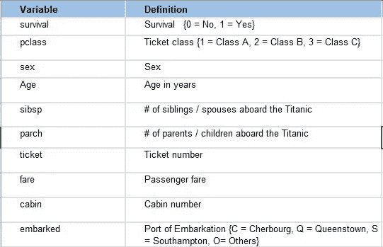

Titanic 数据集中列的描述

> 让我们从检查这些列中的数据开始

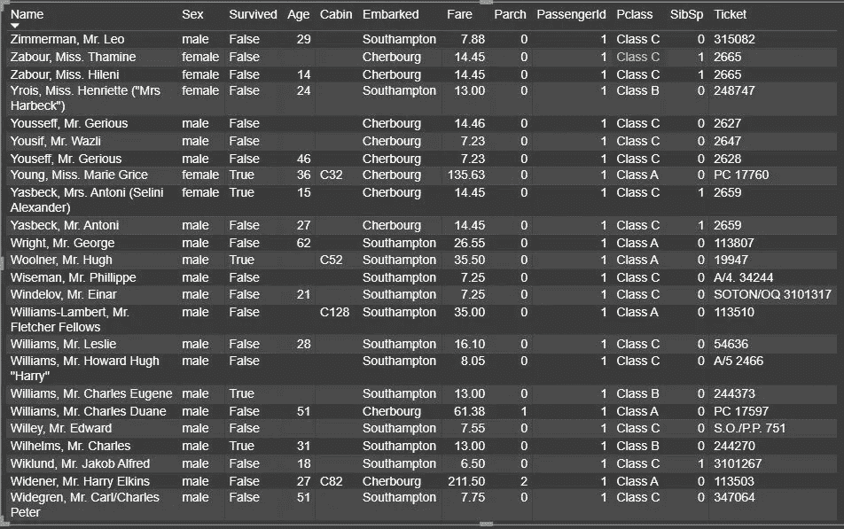

泰坦尼克号数据概述

> 数据集简介

如我们所见，第一列包含旅行乘客的姓名，第二列包含性别。第三栏是最重要的一栏，或者说是我们的目标栏，它告诉我们谁是这次事故中的幸存者。第四列是乘客的年龄。6 号讲述了他们登上的城市。下一个是 Pclass，它包含乘客的类别，即 A/B/C 类。其余的都不太重要(稍后会详细解释)，所以我们现在可以跳过它们。

> 接下来，我们走向一些基本的可视化

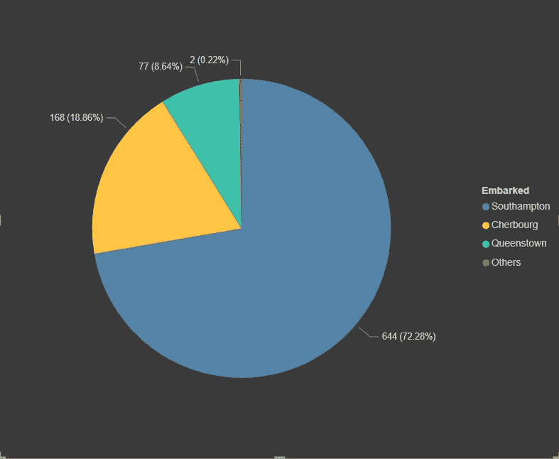

基于位置的登机乘客数量

我们来解释一下上面的图:-
**1。**蓝色区域显示从南安普顿登机的乘客(644)。
**2。**芥末地区显示从瑟堡登机的乘客(168)。
**3。**绿色区域显示来自皇后镇的乘客(77)。
**4。**红色区域显示没有登机数据的乘客(2)。

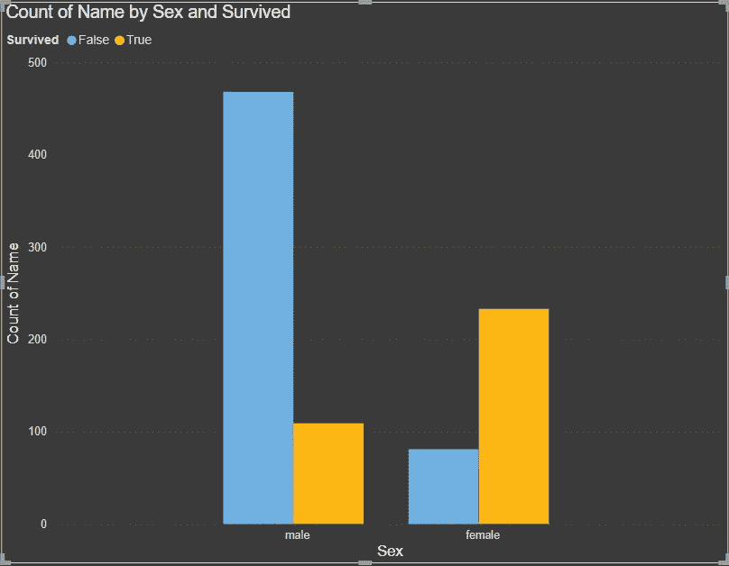

基于性别的幸存乘客人数

让我们解释一下上面的图表:-
1。x 轴表示性别，y 轴表示乘客数量
2。同样我们可以看到性别被分成 2 个独立的条(蓝色和芥末色)3。蓝条显示有多少乘客不幸生还。
4。芥末条代表坠机事件中幸存的乘客。

从图表中我们可以推断出什么？？？

**推断 1:-** 幸存的女性乘客数量远远高于能够幸存的男性乘客。所以，我们可以说女性在撤离时被优先考虑。

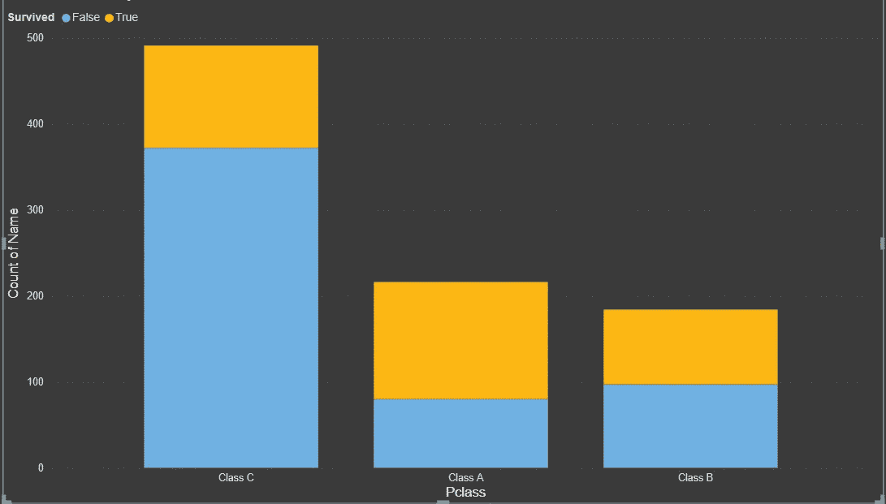

基于 Pclass 的幸存乘客人数

让我们解释一下上面的图表:-
1。x 轴表示乘客人数，y 轴表示乘客人数
2。同样，我们可以看到，Pclass 分为两个独立的条(蓝色和芥末色)。蓝条显示有多少乘客不幸生还。
4。芥末条代表坠机事件中幸存的乘客。

**推断 2:-** 幸存的 A 级和 B 级乘客的比率高于能幸存的 C 级乘客。所以，我们可以说疏散是基于乘客的等级。

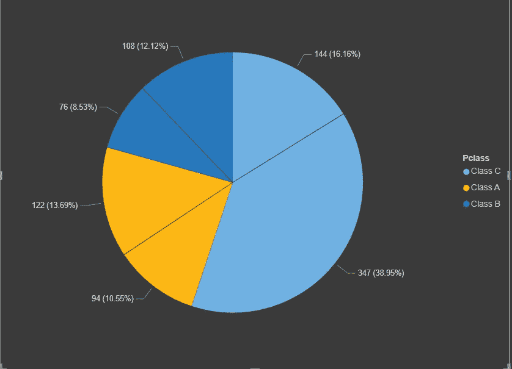

基于 Pclass 的乘客性别计数

让我们解释一下上面的图表:-
1。深蓝色区域显示来自 B 级(76F+108M)的乘客。
2。芥末区域显示来自 A 级(94F+122M)的乘客。
3。浅蓝色区域显示来自 C 舱(144F+347M)的乘客。
4。区域中较小的部分代表该阶层的女性。

推断 3:- 我们可以清楚地看到，与其他两个班相比，每个班的女生人数都较少，而 C 班的人数非常多。因此，我们可以假设甲板上有大量的帮助人员和工人，他们在疏散时被给予最少的优先权。

> 现在让我们用年龄来分析一下

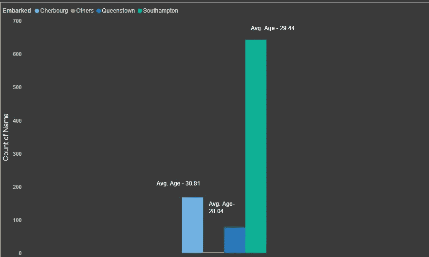

基于寄宿城市的平均年龄

让我们解释一下上面的图表:-
1。浅蓝色区域显示来自瑟堡的乘客(168)。
2。深蓝色区域显示来自皇后镇的乘客(77)。
3。绿色区域显示来自南安普敦的乘客(644)。
4。芥末区域显示缺少城市详细信息的乘客(2)。

**推断 4:-** 我们可以看到，来自南安普顿的乘客平均年龄为 29.44 岁，来自皇后镇的乘客平均年龄为 28.04 岁，平均年龄为 10 岁。来自瑟堡的年龄是 30.81。我们可以看到平均。来自各地的乘客年龄相差不大，平均年龄。年龄 29 左右。

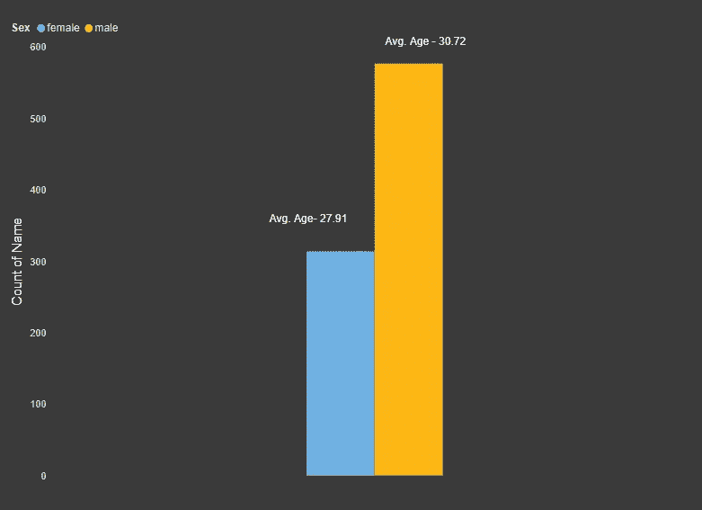

基于性别的平均年龄

让我们解释一下上面的图表:-
1。浅蓝色区域显示女性乘客(314)。
2。深蓝色区域显示男性乘客(577)。

**推断 5:-** 我们可以看到女性乘客的平均年龄为 27.91 岁，男性乘客的平均年龄为 30.72 岁

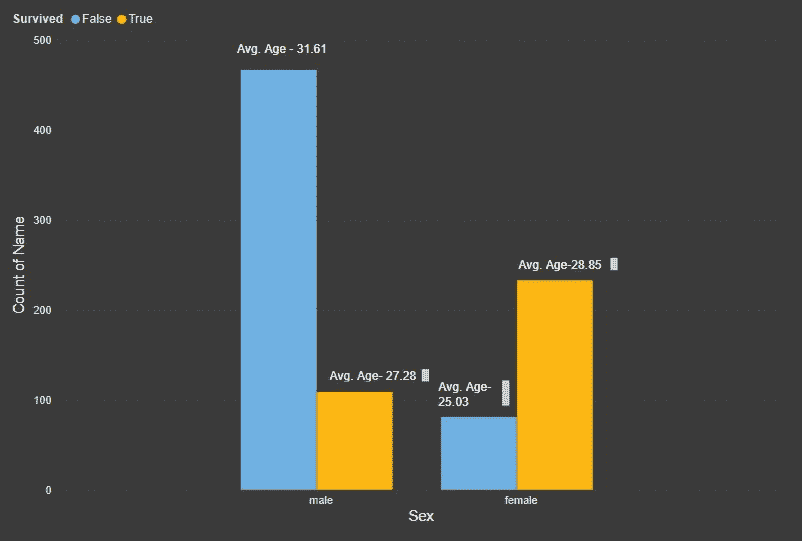

基于性别和存活率的乘客平均年龄

让我们解释一下上面的图表:-
1。蓝色区域显示没有生还的乘客。
2。芥末区域显示幸存的乘客。
3。图表基于性别有 2 个不同的堆栈。

推断 6:- 我们可以看到男性存活的平均年龄是 27.28 岁，而女性存活的平均年龄是 28.05 岁，这很有趣，因为它表明中年女性更受青睐，而年轻男性更受青睐。此外，与男性(109 人)相比，女性的存活率相当高(223 人)。

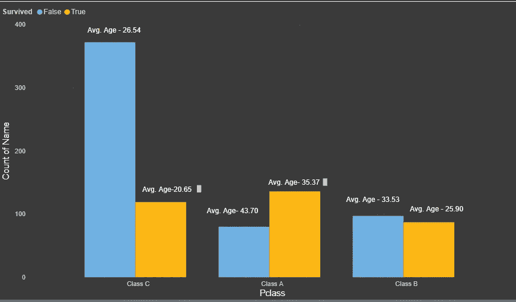

基于 Pclass 和存活率的乘客平均年龄

让我们解释一下上面的图表:-
1。蓝色区域显示没有生还的乘客。
2。芥末区域显示幸存的乘客。
3。图形基于类有 3 个不同的堆栈。

**推断 7:-** 我们可以看到，A 类(136)幸存者的平均年龄为 35.37 岁，B 类(87)幸存者的平均年龄为 25.90 岁，C 类(119)幸存者的平均年龄为 20.65 岁，而 A 类、B 类和 C 类未幸存者的平均年龄分别为 43.70 岁(80)、33.53 岁(97)、26.54 岁(372)。从这里我们可以推断出，A 等舱的乘客大多是老年人，B 等舱的乘客大多是中年人，而 C 等舱的乘客大多是年轻人。此外，这里要注意的一件有趣的事情是，每个组的年轻人都有优先权。

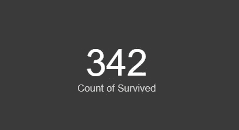

幸存人数

最后，我想简要介绍一下大型数据集分析的最终结果…

共有 342 名乘客幸运地在事故中幸存下来。幸存下来的大多数是 A 班的女性，最少是 C 班的男性。

最后但同样重要的是，关于跳过的列..我们跳过了这些列，因为大多数这些列都有缺失数据，这将在另一篇文章中讨论。此外，客舱和票价等数据与存活率的关系也很小。

*感谢阅读…
请喜欢、分享并在阅读后留下评论。*

请写下你接下来想看什么…
1。泰坦尼克号
2 的更多分析。任何特定数据集的数据可视化。

更了解我:- [关于我](https://shashank-singhal.medium.com/about-me-shashank-singhal-6654366c8a05)