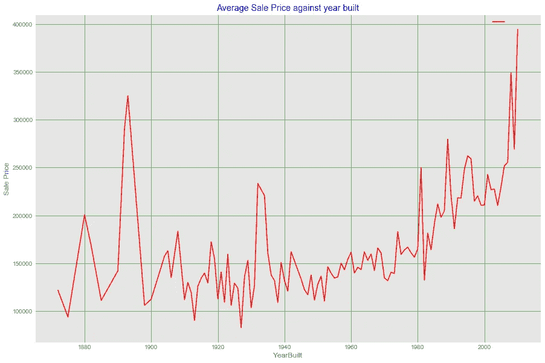
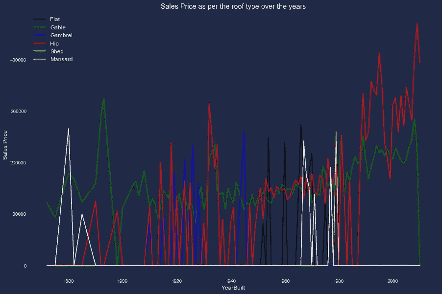

# 使用折线图的数据可视化

> 原文：<https://medium.com/analytics-vidhya/data-visualization-using-a-line-chart-c31c467d638a?source=collection_archive---------10----------------------->

本文使用了[埃姆斯住宅数据集](https://www.kaggle.com/c/neolen-house-price-prediction)

可视化代码可以从[我的 Github 库](https://github.com/wanyangajnr/eda/blob/main/data_visualization.ipynb)获得

**随着时间的推移，平均销售价格如何变化？**

来源(作者)

**亮点**

销售价格一直在稳步增长，然而，也有一些销售价格的显著大幅增长。

大约在 19 世纪 90 年代早期，30 年代早期，80 年代早期，平均销售价格急剧上升

自 2010 年左右以来，平均销售价格稳步上升。

**随着时间的推移，屋顶类型的平均销售价格如何变化？**

**亮点**

人们一直在使用山形屋顶和臀部式屋顶。

在过去的二十年里，坡屋顶越来越受欢迎，而山墙的受欢迎程度一直在下降(两者都在过去的三十年里占主导地位)。

1950 年至 1970 年间，平屋顶风格的使用很流行。

在 19 世纪 80 年代，折线形住宅很常见，但在 20 世纪 70 年代左右又出现了短暂的复兴

关注此帐户，获取更多关于数据可视化的精彩文章