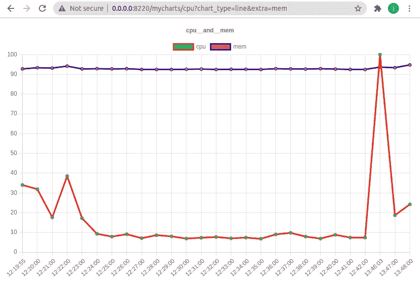
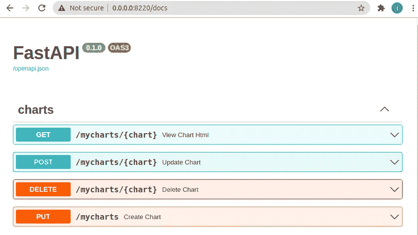
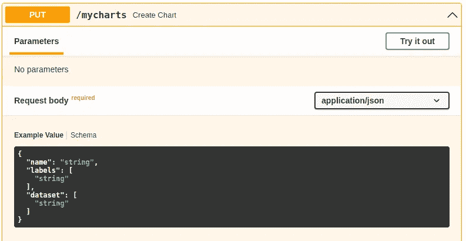
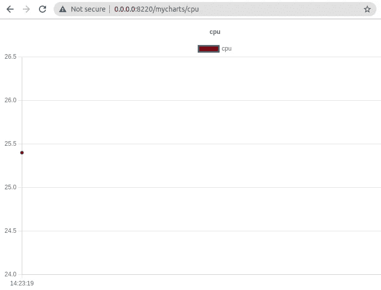
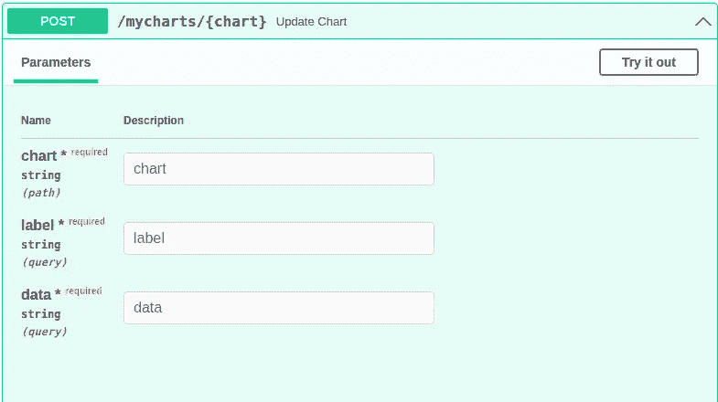
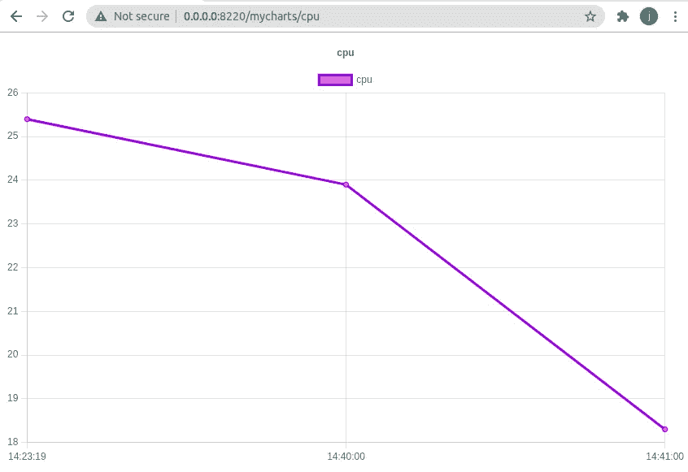
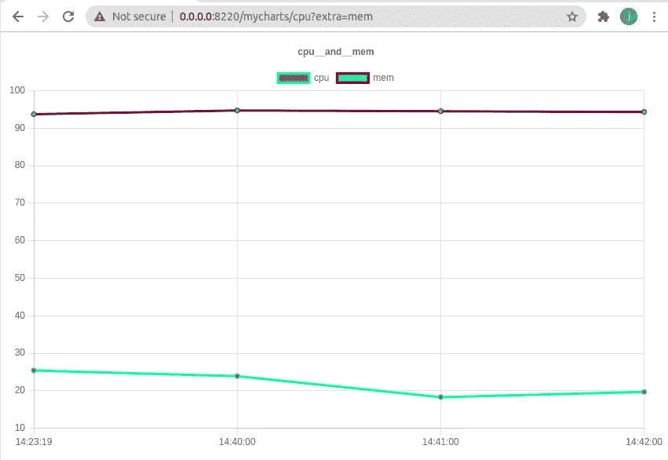
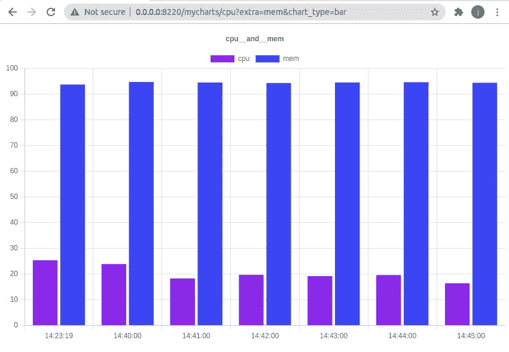

# 使用 FastAPI 和 EasyCharts 实现数据可视化

> 原文：<https://medium.com/analytics-vidhya/data-visualization-using-fastapi-and-easycharts-493eda3b1f3d?source=collection_archive---------1----------------------->


如果可视化消费，可以从数据中获得许多有用的见解。

现在有很多工具可以提供数据可视化，但是很少有工具可以通过一个易于使用和消费的 API 实现动态更新——进入 FastAPI & EasyCharts。

## **FastAPI**

对于那些还没有发现这个网络框架的人来说， [FastAPI](https://fastapi.tiangolo.com/) 是开发人员用来创建丰富的、自我记录的、易于使用的 API 的增长最快的工具之一，它遵循 [OpenAPI](https://swagger.io/specification/) 规范，又名 swagger。

## **简易图表**

一个 FastAPI“插件”,可用于通过 RestAPI 在 web 浏览器中创建动态更新的数据可视化。



**入门**

让我们看看如何使用 EasyCharts 创建一个跟踪主机/容器/ pod 的 CPU 和内存利用率的基本图表。

# **安装**

```
$ pip install easycharts
```

计划和收集资源利用率的附加相关性

```
$ pip install psutils
$ pip install easyschedule
```

## **导入依赖关系**

除了 easycharts 和 fastapi 之外，还导入了 [easyschedule](https://github.com/codemation/easyschedule) 来提供收集统计数据的常规节奏。

# **设置调度器& EasyCharts**

这里我们定义了一个名为 **every_minute** 的 cron 调度，稍后在设置我们的监控方法时将会用到它。

在 fastapi 应用程序**服务器**启动动作中，启动**调度程序**，并创建**图表服务器**。

**ChartServer** 接受 FastAPI **服务器**，存储图表数据的数据库名称，以及访问图表的默认路径。

## **启动图表服务器**

```
$ uvicorn --host 0.0.0.0 --port 8220 monitor:server
```



API 立即提供了通过 API 查看、创建、更新和删除图表的能力。

# **创建图表**

图表可以通过 API 创建，也可以在应用程序启动时创建。任何以前创建的图表都会自动可用。



创建图表时，应该用标签(y)和数据(x)值对其进行初始化。

如果图表已经存在， **create_dataset()** 不会影响现有的图表数据。

**查看图表**



现在只存在一个数据点(x，y ),因为这是在创建图表时添加的。

# **更新图表**



与创建表一样，可以通过 API 或服务器上的后台任务向图表添加数据。

首先，我们定义了一个 **resource_monitor()** 任务，按照我们在上面**中定义的 **every_minute** 计划，这个任务被我们修饰为每分钟运行一次。**

这个更新任务与创建任务非常相似，我们收集当前时间的标签(y)和 CPU /内存使用情况(x ),同时使用 **update_dataset()** 按名称定位现有图表。

**重启图表服务器**

我们的完整代码应该类似于下面这样。

现在，调度程序应该开始每分钟为主机的 cpu 和内存利用率添加数据点。观察图形的动态更新。



## **并排查看 CPU 和内存**



## **选择图表类型**

EasyCharts 支持线形和条形图形，可以选择。



## **结论**

EasyCharts 提供了一种简单的方法来可视化数据，尤其是(但不限于)随时间变化的数据。

# **资源**

[**FastAPI**](https://fastapi.tiangolo.com/)**—快来加入成长中的社区**

[**easy charts**](https://github.com/codemation/easycharts)**—想法、评论或建议？在 Github 上制造一个问题。觉得有用？留下一颗星星。**

[**easy schedule**](https://github.com/codemation/easyschedule)**—用于同步/异步任务的类似 cron 的调度程序**