# 使用 Python 实现数据可视化第一部分

> 原文：<https://medium.com/analytics-vidhya/data-visualization-using-python-part-i-19f9b76d43dc?source=collection_archive---------14----------------------->

***数据可视化*** *是试图理解* ***数据*** *的学科，通过将数据放置在可视化的上下文中，使得原本可能检测不到的模式、趋势和相关性* ***可以*** *被暴露出来。*

***Python*** *提供了多个很棒的图形库，比如****Matplotlib****和****Seaborn****，它们都包含了许多不同的特性，让我们花几分钟时间来探索一下吧！*

> 数据只有呈现出来才是好的— [来源](https://www.springboard.com/blog/41-shareable-data-quotes/)

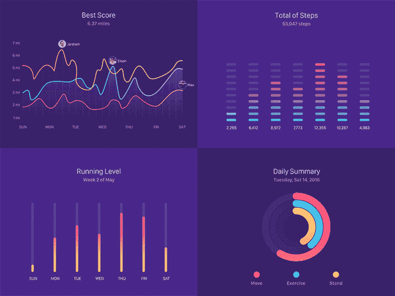

图片来源:Pinterest

# Matplotlib

Matplotlib 是一个非常棒的 Python 可视化库，用于数组的 2D 绘图。Matplotlib 是一个基于[***Numpy***](/analytics-vidhya/getting-familiar-with-numpy-854fc60ac497)数组的多平台数据可视化库，旨在与更广泛的 SciPy 堆栈一起工作。它是约翰·亨特的创意。

## Matplotlib 安装

*可以在你的* ***本地机器*** *上通过* ***Python 命令提示***

```
python -m pip install -U pip
python -m pip install -U matplotlib
```

## **导入 Matplotlib**

```
from matplotlib import pyplot as plt
*#or*
import matplotlib.pyplot as plt
```

## Matplotlib 中的一般概念

*一个* ***Matplotlib 图*** *可以分为如下几个部分—*

***图形:*** 它是一个完整的图形，可以包含一个或多个轴(图)。你可以把一个**图形**想象成一块包含情节的画布。

***轴:*** 就是我们一般认为的剧情。一个**图形**可以包含多个轴。它包含两个或三个**【3D】轴**对象。每个轴都有一个标题、一个 x 标签**和一个 y 标签**。

***轴:*** 它们是像数字线一样的物体，负责生成图形界限。

***艺术家:*** 图中所见的一切都是艺术家喜欢的`Text`物、`Line2D`物、`collection`物。大多数艺术家都被绑在斧头上。

## Pyplot 入门

***制作简单的剧情***

```
import matplotlib.pyplot as plt
import numpy as np
```

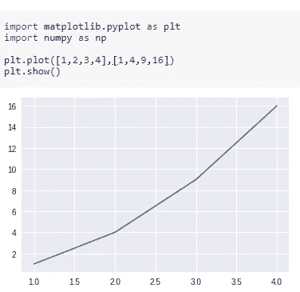

***需要注意的几点—***

*   我们将两个数组作为输入参数传递给 Pyplot 的`plot()` 方法，并使用`show()`方法调用所需的绘图。
*   请注意，第一个数组出现在图的 x 轴上，第二个数组出现在 y 轴上。
*   现在我们的第一个图已经准备好了，让我们添加标题，并分别使用方法`title()`、`xlabel()`和`ylabel()`命名 x 轴和 y 轴。

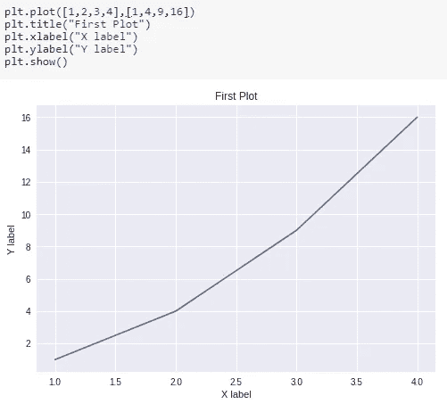

我们还可以使用方法`figure()`指定图形的大小，并将值作为行和列长度的元组传递给参数`figsize`，如下图所示。

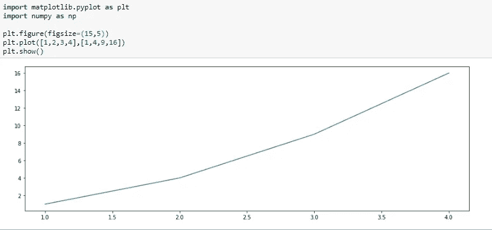

我们还可以通过使用`plot()`传入多组 X 轴和 Y 轴参数来绘制多组数据，如图所示——

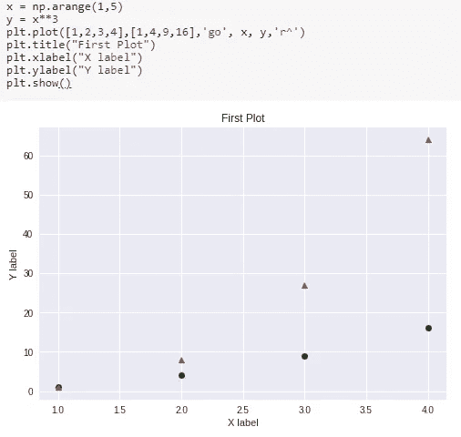

# 使用 Pyplot 的不同可视化

## ***柱状图***

Pyplot 提供了一个方法`bar()`来制作带参数的条形图:分类变量、它们的值和颜色(如果你想指定的话)。

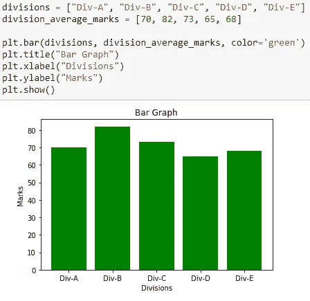

您还可以使用方法`barh()`制作水平条形图。此外，我们可以传递一个参数(及其值)`xerr`或`yerr`(在上面的垂直条形图中)来描述我们的数据中的差异，如下所示

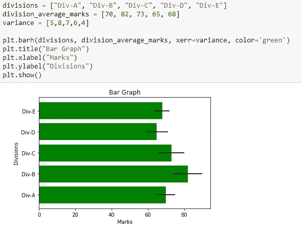

为了创建水平堆叠的条形图，我们使用了两次`bar()`方法，并在提到条形图的索引和宽度时传递参数，以便将它们水平堆叠在一起。

> 此外，请注意使用了另外两种方法`legend()`来显示图表的图例，以及`xticks()`来根据条形的位置标记 x 轴。

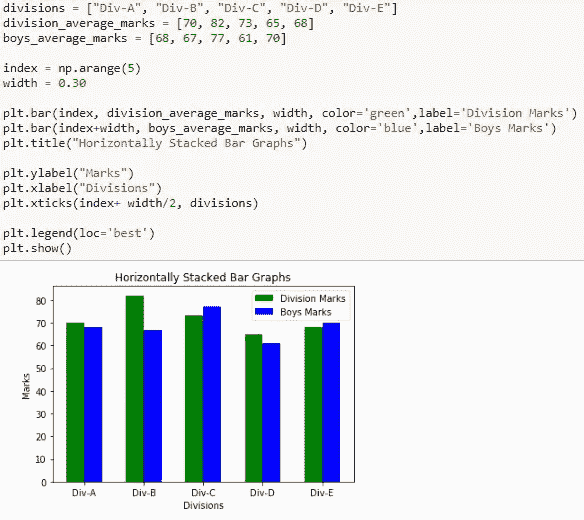

类似地，要将条形图垂直堆叠在一起，我们可以使用一个参数`bottom`并在下面提到我们想要堆叠的条形图作为它的值。

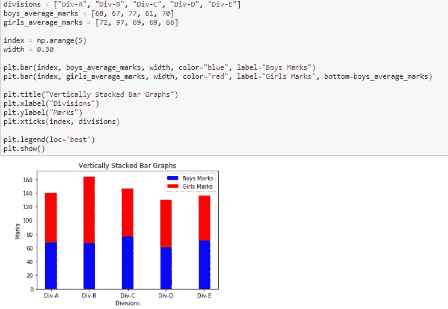

## ***饼状图***

使用方法`pie()`可以制作一个饼状图，我们也可以传入参数来定制我们的饼状图，以显示阴影，分解它的一部分，以如下角度倾斜它——

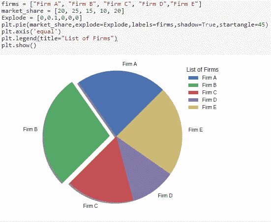

## 柱状图

直方图是条形图的一种特殊形式，其中的数据代表连续而非离散的类别。这意味着在直方图中，代表不同类别的列之间没有间隔。

> 用 Matplotlib 可以实现直方图！

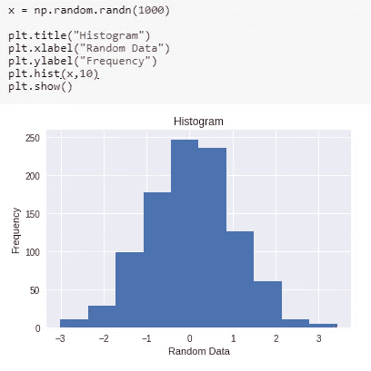

## 散点图

散点图是广泛使用的图形，尤其是在可视化回归问题时非常方便。

在下面的例子中，我们输入了任意创建的身高和体重数据，并将它们绘制成图表。我们可以使用`xlim()`和`ylim()`方法分别设置 X 轴和 Y 轴的极限。

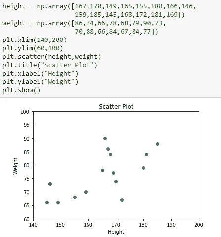

## 三维绘图

上面的散射也可以三维可视化。为了使用这个功能，我们首先如下导入模块`mplot3d`—

```
from mpl_toolkits import mplot3d
```

一旦模块被导入，通过将关键字`projection='3d'`传递给 Pyplot 模块的`axes()`方法就创建了一个三维轴。一旦创建了对象实例，我们就将我们的参数高度和重量传递给`scatter3D()`方法。

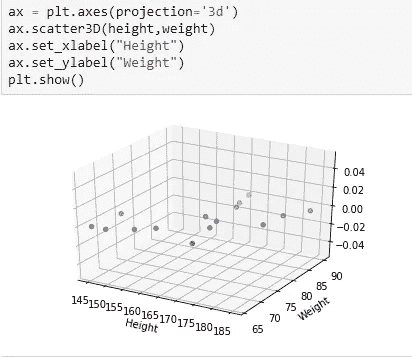

我们还可以创建其他类型的三维图形，如线图、曲面图、线框图、等高线图等。上面的例子以简单的线图的形式如下:这里我们使用方法`plot3D()`而不是`scatter3D()`

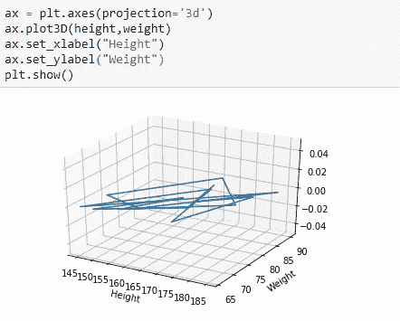

> 我知道一下子很难接受。但是你坚持到了最后！恭喜你。

# 额外资源

> Matplotlib 已经存在一段时间了，如果您仍然有兴趣充分利用这个库，还有很多其他的好资源。

*如需完整代码，请访问以下链接—*

[](https://github.com/tanvipenumudy/Winter-Internship-Internity/blob/main/Day%2004/Day-4%20Notebook-1%20%28Matplotlib%29.ipynb) [## tanvipenumudy/Winter-实习-实习

### 存储库跟踪每天分配的工作-tanvipenumudy/Winter-实习-实习

github.com](https://github.com/tanvipenumudy/Winter-Internship-Internity/blob/main/Day%2004/Day-4%20Notebook-1%20%28Matplotlib%29.ipynb) 

*还有，别忘了浏览一下****——***[***Matplotlib 文档***](https://matplotlib.org/3.3.3/contents.html)**以及本博客的* [***第二部分。***](https://tp6145.medium.com/data-visualization-using-python-part-ii-e00249fe2543)*