# 使用 Python 实现数据可视化第二部分

> 原文：<https://medium.com/analytics-vidhya/data-visualization-using-python-part-ii-e00249fe2543?source=collection_archive---------8----------------------->

*下面是 Part-II 到* [***数据可视化使用 Python Part-I***](https://tp6145.medium.com/data-visualization-using-python-part-i-19f9b76d43dc)***。*** *如果你还没有经历过，现在就去做吧！我们现在将使用 Python 中的****Seaborn****库实现相同的功能！*


图片来源:Airtame —数据可视化

Matplotlib 已经被证明是一个非常有用和受欢迎的可视化工具，但即使是狂热的用户也会承认它经常有很多不足之处。有几个关于 Matplotlib 的有效抱怨经常出现。

这些问题的一个答案是[***Seaborn***](http://seaborn.pydata.org/)***。*** Seaborn 在 Matplotlib 的基础上提供了一个 API，为绘图样式和颜色默认值提供了合理的选择，为常见的统计绘图类型定义了简单的高级函数，并与 Pandas `DataFrame.`提供的功能进行了集成

# Seaborn 入门

***海博安装***

```
pip install seaborn
```

*参考*[***seaborn PyPI***](https://pypi.org/project/seaborn/)**进行故障排除**

****进口海博****

```
*import seaborn as sns*
```

# *Seaborn vs Matplotlib*

*下面是 Matplotlib 中一个简单的随机游走图的例子，使用了它的经典绘图格式和颜色。我们从典型的进口开始—*

```
***import** **matplotlib.pyplot** **as** **plt**
plt.style.use('classic')
%**matplotlib** inline
**import** **numpy** **as** **np**
**import** **pandas** **as** **pd***
```

> *现在我们创建一些随机行走数据—*

```
**#Create some data*
rng = np.random.RandomState(0)
x = np.linspace(0, 10, 500)
y = np.cumsum(rng.randn(500, 6), 0)*
```

> *做一个简单的情节—*

```
**#Plot the data with Matplotlib defaults*
plt.plot(x, y)
plt.legend('ABCDEF', ncol=2, loc='upper left');*
```

*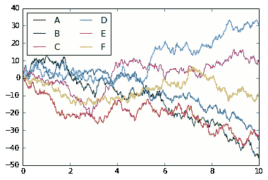*

> *尽管结果包含了我们希望它传达的所有信息，但它传达的方式并不那么美观，甚至看起来有点过时。*

****使用海博****

```
***import** **seaborn** **as** **sns**
sns.set()*
```

> *现在让我们重新运行和之前一样的两行代码—*

```
**#same plotting code as above!*
plt.plot(x, y)
plt.legend('ABCDEF', ncol=2, loc='upper left');*
```

*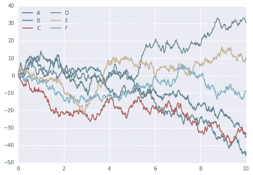*

> *这个比上一个好多了！*

## *直方图、KDE 和密度*

*通常在统计数据可视化中，您想要的只是绘制直方图和变量的联合分布。我们已经看到这在 Matplotlib 中相对简单——*

```
*data = np.random.multivariate_normal([0, 0], [[5, 2], [2, 2]], size=2000)
data = pd.DataFrame(data, columns=['x', 'y'])

**for** col **in** 'xy':
    plt.hist(data[col], normed=**True**, alpha=0.5)*
```

*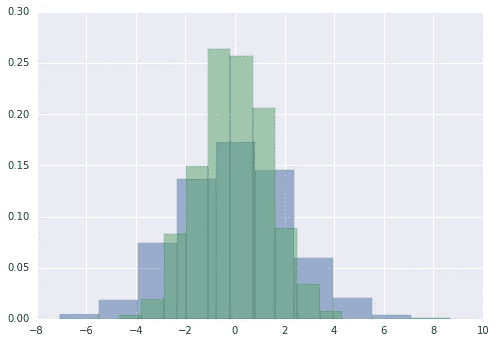*

*我们可以使用核密度估计来得到分布的平滑估计，而不是直方图，这是 Seaborn 用`sns.kdeplot`做的*

```
***for** col **in** 'xy':
    sns.kdeplot(data[col], shade=**True**)*
```

*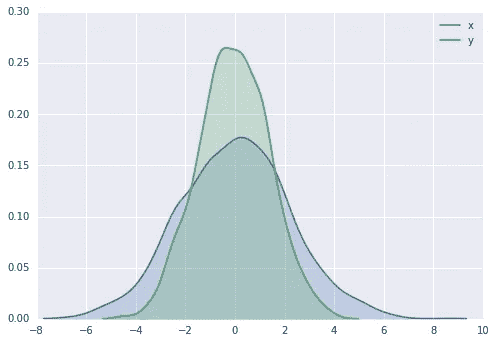*

*直方图和 KDE 可以使用`distplot`组合*

```
*sns.distplot(data['x'])
sns.distplot(data['y']);*
```

*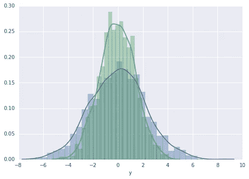*

*如果我们将完整的二维数据集传递给`kdeplot`，我们将获得数据的二维可视化——*

```
*sns.kdeplot(data);*
```

*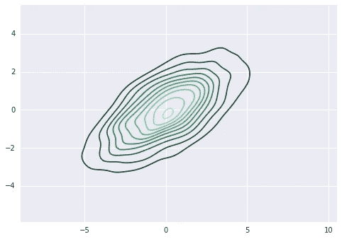*

*我们可以使用`sns.jointplot`看到联合分布和边际分布。对于这个图，我们将样式设置为白色背景—*

```
***with** sns.axes_style('white'):
    sns.jointplot("x", "y", data, kind='kde');*
```

*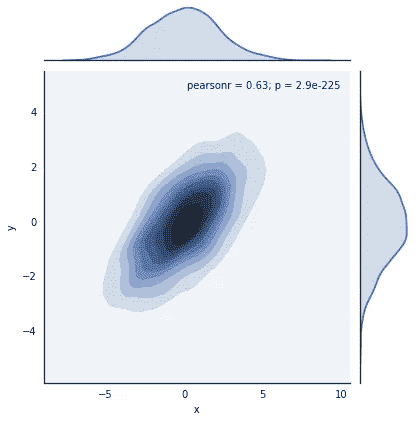*

*还有其他参数可以传递给`jointplot`——例如，我们可以使用基于六边形的直方图来代替—*

```
***with** sns.axes_style('white'):
    sns.jointplot("x", "y", data, kind='hex')*
```

*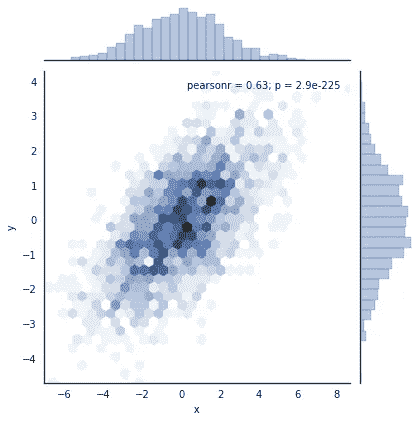*

## *配对图*

*当您将联合图推广到更大维度的数据集时，您最终会得到 ***对图*。***

> *我们将用著名的 [**鸢尾数据集**](https://archive.ics.uci.edu/ml/datasets/iris) 来演示这一点，该数据集列出了三种鸢尾的花瓣和萼片的测量值*

```
*iris = sns.load_dataset("iris")
sns.pairplot(iris, hue='species', size=2.5);*
```

*可视化样本之间的多维关系就像调用`sns.pairplot`一样简单*

*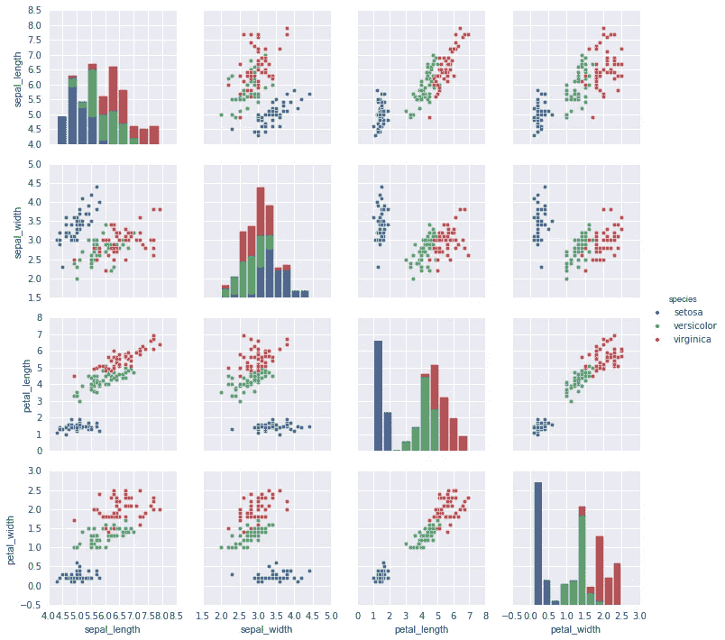*

## *因子图*

*因子图对于这种可视化也很有用。这允许您查看由任何其他参数定义的条块内参数的分布情况—*

```
***with** sns.axes_style(style='ticks'):
    g = sns.factorplot("day", "total_bill", "sex", data=tips, kind="box")
    g.set_axis_labels("Day", "Total Bill");*
```

*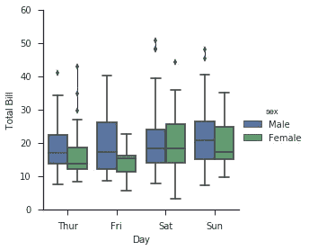*

## *联合分布*

*类似于我们之前看到的*对图*，我们可以使用`sns.jointplot`来显示不同数据集之间的联合分布，以及相关的边际分布——*

```
***with** sns.axes_style('white'):
    sns.jointplot("total_bill", "tip", data=tips, kind='hex')*
```

*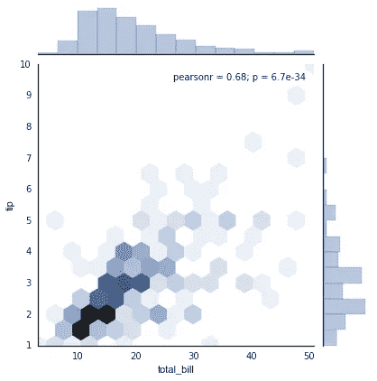*

*联合图甚至可以做一些自动核密度估计和回归—*

```
*sns.jointplot("total_bill", "tip", data=tips, kind='reg');*
```

*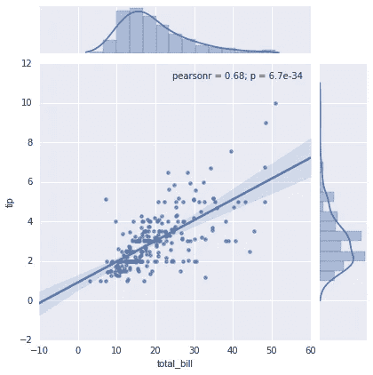*

## *条形图*

*我们已经看到了 Matplotlib**的 [***条形图，现在让我们尝试用 Seaborn 做同样的事情。***](https://medium.com/r?url=https%3A%2F%2Ftp6145.medium.com%2Fdata-visualization-using-python-part-i-19f9b76d43dc)***

*可以使用`sns.factorplot`绘制时间序列。在下面的例子中，我们将使用 [***行星数据集***](https://github.com/mwaskom/seaborn-data/blob/master/planets.csv) ***。****

```
*planets = sns.load_dataset('planets')
**with** sns.axes_style('white'):
    g = sns.factorplot("year", data=planets, aspect=2,
                       kind="count", color='steelblue')
    g.set_xticklabels(step=5)*
```

*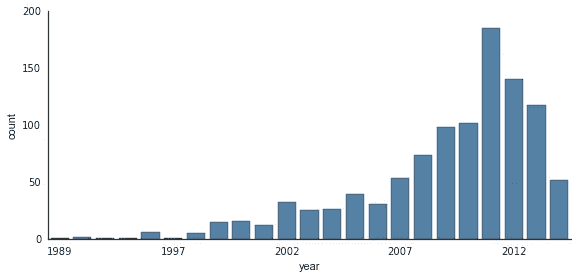*

*我们可以通过观察发现这些行星的*方法*来了解更多——*

```
***with** sns.axes_style('white'):
    g = sns.factorplot("year", data=planets, aspect=4.0, kind='count',
                       hue='method', order=range(2001, 2015))
    g.set_ylabels('Number of Planets Discovered')*
```

*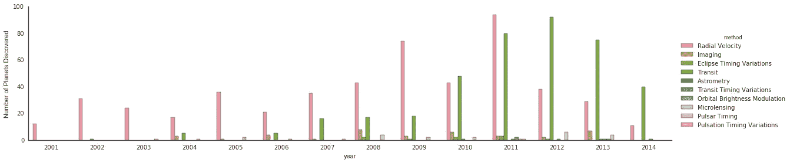*

> *有关使用 Seaborn 绘图的更多信息，请参见 [**Seaborn 文档**](http://seaborn.pydata.org/) 、a [**教程**](http://seaborn.pydata.org/tutorial.htm) 和 [**Seaborn 图库**](http://seaborn.pydata.org/examples/index.html) 。*
> 
> ***参考文献**—[https://jakevdp . github . io/python datascience handbook/04.14-visualization-with-seaborn . html](https://jakevdp.github.io/PythonDataScienceHandbook/04.14-visualization-with-seaborn.html)*
> 
> *【https://elitedatascience.com/python-seaborn-tutorial *

**如需完整代码，请访问以下链接—**

*[](https://github.com/tanvipenumudy/Winter-Internship-Internity/blob/main/Day%2004/Day-4%20Notebook-2%20%28Seaborn%29.ipynb) [## tanvipenumudy/Winter-实习-实习

### 存储库跟踪每天分配的工作-tanvipenumudy/Winter-实习-实习

github.com](https://github.com/tanvipenumudy/Winter-Internship-Internity/blob/main/Day%2004/Day-4%20Notebook-2%20%28Seaborn%29.ipynb)*