# 数据可视化:什么？什么时候？怎么会？

> 原文：<https://medium.com/analytics-vidhya/data-visualization-what-when-how-7ad62f850d27?source=collection_archive---------13----------------------->

数据！数据！！数据！！！在过去的几年里，唯一的趋势是数据。但是最大的眼中钉是发现数据中的趋势。滚动一行又一行的信息，将一个部分与另一个部分连接起来是乏味的，老实说，有时它在我眼前模糊不清。

[9GAG 图像](https://www.facebook.com/9gag/posts/reading-the-same-line-for-three-hourshttps9gagcomgagaq18lnjscfunnyreffbsc/10156167174666840/)

幸运的是，我们可以通过可视化让这些数据看起来更漂亮，不那么吓人。可视化使用图形和图表等可视化元素以图解格式表示数据。它是检测数据变量之间的任何模式、趋势和相关性的技术。借助可视化技术，我们可以意识到一个变量的存在和不存在对其他变量的影响。
所以，让我们从一些基本的开始。在这一节中，我将重点介绍两种基本的可视化技术:

1.  线形图
2.  散点图

**线条图:**

使用的库: **Seaborn**

让我们假设你有 1 到 10 范围内的数字以及它们对应的正方形和立方体。现在，如果您想检测一个特定的整数是如何与其平方和立方相关联的，您可以使用一个线图。它将数据点绘制在二维平面上，并用曲线将它们连接起来。

现在，让我们深入一些代码，并可视化情节:

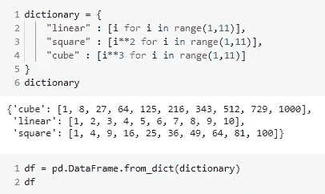

数据集如下所示:

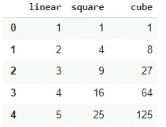

数据集-1

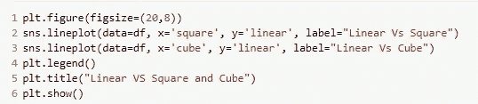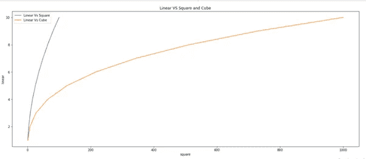

线形图:线性与正方形和立方体

上图(*线图:线性与正方形和立方体*)显示了数字、正方形(蓝色图)和立方体(橙色图)之间的关系。使用线图，我们可以看到二次曲线和三次曲线的指数增长。您可以注意到，立方图比二次图增长得更快，因此覆盖的面积比二次图大得多。

在这里，整数与它们的平方和立方相关，所以我们使用线图从中找出了一些有价值的信息。但是，如果这些数据点之间完全没有关系，那该怎么办呢？我们能从这样的情节中提取信息吗？让我们试一试:

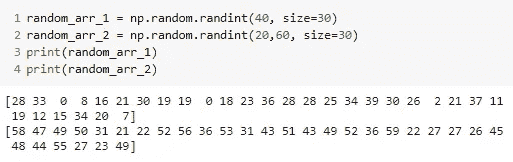

数据集-2

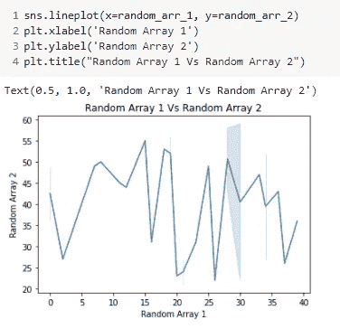

折线图:随机阵列 1 与随机阵列 2

在 *dataset-2 中，*我使用了两个变量， *random_arr_1* 有 30 个在(0，40)范围内的整数， *random_arr_2* 有 30 个在(20，60)范围内的整数。这两个变量之间没有联系，如你所见，我们得到了一个不相关的图*(线图:随机数组 1 Vs 随机数组 2* )。仅仅浏览一下，我们无法发现任何趋势或相关性。因此，这是我们的第一个结论，只有当我们在数据变量之间有一些关系时，折线图对于提取趋势和模式才是有利的。

但是..但是..酪数据变量并不总是相互关联的。在这种情况下，散点图就出现了。

**散点图:**

使用的库: **Seaborn**

在这里，我从(0，99)的范围内取了 50 个随机整数，并计算了它们的平方和立方。

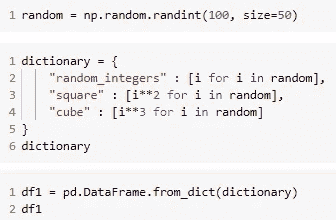

以下是数据集的外观:

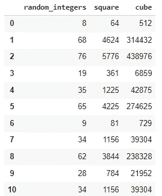

数据集-3

随机整数及其正方形和立方体的散点图:

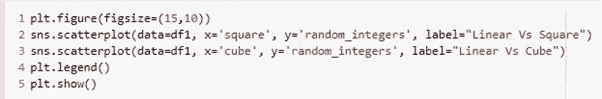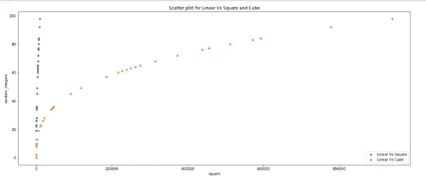

散点图:随机整数与正方形和立方体

散点图类似于折线图(图:*折线图:线性 Vs 正方形和立方体*)，但它只标记数据点，而不用曲线将它们连接起来。检查上面的图像，我们可以跟踪路径，以获得一个线条图的错觉。

你可能想知道这两个图是否能给出相似的结果，那么这种技术究竟为什么存在呢？因此，为了回答这个问题，让我们考虑一下我们之前使用的一些随机整数( *dataset-2* )。

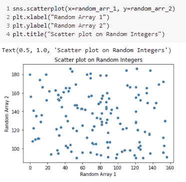

散点图:随机阵列 2 与随机阵列 1

对随机数据应用散点图，我们得到了这些分散的数据点。这就是散点图的用途。只看数据点，就能看出数据变量之间的相关性。它可以有多种类型:

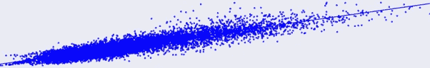

线性正相关

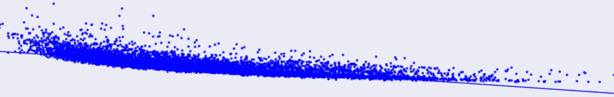

非线性负相关

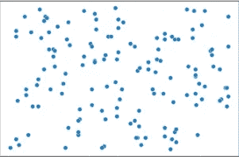

没有关系

该图(*散点图:随机数组 2 Vs 随机数组 1* )属于“**无关系**”类别，这是正确的，因为 *random_arr_1* 与 *random_arr_2* 完全没有关系。

散点图被进一步处理以识别趋势和模式。使用各种聚类技术，所有密切相关的点集将形成一个聚类。因此，对于所有类型的数据变量，散点图用于有效的可视化。

现在让我们总结一下之前提到的一些要点:

**结论:**

折线图通过用曲线连接数据点来显示数据点，并且只能用于相关的数据变量。
散点图并不连接数据点，仅通过观察散点图，我们就可以判断出数据变量之间的相关性类型。

耶！您已到达文章末尾:)

谢谢大家！

我有义务接受任何意见、建议或反馈。

敬请关注即将到来的可视化技术！

你可以在这里找到 Github 代码[的链接。](https://github.com/Rashmiii-00/Visualization-Techniques-1)

数据可视化的第二部分，点击[这里](https://rashmi-manwani.medium.com/data-visualization-what-when-how-ii-3aa8712fd185)。

**在 LinkedIn 上连接:**[https://www.linkedin.com/in/rashmi-manwani-a13157184/](https://www.linkedin.com/in/rashmi-manwani-a13157184/)

**在 Github 上连接:**【https://github.com/Rashmiii-00 