# 数据可视化:什么？什么时候？怎么会？-二

> 原文：<https://medium.com/analytics-vidhya/data-visualization-what-when-how-ii-3aa8712fd185?source=collection_archive---------12----------------------->

你在考虑放弃一个问题，开始寻找新的信息吗？

你在研究中碰壁了吗？

你是否也把宝贵的时间花在思考如何让数据变得可信上？

如果是，那么这篇文章是给你的。它将引导您了解一些可视化技术，这些技术可以帮助您理解数据、检测趋势、识别模式等等。所以，继续我之前的博客:'[数据可视化:什么？什么时候？怎么会？](https://rashmi-manwani.medium.com/data-visualization-what-when-how-7ad62f850d27)‘我会尽量把这篇文章“*”做得很简单，就像‘哈比瘸子’一样。*

**

*[哈比拉梅](https://www.instagram.com/khaby00/?hl=en)*

*所以，让我们从它开始。在本文中，我将重点介绍三种可视化技术:*

*   *柱状图*
*   *计数图*
*   *条形图*

*为了解释这些技术，我使用了 Kaggle 的'[电信客户流失预测](https://www.kaggle.com/dileep070/logisticregression-telecomcustomer-churmprediction)'数据集。数据集如下所示:*

*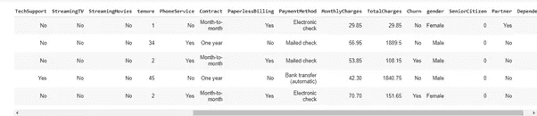*

*资料组*

## ***1。直方图:***

*使用的库: **Seaborn***

*根据直方图的定义，它们通过不同高度的条形以图形格式表示数据。它们用于可视化数据变量的频率分布。*

*没听懂？不要担心例子会掩盖它😉*

*在这里，我绘制了*月费用*的柱状图。*

*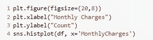**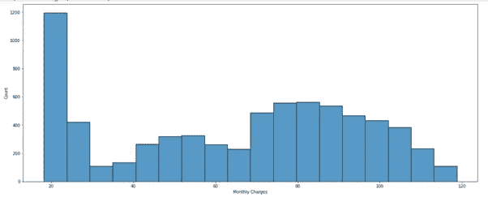*

*直方图:每月费用*

*观察上面的直方图，我们可以看出*月费*位于(20，120)之间，Y 轴上的值描述了*月费*在指定范围内的客户数量。*

*它描述了将近 600 个客户的月费用在(70，90)的范围内。他们中的大多数人每月花费 20 英镑左右，而少数客户每月花费 120 英镑。*

*单变量直方图有助于观察分布的形状。但是我们也可以添加一些其他参数来检查分布对其他分布的影响。*

*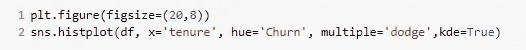**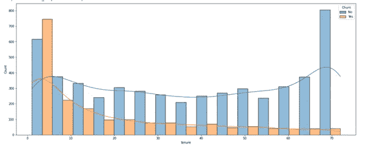*

*直方图:任期和流动率*

*在这里，类变量是*任期。添加*色调= *搅动，我们可以*检查类变量对*搅动的影响。正如你所看到的，流失率与任期成反比。**

*现在，如果我们想要绘制一个二元直方图呢？*

*为此，您需要添加 y 参数作为第二个变量。*

*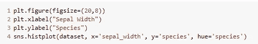**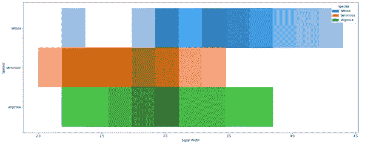*

*二元直方图:物种对萼片宽度*

*这里，我取了 Seaborn library 的 Iris 数据集，x 为*萼片宽度*，y 为*物种*。我们以[热图](https://seaborn.pydata.org/generated/seaborn.heatmap.html)的形式得到了一个二元直方图。你可以看到*(2.5，3.9)范围内的萼片宽度*属于*海滨锦葵、*的物种，同样，我们可以为其他物种指定*萼片宽度*。*

*好吧，好吧，信息太多了。现在，是时候了解直方图的要点了:*

*   *直方图用于观察**数字**数据变量的频率分布。*
*   *借助**色调**参数，我们可以检查频率分布对其他变量的影响。*
*   *使用 x 和 y 参数，我们可以绘制一个二元直方图。*

## ***2。计数图:***

*使用的库: **Seaborn***

*计数图只是直方图的另一个版本，用于分类值而不是定量值。它使用条形格式绘制数据，Y 轴代表不同类别中的记录数。*

*在这里，我对*支付方式*进行了盘点:*

***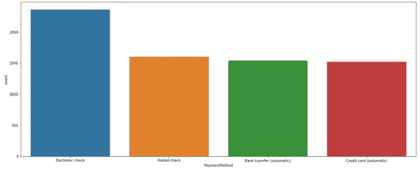*

*计数图:付款方式*

*X 轴代表不同类别的*支付方式，* Y 轴代表每个类别的观察次数。我们可以推断，最大数量的客户将*电子支票*作为他们的*支付方式*。*

*计数图还提供使用*色调*参数添加另一个变量。*

*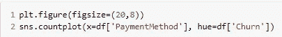**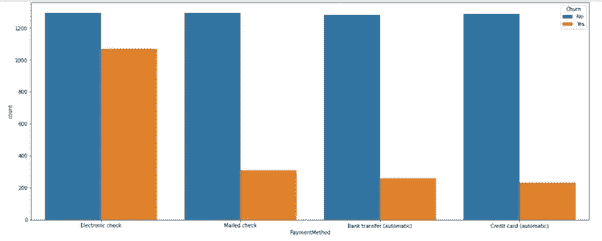*

*计数图:付款方式 w.r.t .流失*

*从上面的图中，我们可以看到*支付方式* w.r.t 到*客户流失*变量的分类。*

*快速引起疑问，计数图和直方图有什么区别？*

*   *计数图用于**分类**值，而直方图用于**数字**数据*
*   *计数图适用于**离散数据**变量，直方图适用于**连续范围***

*这就是最终的绘图技术！😀*

## *3.**柱状图:***

*使用的库: **Seaborn***

*条形图用于可视化分类数据变量和数字数据变量之间的关系。它以聚合的形式表示分类数据，默认情况下使用数值数据变量的平均值。*

*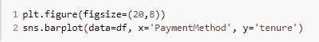**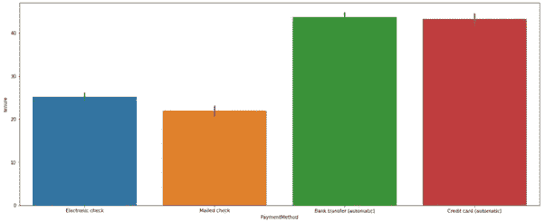*

*柱状图:使用权与支付方式*

*上面的柱状图描绘了*支付方式*相对于*任期*的平均值。我们可以推断出付款方式为*银行转账*的客户平均使用年限为 45 年，而*电子支票*的客户平均使用年限为 25 年。*

*现在，让我们尝试将色调参数添加到条形图中:*

*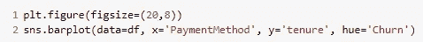**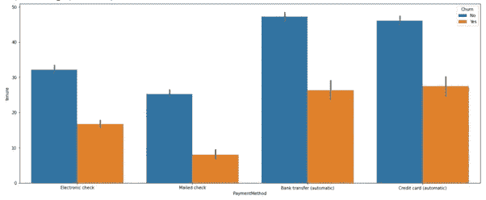*

*柱状图:任期与支付方式*

*X 轴上的每个类别都根据色调变量进行了拆分。对于付款方式为*邮寄支票*的客户，平均 10 年的*流失率*较低。*

*酒吧情节的本质:*

*   *当一个轴具有**分类值**而另一个轴具有**数字值**时，条形图用于有效的可视化。*
*   *默认情况下，条形图代表数值数据变量的分类数据 w.r.t **平均值**。*

*万岁！！您已经成功掌握了**可视化提示和技巧！👏***

*谢谢大家！*

*我有义务接受任何意见、建议或反馈😃*

*敬请关注即将到来的可视化技术！*

*你可以在这里找到 Github 代码[的链接。](https://github.com/Rashmiii-00/Visualization-2)*

***在 LinkedIn 上连接:**[https://www.linkedin.com/in/rashmi-manwani-a13157184/](https://www.linkedin.com/in/rashmi-manwani-a13157184/)*

***在 Github 上连接:**[https://github.com/Rashmiii-00](https://github.com/Rashmiii-00)*