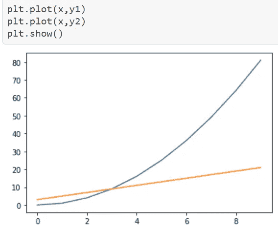

# 用 Matplotlib 实现数据可视化

> 原文：<https://medium.com/analytics-vidhya/data-visualization-with-matplotlib-4a962cb94a3d?source=collection_archive---------28----------------------->

> matplotlib:python 的绘图库


atplotlib 是一个全面的库，用于在 Python 中创建静态、动画和交互式可视化。都说“Matplotlib 让容易的事情变得容易，让困难的事情变得可能”。这是一个低级的库，它的接口类似于 Matlab，提供了很多自由，但代价是必须编写更多的代码。

> [在你的系统中安装 Matplotlib。](https://matplotlib.org/users/installing.html)

```
pip install matplotlib
*# in conda*
conda install matplotlib
```

> 我们将在这里详细看到 *pyplot* 子模块，其中 *plt* 作为别名。

我们可以通过选择可用的主题来改变我们的情节的主题。

```
themes = plt.style.available
print(themes)OUTPUT['Solarize_Light2', '_classic_test_patch', 'bmh', 'classic', 'dark_background', 'fast', 'fivethirtyeight', 'ggplot', 'grayscale', 'seaborn', 'seaborn-bright', 'seaborn-colorblind', 'seaborn-dark', 'seaborn-dark-palette', 'seaborn-darkgrid', 'seaborn-deep', 'seaborn-muted', 'seaborn-notebook', 'seaborn-paper', 'seaborn-pastel', 'seaborn-poster', 'seaborn-talk', 'seaborn-ticks', 'seaborn-white', 'seaborn-whitegrid', 'tableau-colorblind10']plt.style.use("dark_background")
```

L线情节


在这里，我们将 x 和 y 分别标在各自的轴上。我们也可以一次画出许多方程。



当超过 plt.show()时，如果我们想要两个不同的图形，则绘制线条→


**让我们通过添加一些插件，如标题、标签和颜色，制作一个完美的线条图。plt.legend()让我们打印标签。**


SS**catter Plot**

它类似于线图，除了我们将绘制点而不是线。


Bar 图

通过执行以下命令来绘制条形图非常简单。


T20 伊查特

下面的代码有助于我们绘制饼图。如果你不希望任何主题被突出显示，那么跳过爆炸术语。阴影=真实给我们更好的效果。


H 图

直方图是数字数据分布的精确表示。它是对连续变量的概率分布的估计。这是一种条形图。


> 不要忘记参考官方文件
> 
> [https://matplotlib.org/index.html](https://matplotlib.org/index.html)

可以做的事情还有很多。所以，一定要探索它们，体验可视化数据！！！