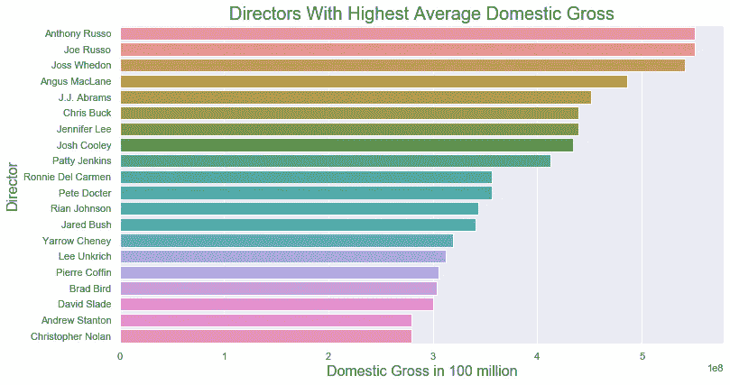
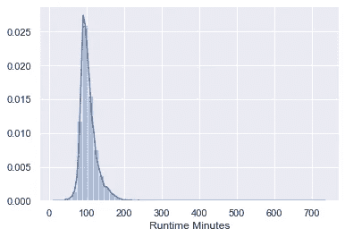
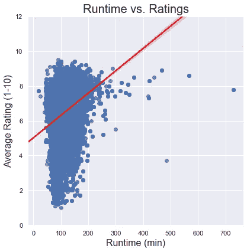
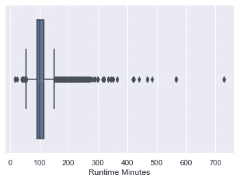
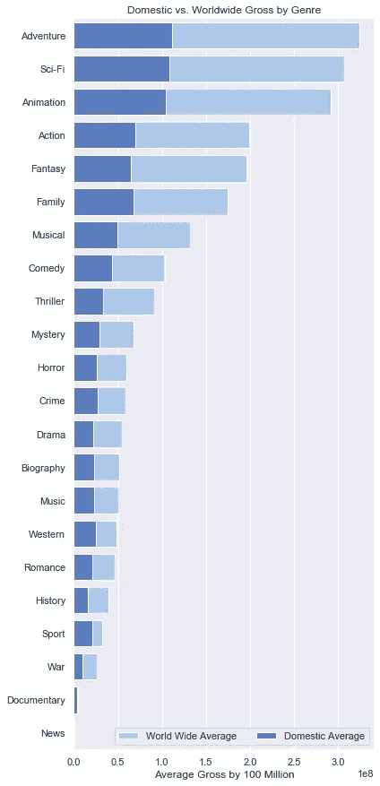

# 数据可视化:何时和如何

> 原文：<https://medium.com/analytics-vidhya/data-visualizations-the-when-and-how-4ee7493ba7da?source=collection_archive---------25----------------------->

当讨论数据可视化时，决定在哪里使用哪种类型的图表可能是压倒性的。我是否清楚地展示了数据？这对客户有意义吗？是否具有美感？在这里，我们将回顾一些最常见的数据可视化类型，以及如何在笔记本中使用它们。

*对于下面所有的图形，我正在模拟 seaborn。编码信息可以在 seaborn.pydata.org*找到

**第一步:**

`import seaborn as sns`

**第二步:选择你的视觉化**

# 条形图

条形图使用条形图显示比较数据。条形图可以水平或垂直创建。最佳实践是水平条形图用于较长的条形，而垂直条形图可用于阳性或阴性数据。我用下面的代码创建了一个水平条形图，比较电影导演和他们的电影带来的国内总收入。

**代码**:

```
f, ax = plt.subplots(figsize=(12, 6.5))
sns.barplot(y= 'primary_name', x= 'avg_domgross',
                data=df, ax=ax)ax.set_title('Directors With Highest Average Domestic Gross', fontsize = 20)
ax.set_ylabel('Director', fontsize = 16)
ax.set_xlabel('Domestic Gross in 100 million', fontsize = 16)
```

*在柱状图上使用的一些额外的有用选项是色调、色调顺序、方向(垂直或水平)、颜色、调色板、饱和度

*柱状图*:



# 距离图

散点图对于查看数据的分布很有用。很像直方图，但上面有一条线以增加可视化。下图显示了电影运行时间的分布。

**代码:**

```
ax = sns.distplot(df1['runtimeMinutes'])
```

*距离图*:



# 回归图

回归图很像散点图，只是添加了一条线来显示回归。(基本上是一条穿过散点图数据的线，显示 x 和 y 的关系)。散点图本身用于显示数据之间的相关性以及一个变量如何受到另一个变量的影响。相关性越强，这些点就越紧密。我下面用的例子是为了显示电影播放时间和收视率。

**代码**:

```
f, ax = plt.subplots(figsize=(6.5, 6.5))
sns.despine(f, left=True, bottom=True)
sns.regplot(x= 'runtimeMinutes', y= 'averageRating',
                data=df, ax=ax, line_kws = {'color':'red'})

ax.set_title('Runtime vs. Ratings', fontsize = 20)
ax.set_xlabel('Runtime (min)', fontsize = 16)
ax.set_ylabel('Average Rating (1-10)', fontsize = 16)
ax.set(ylim=(0, 12));
```

*   在回归图上使用的一些附加的有用选项是样式、图例、色调、大小、调色板、色调顺序、大小、线宽

*回归图:*



# 箱线图

箱线图非常适合用于显示细节的数据。例如，显示平均值、中值、标准差和 IQR。箱线图在显示给定数据集内存在异常值方面也很有用。下面我用运行时的箱线图建模。这样，我们可以看到电影的平均长度，以及那些真正长的电影作为离群值。

**代码**:

```
ax = sns.boxplot(x=df["runtimeMinutes"], showmeans = True)
```

*箱线图*:



# 堆积条形图

与原始条形图非常相似，堆积条形图允许查看者看到两个类别之间的相对差异。下面的例子比较了电影类型与国内和世界总票房。

**代码**:

```
sns.set(style="darkgrid")f, ax = plt.subplots(figsize=(6, 15))dom_ww = dom_ww.sort_values("avg_wwgross", ascending=False)sns.set_color_codes("pastel")sns.barplot(x="avg_wwgross", y="genres", data=dom_ww,
            label="World Wide Average", color="b")sns.set_color_codes("muted")
sns.barplot(x="avg_gross", y="genres", data=dom_ww,
            label="Domestic Average", color="b")ax.legend(ncol=2, loc="lower right", frameon=True)
ax.set(ylabel="",
       xlabel="Average Gross by 100 Million",
       title= "Domestic vs. Worldwide Gross by Genre")
sns.despine(left=True, bottom=True)
```

*堆积条形图:*

