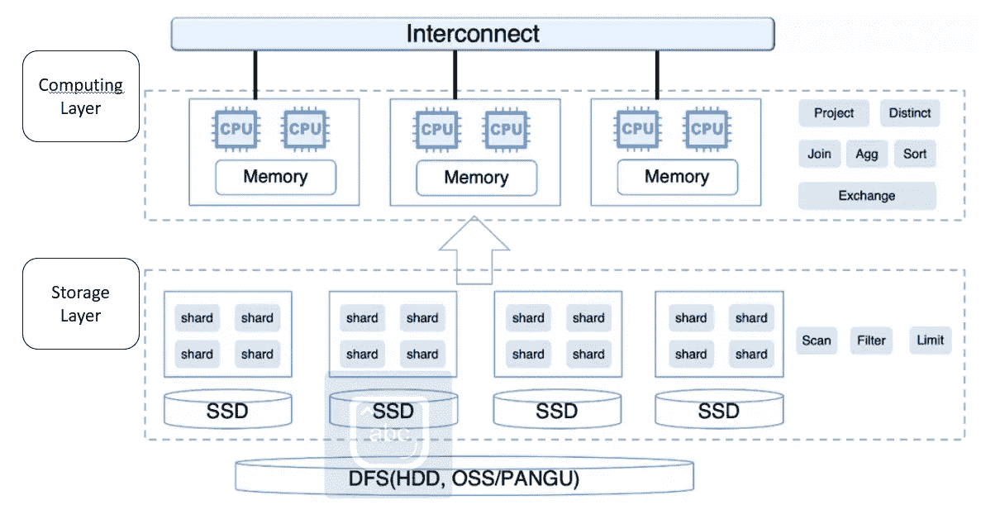
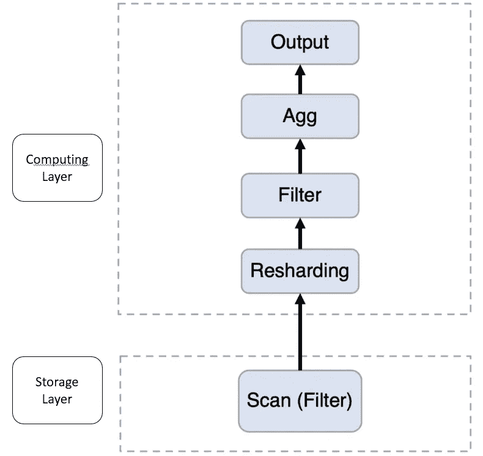
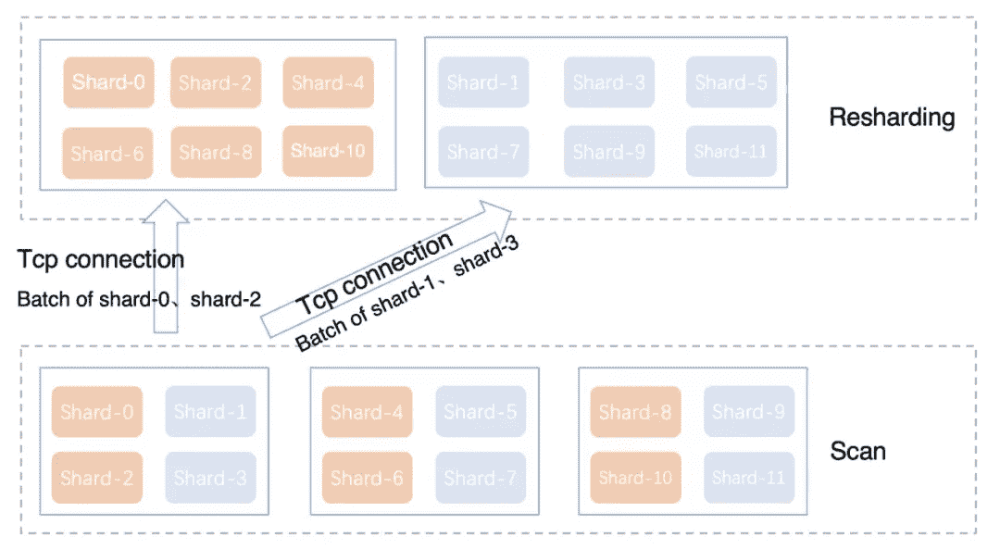

# 数据仓库—云和存储的分离

> 原文：<https://medium.com/analytics-vidhya/data-warehouse-separation-of-cloud-and-storage-85a7b92415a6?source=collection_archive---------14----------------------->

越来越需要云数据仓库来分离计算和存储。有些数据库还处于云托管阶段，只是把原来的架构迁移到云主机上，利用云资源。一些数据库已经进入云原生阶段，基于云平台 IAAS 层的基础设施，构建弹性、无服务器、数据共享等能力。

分离存储和计算资源的优势在于，您可以独立规划存储和计算资源的规格和容量。这样计算资源的扩充、缩减、释放都可以相对较快的完成，并且不会带来额外的数据重定位成本。存储和计算也可以更好地结合各自的特点，选择更适合自己的资源规格和设计。

## 让我们看看阿里云的原生数据仓库 AnalyticDB MySQL，因为它在过去几年中增强了灵活性。

AnalyticDB 最初是基于 AWS RedShift 这样的传统大规模并行处理(MPP)架构构建的。最近，AnalyticDB 推出了一种灵活的模型，具有独立的计算和存储架构。AnalyticDB 弹性模型分为访问层、计算层和存储层。访问层兼容 MySQL 协议，包括访问控制、优化器、元数据、查询调度等模块，负责实时数据写入和查询。

分析数据库当前架构

## 存储层

在弹性架构下，存储层负责实时数据写入、索引构建、数据扫描、下推谓词计算(过滤、列裁剪、分区裁剪等。)，并且不再负责查询计算任务。存储层中的数据仍然由 MPP 组织。

数据以散列和随机的方式均匀分布在分区(碎片)中。分片方法可以轻松实现实时数据写入的强一致性。扫描时可以实现分片级并发读取，保证并发。同时，存储层提供集成的冷、热分层存储能力。

数据可以以热表的形式存储在本地 SSD 中，以冷表的形式存储在底层 DFS 中，或者以冷热混合表的形式存储来实现冷热数据自动迁移的实现，详见文章《数据仓库分层存储技术的秘密》。

## 计算层

在柔性模式下，计算层由若干个计算节点组成，计算节点负责接收接入层下发的物理执行计划，并根据物理执行计划转换成相应的操作符。

计算层采用矢量化执行模型，操作符之间的数据以流水线方式交互。几行(一般几千行)数据组成一个批次，批次内部数据以列存储的形式组织。

此外，根据查询计划动态生成代码以加快计算速度，包括表达式计算、排序和类型比较。将规划好的模式作为缓存动态生成代码的关键，从而降低交互查询下动态生成代码的成本。

## 执行计划

由于计算和存储容易分离，因此可以在计算层添加一个新的重散列操作符。操作员负责从存储层加载数据。在批处理和列存储中，数据在存储层和计算层之间传输。单个请求会传输多批数据，一般不大于 32MB。

由于存储层仍然保留 MPP 数据预分区方法，优化器将在生成执行计划时，基于此分布特性减少连接和聚合操作期间不必要的数据重新分区。

此外，优化器还会确定查询中的过滤器是否可以使用存储层索引，并尝试将存储层可以识别的过滤器下推到存储层并使用索引来加速过滤，减少与计算层的数据传输。不能下推的过滤器留在计算层进行过滤。

执行计划示例

## 数据加载优化

计算和存储的分离相比原来的架构多了一个远程数据访问，会对查询的延迟和吞吐量产生更大的影响。

*   通过合并连接，减少了小数据查询的网络交互次数，并减少了查询延迟。
*   批量数据基于列存储格式进行压缩，减少了网络带宽的消耗，有效提高了重散列算子的加载吞吐量。
*   网络模块异步加载，将数据放入缓冲区，重共享操作符从缓冲区获取数据，这样 CPU 和网络 IO 完全并行。

## 动态分区重新分配

在重排操作符和扫描操作符之间，碎片根据以下原则重新分配:

*   来自同一存储节点的多个分区应该尽可能分散到不同的计算节点。
*   在同一查询中，不同表的相同分区将被映射到同一计算节点。
*   在不同的查询之间，相同的分区被随机分配给不同的计算节点。

再射击演示

**与雪花和红移不同，计算节点和分区之间没有固定的映射关系**，因为计算节点没有本地缓存，数据访问的加速完全依赖于存储层的 SDD 和内存缓存。这种动态再分配方式可以大大缓解分区不均匀、分区内数据偏斜等问题，并且不会对固定计算节点造成热点。

从阿里云 Native AnalyticDB 的例子可以看出，计算资源池、按需弹性功能有更大的机会，使企业能够大幅扩展和缩减。共享存储可以独立于计算层扩展其功能。通过这些弹性能力，可以更好地满足客户对云数据仓库的需求，进一步降低客户的使用成本。展望云数据仓库技术的未来发展。

> R 引用
> 
> 雪花[https://www.snowflake.com/](https://www.snowflake.com/)
> 
> 雪花 vs 红移[https://level up . git connected . com/雪花 vs 红移-ra3-the-need-for-than-just-speed-52e 954242715](https://levelup.gitconnected.com/snowflake-vs-redshift-ra3-the-need-for-more-than-just-speed-52e954242715)
> 
> data bricks[https://data bricks . com/session/taking-advantage-a-decomposited-storage-and-compute-architecture](https://databricks.com/session/taking-advantage-of-a-disaggregated-storage-and-compute-architecture)