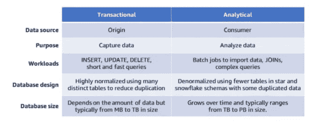
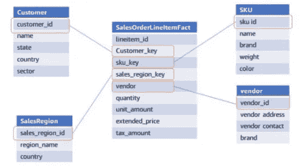
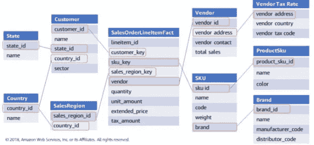
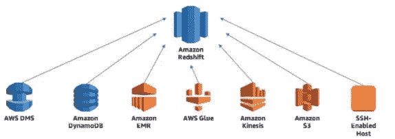
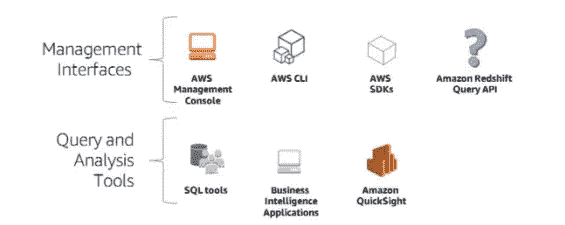
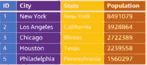
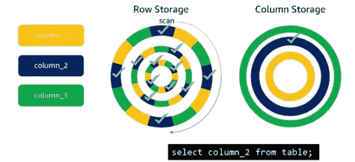
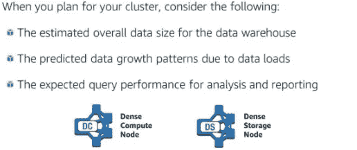
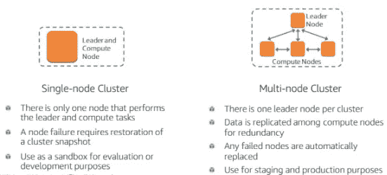
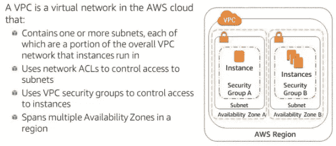

# AWS 中的数据仓库第 1 部分

> 原文：<https://medium.com/analytics-vidhya/data-warehousing-in-aws-c5e097249cf6?source=collection_archive---------10----------------------->

你好，这是我的第一篇中型文章，这篇文章的目的是我在 AWS 课程中的**数据仓库的笔记本。让我们开始吧😊。**

在我开始讨论数据仓库之前，我们首先需要了解数据库的基础知识。在数据库中有两种类型的数据库，分别是 **OLTP** 和 **OLAP** 。

在线事务处理(OLTP)主要是一种关系数据库，收集和管理事务性和操作性数据。OLTP 的例子是销售点(POS)终端。

在线分析处理(OLAP)大多是关系数据库，执行复杂的分析查询，并且数据是从事务性或系统中导入的。

以下是 OLTP 和 OLAP 的主要区别:

## 那么什么是数据仓库呢？

数据仓库是:

*   来自不同来源的业务数据的中央存储库。
*   一种支持数据分析的关系数据库。
*   一组经过批准和信任的历史公司数据。

数据仓库还有一个**目标**提供对数据的访问，确保数据的一致性和质量，并支持使用通用 BI 工具以不同方式查询数据。

数据仓库有一个小的子集，叫做数据集市。数据集市用于对业务范围内的一个部门或其他小实体的单个主题进行建模。数据集市通常以星型或雪花型模式组织。

## 什么是星型和雪花型模式？

**星型模式**是围绕一个中心表(称为事实表)来组织的，该表包含特定事件的度量，比如一件商品的销售。事实表包含与一个或多个维度表的外键关系，维度表包含销售的主键和描述性属性，如客户或产品。

星型模式示例

雪花模式类似于星型模式，但是维度被分离以进一步将数据库规范化为 3NF。

雪花模式示例

当我们讨论数据仓库时，我们还会谈到大数据，您知道什么是大数据吗？

> 大数据是高容量、高速度和/或高多样性的信息资产，需要经济高效、创新的信息处理形式来增强洞察力、决策制定和流程自动化。— Gartner

所以现在我们可以谈谈 AWS 中的数据仓库了。

AWS 有一个名为 Amazon Redshift 的工具，它负责许多具有挑战性的数据仓库部署和持续维护任务。在 Amazon 红移中，我们可以将各种数据源集成到红移中。

有两种方式与红移相互作用

Amazon Redshift 构建在大规模并行处理(MPP)架构之上，MPP 是一种数据库架构，其中主节点(在 Amazon Redshift 中称为领导节点)将工作分配给数据库集群中的一个或多个从节点(在 Amazon Redshift 中称为计算节点)。

当我们创建一个数据库时，传统的数据库以行为基础存储数据。

Amazon Redshift 有不同的方式来存储他们的数据，Redshift 使用列存储来使扫描更大的数据集和复杂的分析查询更加快速和高效。

这是列存储比行存储执行速度更快一个例子。假设您想要查询 column_2 中的值(在图中用蓝色表示)。当数据按行存储时，数据库引擎必须扫描每一行的所有值，以获得每一行中第 2 列的值。但是，对于列存储，Amazon Redshift 必须只定位包含 column_2 数据的块，才能返回请求的值。

当我们创建一个数据仓库时，我们必须计划集群有多大，以及您必须考虑的许多事情，例如…

AWS 中有两种类型集群。

当使用亚马逊红移你可以定义如何启动你的集群，亚马逊提供这个设置使用亚马逊 VPC

也许我会把这篇文章分成 2 篇，所以下一篇文章会讲如何把数据加载到红移等等。你可以在这里找到下一篇文章[。](https://ariqnfl.medium.com/data-warehousing-in-aws-part-2-aea9c458b383)

感谢您的阅读

来源:

*   亚马逊培训课程