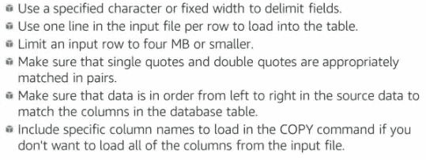
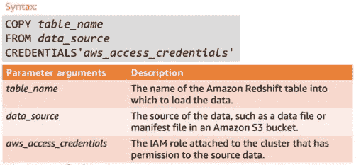
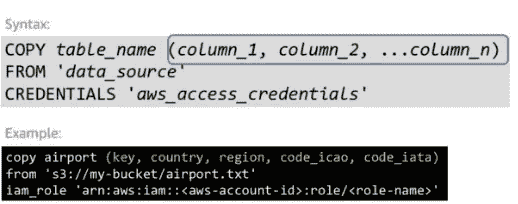

# AWS 中的数据仓库第 2 部分

> 原文：<https://medium.com/analytics-vidhya/data-warehousing-in-aws-part-2-aea9c458b383?source=collection_archive---------12----------------------->

又见面了，所以我将继续我之前关于 AWS 中数据仓库的文章。所以让我们开始吧😊

在设计数据库并将数据加载到 Redshift 之前，您必须首先确定数据将来自何处。在将数据加载到 Redshift 之前有许多步骤。

数据有不同的格式。有些数据是结构化的，但有些数据也是非结构化的。Amazon 为您提供了许多加载数据服务。

在上一篇文章中，我们谈到了数据集市，数据集市与数据湖有一些相似之处，但又有所不同。那么什么是数据湖呢？

> **数据湖**主要是由收集尽可能多的数据的需求驱动的，而不需要预先处理、了解需求或聚合，以便数据可以灵活地用于以后的分析。

**有什么不同？**

在这篇文章中，我只谈论如何加载数据到亚马逊 S3 红移。

亚马逊 S3 是互联网的存储。它旨在使开发人员更容易进行网络规模的计算。亚马逊 S3 提供了一个简单的网络服务接口，可以用来在任何时间、从网络上的任何地方存储和检索任何数量的数据。因此，使用亚马逊 S3 作为 AWS 中的数据湖，并将数据加载到其他服务中，如亚马逊红移。

亚马逊 S3 和亚马逊红移之间的集成使您能够:

*   将数据直接从 bucket 加载到集群中。
*   并行加载多个数据文件。
*   将集群中的数据卸载到存储桶中。

因此，您可以使用简单的复制命令将数据从 S3 加载到 redshift 中。

AWS 还允许您在使用 AWS Glue 将数据加载到 redshift 之前进行一些 ETL 过程。

你可以用 AWS Glue 和 AWS Lambda 运行一个无服务器、事件驱动的 ETL 管道来红移。一旦新数据在亚马逊 S3 可用，您就可以通过从 Lambda 函数调用 Glue APIs 来运行 AWS Glue ETL 作业。您还可以在 AWS Glue 数据目录中注册这个新数据集，作为 ETL 作业的一部分。

AWS 胶水有 3 个主要成分。

AWS 胶水组件

## 准备数据

准备好你的数据很重要，这里有一些准备数据加载到亚马逊红移的技巧，你可以在这里看到详细信息[。](http://docs.aws.amazon.com/redshift/latest/dg/t_preparing-input-data.html)

准备数据

如果你把数据分成几个片段，你也可以使用一个清单文件。manifest files 是 JSON 格式的文本，它列出了运行 COPY 命令时要加载的每个文件。

如果你的数据需要特殊处理，这里有一些提示。

如果你的数据是用**字符分隔的**。

如果要将数据指定到固定宽度的列中

此外，红移不会强制您创建主键和外键约束。

## 使用复制命令加载数据

建议使用 COPY 命令将数据源中的数据加载到 Redshift 中。你可以在这里看到关于复制命令[的详细信息。](http://docs.aws.amazon.com/redshift/latest/dg/t_Loading_tables_with_the_COPY_command.html)

所需的复制参数包括:

**从 CSV 文件加载数据**

CSV 是用于在电子表格中导入和导出数据的常用格式。借助 CSV，您可以:

*   使用 IGNOREHEADERS AS 选项跳过标题，并指定要忽略的行数。
*   如果不想加载所有列，请使用列映射或 JSONpaths 文件来指定映射。

加载 CSV 文件的复制命令

**从 JSON 文件加载数据**

Redshift 使用 JSONPaths 文件来解析 JSON 格式的源数据。

*   JSONPaths 文件包含一个或多个 JSONPaths 表达式。
*   JSONPath 表达式对应于 Redshift 中目标表中的一列

您可以在复制命令中使用列列表来指定列顺序。

复制命令中有许多数据转换参数。你可以在这里找到详细信息[。](http://docs.aws.amazon.com/redshift/latest/dg/copy-parameters-data-conversion.html)

**维护表格**

维护表对于确保表仍然正确运行很重要。您可以使用分析和真空命令来帮助您维护表格。

**ANALYZE** 命令获取行的样本，进行一些计算，并保存得到的列统计信息。

使用 **VACUUM** 命令释放存储空间并提高性能，因为红移不会自动从已删除的项目中回收空间。

如果您在验证数据和对数据加载进行故障排除时遇到问题，使用以下系统表有助于在加载过程中验证数据和对问题进行故障排除:

*   STL_LOAD_ERRORS 包含在特定加载期间发生的错误。
*   STL_FILE_SCAN 提供了特定文件的加载时间。

有一些加载数据的最佳实践提示:

这就是如何在 AWS 中创建数据仓库。希望这篇文章能对你有所帮助。稍后，您可以将 Redshift 连接到 Amazon QuickSight，以创建数据的可视化。谢谢你😂

来源:

*   亚马逊培训课程