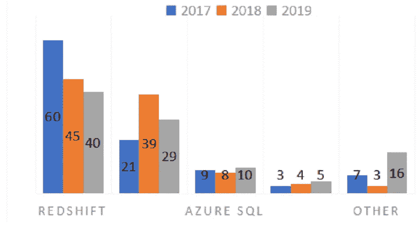
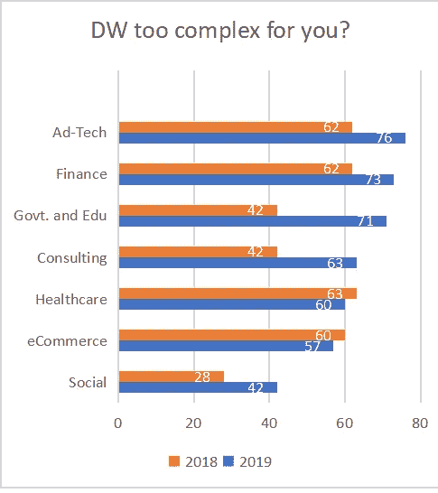

# 数据仓库:鸟瞰当今的相关性

> 原文：<https://medium.com/analytics-vidhya/data-warehousing-the-relevance-today-as-seen-by-a-birds-eye-view-b7e513f7ad75?source=collection_archive---------22----------------------->

本文提供了一种方法来透视通常与数据驱动型行业名称相关的热门话题，这些行业在当今世界正受到指数级关注，只有少数技术行业以外的人真正知道它代表什么。

在 [Unsplash](https://unsplash.com?utm_source=medium&utm_medium=referral) 上[科学高清](https://unsplash.com/@scienceinhd?utm_source=medium&utm_medium=referral)拍摄的照片

当我们听到数据科学、云计算等与数据产业相关的热门词汇，而不是商业智能、数据智能等许多知名词汇时，这些在当代技术产业中相对较新的词汇却引起了技术社区内外人士的强烈关注。

但是我们当中有多少人真正了解科技行业中这些放大的新现代领域的开端，为了更好地理解数据行业是如何形成的，让我们回顾一下前现代大规模数据积累方法**数据仓库。**

> [数据仓库](https://en.wikipedia.org/wiki/Data_warehouse)是一个巨大的数据存储系统，存储所有当前和历史相关数据，最终由分析师和数据科学家使用，从中提取有用的数据*。*

> 数据仓库这个名字是由美国计算机科学家比尔·恩门在 20 世纪 70 年代创造的。在那些年里，最早的数据仓库是建立在最多几千兆字节容量的本地服务器上的。如今，我们的口袋里有了更多的储物空间。
> 
> 然而，对仓库的需求也大幅上升。当时的数据仓库在执行当天的查询时也非常慢。无论是硬件还是软件，他们都是劣等的。第一代云数据仓库消除了设置支持集群 MPP 数据仓库所需的相当复杂的基础设施的复杂性。不仅硬件和操作系统环境是预配置的，数据仓库也是如此。

传统上，有两种方法用于构建数据仓库，这两种方法都很好，但它们在原理上是不同的。一个是 ETL 方法*(提取>转换>加载)*，而另一个是 ELT *(提取>加载>转换)*。

然而，数据仓库中不断增长的需求对当时的硬件行业提出了挑战，即提出一种最佳解决方案来为数据提供更多的空间，同时尽可能少地占用物理空间。

> *由此标志着云存储时代的开始。*

当前趋势中的数据仓库被认为是由大型数据巨头(如 AWS、Google Cloud)管理的，目的是为更多样的一般用途积累数据，大规模积累这些数据的好处是，第一，小行业不必为数据仓库建立自己的物理空间，第二，允许高效使用数据。由于冗余可以通过各种算法来消除，这些算法可以检查相似或重复的数据，这种方法的另一个用途是数据收集模式可以被概括为通过人工智能来自动化任务

用于数据仓库的技术

但是第二代数据仓库(或云计算)并没有解决第一代的所有问题。

同样，所有这些都是云原生解决方案，这意味着那些只需要本地存储的人需要寻找替代方案。此外，尽管初始设置成本很低，但随着更多计算集群的涌现，这些成本也会迅速增加，以满足不断增长的用户需求。[ [1](https://dzone.com/articles/data-warehouses-past-present-and-future)

这并不意味着数据仓库是当今世界存储数据的缓慢方法，事实上，[最近的一项分析发现，数据仓库工程师在需求最大的 10 个职位中排名第六。](https://in.indeed.com/?r=us)

现在，由于目前的前景给出了一个清晰的画面，即未来也将需要 DWs，因此可能会出现一个问题，它将何去何从。

未来可能出现的一个基本问题是数据复制，即积累可能已经存储在数据仓库中的相同或相似的数据，为了消除这个问题**数据仓库将是分析性的。由于当今时代数据分析和数据存储齐头并进，这将不是一项单调乏味的任务。**

还有另一个积累层，称为**数据湖**，它以原始形式存储数据。在一个越来越多地由数据湖提供服务的世界中，关于数据仓库的未来，以及当任何和所有应用程序需要即时利用数据时，传统的提取、转换和加载环境如何成为累赘，已经有了大量的讨论

我们正在更积极地迎接当今世界的自动化时代，因此数据仓库领域的自动化将意味着更少的人来操作和填充，这在当前世界是相当必要的，然而相反，我们将需要更好的优化算法，以及优秀的数学家和开发人员团队来利用人工智能以有效的方式组织数据仓库。我们正在谷歌大脑中看到它的种子，它正在使用这些积累的数据通过一些人工通用智能算法来操纵自己，使数据本身足够智能，可以在没有任何人类监督的情况下处理自己。

像谷歌、亚马逊这样的大型数据组织已经在未来的数据收集方面占据优势，使得少数孤立的数据仓库成为必要，这将使它们成为大型*数据仓库*，为更多公司使用收集的数据腾出空间，并减少公司仅用于数据分配的空间需求，但如果需要，新公司可能会建立自己的微数据车库(可以这么说)。

最后但同样重要的是，数据在未来不会减少，因此，标志着未来需要更多的服务(如亚马逊已经提供的 AWS)、就业和计算能力来存储数据，这已经成为未来数据科学时代的整个支柱。这个数字还在不断增加。

# 简而言之，更多的数据产生更多的资源，这反过来又增加了复杂性，但更有可能进行概括，从而为人工智能的出现和工作提供了空间，并催生了数据科学。

但是，如果我们走的是一条长路，要完全理解在当今世界中，随着数据不断增加，手动维护工作是如何减少的，我们首先需要认识到，数据一直存在，它积累到需要仓库和湖泊这样大的规模只是时间问题。在今天这个时代，数据本身已经收集了如此多的数据，以至于有一个称为数据工程的领域来处理数据本身，从而产生了大量的子领域，如*大数据、*数据科学、*数据分析、商业智能*等等。随着数据的不断增长，我们需要更好的算法来概括数据，使数据变得智能，并将其自身作为处理未来数据的资源。事实上，这被称为*数据智能*，它在未来会越来越相关。

# TLDR: *数据仓库是一个巨大的数据存储系统，所有当前的以及历史的相关数据都存储在这里，最终由分析师和数据科学家使用，以从中提取有用的数据。云计算基于数据仓库科学，从而使数据积累更具可扩展性和可行性。*