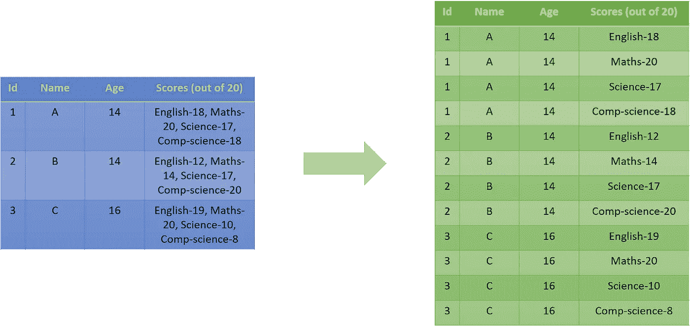
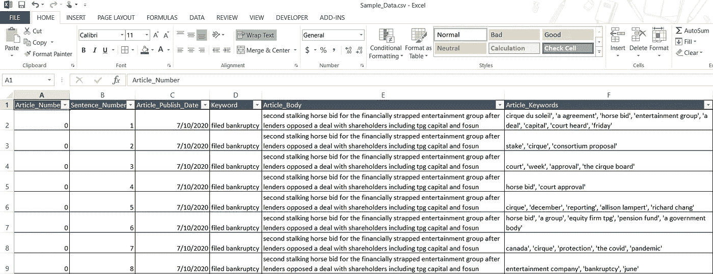
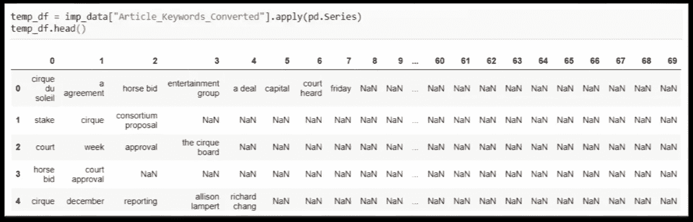
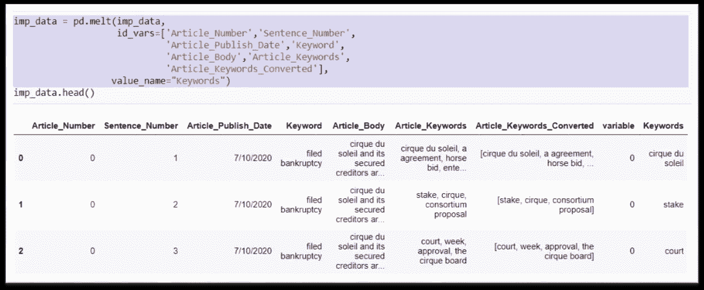
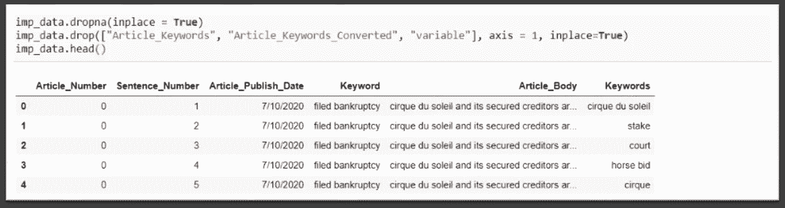

# 数据争论解决方案—拆分列，每个单元格包含值列表

> 原文：<https://medium.com/analytics-vidhya/data-wrangling-solutions-splitting-column-with-each-cell-containing-list-of-values-fc95d14fa539?source=collection_archive---------24----------------------->

## 常见的数据争论挑战和一步到位的解决方案。


约书亚·苏考夫在 [Unsplash](https://unsplash.com?utm_source=medium&utm_medium=referral) 上的照片

在分析项目的数据准备阶段，一个常见的挑战是让**在表格的列中有一个值列表**。通常，在这种情况下，分析师会将其拆分为多个记录。这种情况的直观表示如下:



示例场景(图片由作者提供)

在本教程中，我们将演示一步一步的方法来处理这种情况。**根据 *Pandas* 库的版本，可以遵循下面**详述的不同解决方案。

## 假设和建议

动手是掌握编程的关键。我们建议您在完成教程的过程中继续实现这些代码。要实现这一点，您可以从[**this GitHub link**](https://github.com/dalmiaujjwal/Data_Wrangling_Tips_Tricks)的 **Scenario_4 文件夹**中访问本教程中使用的示例数据和相关笔记本。

如果你是 GitHub 新手，想学习它，请通过 [***这篇***](https://towardsdatascience.com/must-know-tools-for-data-scientists-114d0b52b0a9) 教程。要在您的系统上设置一个新的 Python 环境，请阅读本 教程中的 [***。***](https://towardsdatascience.com/getting-started-guide-anaconda-80a4d30d3486)

以下是本教程中使用的 pandas 函数/方法列表:

1.  阅读 _csv
2.  字符串存取器
3.  应用
4.  合并
5.  熔化
6.  德罗普纳
7.  滴
8.  激增

# 我们开始吧

## 步骤 1 —准备好数据

对于本教程，我们搜集了一些关于加拿大公司破产的新闻。我们还使用了一些 NLP 技术来从抓取的文章的每个句子中提取关键词。该数据集和样本数据快照的数据字典如下:

*   商品编号——识别商品的唯一编号
*   Sentence_Number —标识文章句子的唯一编号
*   文章发布日期—文章的发布日期
*   关键字—用于文章网络搜索的关键字
*   Article_Body —文章的实际文本
*   文章关键词—从文章句子中识别的重要关键词



样本数据快照(图片由作者提供)

注意，文章关键词以逗号分隔文本值的**列表的形式出现。我们的目标是将它分成多个记录。**

## 步骤 2 —导入包和数据文件。

一旦有了可用的数据，下一步就是将其导入到 Python 环境中。

```
**#### Sample Code
#### Importing Pandas** import pandas as pd**#### Importing Data File - Change the Windows Folder Location** imp_data = pd.read_csv("C:\\Ujjwal\\Analytics\\Git\\Scenario_4\\Sample_Data.csv")
```

我们使用了熊猫 ***read_csv*** 函数来读取 Python 中的数据。

## 步骤 3 —将关键字文本转换为值列表。

该任务的一个关键步骤是**将逗号分隔的文本转换成 Python 序列对象(本例中为 list)**。以下是示例代码:

```
**#### Converting the keywords to a Python list object**
imp_data["Article_Keywords_Converted"] = imp_data["Article_Keywords"].str.split(",")
```

注意使用 ***字符串访问器*** 和相关的 ***split*** 方法来获得想要的结果。**文本值列表现在作为列表对象可用，其中每个关键字是一个列表组件**。

## 步骤 4a —使用低于 0.25.0 的 Pandas 版本的用户

在 0.25.0 版本之前，Pandas 没有任何现成的函数/方法来解决上述情况。如果您使用的是旧版本的 Pandas，并且无法升级到最新版本，请遵循以下简单步骤:

*   **将带有列表对象的列转换为熊猫系列**并存储在临时数据框中。通过将列表对象列转换为 Pandas 系列，每个列表组件将分成一个新数据框的多个列。新数据帧的示例代码和结构如下:

```
**#### Sample Code**
temp_df = imp_data["Article_Keywords_Converted"].apply(pd.Series)
```



转换后的示例值(图片由作者提供)

*   **将临时数据帧与原始数据帧**合并。由于新创建的数据框将与原始数据框具有相同的索引，因此我们可以使用左索引和右索引来合并这两个数据框。

```
**#### Sample Code**
imp_data = pd.merge(imp_data, temp_df, right_index=True, left_index=True, how = "left")
```

*   **融化新增的列**。这一步将把所有单独的关键字值放在单独的行中。要了解熊猫的融化，请通读 [**这篇**](/analytics-vidhya/pandas-for-beginners-reshaping-dataframes-part-1-cfb43f6170bf) 教程。

```
**#### Sample Code**
imp_data = pd.melt(imp_data, 
                   id_vars=['Article_Number','Sentence_Number',
                            'Article_Publish_Date','Keyword',
                            'Article_Body','Article_Keywords',
                            'Article_Keywords_Converted'],
                  value_name="Keywords")
```



熔化数据帧后的输出(图片由作者提供)

*   **最后，删除新创建的 Keywords 字段中所有具有空值**的记录。此外，删除所有临时的或不需要的列。最终的数据框将类似于下面共享的快照:

```
**#### Sample Code**
imp_data.dropna(inplace = True)
imp_data.drop(["Article_Keywords", "Article_Keywords_Converted", "variable"], axis = 1, inplace=True)
```



最终输出(图片由作者提供)

## 步骤 4b—Pandas 0 . 25 . 0 及以上版本的用户

在 0.25.0 版本中，熊猫引入了新的**数据帧方法**叫做 ***爆炸*。**这个函数只需一步就能完成这项工作。在数据帧上使用这个方法，**将列名作为参数**传递。它会自动将值序列分割成多个记录。示例代码如下:

```
**#### Converting the list of values into multiple records** imp_data = imp_data.explode("Article_Keywords_Converted")
imp_data.head()
```

# 结束语

我敢肯定，教程最后一段一定是 ***炸了*** 你的脑子。有了这些现成的解决方案，我们的数据争论任务变得容易实现。我希望上面介绍的解决方案是有帮助的。

快乐学习！！！！