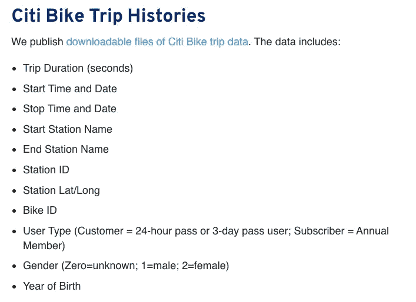

# 与 Python 熊猫的数据角力

> 原文：<https://medium.com/analytics-vidhya/data-wrangling-with-python-pandas-e58a7058408a?source=collection_archive---------9----------------------->

## 非技术人员的视角

最近，我完成了一门侧重于数据分析师技能的 MOOC 课程；主要是 *SQL，实用统计& Python* 。课程结束后，我决定通过使用托管在 bikeshare.com[的自行车共享活动数据集来练习 Python 熊猫在数据清理/争论方面的技能。](https://www.citibikenyc.com/system-data)

注意:

1.  我的工作基于纽约 2019 年的月度数据
2.  我在[谷歌实验室](https://colab.research.google.com/notebooks/intro.ipynb)上执行任务

下面是数据集的数据定义:



自行车共享的数据定义

在我们开始这个故事之前，我想强调一下，我的作品旨在强调:

1.  我的发现关于我们如何利用好 Python 熊猫进行数据角力，特别是对于 ***没有编程背景的人*** 。
2.  相同进程使用 ***代码优化*** (执行时间&内存使用方面的改进)前后。毕竟，combine 数据集的大小超过 1 GB，包含 2000 万条记录。

以下是用于该任务的 python 库:

```
*# install haversine if required*
*# use memory_profiler to check memory usage for each command*

!pip install haversine memory_profiler*# data analysis* 
**import** **numpy** **as** **np** 
**import** **pandas** **as** **pd** *# Operating System* 
**from** **glob** **import** glob 
**from** **os** **import** path 
**from** **pathlib** **import** Path *# calculate distance between geo coordinates* 
**from** **haversine** **import** haversine_vector, Unit # from memory_profiler
%load_ext memory_profiler
```

# 第一课:系统高效地导入 CSV

经过反复试验，我找到了导入 CSV 文件的各种方法，特别是多个 CSV 文件。大多数课程教授的 ***熊猫 read_csv()*** 方法都是针对单个文件，通常文件大小很小，用于教学目的..

实际上，分析师可能需要收集多个 CSV 文件，每个文件都可能非常大。在这种情况下，自行车共享月文件是 100 MB+。我们需要分析 12 个月的数据。

在这里我演示了 ***不重复自己的概念(干)***——避免类似任务的长&重复代码，在实际语境中是适用的。

```
*# list files available in the 'New York Bike Share' directory*
*# 13 files in the directory which we only need file in format 
"*-citibike-tripdata.csv" (i.e. 201901-citibike-tripdata.csv etc)*
*# each file is 100 MB+*

!ls -lh /content/drive/MyDrive/'New York Bike Share'total 5.4G
-rw------- 1 root root 176M Feb 11  2019 201901-citibike-tripdata.csv
-rw------- 1 root root 172M Mar  4  2019 201902-citibike-tripdata.csv
-rw------- 1 root root 242M Apr 15  2019 201903-citibike-tripdata.csv
-rw------- 1 root root 322M May  6  2019 201904-citibike-tripdata.csv
-rw------- 1 root root 351M Jun 11  2019 201905-citibike-tripdata.csv
-rw------- 1 root root 387M Jul 15  2019 201906-citibike-tripdata.csv
-rw------- 1 root root 397M Aug  5  2019 201907-citibike-tripdata.csv
-rw------- 1 root root 426M Sep 16  2019 201908-citibike-tripdata.csv
-rw------- 1 root root 443M Oct 11  2019 201909-citibike-tripdata.csv
-rw------- 1 root root 379M Nov  5  2019 201910-citibike-tripdata.csv
-rw------- 1 root root 268M Dec 20  2019 201911-citibike-tripdata.csv
-rw------- 1 root root 173M Jan 21  2020 201912-citibike-tripdata.csv
-rw------- 1 root root 1.7G Feb 19 02:04 new_york_bikeshare_2019.csv
```

# 以前:低效的方式

我的编码之旅的第一次尝试是用 Pandas 导入所有的月度文件，并将它们合并到一个主数据框架中。

```
*Issue: repetitive codes that require copy + paste and are error prone.*
*Note: Imagine we have files for 5 years (60 months) within the same directory ??**file_01 = pd.read_csv('/content/drive/MyDrive/New York Bike Share/201901-citibike-tripdata.csv')*
*file_02 = pd.read_csv('/content/drive/MyDrive/New York Bike Share/201902-citibike-tripdata.csv')*
*file_03 = pd.read_csv('/content/drive/MyDrive/New York Bike Share/201903-citibike-tripdata.csv')*
*file_04 = pd.read_csv('/content/drive/MyDrive/New York Bike Share/201904-citibike-tripdata.csv')*
*file_05 = pd.read_csv('/content/drive/MyDrive/New York Bike Share/201905-citibike-tripdata.csv')*
*file_06 = pd.read_csv('/content/drive/MyDrive/New York Bike Share/201906-citibike-tripdata.csv')*
*file_07 = pd.read_csv('/content/drive/MyDrive/New York Bike Share/201907-citibike-tripdata.csv')*
*file_08 = pd.read_csv('/content/drive/MyDrive/New York Bike Share/201908-citibike-tripdata.csv')*
*file_09 = pd.read_csv('/content/drive/MyDrive/New York Bike Share/201909-citibike-tripdata.csv')*
*file_10 = pd.read_csv('/content/drive/MyDrive/New York Bike Share/201910-citibike-tripdata.csv')*
*file_11 = pd.read_csv('/content/drive/MyDrive/New York Bike Share/201911-citibike-tripdata.csv')*
*file_12 = pd.read_csv('/content/drive/MyDrive/New York Bike Share/201912-citibike-tripdata.csv')*

*df = pd.concat([file_01, file_02, file_03, ....], ignore_index=True)*
```

繁琐的方法，不是很聪明…

# 之后:系统有效的方法

我发现做同样的事情更简洁系统的方法。我把这个过程分成几个步骤。不再需要复制+粘贴，因此效率更高，可扩展性更强。

```
*'''*
*Step 1: Getting file names within directory that are required for analysis*

*'''*

*# replace 'file_dir' with your working directory*
*# current path of working directory for jupyter notebook and CSV files in Google Colab*
file_dir = '/content/drive/MyDrive/New York Bike Share'

*# getting file names within the directory*
file_names = glob(path.join(file_dir, '*-citibike-tripdata.csv'))
file_names['/content/drive/MyDrive/New York Bike Share/201901-citibike-tripdata.csv',
 '/content/drive/MyDrive/New York Bike Share/201902-citibike-tripdata.csv',
 '/content/drive/MyDrive/New York Bike Share/201903-citibike-tripdata.csv',
 '/content/drive/MyDrive/New York Bike Share/201904-citibike-tripdata.csv',
 '/content/drive/MyDrive/New York Bike Share/201905-citibike-tripdata.csv',
 '/content/drive/MyDrive/New York Bike Share/201906-citibike-tripdata.csv',
 '/content/drive/MyDrive/New York Bike Share/201907-citibike-tripdata.csv',
 '/content/drive/MyDrive/New York Bike Share/201908-citibike-tripdata.csv',
 '/content/drive/MyDrive/New York Bike Share/201909-citibike-tripdata.csv',
 '/content/drive/MyDrive/New York Bike Share/201910-citibike-tripdata.csv',
 '/content/drive/MyDrive/New York Bike Share/201911-citibike-tripdata.csv',
 '/content/drive/MyDrive/New York Bike Share/201912-citibike-tripdata.csv']
```

这里有一个额外步骤，我相信它对于理解变量和数据类型方面的数据集是有用的。我们只导入对分析有意义的变量。

```
*# only import 100 line items for quick view of column names and data type*
*# let's leave columns such as 'stop_time', station_id, station_name & bike_id out of this demo*

pd.read_csv('/content/drive/MyDrive/New York Bike Share/201901-citibike-tripdata.csv', nrows=100).info()<class 'pandas.core.frame.DataFrame'>
RangeIndex: 100 entries, 0 to 99
Data columns (total 15 columns):
 #   Column                   Non-Null Count  Dtype  
---  ------                   --------------  -----  
 0   tripduration             100 non-null    int64  
 1   starttime                100 non-null    object 
 2   stoptime                 100 non-null    object 
 3   start station id         100 non-null    int64  
 4   start station name       100 non-null    object 
 5   start station latitude   100 non-null    float64
 6   start station longitude  100 non-null    float64
 7   end station id           100 non-null    int64  
 8   end station name         100 non-null    object 
 9   end station latitude     100 non-null    float64
 10  end station longitude    100 non-null    float64
 11  bikeid                   100 non-null    int64  
 12  usertype                 100 non-null    object 
 13  birth year               100 non-null    int64  
 14  gender                   100 non-null    int64  
dtypes: float64(4), int64(6), object(5)
memory usage: 11.8+ KB
```

如果你是 Python 编程的新手，你可能想阅读我以前关于 [***的帖子。***](https://ks-ong86.medium.com/python-pandas-read-csv-fb0fc322c8c1)

[](https://ks-ong86.medium.com/python-pandas-read-csv-fb0fc322c8c1) [## 蟒蛇熊猫{read_csv}

### 不同的视角

ks-ong86.medium.com](https://ks-ong86.medium.com/python-pandas-read-csv-fb0fc322c8c1) 

```
*'''*
*Step 2: Define function to create Pandas DataFrame*

*'''*

col_index = [0, 1, 5, 6, 9 ,10, 12, 13, 14]

col_name = ['duration', 
            'time_start', 
            'station_latitude_start', 
            'station_longitude_start',
            'station_latitude_end', 
            'station_longitude_end', 
            'user_type', 
            'birth_year', 
            'gender']

col_type = {
    'duration': np.int32,
    'station_latitude_start': np.float32,
    'station_longitude_start': np.float32,
    'station_latitude_end': np.float32,
    'station_longitude_end': np.float32,
    'user_type': 'category',
    'birth_year': np.int32,
    'gender': 'category'
}

*# self defined function to create dataframe*
**def** create_df(f, size = 100_000):

*# create chunks of data frame with 100K per chunk. Result is an iteratable of dataframes*
    result = pd.read_csv(f, chunksize=size, usecols=col_index,      names=col_name, dtype=col_type, parse_dates=['time_start'], header=0)

    **return** result*'''*

*Step 3: Use .map() to apply 'create_df' function to each file in 'file_names'*

*'''*

*# .map() will apply 'create_df' function to each file in file_names*
*# ref: https://realpython.com/python-map-function/#getting-started-with-pythons-map*
*# result >> list of iteratable. Each iterable contains many dataframes with 100,000 rows*

df = list(map(create_df, file_names))
df[<pandas.io.parsers.TextFileReader at 0x7f20ce82ae10>,
 <pandas.io.parsers.TextFileReader at 0x7f20ccd9ced0>,
 <pandas.io.parsers.TextFileReader at 0x7f20ccdd7390>,
 <pandas.io.parsers.TextFileReader at 0x7f20ccde1dd0>,
 <pandas.io.parsers.TextFileReader at 0x7f20ccde1b90>,
 <pandas.io.parsers.TextFileReader at 0x7f20ccd6b5d0>,
 <pandas.io.parsers.TextFileReader at 0x7f20cefd4290>,
 <pandas.io.parsers.TextFileReader at 0x7f20ccdd7a90>,
 <pandas.io.parsers.TextFileReader at 0x7f20cd622a90>,
 <pandas.io.parsers.TextFileReader at 0x7f20ce8a68d0>,
 <pandas.io.parsers.TextFileReader at 0x7f20cee91550>,
 <pandas.io.parsers.TextFileReader at 0x7f20ce82aa90>]*'''*
*Step 4: apply python 'list comprehension' to get list of DataFrame*

*'''*

*# loop through each iteratable and store each dataframe to list with 'list comprehension'*

df = [chunk **for** ls **in** df **for** chunk **in** ls]*# let's check one of the dataframe*
*# each dataframe contains up to 100,000 line items*
*# df[0] index number range from 0 to 99,999*

df[0].info()<class 'pandas.core.frame.DataFrame'>
RangeIndex: 100000 entries, 0 to 99999
Data columns (total 9 columns):
 #   Column                   Non-Null Count   Dtype         
---  ------                   --------------   -----         
 0   duration                 100000 non-null  int32         
 1   time_start               100000 non-null  datetime64[ns]
 2   station_latitude_start   100000 non-null  float32       
 3   station_longitude_start  100000 non-null  float32       
 4   station_latitude_end     100000 non-null  float32       
 5   station_longitude_end    100000 non-null  float32       
 6   user_type                100000 non-null  category      
 7   birth_year               100000 non-null  int32         
 8   gender                   100000 non-null  category      
dtypes: category(2), datetime64[ns](1), float32(4), int32(2)
memory usage: 3.2 MB*# df[1] index number range from 100,000 to 199,999*

df[1].info()<class 'pandas.core.frame.DataFrame'>
RangeIndex: 100000 entries, 100000 to 199999
Data columns (total 9 columns):
 #   Column                   Non-Null Count   Dtype         
---  ------                   --------------   -----         
 0   duration                 100000 non-null  int32         
 1   time_start               100000 non-null  datetime64[ns]
 2   station_latitude_start   100000 non-null  float32       
 3   station_longitude_start  100000 non-null  float32       
 4   station_latitude_end     100000 non-null  float32       
 5   station_longitude_end    100000 non-null  float32       
 6   user_type                100000 non-null  category      
 7   birth_year               100000 non-null  int32         
 8   gender                   100000 non-null  category      
dtypes: category(2), datetime64[ns](1), float32(4), int32(2)
memory usage: 3.2 MB*'''*  
*Step 5: use pd.concat() to merge list of dataframes* *'''* *# p.concat() >> append list of dataframe on top of each other to produce master dataframe* 
*# ref: https://pandas.pydata.org/pandas-docs/stable/reference/api/pandas.concat.html* 
*# note: each dataframe has different index number. parameter 'ignore_index' is set to 'True' and pd.concat() will reset index number after merge.*  df = pd.concat(df, ignore_index=**True**) df.info()<class 'pandas.core.frame.DataFrame'>
RangeIndex: 20551697 entries, 0 to 20551696
Data columns (total 9 columns):
 #   Column                   Dtype         
---  ------                   -----         
 0   duration                 int32         
 1   time_start               datetime64[ns]
 2   station_latitude_start   float32       
 3   station_longitude_start  float32       
 4   station_latitude_end     float32       
 5   station_longitude_end    float32       
 6   user_type                category      
 7   birth_year               int32         
 8   gender                   category      
dtypes: category(2), datetime64[ns](1), float32(4), int32(2)
memory usage: 666.4 MB
```

# 第 2 课:熊猫“类别”数据类型

导入 CSV 时，性别数据类型设置为 ***【类别】*** 。read_csv()方法。我了解到，即使我明确排除了性别类别为“0”的行项目，类别仍将保留在 pandas 的内存/数据帧中。

我们可以用 ***.cat.categories*** 属性检查变量的类别，用***. cat . remove _ categories()***方法去掉不需要的类别。最后，我们还可以使用***. cat . rename _ categories()***方法来重命名类别。

```
*# Based on data dictionary, 'gender' consists category 0, 1, 2 which category 0 is 'unknown'*
*# .unique() method can easily shows unique category for 'gender'*

df.gender.unique()['1', '2', '0']
Categories (3, object): ['1', '2', '0']*# .cat.categories attribute is an alternative to .unique() method*
*# ref: https://pandas.pydata.org/pandas-docs/stable/reference/api/pandas.Series.cat.categories.html*

df.gender.cat.categoriesIndex(['0', '1', '2'], dtype='object')*# let's remove category '0' from dataframe*

df = df.loc[df.gender != '0', :]

*# check again unique values in 'gender'*

df.gender.unique()['1', '2']
Categories (2, object): ['1', '2']
```

让我们用*做一个按性别划分的用户百分比汇总。value _counts()* 方法。尽管结果显示为 0%,但我们会惊讶地发现类别“0”是摘要的一部分。

```
*# 1 >> 'Male', 2 >> 'Female'*df.gender.value_counts(normalize=**True**)1    0.739935
2    0.260065
0    0.000000
Name: gender, dtype: float64
```

原因是，类别' 0 '仍然在熊猫的内存中，尽管我们从数据帧中显式删除了类别' 0 '的性别。

```
df.gender.cat.categoriesIndex(['0', '1', '2'], dtype='object')
```

# 移除 _ 类别

***. cat . remove _ categories()***帮助删除熊猫内存中未使用的类别

```
*# set parameter inplace = True; pandas doesn't print result of new category*

df.gender.cat.remove_categories(removals = '0', inplace = **True**)

*# category '0' no longer in pandas memory*

df.gender.cat.categoriesIndex(['1', '2'], dtype='object')*# sumamrise gender percentage....again*

df.gender.value_counts(normalize=**True**)1    0.739935
2    0.260065
Name: gender, dtype: float64
```

# 重命名 _ 类别

*类别‘1’&‘2’都不是自明的，所以我们用****. cat . rename _ categories()****的方法给类别重新命名。*

```
df.gender.cat.rename_categories({'1': 'Male', '2': 'Female'}, inplace = **True**)

*# new category name for gender*

df.gender.cat.categoriesIndex(['Male', 'Female'], dtype='object')*# sumamrise gender percentage....again*
*# gender category becomes 'Male' & 'Female'*

df.gender.value_counts(normalize=**True**)Male      0.739935
Female    0.260065
Name: gender, dtype: float64
```

# 第 3 课:熊猫特征工程. cut()

在自行车共享数据框架中，我们被赋予“出生年份”。出生年份对于数据分析/可视化不是很有用。

想象一下从 1970 年到 2020 年的出生年份，无论是柱状图还是柱状图都很难显示。

在这种情况下，我们可以执行特征工程，将出生年份分组为*代*。例如:任何出生于 1981-1996 年的人都是 y 一代。因此，我们可以按代而不是出生年份来分析自行车共享活动。

```
*# summary of birth_year (min & max)*df.birth_year.min(), df.birth_year.max()(1857, 2003)*# let's only include birth_year from 1928 (silent generation) onward*

df = df.query(" birth_year >= 1928 ").reset_index(drop = **True**)*# total observations after exclude birth_year < 1928*
*# approximately 19M observations*

df.shape(18982169, 9)
```

# 之前:将自定义函数应用于“出生年份”

这里我们创建了一个函数，将出生年份分成几代:silent，baby-boomer，gen_x，gen_y & gen_z。

```
**def** define_gen(year): gen = **None**    
      **if** year < 1946:
         gen = 'silent'   
      **elif** (year >= 1946) & (year < 1965):
         gen = 'baby_boomer'
      **elif** (year >= 1965) & (year < 1981):
         gen = 'gen_x'
      **elif** (year >= 1981) & (year < 1997):
         gen = 'gen_y'
      **else**:
         gen = 'gen_z'
      **return** gen
```

这样做没有错，但是，这种方法提出了一个巨大的挑战…在大型数据集上执行操作需要很长时间，在这种情况下，有 1900 万行。

我们可以使用 *%timeit 来找出对每个观察值应用该函数所花费的总时间。*

```
*# 6+ second for each observation; how much time required for 19M observations ??*

%timeit df.birth_year.apply(define_gen)1 loop, best of 5: 6.07 s per loop
```

# 之后:应用 **pd.cut()**

用 *pd.cut()* 方法可以达到同样的效果，但时间更短。

```
*# 528 milisecond (0.528 second) for each observation; this is 11x faster than applying function to 'birth_year'*

%%timeit 

pd.cut(df.birth_year, 
       bins = [1928, 1946, 1965, 1981, 1997, 2016], 
       labels = ['silent', 'baby_boomer', 'gen_x', 'gen_y',                'gen_z'], 
       include_lowest=**True**, ordered=**False**)1 loop, best of 5: 528 ms per loop
```

各代自行车共享用户汇总如下:

```
*# Gen Y is the largest user group, accounted for 54%*

pd.cut(df.birth_year, 
       bins = [1928, 1946, 1965, 1981, 1997, 2016], 
       labels = ['silent', 'baby_boomer', 'gen_x', 'gen_y', 'gen_z'], 
       include_lowest=**True**, 
       ordered=**False**).value_counts(normalize=**True**)gen_y          0.543800
gen_x          0.293460
baby_boomer    0.128881
gen_z          0.029339
silent         0.004520
Name: birth_year, dtype: float64
```

# 第 4 课:Numpy 获得更好的性能& Python 哈弗辛

> 哈弗辛= >计算地球上两点之间的距离

使用 Numpy 是我在这个项目中学到的最重要的经验之一，尽管熊猫是我这篇文章的主要焦点。它有助于 *(1)减少内存使用& (2)加快进程。*

# 之前:使用元组和列表创建坐标

```
*# produce coordinates of start_station*
*# memory usage: +/- 5GB*

%%memit

list(zip(df.station_latitude_start.values, df.station_longitude_start.values))peak memory: 5406.20 MiB, increment: 2562.55 MiB
```

# 之后:使用 Numpy & Haversine 创建坐标

```
*# produce coordinates of start_station*
*# memory usage: +/- 3GB*

%%memit

np.column_stack((df.station_latitude_start.values, df.station_longitude_start.values))peak memory: 2746.66 MiB, increment: 0.00 MiB
```

在本节中，我将介绍一个 python 库 *haversine* ，它用于测量两个坐标之间的距离(即纬度&经度)。我们可以将*station _ latitude _(start/end)*转换成几何坐标，这些将成为哈弗辛公式的输入。也许你正在思考哈弗辛的数学，就像你现在在学校做的一样。我来告诉你:不用麻烦了。你需要做的就是把坐标输入哈弗辛，让 Python 计算距离。

然而，您确实需要了解一下创建坐标的两种方法之间的区别: *list + zip* 与 *np.column_stack* 。正如你所看到的，在 *np.column_stack 的帮助下，*与前一种方法相比，同样的过程只消耗 2.7GB 的内存。

我们可以用一个函数来包装一切:创建坐标&计算距离的哈弗线；所以一切都会一气呵成。

```
**def** measure_distance(lat_1, long_1, lat_2, long_2):

    *# use numpy .column_stack() instead of list to optimize code operation
*    coordinate_start = np.column_stack((lat_1, long_1))
    coodrinate_end = np.column_stack((lat_2, long_2))

    *# ref: https://pypi.org/project/haversine/*
    distance = haversine_vector(coordinate_start, coodrinate_end, Unit.KILOMETERS)

    **return** distance
```

嗯，我已经知道结果了；所以我向您展示这个操作的内存使用情况，而不是结果。令人惊讶的是，该函数仅占用创建坐标所需的内存(2.8GB)。而且，计算只需几秒钟就完成了。这真的很神奇。

```
%%memit

measure_distance(df.station_latitude_start.values, 
                 df.station_longitude_start.values, 
                 df.station_latitude_end.values, 
                 df.station_longitude_end.values)peak memory: 2766.87 MiB, increment: 20.20 MiB
```

# 第 5 课:用 pandas.assign()创建/替换变量

在 pandas 中，我们倾向于使用***df[' variable ']= pandas action***来创建/替换变量。如果我们想创建几个变量，可以多次使用这种方法:

*df[' var _ 01 ']= action _ 01*
*df[' var _ 02 ']= action _ 02*
*df[' var _ 03 ']= action _ 03*

带*。assign()* 方法，我们可以用一个命令创建多个变量。在此查看文件[。](https://pandas.pydata.org/pandas-docs/stable/reference/api/pandas.DataFrame.assign.html)

对了，assign()方法是受 R Tidyverse *mutate()* 的启发。更多详细信息，请参考此处的[和](https://pandas.pydata.org/docs/getting_started/comparison/comparison_with_r.html#transforming)。下面，我在一个命令中创建变量*生成，持续时间&速度*。

```
hour = np.divide(df.duration, 3600)

*# create/replace variable with one command*df = df.assign(generation = pd.cut(df.birth_year, bins = [1928, 1946, 1965, 1981, 1997, 2016], labels = ['silent', 'baby_boomer', 'gen_x', 'gen_y', 'gen_z'], include_lowest=**True**, ordered=**False**), 
                duration = np.divide(df.duration.values, 60), 
                speed = np.divide(df.distance.values, hour))
```

# 第 6 课:方法链接

正确的方法链接提高了代码的可读性，减少了中间变量的赋值；当我们需要一次执行多个动作时，这尤其有用。

根据之前的经验，我们创建了新的变量(距离、代和速度)并重新设计了持续时间(从几秒钟到几分钟)。现在我们观察到持续时间、距离和速度是超过 4 位小数的数值变量。分析不再需要纬度&经度和出生年份等变量。

我们可以用*方法链接删除& format 变量。*

```
*'''
Proper Method Chaining with back slash '\'*

*1\. .drop() to remove variables*
*2\. .round() to round variables in float type to 2 decimals*
*3\. change data type of 'speed' & 'duration' from 'float64' to 'float32'*

*'''*

df = df.drop(columns=['station_latitude_start', 'station_longitude_start', 'station_latitude_end', 'station_longitude_end', 'birth_year'])\
        .round(2)\
        .astype({'speed': np.float32, 'duration': np.float32})
```

# 第八课:重采样时间序列()

*。pandas 中的 resample()* 方法对于按小时、天、周、月等组织数据非常有用。例如，下面的代码有助于总结 2019 年每月的自行车使用情况。

```
*# 'M' >> group by "month"*
*# parameter 'on' must be set to a variable with 'datetime64' data type*

df.resample('M', on = 'time_start')['gender'].count()time_start
2019-01-31     932320
2019-02-28     906456
2019-03-31    1255656
2019-04-30    1627078
2019-05-31    1755529
2019-06-30    1925806
2019-07-31    1984048
2019-08-31    2117821
2019-09-30    2237988
2019-10-31    1938000
2019-11-30    1393111
2019-12-31     908356
Freq: M, Name: gender, dtype: int64
```

# 第 9 课:用熊猫操纵日期时间

在我们的数据框架中，“时间开始”变量采用*日期时间 64* 格式。我们可以用*提取日期/时间。dt* 后跟日期时间属性/方法(秒、小时、日、周、日名称、月&月名称)。

```
*# example: day name (i.e. Monday, Tuesday)*df.time_start[0:100].dt.day_name()0     Tuesday 
1     Tuesday 
2     Tuesday 
3     Tuesday 
4     Tuesday        
...    
95    Tuesday 
96    Tuesday 
97    Tuesday 
98    Tuesday 
99    Tuesday 
Name: time_start, Length: 100, dtype: object
```

# 第十课:熊猫小组

Groupby 可以和*计数/求和/变换*一起使用。它可以替代 *resample()* 按照日期时间变量对数据进行分组。如果方法正确，我们可以将 groupby 与 datetime 操作结合起来。

*group by<user _ type>&<gender>+Count =>*其中一个实用的例子来了解性别混合 by user_type。该表按性别列出了用户总数绝对值。

```
# Groupby + Countuser_by_gender = df.groupby(by = ['user_type', 'gender'], as_index=**False**)['duration'].count()user_by_gender user_type  gender duration
0 Customer   Male   1045906
1 Customer   Female 585312
2 Subscriber Male   12999422
3 Subscriber Female 4351529
```

通过使用函数对 *user_by_gender* 应用 *groupby + transform，我们得到了用户类型的用户总数。*

```
*# function col.sum() is used to 'transform' total user by user_type when we group the dataframe by 'user_type'*

user_by_gender.groupby(by = 'user_type').transform(**lambda** col: col.sum()) duration
0 1631218
1 1631218
2 17350951
3 17350951
```

我们可以通过一个小技巧来获取用户的性别比例。

```
*# we take each number in the 'col' (i.e duration), divide by the sum of each user_type group*
*# example: Male Customer 1,046,076 divided by total user 1,631,433 of 'Customer' user_type == > 64%*

*# result == > percentage of Male/Female user by user_type*
*# note: result is in float type, hence we use .round() method to round the number to ZERO decimal & use .astype() method to convert to integer.*

user_by_gender.groupby(by = 'user_type')\
.transform(**lambda** col: col / col.sum() * 100)\
.round()\
.astype('int') duration
0 64
1 36
2 75
3 25
```

# 第 11 课:字符串方法

熊猫串法，*。str* 是一种处理熊猫系列( **NOT list 或 Numpy array** )的便捷方式。之所以称之为*‘string’*方法:它只对数据类型为‘string’的熊猫系列有效。

我们可以用字符串方法做什么？熊猫系列的一些常见应用有:

1.  将字符串从小写转换为大写
2.  从文本中切分子字符串
3.  过滤数据
4.  查找和替换特定文本

还有更多…

```
*'''
In Lesson 03, we group 'birth_year' into 'generation' category. * *However, category names are in lower case and separated by underscore '_'* *'''* pd.Series(df.generation.unique())1    baby_boomer
2          gen_y
3          gen_z
4         silent
dtype: category
Categories (5, object): ['gen_x', 'baby_boomer', 'gen_y', 'gen_z', 'silent']
```

# 将文本从小写转换为大写并替换字符串

```
*'''*
*with .str.title(), we convert first letter of each word to upper case*
*with .str.replace(), we replace underscore '_' with space ' '*

*reminder !!! .str only works for Series*
*'''*

pd.Series(df.generation.unique())\
.str.title()\
.str.replace('_', ' ')0          Gen X
1    Baby Boomer
2          Gen Y
3          Gen Z
4         Silent
dtype: object
```

嗯，实际上，我们可以通过对级数应用 lambda 函数来完成同样的事情，就像下面这样。

```
*'''*
*note: .str is a more convenient way to the 'apply' function 'title' & 'replace'*

*'''*

pd.Series(df.generation.unique()).apply(**lambda** word: word.title().replace('_', ' '))0          Gen X
1    Baby Boomer
2          Gen Y
3          Gen Z
4         Silent
dtype: category
Categories (5, object): ['Gen X', 'Baby Boomer', 'Gen Y', 'Gen Z', 'Silent']
```

现在你一定想知道为什么要用*。str* 代替 *for-loop + list comprehension 或者 apply + function* 如果每种方法都能把事情搞定？在大多数情况下，他们有能力做到这一点。

下面的代码告诉你*为什么…*

# str vs for-loop +列表理解 vs 应用+函数

```
*'''*
*imagine you have list of month names, which NaN is part of the list...*

*'''*

month_name = ['January', 'February', np.nan, 'April', 'May', 'June', 'July', 'August', 'September', 'October', 'November', 'December']  

month_name['January',
 'February',
  nan, ## this is the root cause
 'April',
 'May',
 'June',
 'July',
 'August',
 'September',
 'October',
 'November',
 'December']
```

# for 循环+列表理解

```
*# use of for-loop within list comprehension*
*# operation fail if there is NaN*

[word[0:3] **for** word **in** month_name]---------------------------------------------------------------------------
TypeError                                 Traceback (most recent call last)
<ipython-input-57-398382afecd8> in <module>()
      2 # operation fail if there is NaN
      3 
----> 4 [word[0:3] for word in month_name]

<ipython-input-57-398382afecd8> in <listcomp>(.0)
      2 # operation fail if there is NaN
      3 
----> 4 [word[0:3] for word in month_name]

TypeError: 'float' object is not subscriptable
```

# 应用+功能

```
*# apply function to slice the substring*
*# operation fail if there is NaN*

pd.Series(month_name).apply(**lambda** word: word[0:3])---------------------------------------------------------------------------
TypeError                                 Traceback (most recent call last)
<ipython-input-58-f030d5097502> in <module>()
      2 # operation fail if there is NaN
      3 
----> 4 pd.Series(month_name).apply(lambda word: word[0:3])

/usr/local/lib/python3.7/dist-packages/pandas/core/series.py in apply(self, func, convert_dtype, args, **kwds)
   4211             else:
   4212                 values = self.astype(object)._values
-> 4213                 mapped = lib.map_infer(values, f, convert=convert_dtype)
   4214 
   4215         if len(mapped) and isinstance(mapped[0], Series):

pandas/_libs/lib.pyx in pandas._libs.lib.map_infer()

<ipython-input-58-f030d5097502> in <lambda>(word)
      2 # operation fail if there is NaN
      3 
----> 4 pd.Series(month_name).apply(lambda word: word[0:3])

TypeError: 'float' object is not subscriptable
```

# 最后，*字符串*方法

```
*# .str will skip NaN item*
*# everything just works ...*

pd.Series(month_name).str[0:3]0     Jan
1     Feb
2     NaN
3     Apr
4     May
5     Jun
6     Jul
7     Aug
8     Sep
9     Oct
10    Nov
11    Dec
dtype: object
```

# 第 12 课:select_dtypes

*。select_dtypes()* 对按特定数据类型的子集列很有用

```
*# imagine we want to find out correlation between variables: duration, distance & speed*

df.dtypestime_start    datetime64[ns]
user_type           category
gender              category
generation          category
duration             float32
distance             float32
speed                float32
dtype: object*# data type for duration, distance & speed is 'float32'*
*# ref: https://pandas.pydata.org/pandas-docs/stable/reference/api/pandas.DataFrame.select_dtypes.html*

df.select_dtypes(include = np.float32).head() duration distance speed
0 5.33    1.07     12.00 
1 5.27    0.58     6.58 
2 9.85    2.03     12.39
3 45.32   1.40     1.86
4 5.05    1.32     15.64 
```

通过使用 *select_dtypes* ，我们节省了手工输入子集列的工作量(假设我们有 20+列)。

```
*# .corr() method is used to obtain correlation matrix*df.select_dtypes(include = np.float32).corr().round(2) duration distance speed
duration 1.000000 0.061444 -0.057840
distance 0.061444 1.000000  0.306654
speed.  -0.057840 0.306654  1.000000
```

# 结束了

最后，我的分享告一段落。TQVM 为您的时间通读我的超长文章。如果你喜欢探索所有的细节，你可以在我的 github @[**ongks-useR**](https://github.com/ongks-useR/united_states_bike_share/blob/main/data_cleaning.ipynb)中找到 jupyter 笔记本。