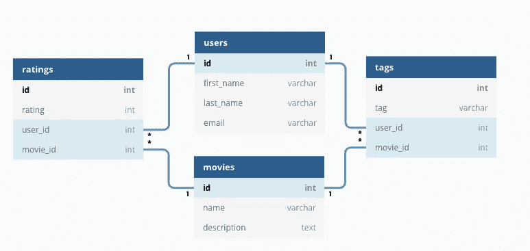
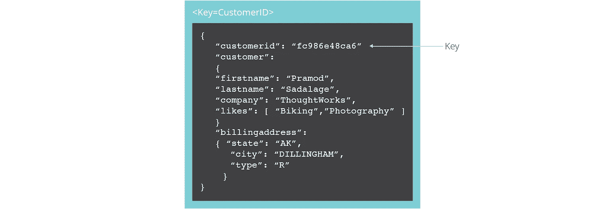
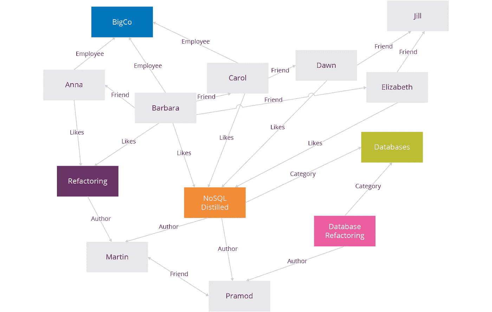
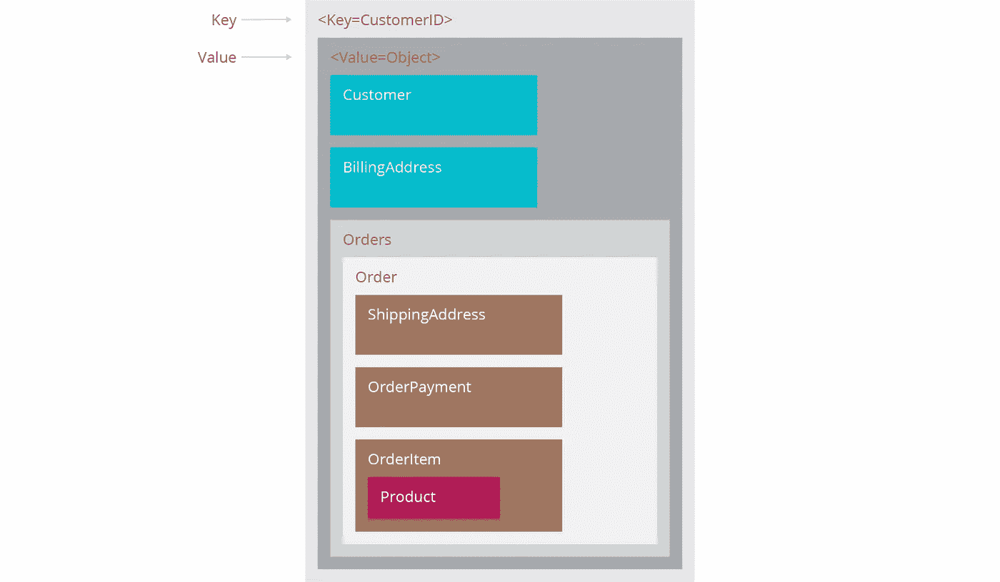
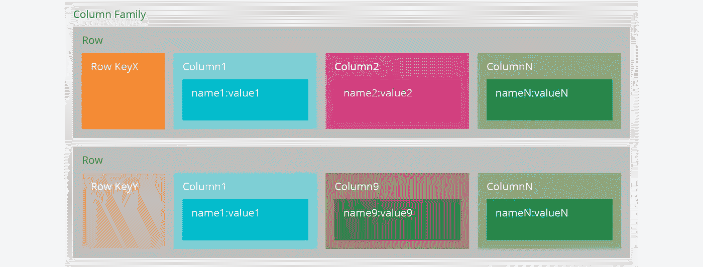

# 数据库、SQL 和 NoSQL

> 原文：<https://medium.com/analytics-vidhya/database-sql-and-nosql-16865f90d634?source=collection_archive---------21----------------------->


数据库是组织起来的信息的集合，以便于访问、管理和更新。数据库通常包含包含信息的数据记录或文件的集合。数据库是对操作系统文件系统的抽象，它使开发人员更容易构建创建、读取、更新和删除持久数据的应用程序。

数据库使结构化存储可靠而快速。它们还为您提供了一个如何保存和检索数据的框架，而不是每次构建新的应用程序时都必须弄清楚如何处理数据。

## 关系数据库

它将数据存储在一系列表中。表之间的互连称为外键。每个表在一列中至少有一个数据类别，每一行都有在列中定义的类别的特定数据实例。



关系数据库

结构化查询语言(SQL)是关系数据库的标准用户和应用程序接口。Python 中包含的数据库 SQLite 为每个数据库的所有数据创建了一个文件。PostgreSQL、MySQL、Oracle 和 Microsoft SQL Server 等其他数据库具有更高级的功能，可用于 web 应用程序数据存储。

数据库接口的 Python 标准是 Python DB-API。DB-API 为尽可能使用 Python 结构和语法处理数据库提供了最低标准。该 API 包括以下内容

*   导入 API 模块。
*   获取与数据库的连接。
*   发出 SQL 语句和存储过程。
*   关闭连接

# SQL 数据库

SQL 代表结构化查询语言。在 SQL 中，我们可以生成查询来检索或更新数据库。SQL 是关系数据库系统的标准语言。它允许您在表之间建立关系，可以是一对一、一对多、多对一、多对多。这是关系数据库管理系统的一个例子。

所有的关系数据库管理系统(RDMS)如 MySQL、MS Access、Oracle、Sybase、Informix、Postgres 和 SQL Server 都使用 SQL 作为它们的标准数据库语言。

## 使用 Python SQL 库连接到数据库

要通过 Python SQL 库与任何数据库进行交互，我们必须连接到数据库。我们需要为 MySQL 安装一个 **Python SQL 驱动程序**，以便在 Python 应用程序中与 MySQL 数据库进行交互。

MySQL 数据库创建数据库的过程分为两步:

1.  **连接一个 MySQL 服务器**。
2.  **执行一个单独的查询**来创建数据库。

```
pip install mysql-connector-pythonimport mysql.connectormydb = mysql.connector.connect(host='localhost',
                               user='root',
                               user_password = '1234')
print(mydb.connection_id) #it'll give connection_id,if got connected
```

数据库尚未创建。为此，我们将定义另一个函数`create_database()`，它接受两个参数:

1.  `**connection**`是您想要与之交互的数据库服务器的连接对象。
2.  `**query**`是创建数据库的查询。

# NoSQL 数据库

NoSQL 扩展到“*不止 SQL* ”。它为我们提供了一种存储和检索数据的方法，我们可以用关系型(表)以外的形式来建模这些数据。NoSQL 数据库主要用于涉及大量数据和实时使用的应用中。我们之所以称它们为“不仅仅是 SQL ”,是因为它们可能支持类似 SQL 的查询语言。我们可以使用 NoSQL 以键值、文档、柱形图和图表等形式存储数据。当处理大型分布式数据集时，我们使用 NoSQL。

例子——MongoDB、redis、Apache HBase、cassandra 等。

我们有四种不同类型的数据可以用 Python 中的 NoSQL 数据库建模

# a.文档数据库



在文档数据库中，每个键与一个文档配对。文档是文档数据库中的主要概念。数据库存储和检索文档，这些文档可以是 XML、JSON、BSON 等等。这些文档是自描述的、分层的树形数据结构，可以由地图、集合和标量值组成。文档是一种复杂的数据结构，可以包含以下任何内容——键-值对、键-数组对、嵌套文档。

# b.图形存储



图形存储保存关于数据网络的知识。一个这样的网络是社会关系。在图形存储中，节点就像关系数据库中的记录，边就像节点之间的连接。图形数据库非常适合我们有关联数据的问题空间，如社交网络、空间数据、商品和金钱的路由信息、推荐引擎。我们将这些用于 CRM 和预订系统等应用程序。例如 Neo4J 和 Giraph。

# c.键值存储



键值存储在其结构中保存键值对。键值对数据存储基于哈希映射数据结构。从 API 的角度来看，键值存储是最简单的 NoSQL 数据存储。我们在 web 应用程序中的会话管理和缓存等应用程序中使用这些。一些例子包括 Riak、Redis 和 Berkeley DB。

# d.宽栏商店



当我们希望将列存储在一起以处理大型数据集上的查询时，我们可以使用宽列存储。列族数据库将列族中的数据存储为具有许多与行键相关联的列的行。我们在 SQL 数据库中也发现了这些，它们可以更快地查询大量数据。一些例子是 Cassandra，HBase 和 Google BigTable。

## 这个博客到此为止。感谢阅读。🙌

## 参考文献

[https://data-flair . training/blogs/no SQL-database-in-python/#:~:text = The % 20 no SQL % 20DB % 20 used % 20 determines，Microsoft % 20 SQL % 20 server % 2C % 20 和%20Postgres](https://data-flair.training/blogs/nosql-database-in-python/#:~:text=The%20NoSQL%20DB%20used%20determines,Microsoft%20SQL%20Server%2C%20and%20Postgres) 。

[https://wiki.python.org/moin/DatabaseProgramming](https://wiki.python.org/moin/DatabaseProgramming)

[https://www . fullstackpython . com/databases . html #:~:text = Most % 20 common % 20 databases % 20 for % 20 python，single % 20 connection % 20 at % 20a % 20 time](https://www.fullstackpython.com/databases.html#:~:text=Most%20common%20databases%20for%20Python,single%20connection%20at%20a%20time)。