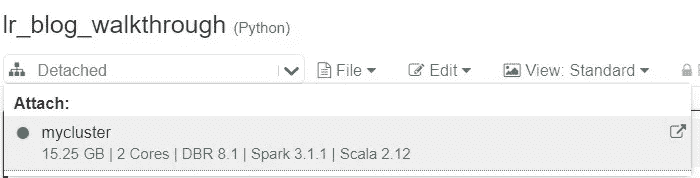
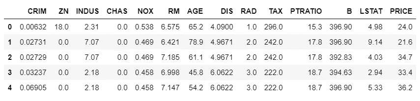
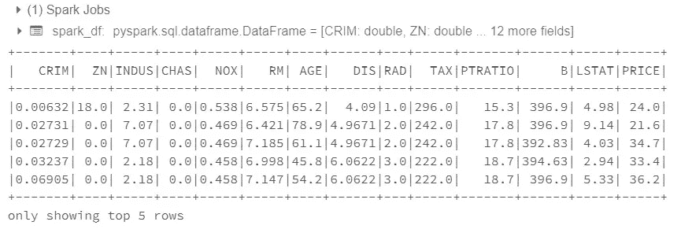
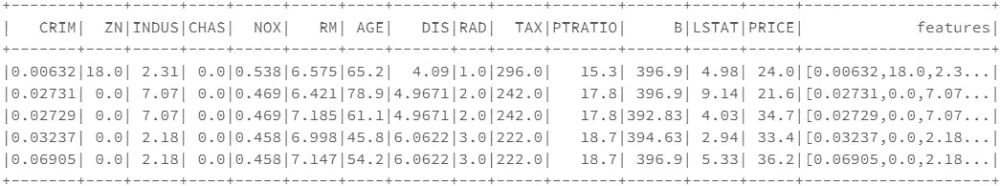
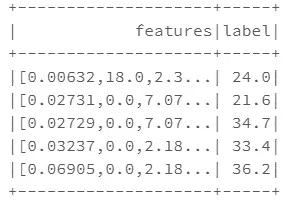
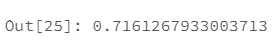

# 数据块:为线性回归设置 Spark 数据框架

> 原文：<https://medium.com/analytics-vidhya/databricks-setting-up-our-spark-dataframe-for-linear-regression-ba08c880bcd2?source=collection_archive---------5----------------------->


在我们开始这个有趣的旅程之前，有一个**忠告**:这个博客的重点是**而不是**清理数据和检查是否满足线性回归的假设(下面简要列出)。相反，重点是如何格式化数据集，以便我们可以使用 PySpark 将其输入线性回归模型！

# 线性回归的假设

**线性回归**是一种评估一个或多个特征变量是否能解释目标变量的分析。

**线性回归有 5 个关键假设**:

*   线性关系
*   多元正态性
*   没有或很少多重共线性
*   无自相关
*   同方差性

如果您想了解更多关于上述假设的信息，您可以访问[此链接](https://www.statisticssolutions.com/assumptions-of-linear-regression/)了解更多信息。既然我们已经解决了这个问题…让我们开始吧！

# 数据砖

在这篇博客中，我们使用 Databricks 作为平台，通过 PySpark 构建我们的线性回归模型。如果你以前没有使用过 Databricks，请随意访问我的博客[这里](/analytics-vidhya/beginners-guide-on-databricks-spark-using-python-pyspark-de74d92e4885)，我会带你快速完成设置！

如果您已经熟悉 Databricks:登录，创建一个新的集群和一个新的笔记本。完成后，只需将集群连接到笔记本电脑:



将群集连接到笔记本电脑

现在，我们将加载一些我们需要访问数据的库。我们将在本博客中使用的数据集将是波士顿房价数据集，我们可以从 sklearn.datasets 库中加载该数据集:

```
import pyspark
import numpy as np
import pandas as pd
from sklearn.datasets import load_boston
```

一旦我们运行了上面的单元格，我们就可以访问数据集了。我们将数据加载到 Pandas 数据帧中，然后将该数据帧转换为 Spark 数据帧，这样我们就可以使用 Spark 的 MLlib 库进行线性回归。

# 步骤 1:将数据集加载到 Pandas 数据框架中

```
# loading an instance of the boston dataset
boston = load_boston()# Gathering the features of the dataset
feats = boston.data# Putting the array of features into a pandas Dataframe
df = pd.DataFrame(feats)# Naming the columns of the dataframe their respective feature names
df.columns = boston.feature_names# Creating a new column in the Dataframe called 'PRICE' that holds 
# the target values 
df['PRICE'] = boston.target# Viewing the df to make sure everything looks okay
df.head()
```



查看熊猫数据框的前 5 行

太好了，数据框看起来不错！现在我们必须将这个熊猫数据帧转换成 Spark 数据帧。

# 步骤 2:将熊猫数据帧转换成 Spark 数据帧

要将数据帧转换成 Spark 数据帧，我们只需运行一行简单的代码:

```
# This line will create a spark dataframe from our pandas dataframe
spark_df = spark.createDataFrame(df)# Viewing first 5 rows of the spark_df
spark_df.show(5)
```



查看火花数据帧的前 5 行

如果你比较熊猫数据帧和火花数据帧的前 5 行，你会发现它们是一样的。到目前为止，一切都在按计划进行…


# MLlib 和 Sklearn 线性回归的区别

在 Sci-kit Learn 中，每个特性都有自己的列，我们不需要担心对数据帧应用更多的转换。但是，在 MLlib 中，我们不能为每个特性提供单独的列。MLlib 要求一行中特性的所有值都包含在一个数组中，并且它们都位于一个名为“特性”的列中。让我们看一个例子来说明我的意思:



请注意末尾的“功能”栏

“功能”列包含数组。这些数组中的每一个都包含一行中的所有特性值。例如，第一行包含:

*   卷曲= 0.00632
*   锌= 18.0
*   印度河= 2.31
*   等等。

为了使我们的 Spark 数据框架与 MLlib 线性回归模型兼容，我们希望将每行中的所有值压缩到一个数组中，放在一个列中，我们称之为“features”。那么我们该怎么做呢？

# 输入:VectorAssembler

```
from pyspark.ml.feature import VectorAssembler
```

这项工作我们需要的工具是 **PySpark 的 VectorAssembler** 。VectorAssembler 所做的是将多个值组合成一个数组(或行向量)；即，其中新生成的列的每个行元素是通过连接来自指定输入列的每个行元素而形成的向量。我们可以通过以下语句在数据帧上实现这一点:

```
# Creating an instance of the VectorAssembler
assembler = VectorAssembler(inputCols=[‘CRIM’,’ZN’,’INDUS’,’CHAS’,
                                       ’NOX’,’RM’,’AGE’,’DIS’,’RAD’,
                                       ’TAX’,‘PTRATIO’,’B’,’LSTAT’],
                            outputCol=’features’)
```

为了使用 VectorAssembler，我们分配一个名为“Assembler”的变量，该变量将引用 VectorAssembler 的位置。接下来，我们必须传入一个字符串列表，这些字符串是我们希望包含在模型中的特性的列名。这些名字将会出现在分配给 **inputCols** 参数的列表中。

**重要提示:不要包含任何值没有经过 StringIndexed 或 OneHotEncoded 的分类列名**

注意**我们没有将目标变量**添加到 **inputCols** 的列表中。这个 VectorAssembler 被设计成只接受数据集的独立变量，然后将它们压缩成包含一个值数组的单个列。 **outputCol** 参数为将要创建的压缩列指定一个名称—我建议将其命名为‘features’(这是许多 MLlib 模型用来标识特性列的默认名称)。要转换我们的 Spark 数据框架:

```
# transforming our spark dataframe
df_out = assembler.transform(spark_df)# Viewing the first 5 rows
df_out.show(5)
```


我们需要为线性回归模型定型的唯一列是“功能”和“价格”列。让我们创建一个只包含这些列的新 spark 数据框架:

```
# While we could say something like this...
clean_df = df_out.select(['features', 'PRICE'])# I want to rename the 'PRICE' column to 'label' as well
clean_df = df_out.select([‘features’, col(‘PRICE’).alias(‘label’)])clean_df.show(5)
```



漂亮整洁

# 创建训练集和测试集

在用数据拟合模型之前，我们的最后一步是:我们必须创建训练集和测试集！简而言之，在对数据建模时，训练集和测试集是极其重要的。如果你碰巧有一个 R 平方的分数，比如说… 0.99(非常高)，并且没有其他数据来验证这个分数，你怎么知道你的模型是否过度拟合？简单来说，你不会。如果你想知道更多关于建立训练集和测试集(以及验证集)的重要性。)随意查看[这篇文章](https://towardsdatascience.com/train-validation-and-test-sets-72cb40cba9e7)。让我们继续创建我们的训练集和测试集吧！

```
# Creating our train and test sets
train, test = clean_df.randomSplit([0.7, 0.3], seed=42)
```

Spark 数据帧有一个名为 randomSplit()的内置方法，允许我们直接从 Spark 数据帧创建训练集和测试集。上面，我们说“将 clean_df 随机分成 70%和 30%的块，分别进入训练和测试集，并将随机种子设置为 42。我们的下一步是创建和拟合一个线性回归模型。

# 创建线性回归模型

```
from pyspark.ml.regression import LinearRegression
```

第一步是创建 LinearRegression()模型的实例:

```
# creating an instance of a linear regression model
lr_model = LinearRegression(featuresCol=’features',labelCol=’label’)
```

默认情况下，线性回归模型假定 featuresCol 和 labelCol 的名称分别为“features”和“label”。只要要素被正确格式化为一列，并且标注列也存在，那么它们的名称是什么并不重要(例如。如果您将标签列的名称保留为“PRICE”，那么 label col =“PRICE”)。接下来，我们让模型适合我们的列车组:

```
# fitting the model to the train set
fit_model = lr_model.fit(train)
```

现在我们终于可以评估我们模型的性能了！我们将创建一个名为“test_results”的新变量，它将保存我们的测试集的评估结果。这实质上是模型在测试集上的性能总结:

```
test_results = fit_model.evaluate(test)
```

要访问像 R 平方这样的值，我们可以说:

```
test_results.r2
```



我们的测试集的 r 平方结果

请记住**这篇博客的目的是让我们的数据集被正确格式化，以便它可以与 MLlib 的线性回归**一起使用。在浏览这篇博客时，我们没有检查或清理任何数据，也没有检查是否违反了线性回归的任何假设。非常感谢您的阅读！如果你有任何问题，请随时提问！