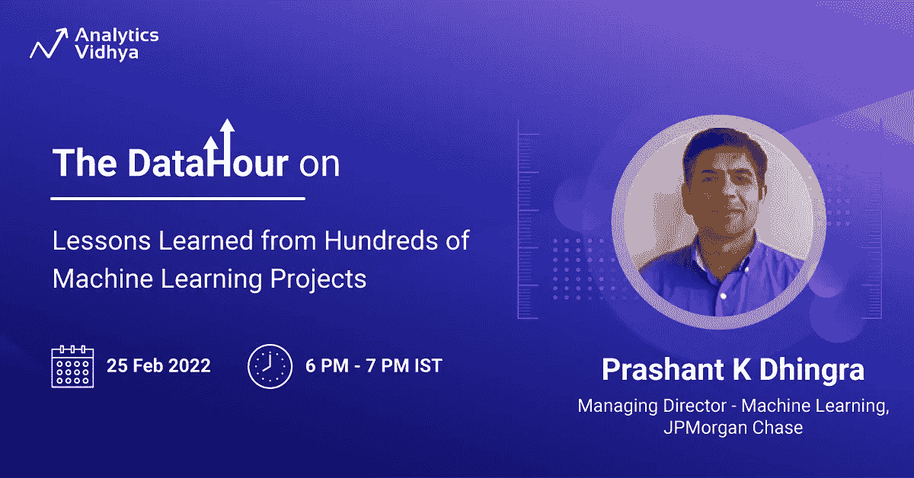

# DataHour:从数百个机器学习项目中吸取的经验教训！

> 原文：<https://medium.com/analytics-vidhya/datahour-lessons-learned-from-hundreds-of-machine-learning-projects-6d9da3458746?source=collection_archive---------1----------------------->

*“卓越不是一门艺术，而是实践的习惯”——*亚里士多德

不要错过明天的免费数据小时，关于摩根大通董事总经理(机器学习)Prashant K Dhingra 从数百个机器学习项目中吸取的经验教训

🗓️: 2022 年 2 月 25 日星期五

🕓:IST 时间下午 6 点— 7 点

加入 Prashant，分享他在工作和管理数据科学项目时学到的一些重要经验。他还将展示如何将数据科学与心理学等其他领域结合起来，以从数据中获得更深入的见解。

快一点！

现在免费注册👇

[**在这里注册！**](https://datahack.analyticsvidhya.com/contest/datahour-lessons-learned-from-hundreds-of-machine-/?utm_source=medium&utm_medium=newsletter)