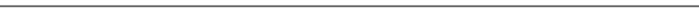

# 自动驾驶汽车中机器学习的数据集

> 原文：<https://medium.com/analytics-vidhya/datasets-for-machine-learning-in-autonomous-vehicles-dd13bae5925b?source=collection_archive---------0----------------------->

具有多种传感器形式(激光雷达、雷达、立体摄像机、热感摄像机等)的数据集。)

由 upklyak 创建的汽车矢量—[www.freepik.com](http://www.freepik.com)

自主车辆中使用了各种各样的传感器。传感模式的多样性有助于不同的天气条件。以下是最新发布的自动驾驶数据集的流行列表。

***注:*** *由于每隔几个月就会有新的数据集发布，如果有流行的数据集发布，我会每个月更新这个页面。*

**名称**:ONCE Dataset(**O**ne milli**N**s**C**en**E**s)-华为公司

**出版年份** : 2021 年

**传感器类型**:摄像头、激光雷达

**录制地区**:中国

**描述**:一次(一百万场景)数据集可用于自动驾驶场景下的 3D 物体检测。ONCE 数据集由 100 万个激光雷达场景和 700 万个相应的相机图像组成。这些数据选自 144 个驾驶小时，比现有最大的 3D 自动驾驶数据集(如 nuScenes 和 Waymo)长 20 倍，并且是在一系列不同地区、时段和天气条件下收集的。它有 5 类 15k 完全注释的场景(汽车，公共汽车，卡车，行人，自行车)。在 ONCE 数据集中，对于每个标记和未标记的场景，有 3 个天气条件，即晴天、多云、雨天和 4 个时间段，即上午、中午、下午、晚上。对于每个场景，信息(即天气、时间段、时间戳、姿势、校准、注释)都在单个 JSON 文件中。

**数据集下载和论文** : [数据集](https://once-for-auto-driving.github.io/)，[论文](https://arxiv.org/pdf/2106.11037.pdf)

**名称**:多功能一体机(AIODrive)

**出版年份** : 2020 年

**传感器类型**:相机、激光雷达、雷达

**记录区** : NA

**描述**:高密度远程点云的大规模综合感知数据集。这是一个大规模的**合成数据集**，提供了全面的传感器、注释和环境变化。它有

1.  八种传感器模式(RGB、立体、深度、激光雷达、SPAD-激光雷达、雷达、IMU、GPS)
2.  所有主流感知任务的注释(例如，检测、跟踪、轨迹预测、分割、深度估计)
3.  罕见的驾驶场景，如不利的天气和照明、拥挤的场景、高速驾驶、违反交通规则和事故

它拥有用于激光雷达和 SPAD-LiDAR 传感器的高密度远程点云，比威力登-64 密度大十倍，传感范围大。

**数据集下载和论文** : [数据集](http://www.aiodrive.org/download.html)，[论文](https://www.xinshuoweng.com/papers/AIODrive/arXiv.pdf)

**名称**:福特多 AV 季节性数据集

**出版年份** : 2020 年

**传感器类型**:摄像机、激光雷达

**录制区域**:美国(密歇根州)

**描述**:多代理季节性数据集由福特自动驾驶汽车车队在 2017-18 年期间的不同日期和时间收集。这些车辆在密歇根州的一条路线上人工驾驶，包括各种驾驶场景，包括底特律机场、高速公路、市中心、大学校园和郊区。该数据集具有在动态城市环境中经历的天气、照明、建筑和交通状况的季节性变化。

**数据集下载和论文** : [数据集](https://avdata.ford.com/downloads/default.aspx)，[论文](https://arxiv.org/pdf/2003.07969.pdf)

**名称**:自动驾驶的密集深度(DDAD)——丰田研究所

**出版年份** : 2020 年

**传感器类型**:摄像机、激光雷达

**录制地区**:美国(旧金山、湾区、剑桥、底特律、安阿伯)和日本(东京、台场)

**描述** : DDAD 是 TRI(丰田研究所)推出的一款全新自动驾驶基准，用于在充满挑战和多样化的城市条件下进行长距离(最远 250 米)和密集深度估计。它包含单目视频和精确的地面真实深度(跨越 360 度的完整视野)，这些数据是由安装在跨洲行驶的自动驾驶汽车上的高密度激光雷达生成的。

**数据集下载和论文** : [数据集](https://github.com/TRI-ML/DDAD/blob/master/README.md)，[论文](https://arxiv.org/pdf/1905.02693.pdf)

**名称** : PandaSet

**出版年份** : 2020 年

**传感器类型**:相机、激光雷达

**录制地区**:美国(旧金山，El Camino Real 从帕洛阿尔托到圣马特奥)

**描述** : PandaSet 结合了何塞同类最佳的激光雷达传感器和 Scale AI 的高质量数据标注。PandaSet 的特点是使用具有类似图像分辨率的前向激光雷达(PandarGT)和机械旋转激光雷达(Pandar64)收集数据。所收集的数据用长方体和分割标注(比例 3D 传感器融合分割)的组合来标注。

**数据集下载和论文** : [数据集](https://scale.com/open-datasets/pandaset)

**名称**:加拿大恶劣驾驶条件(CADC)

**出版年份** : 2020 年

**传感器类型**:摄像机、激光雷达

**录制地区**:加拿大(滑铁卢)

**描述**:加拿大不利驾驶条件(CADC)数据集由 autonomouse 自动驾驶汽车平台收集，基于改装的林肯 MKZ。该数据集于冬季在加拿大滑铁卢地区收集，是首个专门关注不利驾驶条件的自动驾驶汽车数据集。它包含 7，000 帧通过 8 台相机(Ximea MQ013CG-E2)、激光雷达(VLP-32C)和 GNSS+INS 系统(Novatel OEM638)在各种冬季天气条件下收集的注释数据。传感器是时间同步的，并用数据集中包含的内部和外部校准进行校准。Scale AI 已经提供了表示 3D 对象检测和跟踪的地面真相的激光雷达帧注释。

**数据集下载和论文** : [数据集](http://cadcd.uwaterloo.ca/)，[论文](https://arxiv.org/pdf/2001.10117)

**名称** : A2D2:奥迪自动驾驶数据集

**出版年份** : 2020 年

**传感器类型**:摄像头、激光雷达、总线数据

**录制区域**:德国(盖默尔斯海姆、慕尼黑和因戈尔施塔特)

**描述**:数据集由同时记录的图像和 3D 点云，以及 3D 包围盒、语义分割、实例分割和从汽车总线提取的数据组成。传感器套件由六个摄像头和五个激光雷达单元组成，提供 360 度全方位覆盖。记录的数据是时间同步的并且相互记录。该数据集具有 2D 语义分割、3D 点云、3D 边界框和车辆总线数据。所有传感器信号都以 UTC 格式打上时间戳。

**数据集下载和论文** : [数据集](https://www.a2d2.audi/a2d2/en.html)，[论文](https://arxiv.org/pdf/2004.06320)

**名称**:一个*3D 数据集

**出版年份** : 2019 年

**传感器类型**:摄像机、激光雷达

**录制地区**:新加坡

**描述**:a* 3D 数据集由 RGB 图像和激光雷达数据组成，具有场景、时间和天气的显著多样性。该数据集由高密度图像(比开创性的 KITTI 数据集多 10 倍)、严重遮挡、大量夜间帧(是场景数据集的 3 倍)组成，解决了现有数据集的差距，将自动驾驶研究的任务边界推向了更具挑战性的高度多样化的环境。数据收集覆盖整个新加坡，包括高速公路、邻近道路、隧道、市区、郊区、工业区、HDB 停车场、海岸线等。

**数据集下载和论文** : [数据集](https://github.com/I2RDL2/ASTAR-3D)，[论文](https://arxiv.org/pdf/1909.07541.pdf)

**姓名**:欧洲城市人(ECP)

**出版年份** : 2019 年

**传感器类型**:摄像机、激光雷达

**录制地区**:欧洲(12 个国家的 31 个城市)

**描述**:euro city Persons 数据集提供了大量关于城市交通场景中行人、骑自行车者和其他骑车者的高度多样化、精确和详细的注释。该数据集的图像是在 12 个欧洲国家的 31 个城市的移动车辆上收集的。EuroCity Persons 在超过 47300 张图片中人工标记了超过 238200 个人实例，比之前用于基准测试的个人数据集大了近一个数量级。该数据集还包含大量的个人取向注释(超过 211200 个)。

**数据集下载和论文** : [数据集](https://eurocity-dataset.tudelft.nl/eval/overview/home)，[论文](https://ieeexplore.ieee.org/document/8634919)

**名称**:牛津机器人汽车数据集

**出版年份** : 2019 和 2016

**传感器类型** : **2019** - 相机、雷达、激光雷达。 **2016** -相机、激光雷达

**录制区域**:英国(牛津)

**描述** : **2019** -牛津雷达机器人汽车数据集可用于使用毫米波 FMCW 扫描雷达数据研究场景理解。目标应用是自动驾驶汽车，这种模式对雾、雨、雪或镜头眩光等环境条件具有鲁棒性，这些环境条件通常会挑战视觉和激光雷达等其他传感器模式。这些数据是在 2019 年 1 月收集的，经过了 32 次牛津市中心路线的穿越，在城市驾驶中总共行驶了 280 公里。它包括各种天气、交通和照明条件。

**2016**——最初发布的数据集包括超过 20 TB 的车载单目和立体图像、2d 和 3D 激光雷达，以及在英国牛津驾驶一年收集的惯性和 GPS 数据。在此期间，对一条 10 公里长的路线进行了 100 多次穿越，以捕捉一定时间范围内的场景变化，从 24 天/夜照明周期到长期季节变化。

**数据集下载及论文** : [2019 年数据集](https://oxford-robotics-institute.github.io/radar-robotcar-dataset/)， [2019 年论文](https://arxiv.org/pdf/1909.01300.pdf)， [2016 年数据集](https://robotcar-dataset.robots.ox.ac.uk/)， [2016 年论文](https://robotcar-dataset.robots.ox.ac.uk/images/robotcar_ijrr.pdf)

**名称** : Waymo 开放数据集

**发布年份** : 2021 年和 2019 年

**传感器类型**:摄像头、激光雷达

**录制地区**:美国(旧金山、山景城、洛杉矶、底特律、西雅图、凤凰城)

**描述**:way mo 开放数据集于 2019 年 8 月首次推出，其感知数据集包含 1950 个细分市场的高分辨率传感器数据和标签。2021 年 3 月，扩展了 Waymo 开放数据集，使其还包括一个运动数据集，该数据集包含 103，354 个分段的对象轨迹和相应的 3D 地图。Waymo 开放数据集包括各种各样的环境、对象和天气条件(市区、郊区、白天、夜间、行人、骑自行车的人、建筑、各种天气)。

**数据集下载及论文** : [数据集](https://www.waymo.com/open)， [2021 年论文](https://arxiv.org/abs/2104.10133)， [2019 年论文](https://arxiv.org/pdf/1912.04838.pdf)

**名称**:Lyft 5 级数据集

**出版年份** : 2019 年

**传感器类型**:摄像头、激光雷达、雷达

**录制地区**:美国(帕洛阿尔托)

**描述**:该数据集可用于超过 1000 小时数据的运动预测。这是由一支由 20 辆自动驾驶汽车组成的车队在加利福尼亚州帕洛阿尔托的一条固定路线上收集的，历时四个月。它由 170，000 个场景组成，每个场景长 25 秒，捕捉自动驾驶系统的感知输出，这些输出编码了附近车辆、骑自行车者和行人随着时间推移的精确位置和运动。在此基础上，数据集包含一个高清语义地图，其中有 15，242 个标记元素和该地区的高清鸟瞰图。数据集包括一个高清语义地图，以提供关于交通代理及其运动的上下文。该地图包含 4000 多个手动注释的语义元素，包括车道段、人行横道、停车标志、停车区、减速带和减速带。数据集包括来自真实世界场景的元素，包括车辆、行人、十字路口和多车道交通。

**数据集下载和论文** : [数据集](https://level5.lyft.com/dataset/)，[论文](https://tinyurl.com/lyft-prediction-dataset)

**名称** : Argoverse

**出版年份** : 2019 年

**传感器类型**:摄像机、激光雷达

**录制地区**:美国(匹兹堡，迈阿密)

**描述** : Argoverse 是由匹兹堡和迈阿密的一支自动驾驶汽车车队收集的。Argoverse 3D 追踪数据集包括来自 7 个具有重叠视野的相机的 360 度图像、来自远程激光雷达的 3D 点云、6 自由度姿态和 3D 轨迹注释。它提供了面向前方的立体图像。Argoverse 运动预测数据集包括超过 300，000 个 5 秒的跟踪场景，其中特定车辆被识别用于轨迹预测。Argoverse 是第一个包含“高清地图”的自动驾驶汽车数据集，其中有 290 公里的地图车道，带有几何和语义元数据。它提供了关于道路基础设施和交通规则的丰富语义信息。

**数据集下载和论文** : [数据集](https://www.argoverse.org/data.html)，[论文](https://arxiv.org/pdf/1911.02620)

**名称** : nuScenes 数据集

**出版年份** : 2019 年

**传感器类型**:相机、激光雷达、雷达

**录制地区**:美国(波士顿)、新加坡

**描述** : nuTonomy 场景(nuScenes)携带完全自主的车辆传感器套件:6 个摄像头，5 个雷达和 1 个激光雷达，所有这些都具有完整的 360 度视野。nuScenes 由 1000 个场景组成，每个场景 20 秒长，并完全标注了 23 个类别和 8 个属性的 3D 边界框。它的注释数量是开创性的 KITTI 数据集的 7 倍，图像数量是其 100 倍。数据来自波士顿(海港和南波士顿)和新加坡(一北、荷兰村和皇后镇)，这两个城市以其密集的交通和极具挑战性的驾驶环境而闻名。就植被、建筑物、车辆、道路标记以及右行和左行交通而言，不同地点之间存在差异。

**数据集下载和论文** : [数据集](https://www.nuscenes.org/download)，[论文](https://arxiv.org/pdf/1903.11027)

**名称** : BLVD:打造大规模 5D 自动驾驶语义标杆

**出版年份** : 2019 年

**传感器类型**:摄像机、3D 激光雷达

**录制地区**:中国(常熟)

**描述** : BLVD，大型 5D 语义基准，旨在为动态 4D(3D+时态)跟踪、5D(4D+交互)交互事件识别、意图预测等任务提供平台。BLVD 数据集包含从中国江苏省常熟市(中国智能车辆测试中心(IVPCC)所在地)提取的 12 万帧的 654 个高分辨率视频剪辑。RGB 数据和 3D 点云的帧速率为 10 fps/秒。对所有帧进行完全注释，总共产生 249，129 个 3D 注释，4，902 个用于跟踪的独立个体，总长度为 214，922 点，6，004 个用于 5D 交互事件识别的有效片段，以及 4，900 个用于 5D 意图预测的个体。根据对象密度(低和高)和光照条件(白天和夜间)，这些任务包含在四种场景中。

**数据集下载和论文** : [数据集](https://github.com/VCCIV/BLVD/)，[论文](https://arxiv.org/pdf/1903.06405)

**名称** : H3D - Honda 3D 数据集

**出版年份** : 2019 年

**传感器类型**:摄像机、激光雷达

**录制地区**:美国(旧金山)

**描述**:本田研究所 3D 数据集(H3D)，使用 3D 激光雷达扫描仪收集的大规模全环绕 3D 多目标检测和跟踪数据集。H3D 由 160 个拥挤且高度互动的交通场景组成，在 27，721 帧中总共有 100 万个标记实例。凭借独特的数据集大小、丰富的注释和复杂的场景，H3Dis 聚集在一起，激发了对全环绕 3D 多对象检测和跟踪的研究。它是从 HDD 数据集收集的，HDD 数据集是在旧金山湾区收集的大规模自然主义驾驶数据集。H3D 包括 1)完整的 360 度激光雷达数据集(来自威力登-64 的密集点云)2) 160 个拥挤且高度互动的交通场景 3) 1，071，302 个 3D 边界框标签 4) 8 类常见的交通参与者(每隔 2Hz 手动注释并对 10 Hz 数据进行线性传播)9)基于仅 3D 检测和跟踪算法的最先进算法的基准测试。

**数据集下载和论文** : [数据集](https://usa.honda-ri.com/h3d)，[论文](https://arxiv.org/pdf/1903.01568)

**名称**:阿波罗景观

**出版年份** : 2019 年

**传感器类型**:摄像机、激光雷达

**录制地区**:中国

**描述** : ApolloScape 包含更大更丰富的标注，包括每个站点的整体语义密集点云、立体、逐像素语义标注、车道标志标注、实例分割、3D 汽车实例、来自多个站点、城市和白天的各种驾驶视频中每一帧的高精度定位。数据集包含 140，000+带车道注释的注释图像。对于 3D 对象检测，它在 6K+点云中标注对象的 3D 边界框。它由中国 4 个地区在不同天气条件下的数据组成。

**数据集下载和论文** : [数据集](http://apolloscape.auto/index.html)，[论文](https://arxiv.org/pdf/1803.06184)

**名称** : DBNet

**出版年份** : 2018 年

**传感器类型**:摄像机、激光雷达

**录制地区**:中国

**描述** : DBNet 是一个用于驾驶行为研究的大规模数据集。它包括对齐的视频、点云、GPS 和驾驶员行为(速度和车轮)，可以捕捉 1000 公里的真实世界驾驶数据。激光雷达视频数据集提供了由威力登激光扫描的大规模高质量点云、由仪表板摄像机记录的视频以及标准驾驶员行为。

**数据集下载和论文** : [数据集](http://www.dbehavior.net/)，[论文](https://openaccess.thecvf.com/content_cvpr_2018/CameraReady/1645.pdf)

**名称** : KAIST 多光谱数据集(2018)和 KAIST 多光谱行人数据集(2015)

**发布年份** : 2018 年和 2015 年

**传感器类型** : 2018 - **摄像头**(视觉和**热**)，激光雷达。 **2015** -摄像机(视觉和**热**

**录制地区**:南韩(首尔)

**描述** : **2018** :数据集除了提供精细时间段(日出、清晨、午后、日落、夜晚、黎明)外，还提供了在粗略时间段(白天和黑夜)捕捉到的世界的不同视角。对于自治系统的全天感知，可以使用热成像相机。为实现这一目标，开发了一个多传感器平台，支持使用共校准 RGB/热感相机、RGB 立体摄像机、3d 激光雷达和惯性传感器(GPS/IMU)以及相关校准技术。

**2015** :多光谱行人数据集，提供由基于分束器的特殊硬件捕获的对齐良好的彩色-热图像对。色热数据集与先前基于颜色的数据集一样大，并提供密集的注释，包括时间对应。通过这个数据集，该团队引入了多光谱 ACF，这是聚合通道特征(ACF)的一种扩展，可同时处理彩色-热图像对。多光谱 ACF 将 ACF 的平均漏检率降低了 15%。

**数据集下载及论文** : [2018 数据集](http://multispectral.kaist.ac.kr)， [2018 论文](https://doi.org/10.1109/TITS.2018.2791533)， [2018 论文下载选项-2](https://www-users.cs.umn.edu/~jsyoon/JaeShin_homepage/kaist_multispectral.pdf) ， [2015 数据集](https://soonminhwang.github.io/rgbt-ped-detection/)， [2015 论文](https://openaccess.thecvf.com/content_cvpr_2015/papers/Hwang_Multispectral_Pedestrian_Detection_2015_CVPR_paper.pdf)

**名称** : FLIR ADAS 数据集

**出版年份** : 2018

**传感器类型**:摄像机(视觉和**热**)

**记录区域**:美国(圣巴巴拉)

**描述**:该数据集以 1 万多幅白天和夜晚场景中人、车、其他车辆、自行车和狗的热图像注释汇编为特色。它主要拍摄于美国加利福尼亚州圣巴巴拉的街道和高速公路上，白天和晚上天空晴朗。热图像的注释基于 COCO 注释方案。但是，相应的可见图像不存在注释。

**数据集下载和论文** : [数据集](https://www.flir.com/oem/adas/adas-dataset-form/)

**名称** : KITTI

**发表年份** : 2015、2013、2012

**传感器类型**:相机、激光雷达

**记录区**:德国(卡尔斯鲁厄)

**说明**:对于立体、光流、视觉里程计、三维物体检测、三维跟踪等任务，配备一辆标准旅行车，配备两台高分辨率彩色、灰度摄像机。精确的地面实况由威力登激光扫描仪和全球定位系统提供。数据集是通过在中等规模的卡尔斯鲁厄市、农村地区和高速公路上行驶来获取的。每个图像中最多可看到 15 辆汽车和 30 名行人，此外还提供了原始格式的所有数据，以及为每个任务提取的基准。

**数据集下载及论文** : [数据集](http://www.cvlibs.net/datasets/kitti/)、 [2012 年论文](https://doi.org/10.1109/CVPR.2012.6248074)、 [2012 年论文下载选项-2](http://www.cvlibs.net/publications/Geiger2012CVPR.pdf) 、 [2013 年论文-1](https://doi.org/10.1177/0278364913491297) 、 [2013 年论文-1 下载选项-2](http://www.cvlibs.net/publications/Geiger2013IJRR.pdf) 、 [2013 年论文-2](https://doi.org/10.1109/ITSC.2013.6728473) 、 [2013 年论文-2 下载选项-2【T32](http://www.cvlibs.net/publications/Fritsch2013ITSC.pdf)

**感谢**阅读！请👏如果你喜欢这个帖子，请**关注我**，因为它**鼓励我**写更多！