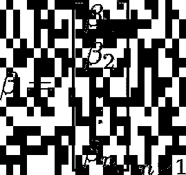

# 使用 Python 从头开始线性回归及其时间复杂性(第一部分)

> 原文：<https://medium.com/analytics-vidhya/day-1-3-linear-regression-from-scratch-using-python-and-its-time-complexity-part-i-372026eb58b6?source=collection_archive---------7----------------------->

照片由[艾萨克·史密斯](https://unsplash.com/@isaacmsmith?utm_source=medium&utm_medium=referral)在 [Unsplash](https://unsplash.com?utm_source=medium&utm_medium=referral) 拍摄

# 介绍

我喜欢写和记录我学到的东西，最近决定在一个更大的平台上写作！**这是使用 Python 和利用面向对象编程来保持代码整洁和可重用的第一系列线性回归。**

为了编写代码，我们需要了解一些简单的线性代数。在写之前，从数学上对机器学习算法有一个清晰的轮廓总是*超级必要*。

在更高的层次上，线性回归算法采用二维矩阵或二维`numpy array` X 和一维向量或一维数组 y，并使用正规方程求解最佳β系数β:

正规方程

# 数学

我不会太深入线性回归的数学细微差别和细节，但是对于感兴趣的人，你可以关注我的 [Kaggle](https://www.kaggle.com/reighns) 简介，以获得对其背后的数学的更严格的解释。为了有更具体的理解，附件是一个房价数据集，其中前三列是预测变量 x₁、x₂和 x₃，最后一列价格是响应变量 y

想法很简单，给定 m 个样本(这里只有 5 行)和 n 个预测变量(这里只有 3 个预测变量)，我们的目标是找到最适合数据的系数，这样我们的模型可以表示如下:

线性回归矩阵形式

## 注释

符号很重要，许多作者没有给出每个符号代表什么的明确定义，这对初学者来说可能很难读懂。所以现在开始:

*   X 为设计矩阵:设 X 为尺寸为 *m* × ( *n* + 1)的设计矩阵，其中 *m* 为观察值(训练样本)的数量， *n* 为独立特征/输入变量。请注意，在这个矩阵的第一列中有一列 1。这就是截距列，如果我们想用截距项β₀.来拟合我们的线性模型，我们通常会包括它

设计矩阵 X

*   X 的第*I*列定义为 X 的 I 次幂，也就是第 *i* 个训练样本，表示为一个 *n* × 1 个向量。

*   y 输出向量:列向量 y 包含第 *m* 次观察的输出。

*   β系数/参数的向量:列向量β包含线性模型的所有系数。

*   ε误差项的随机向量:列向量ε包含对应于 *m* 个观测值的 *m 个*误差项。

# 正态方程

利用上面的等式，我们的目标是找到真实总体参数β的最佳估计。我们称最佳估计值**ḃ**为贝塔帽。我们通过使用普通最小二乘法(OLS)最小化成本函数来找到这个最优估计。简而言之，我们将数据集中观察到的 y 或`y_true`与我们所拥有的线性模型预测的 y 或`y_hat`之间的差的平方和最小化。注意，成本函数通常表示为:

线性回归的成本函数。

在通常的机器学习过程中，我们可能会使用梯度下降算法来优化代价函数。但是在线性回归中，已经存在一个闭合形式的解，可以让我们找到上述函数的最小值，对于一个不关心其他东西的人来说，拥有这个方便的闭合形式的解是天赐的。我们发现这是:

正规方程

# 编码来自 Scatch 的线性回归

我知道，我们厌倦了数学方程式，这里是承诺的代码:

线性回归代码

在本文中，我不会深入讨论代码的细节，但是我想把注意力放在这个算法的时间复杂度上。

# 时间复杂度

时间复杂性是一个重要的话题，你不希望你的代码运行 10 亿年，因此，一个高效的代码对企业来说是很重要的。这也是为什么时间复杂性问题在机器学习和数据科学面试中越来越受欢迎！

我们在这里使用的线性算法仅仅使用矩阵乘法。我们也将忽略恒定时间为 O(1)的码。例如,`self.coef_=None`在构造函数中是 O(1 ),我们真的不希望在*中考虑这一点。*

真正重要的在代码行 37-40。假设 X 是一个 m 乘 n 的矩阵/阵列，其中 m 是样本数，n 是特征数。另外，y 是一个 m 乘 1 的向量。参考这个[维基百科页面](https://en.wikipedia.org/wiki/Computational_complexity_of_mathematical_operations)获得关于数学运算的各种时间复杂度的便利帮助表。

第 37 行:`np.dot(X.T,X)`在点积中，我们将 m × n 矩阵转置成 n × m，这个操作需要 O(m × n)时间，因为我们实际上是在执行两个 for 循环。接下来是执行矩阵乘法，仔细注意两个二维数组之间的`np.dot`不是指[点积](https://stackoverflow.com/questions/3744094/time-and-space-complexity-of-vector-dot-product-computation#:~:text=Assuming%20that%20multiplication%20and%20addition,computed%2C%20i.e.%20ai%20*%20bi%20.)，而是矩阵乘法，需要 O(m × n)时间。这一步的输出矩阵是 n× n。

第 38 行:对一个 n × n 的矩阵求逆需要 n 次。输出矩阵为 n × n。

第 39 行:现在我们进行 n × n 和 n × m 的矩阵相乘，得到 O(m × n)，输出矩阵是 n × m。

第 40 行:最后，时间复杂度为 O(m × n)。

将它们相加得到 O(2mn+2mn +n)，由此得到 mn 的简单三角形不等式

This ends the first series, and also the first article published by me. Stay tuned for updates and see me code various Machine Learning Algorithms from scratch.

# Preamble for the next series on Linear Regression

Just a heads up, I may not be doing part II of the series for Linear Regression just yet, as I want to cover a wide variety of algorithms on a surface level, just enough for beginners (or intermediate) learners. However, as a preamble, I will definitely include more and touch on the following topics that are not covered in today’s session.

## Orthogonalization

We can speed up the Normal Equation’s time complexity by using a technique called Orthogonalization, whereby we make use of [QR 因式分解](http://mlwiki.org/index.php/QR_Factorization)，因此我们不需要对耗时 n 次的恼人的 XᵀX 求逆！

## 正规化

你基本上不能离开线性模型而不知道 L1-2 正则化！山脊，套索，还有橡皮筋！请注意，正则化是一个广泛的术语，贯穿所有机器学习模型。请继续关注如何理解正则化可以减少过度拟合。另外，我没有提到的一个警告是，如果 XᵀX 在我们的正规方程中是不可逆的呢？如果 X 的一些列是线性相关的(我们的特征变量中的冗余)，或者有太多的特征，从而以某种方式…训练样本的数量 m 小于特征的数量 n，就会发生这种情况。如果您使用例如岭回归，那么修改后的正态方程保证有解。我们将在线性回归的第二部分中讨论它。

## 线性回归的统计和解释

关于如何解读线性回归，我没有多提。这一点很重要，即使你知道如何从头开始编写一个线性回归算法，如果你不知道如何以一种统计上严格的方式解释结果，那么这是没有意义的！了解有关假设检验、标准误差和置信度的更多信息。我也可能会深入研究一下最大似然估计量！

学分和参考:

吉姆统计。(2020 年 7 月 06 日)。2021 年 3 月 1 日从[https://statisticsbyjim.com/](https://statisticsbyjim.com/)检索

数学运算的计算复杂性。(2021 年 2 月 04 日)。2021 年 3 月 1 日检索，来自[https://en . Wikipedia . org/wiki/Computational _ complexity _ of _ mathematic _ operations # Matrix _ algebra](https://en.wikipedia.org/wiki/Computational_complexity_of_mathematical_operations#Matrix_algebra)

 [## 线性回归的 BigO 是什么？

### 感谢贡献一个堆栈溢出的答案！请务必回答问题。提供详细信息并分享…

stackoverflow.com](https://stackoverflow.com/questions/1955088/what-is-the-bigo-of-linear-regression)