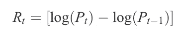
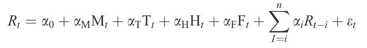
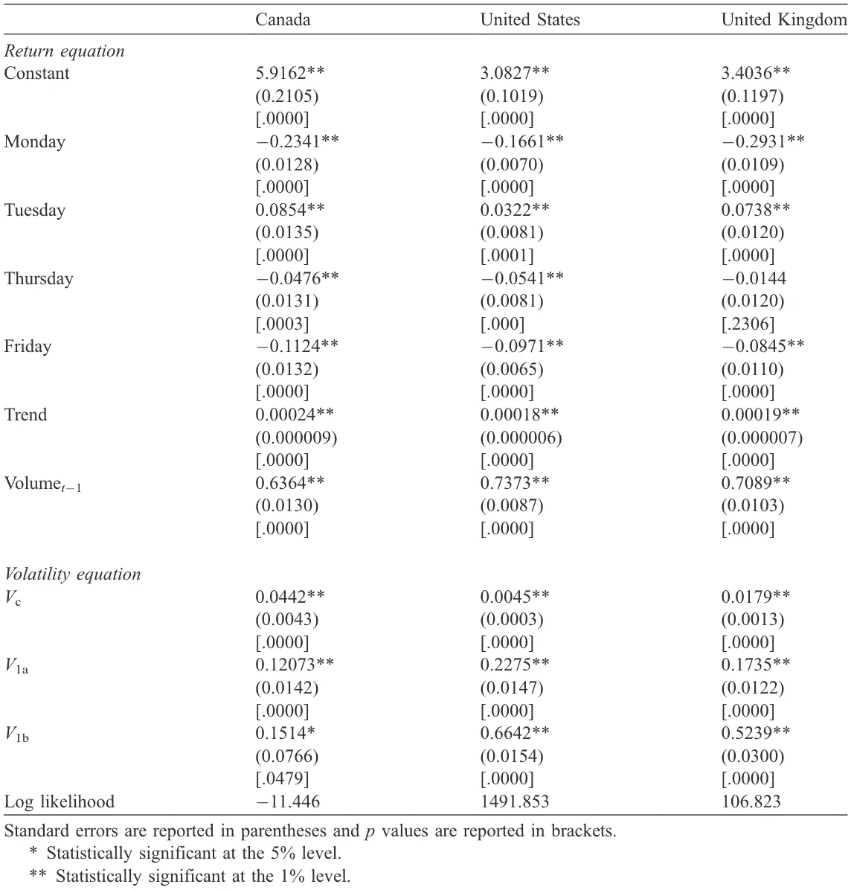

# 一周中的一天效应:如何在一周内构建交易以实现回报最大化。

> 原文：<https://medium.com/analytics-vidhya/day-of-the-week-effect-how-to-structure-trading-over-the-week-to-maximise-returns-39f827751293?source=collection_archive---------16----------------------->

这项研究探索了 1988 年至 2002 年期间，大型股票市场指数受波动影响的一周中的某一天。使用一个条件方差系统，我们发现收益和波动方程都呈现了星期效应。周一，德国和日本的市场波动性最高，周五是加拿大和美国，周四是英国。对某些股票来说，波动性最大的日子通常与市场交易量最低的日子相对应。本文还支持高波动性将跟随低频率交易的说法，因为流动性交易者无法在债券高波动性时卖出。

*尝试将照片与日历异常分析联系起来*

## 介绍

金融文献已经彻底研究并记录了股市回报的日历异常(周末效应、周末效应和一月效应)。这些调查包括股票、货币和国债市场。其他研究人员通过使用波动率方面的广泛自回归条件异方差(GARCH)模型来研究股票价格时间序列行为。首先，股市的意外回报与意外的波动性变化有关。另一些人认为，股票市场日益增长的不确定性增加了所需的汇率，从而降低了股票价格。这些发现表明，股票市场的回报不同的时间，是异方差的条件。然而，这些试验都没有检查未来的不确定性在一周的某一天的变化。对于谨慎的财务决策者来说，回报只是决策过程的一个方面。在做投资决策时，回报的机会或波动性也应该考虑在内。如果一周中某一天的库存波动存在差异，以及某一天的高(低)回报是否与相应的高(低)波动性相关。如果投资者要认识到特定的不确定性趋势，最好是在收益和风险的基础上做出投资决策。例如，不喜欢风险的投资者被认为应该通过减少对可能增加波动性的资产的投资来改变他们的投资。确定某些波动性回报趋势还可以让投资者进行评估，最大限度地提高其投资，为期权定价并降低风险。根据加拿大、德国、日本、英国和美国的全球股票市场指数，这一分析探讨了一周中某一天股票市场波动和交易量的影响。本文还探讨了交易活动和一周中不同日子的可观测波动率之间的关系。

## 方法学

类似地，根据 Kiymaz 和 beru ment(2003)的研究，数据包括从 1988 年 1 月 1 日到 2002 年 6 月 28 日的 TSE-Composite(加拿大)、DAX(德国)、Nikkei-225(日本)、FT-100(英国)和 NYSE-Composite(纽约证券交易所)指数的每日价格。每个市场(Rt)的回报以当地货币表示，并计算为股票市场指数自然对数的第一个差值。

其中 Pt 是指数在时间 t 的价格水平。

为了解决上述公式中的自相关问题，我们可以在方程中包含回报变量的滞后值。在这样的模型中，收益具有以下随机过程:

其中 Rt 代表选定指数的回报率，Mt、Tt、Ht、和 Ft 是周一、周二、周四和周五在时间 t 的虚拟变量，n 是滞后阶数。

## 结果

下表显示了每周交易量的影响。建模是将材积对数作为自表示过程，将模式和条件方差作为 GARCH 过程(1，1)。经验发现表明，在周一，两只股票的交易量都是最低的。加拿大的数字是 0.2341，美国是 0.1661，英国是 0.2931，与周三相比，周一的交易量最低。加拿大、美国和英国的第二低成交量分别为 0.1124、0.0971 和 0.0845。星期二的交易量最大。

加拿大的估计系数为 0.0854，美国为 0.0322，英国为 0.0738。在 1%的情况下，所有近似系数在统计上都是重要的。总之，每个国家的回报波动性和交易量的调查结果如下:在星期五观察到最高的回报波动性，而在星期二观察到最低的波动性。周二交易量最大，周一和周五交易量最小。存在高度的不确定性和低水平的交流。该结果与 Foster 和 Viswanathan(1990)的预测一致，即高波动性之后会出现低交易量，因为流动性交易者无法在市场波动时进行交易。根据 Chang 等人(1997 年)，Foster 和 Viswanathan (1993 年)在星期一报告了类似的结果，这证实了 Foster 和 Viswanathan (1990 年)的模型，其结果是收益方差最大，而星期一的金额最低。在他们对货币行业期货合同的分析中，Wei 和 Zee (1998)还注意到周五的不确定性更大，周一和周五的流动性更小。

本文中波动性变化的含义并不排除公共知识理论。周五第二低的方差也在一定程度上支持宏观经济新闻发布理论。Harvey 和 Huang (1991)报告了周五利率不确定性和期货交易价格的升高，他们认为这证明了周五有更多的公共信息。Ederington 和 Lee (1993 年)进一步证实了这一点。加拿大的观察结果接近美国的发现。在周五，销售额和周一的波动性最大，而在周一和周五的金额较低，周二的波动性最低。Foster 和 Viswanathan (1990 年)的主张也得到了部分认可。另一方面，英国的结果没有明显的趋势。周一波动性最低，交易量最低，周四波动性最高，周二交易量最高。

## 结论

股票和非股票市场中的日复一日的周冲击现象得到了很好的报道。通过交换计划的概念，投资者可以从相对频繁的价格变动中受益，交换计划在一周的第一天解决回报和波动性的影响模式的某些常规趋势。本研究使用条件方差方法，探讨了周末债券市场对债券波动性的影响。

这些数字包括加拿大、德国、日本、联合王国和美国 1988 年 1 月 1 日至 2002 年 6 月 28 日期间的主要常规库存平均数。研究结果表明，回报率和波动性的计算都有星期效应。在周一和日本，周五在加拿大和美国，周四在英国，我们经历了最大的回报不确定性。德国、日本、英国和美国的最低销售差异记录在加拿大的星期一和星期二。周一和周五，日本、英国和美国的交易量最低。每个市场的周二交易量最大。Foster 和 Viswanathan (1990)肯定了本文的结果，即高波动性之后是低交易率，因为流动性商人在高波动率时没有能力进行互换。Foster 和 Viswanathan(1990 年)的索赔也得到了 Chang 等人(1997 年)、Foster 和 Viswanathan(1993 年)以及 Wei 和 Zee(1998 年)的支持。

本文中包含的不确定性趋势与公共知识理论并不矛盾。宏观经济新闻稿理论得到了对加拿大和美国周五最大不确定性的观察的支持。Harvey 和 Huang (1991)在周五记录了更高的不确定性，并将其解释为更多知识将在周五到来的证据，这对公众有利。

这份报告的大部分内容是受 Kiymaz 和 Berument 在 2003 年写的论文的启发。使用相同的数据范围和技术！