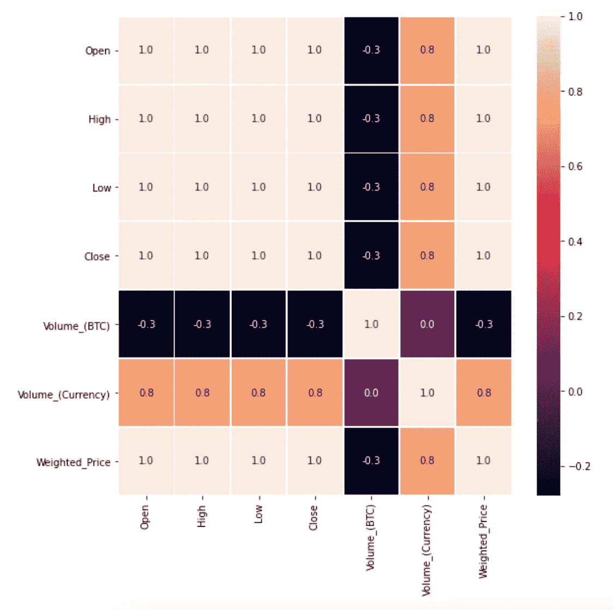
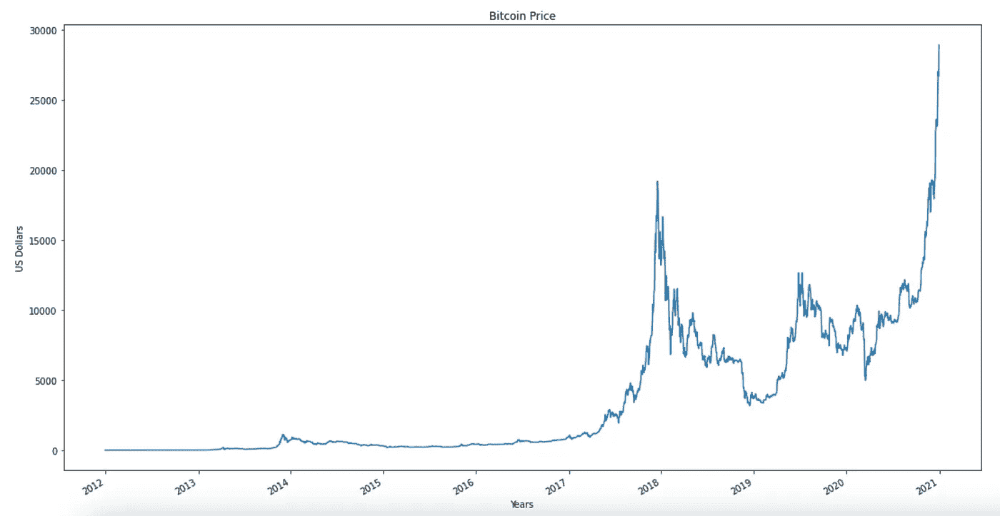
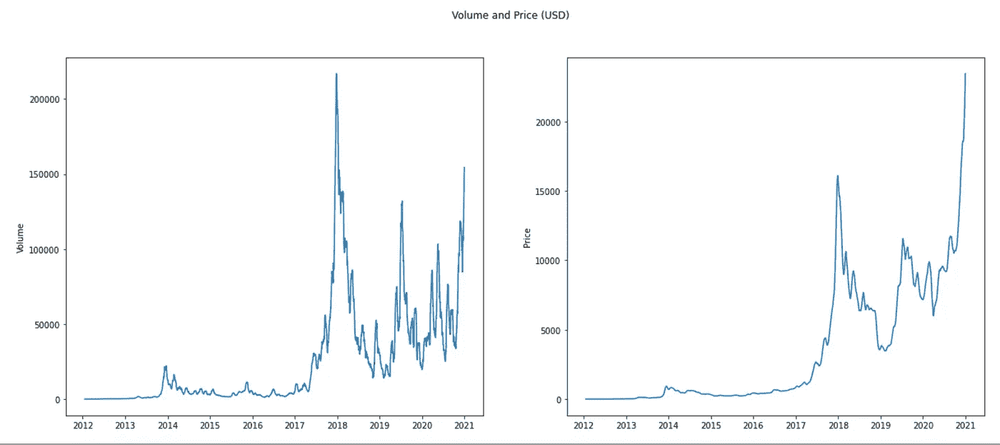
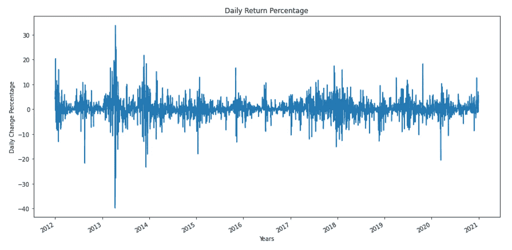
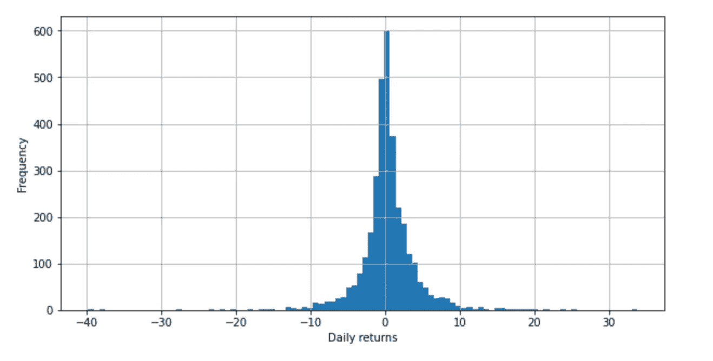
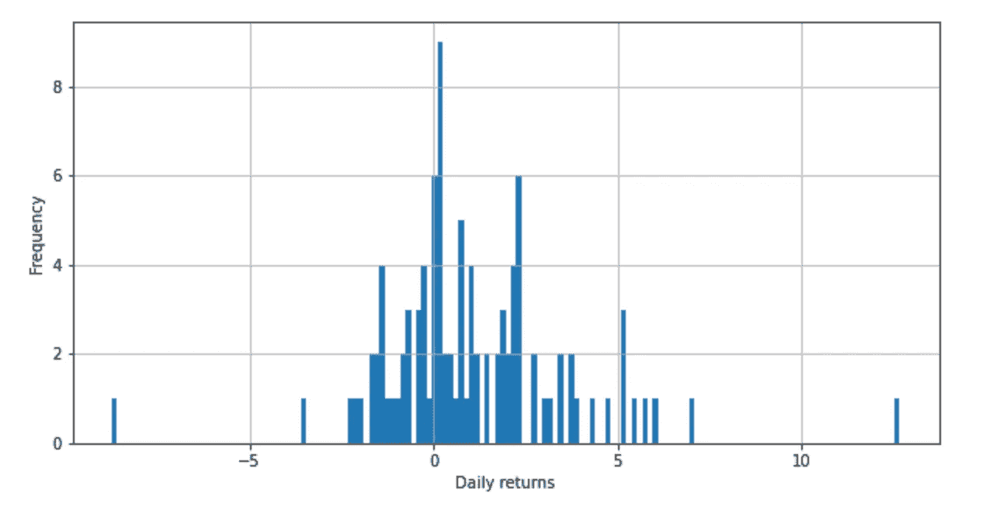
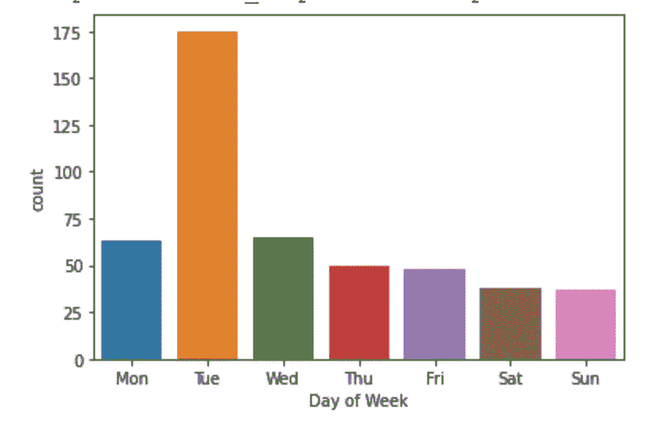

# 日交易比特币:使用历史比特币数据的探索性分析

> 原文：<https://medium.com/analytics-vidhya/day-trading-bitcoin-an-exploratory-analysis-using-historical-bitcoin-data-c0865383ebf5?source=collection_archive---------12----------------------->

# 介绍

日内交易是积极买卖证券的过程，目的是从每分钟的价格变化中获利。即使有正确的洞察力和策略，日内交易也是非常危险的。在传统的股票市场中，有许多规则来阻止模式日交易，例如你的账户中至少有 25，000 美元，购买力限制等等。由于比特币的高波动性和最低限度的监管，这种加密货币已经成为许多高风险日间交易者的首选。极端和快速的价格波动对一些人来说意味着丰厚的利润，对另一些人来说意味着毁灭性的损失。这份报告将分析从 2012 年 1 月到 2020 年 12 月比特币每分钟的更新情况，以回答 3 个关于日内交易的问题。

# **假说**和探索

1.  比特币什么时候交易量最大？(因此波动性和风险最大？).我的假设是，大多数人会在每次价格上涨时买入和卖出。然而，我也相信大多数人都是风险厌恶者，交易量会在每次高峰时迅速减少。因此，快速上涨的价格也意味着日内交易者的风险快速上升。
2.  日交易比特币风险有多大？我的假设相当冒险，但我相信，由于人民币价格的快速上涨，最近几天的每日百分比变化将主要是积极的。因此，这降低了风险，交易者可以在价格下跌时简单地长期持有资产。
3.  比特币一周内最低是什么时候？(最佳工作日购买？)我的假设是，周一将是自股市开盘以来最好的一天，市场表现如何可能与比特币表现如何相关。

# 数据准备和清理

首先，由于每分钟的时间戳和更新，这是一个 300 MB 的大型数据集。最初有 4，727，777 行和 8 列。这些栏是 BTC 的开盘价、最高价、最低价、收盘价、成交量和价格。因为这是时间序列数据，所以我将时间戳列转换为日期时间格式。然后我把日期时间作为索引。接下来，我对数据进行了重新采样，以包括每天的平均值，而不是每分钟的更新。这剩下 3，286 行，而不是 470 万行。最后，我删除了一些缺失的值。所有 Python 代码和数据都可以在我的 [Github 库](https://github.com/AaronFlore/Bitcoin-Exploratory-Data-Analysis-Project)上获得。

# 探索性分析

为了开始我的数据探索，我检查了不同数据类型之间的相关性。下图是显示从 1 到-1 的相关性的热图。正 1 意味着两个变量正协调到小数点后一位。负-1 意味着变量是负协调的。我从这张热图中得出的结论是，贸易量直接取决于价格，系数为 0.8。因此表明当价格上涨时，更多的人交易。这个数字比我想象的要高得多，证实了我的第一个假设，即当价格上涨时，人们会更多地交易 BTC。

下一张图是 8 年来比特币的每日价格。这个图表告诉我们，价格在 2017 年后变得更加波动和高。因此，探索数据的一个有用的技术可能是检查过去 3 年的变量。

下图是以美元为单位的价格和数量的并列图表。这个比较是为了回答我的第一个问题:比特币交易最频繁的时候是什么时候？答案很简单，当价格上涨时，更多的人交易。所以日内交易者要意识到，价格的快速上涨意味着风险的快速增加。

以下三张图旨在衡量比特币交易的每日风险。图表测量连续两天收盘价的价格变化百分比。因此，这些数字表明了投资者的每日收益。令人惊讶的是，下图显示，在过去的 8 年里，比特币的风险并没有显著变化。大比例的上涨很快会伴随着大比例的下跌。这张图表还展示了日内交易中可能出现的丰厚利润和惨重损失。

下图显示了每日回报率百分比的频率。平均值以 0 为中心。出乎意料的是，尽管比特币在过去几年里大幅升值，但直方图并没有向右倾斜。我预计，随着价格的上涨，日平均收益率会更高。为了进一步研究我的假设，我制作了另一个图表。

我创建的下一个柱状图关注的是 2020 年的最后 100 天。这是从数据上看最近的一段时间，也是物价上涨的一段时间。如下所示，最近的日回报率严重偏向盈利。因此，过去 100 天的日内交易很可能比过去 8 年更有利可图。

最后一张图是一个条形图，统计了比特币在一周内处于最低水平的次数。如图所示，最低价在周二压倒性下跌，表明周二是买入的最佳时机。然而，星期二与其他工作日的巨大差异引发了更多的问题。是有一个重复发生的事件导致了这种情况的发生，还是一个巧合？不管怎样，这张图表回答了我的最后一个问题，比特币在哪天是最低的。

# 结论和挥之不去的问题

在探讨了比特币的每日风险之后，我的下一个问题是日内交易者交易比特币的每小时风险是多少。我们发现，在过去的 100 天里，比特币的风险最近变得更低了。探索更多的时间框架将被证明是有价值的。此外，探索一周中除了几天之外的更多季节性将是有用的信息，如分钟或月。为什么周二是比特币价格最低的一天，这个问题仍然没有答案。对我以上 3 个问题的回答只是打开了更多问题的大门。然而，我相信以上信息对比特币的日内交易者来说是有价值的。你了解的越多，你就越能减少交易中的风险。