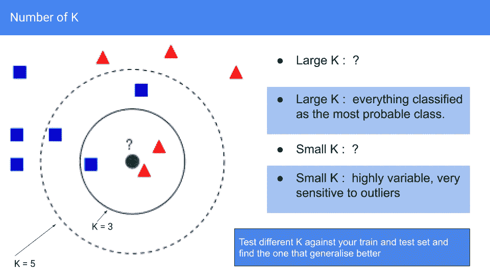

# 机器学习第二天:k 近邻。

> 原文：<https://medium.com/analytics-vidhya/day-two-in-machine-learning-cd5b5853c18b?source=collection_archive---------27----------------------->

图一。KNN 它是如何工作的

k 近邻算法(kNN)是一种用于分类和回归的非参数机器学习方法。它是非参数化的，因为模型不学习任何参数来做出正确的预测。相反，它将查看特征空间中最接近的训练示例(示例的数量取决于用户选择的 k)。用于分类时，输出是一个类组。一个对象通过其邻居的多数投票被分类，该项目被分配到其 k 个最近邻居中最常见的类别。用于回归时，输出是 k 个最近邻值的平均值。本文展示了它是如何工作的，以及如何用 python 开发它。源代码的链接可以在最后找到，这是前一篇[文章](https://guido-salimbeni.medium.com/day-one-in-machine-learning-af510b7d8bed?sk=8a903bdf02b7a3c6a744ca24ced55da7)的链接。

上图(图 1)显示了代表 28 个人及其颜色偏好的 28 个数据样本。红点是喜欢红色、绿点绿色和蓝点蓝色的人。对于每个人，我们知道年薪和年龄，这样我们就可以画出上面的散点图。目标是预测一个 55 岁、年收入 8 万英镑的人最喜欢的颜色。如果我们思考一下如何得到一个解决方案，我假设我们会查看图表中最近的点，计算新数据点附近的大多数颜色，并将该颜色分配给它。在这种情况下，它将是红色的。KNN 以同样的方式处理分类任务，除了在回归任务中计算邻居的平均值之外，也会做同样的事情。

图二。最终动画快照。

考虑图 2 中的简单例子。在我们的数据集中有 2 个绿色正方形和 3 个红色三角形。我们希望预测灰色新数据点的类别。首先，KNN 将计算新数据点到所有其他数据点的距离，并存储在内部字典中(距离为 3、2.8、0.5、2.4 和 5.5)。计算完距离后，KNN 将使用字典，首先按照较短的距离和相关的项目对其进行排序(0.5:正方形，2.4:三角形，2.8:三角形，3:正方形，5.5:三角形)。在这个例子中，用户已经决定实现 k 等于 3 的 KNN。这意味着 KNN 将查看排序后的字典的前 3 项，并对每类的项目进行计数。在排序字典的前 3 项中，有 1 个正方形和 2 个三角形，因此 KNN 将把三角形类分配给新的数据点，因为三角形是 3 个选定样本中的主要类。

图 3。哪个 K？

问题可能是:使用什么样的 K 值才是正确的？看这个例子，总共有 6 个正方形和 5 个三角形。新点可能是正方形的概率稍高，如果我们选择考虑所有训练数据的大量 K，则 KNN 的输出将始终是考虑整个数据集的大多数类。如果我们取一个小的 K 值，预测将对异常值敏感。如果我们选择 5，预测将是正方形，但如果我们选择 3，预测将是三角形。假设中间的两个红色三角形是异常值，选择 k 等于 3 可能不是最佳选择。在实践中，选择正确 K 值的最佳方法是尝试不同的值，并选择一个与不同测试相比产生最一致精度的值。注意，该比较是在测试和未训练和测试之间进行的，因为在 KNN(作为非参数算法)中，没有真正的训练阶段。当 KNN 完成前面提到的所有步骤时，KNN 的训练和预测同时发生。

图 4。代码示例中的数据集

图 4 显示了用于以下示例的数据集的散点图，在该示例中，我们按照详细的算法步骤从头开始构建 KNN。完整代码[此处](https://github.com/Guidosalimbeni/Medium/blob/main/KNN_in_Python_color_dataset.ipynb)。

上面是可以用来计算特征空间中点的距离的函数。长度是数据集的维数，它将包括目标变量。所以下面我们把长度减去 1。欧几里德距离是一个选项，但还有其他几个选项: [Scikit Learn](https://scikit-learn.org/stable/modules/generated/sklearn.neighbors.KNeighborsClassifier.html) 提供了一个名为 p 的参数，根据任务来改变距离度量。

“**get neighbors”**是使用距离创建排序字典的函数，其中 k 个数据点根据它们到我们想要预测的新数据点的距离进行排序。

getResponse 函数将查看字典，计算大多数投票并输出预测值。已排序响应的第一个项目关键字。

当我们用几个新的数据点测试算法时，为了计算算法的精度，我们可以使用上面的函数。与我们为测试目的保留的真实标签相比，它将简单地存储算法做了多少正确和多少错误的预测。

主程序将运行整个算法。我发现通过代码学习算法有时比通过理论更容易，但是有很多不同编程语言的库为我们实现了 KNN:

*[https://sci kit-learn . org/stable/modules/generated/sk learn . neighbors . kneighborsclassifier . html](https://scikit-learn.org/stable/modules/generated/sklearn.neighbors.KNeighborsClassifier.html)

*[https://sci kit-learn . org/stable/modules/generated/sk learn . neighbors . kneighborsregressor . html](https://scikit-learn.org/stable/modules/generated/sklearn.neighbors.KNeighborsRegressor.html)