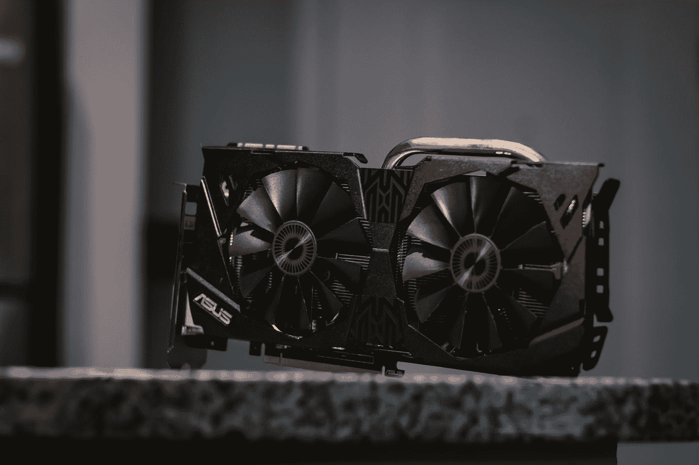

# 你是否恰当地利用了 GPU？

> 原文：<https://medium.com/analytics-vidhya/dealing-with-bottlenecks-in-neural-network-training-d098b34d3342?source=collection_archive---------18----------------------->

## 深度学习

## 减少设备闲置时间，训练速度更快。

约瑟夫·格雷夫在 [Unsplash](https://unsplash.com?utm_source=medium&utm_medium=referral) 上的照片

你好。欢迎回来！

今天我们要讨论如何更快地训练神经网络。我们如何减少设备在培训期间的闲置时间。