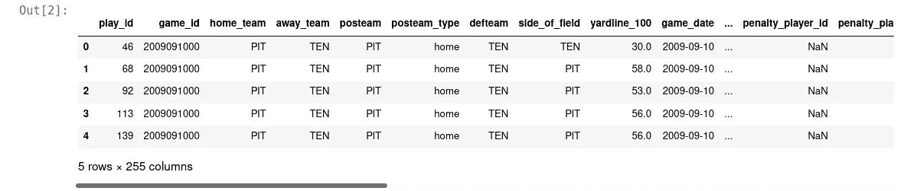
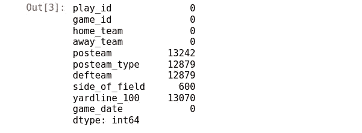
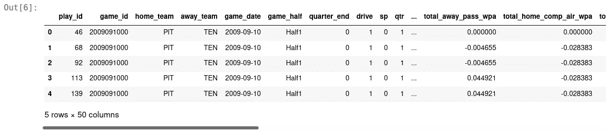
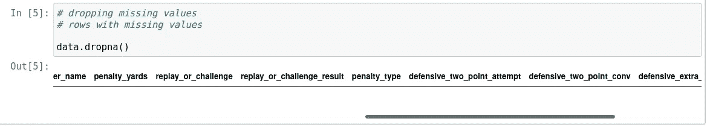

# 处理缺失值

> 原文：<https://medium.com/analytics-vidhya/dealing-with-missing-values-432d06ab4049?source=collection_archive---------2----------------------->

> *第一部分* [***一次数据清理之旅***](/analytics-vidhya/a-data-cleaning-journey-2b0146407e44)

您已经阅读了“数据清理之旅”系列的第一篇文章！


图片来自 [Hub research](http://www.hubresearch.ca/bridging-the-data-gap-how-to-deal-with-missing-data-in-observational-studies/)

不人们喜欢数据清理。这可能非常令人沮丧。尤其是当你正在处理丢失的值并且有截止日期的时候。

> 您需要给自己一些时间来处理数据科学过程中的数据清理部分。

有时您会想知道如何处理数据集中缺失的值。


[分析印度杂志有限公司](https://analyticsindiamag.com/5-ways-handle-missing-values-machine-learning-datasets/)

当您最终拥有一个干净的数据集时，您的分析将运行得更快，您也可以更快地得出见解。

**刷新关于熊猫和 Numpy？**

重要的事情先来。我假设你知道如何使用熊猫和 NumPy 库。如果没有，这里有一些好的资源链接，您可以使用它们来更新:

1.  [熊猫数据帧介绍第一部分](https://annwambui.medium.com/introduction-to-pandas-dataframes-part-1-51ecca298122)
2.  [熊猫-卡格尔](https://www.kaggle.com/learn/pandas)
3.  对 NumPy，熊猫和 Matplotlib 的介绍

## 首先让我们看看我们将使用的数据

我们将使用熊猫来加载和查看数据。数据集可以在[这里](https://www.kaggle.com/maxhorowitz/nflplaybyplay2009to2016?select=NFL+Play+by+Play+2009-2018+%28v5%29.csv)找到，笔记本[这里](https://github.com/3liud/a-data-cleaning-journey)找到。

## 首先，我们导入必要的库并读入数据集

```
#*import libraries*import pandas as pd
import numpy as np#*reading in the dataset*data = pd.read_csv("NFL2009-2018 (v5).csv")
data.head()
```



我们的数据集有 255 列。上面的代码片段只显示了 5 列。下一步是查看数据集中有多少缺失值或空值。

**让我们检查一下缺失的数据点**

我们使用下面的代码来做到这一点。第一行检查缺少值的列，而第二行仅用于显示前 10 列以及有多少行缺少值。

```
# *Checking missing values*missing_values = data.isnull().sum()
missing_values[0:10]
```



从上图中，我们了解到，在前 10 列中，有 5 列带有 missign 值。

## 为什么我们会有缺失数据？

在处理丢失的值之前，了解丢失值的原因是很重要的。


布雷特·乔丹在 [Unsplash](https://unsplash.com/s/photos/missing-piece?utm_source=unsplash&utm_medium=referral&utm_content=creditCopyText) 上的照片

你可能会问，那么这个缺失数据的问题从何而来？

一些丢失的数据可能是人为错误造成的。在记录中输入数据的人可能犯了一个错误，遗漏了一些数据。但这不是唯一的原因。在其他情况下，当回答调查或问卷的问题时，你可能不愿意提供一些数据，如家庭收入或你养的小猫数量:)这可能是数据缺失的一个原因。

**处理缺失值的不同方法。**

1.  **删除缺失值**

删除值不是处理缺失数据的最佳方式。你分析的目的是得出最重要的见解。如果你删除了数据，你就降低了你将获得的洞察力的重要性。但是我们如何着手丢弃丢失的值呢？

如果您因为缺少值而决定删除缺少的列，您可以这样做…

```
# drop columns with missing valuescolumns_without_na = data.dropna(axis=1)
columns_without_na.head()
```

上面的代码删除了任何缺少值的列。结果如下所示:



如果您还记得上面的内容，我们的数据集中最初有 255 列。删除丢失的值只得到 50 列。要丢弃的数据太多了！

[吉菲](http://gph.is/2flOdbz)

如果我们决定删除所有缺少值的行，情况会更糟



这将删除数据集中的所有行

2.**输入缺失值**

简单地说，输入就是按照您的意愿用适当的数据替换丢失的值。然而，无论您决定使用哪种算法或方法来估算缺失值，都会导致信息的丢失。

您正在引入一个缺失的值。“缺失值”本身就是一条信息。输入值强化了模式，但不一定增强了数据中的信息。

```
# *impute or replace missing values with 0
data.fillna(0)**# fill missing values with a string 
data.fillna("data missing")**# fill missing values with mean of specific column*
data["col1"] = data["col1"].fillna(data.mean)
```

**处理缺失的分类数据**

> 处理分类数据时，最好的方法是将缺失值标记为“缺失”。但是，您也可以用列的模式来估算它们。

**思想！**

在本文中，我总结了缺失数据的来源，以及处理它们的方法。但是，您选择的方法将取决于各种因素，例如缺失值的百分比、缺失值的数据类型以及您正在处理的分析或模型的类型。作为一名数据科学家，您会在不同的时间选择不同的方法来处理缺失值。

查看我在这个系列中的下一篇文章关于 [**处理不想要的观察:重复&不相关的观察**](https://3liud.medium.com/dealing-with-unwanted-observations-duplicates-irrelevant-observations-7b6a1e50a93b)