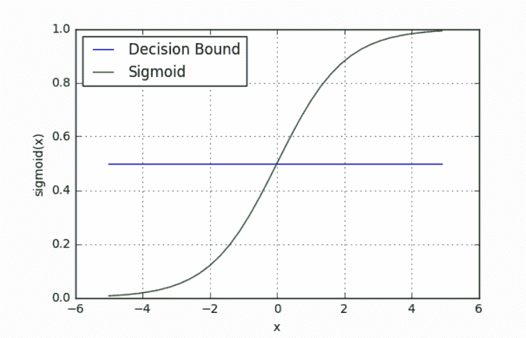
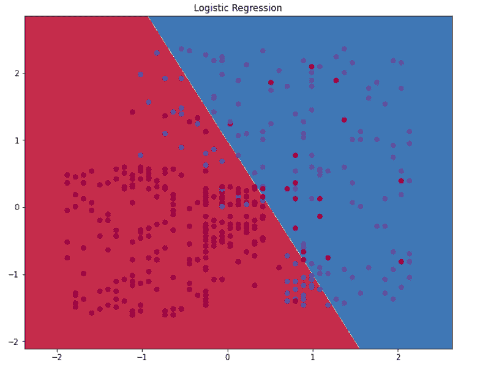
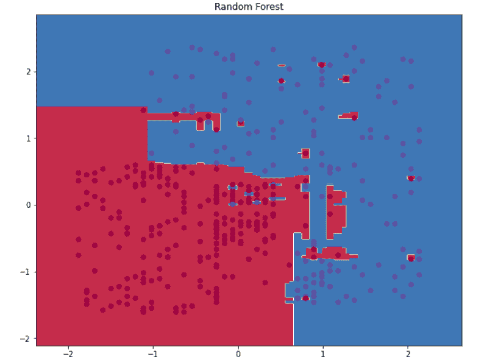
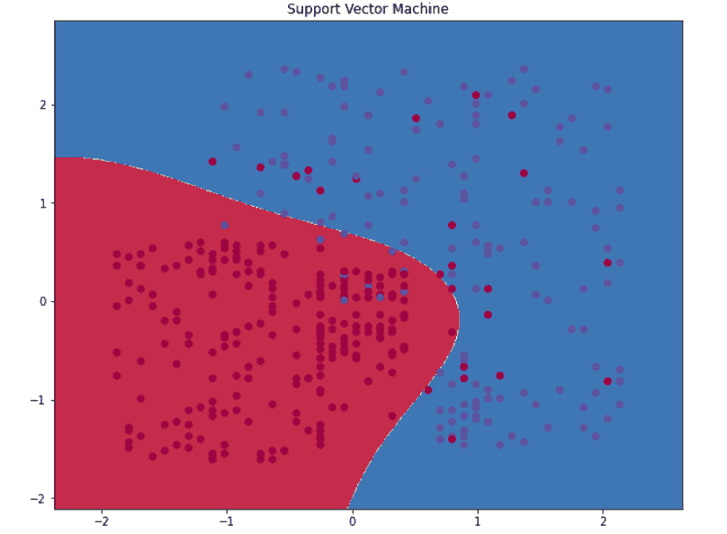
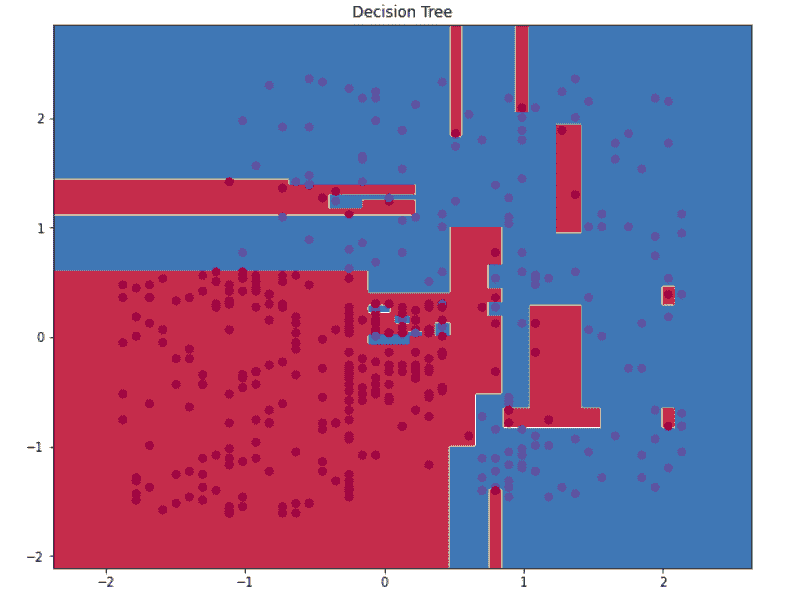
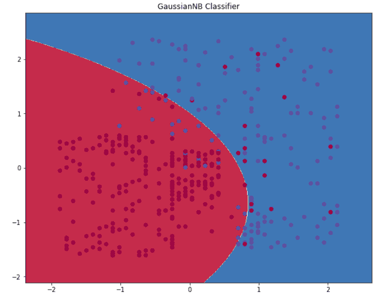

# 分类器的决策边界:介绍

> 原文：<https://medium.com/analytics-vidhya/decision-boundary-for-classifiers-an-introduction-cc67c6d3da0e?source=collection_archive---------0----------------------->

关于如何确定最佳分类器有许多争论。测量性能指标得分、获得 ROC 下的面积是少数方法，但是从可视化决策边界中可以收集到大量有用的信息，这些信息将使我们直观地掌握学习模型。

所以，在本文中，我们将了解以下内容:

*   什么是决策边界
*   决策边界的重要性
*   决策边界的类型
*   不同分类器的决策边界。
*   Python 代码的用例
*   高维数据的决策边界
*   结论

那么，让我们开始吧

# 什么是决策边界？

在数据集上训练分类器时，使用特定的分类算法，需要定义一组超平面，称为决策边界，将数据点分成特定的类，其中算法从一个类切换到另一个类。在决策边界的一侧，A 数据点更可能被称为 A 类，而在边界的另一侧，它更可能被称为 b 类。

让我们举一个逻辑回归的例子。

逻辑回归的目标是找出一些分割数据点的方法，以便使用特征中存在的信息对给定观察值的类别进行准确预测。

假设我们定义了一条描述决策边界的线。因此，在边界一侧的所有点应该具有属于 A 类的所有数据点，并且在边界一侧的所有点应该具有属于 b 类的所有数据点。

**S(z)=1/(1+e^-z)**

*   s(z)= 0 和 1 之间的输出(概率估计值)
*   z =函数的输入(z= mx + b)
*   e =自然对数的基数

我们当前的预测函数返回 0 到 1 之间的概率分数。为了将其映射到离散类(A/B ),我们选择一个阈值或临界点，高于该阈值或临界点时，我们将值分类为 A 类，低于该阈值或临界点时，我们将值分类为 B 类。

**p > =0.5，class=A**

**p < =0.5，class=B**

如果我们的阈值是 0.5，而我们的预测函数返回 0.7，我们会将该观察结果分类为 a 类。如果我们的预测是 0.2，我们会将该观察结果分类为 b 类。

***所以，用 0.5 的线称为决定边界。***

为了将预测值映射到概率，我们使用 Sigmoid 函数。



# 决策边界的重要性

判定边界是分离属于不同类别标签的数据点的表面。决策边界不仅仅局限于我们提供的数据点，还跨越了我们训练的整个特征空间。该模型可以预测我们的特征空间中任何可能的输入组合的值。如果我们训练的数据不是“多样化的”，模型的整体拓扑将*很难推广到新的实例*。因此，在将模型用于生产之前，分析最适合“多样化”数据集的所有模型非常重要。

检查决策边界是了解我们选择的训练数据如何影响我们的模型的性能和泛化能力的一个好方法。决策边界的可视化可以说明模型对每个数据集的敏感程度，这是理解特定算法如何工作以及它们对特定数据集的限制的一种很好的方式。

# 用例

目的:为各种分类器算法建立决策边界，并决定哪种算法是数据集的最佳算法。

数据集在这里[可用。](https://www.kaggle.com/rakeshrau/social-network-ads)

数据集描述:数据集包含用户的信息，应该基于这些信息建立最佳模型来预测用户是否会购买汽车。

独立变量:

*   年龄:用户的年龄
*   **预计薪资**:用户的薪资。

因变量:“已购买”，如果用户购买汽车，则为 1，否则为 0。

步骤 1:导入所有需要的库

大蟒

```
# Package importsimport matplotlib.pyplot as pltimport numpy as npimport sklearnimport sklearn.datasetsimport sklearn.linear_modelimport matplotlibimport pandas as pd
```

步骤 2:导入数据集

大蟒

```
from google.colab import filesuploaded=files.upload()import iodf2=pd.read_csv(io.BytesIO(uploaded['Social_Network_Ads.csv']))
```

步骤 3:将 StandardScaler 应用于数据集。变量“薪金”和“年龄”不在同一个范围内。所以，这些应该被缩放。否则，模型不能预测一个好的结果。标准缩放还有助于加速算法中的计算。

大蟒

```
X = df2.iloc[:, :-1].valuesy = df2.iloc[:, -1].valuesfrom sklearn.preprocessing import StandardScalersc = StandardScaler()X = sc.fit_transform(X)
```

步骤 4:为分类器导入 sklearn 库

大蟒

```
from sklearn.linear_model import LogisticRegressionfrom sklearn.naive_bayes import GaussianNBfrom sklearn.ensemble import RandomForestClassifierfrom sklearn.svm import SVC
```

步骤 5:获取数据集的维度。

步骤 6:建立逻辑回归模型并显示逻辑回归的决策边界。决策边界可以通过网格密集采样来可视化。但是，如果网格分辨率不够，边界就会显得不准确。`meshgrid` 的目的是用一个 x 值数组和一个 y 值数组创建一个矩形网格。我们可以从[这里](https://stackoverflow.com/questions/36013063/what-is-the-purpose-of-meshgrid-in-python-numpy/49439331)得到关于如何绘制网格的完整解释。

在 Meshgrid 中，我们将制作一个图像，其中每个像素代表 2D 特征空间中的一个网格单元。该图像定义了 2D 特征空间上的网格。然后使用分类器对图像的像素进行分类，该分类器将为每个网格单元分配一个类别标签。然后，分类后的图像将用作散点图的背景，散点图将显示每个类别的数据点。

优点:它对 2D 特征空间中的网格点进行分类。

缺点:制作非常精细的决策边界图的计算成本，因为我们必须使网格越来越精细。

大蟒

```
# Display plots inline and change default figure size%matplotlib inlinematplotlib.rcParams['figure.figsize'] = (10.0, 8.0)# Train the logistic rgeression classifierclf = sklearn.linear_model.LogisticRegressionCV()clf.fit(X, y)​# Helper function to plot a decision boundary.def plot_decision_boundary(pred_func):# Set min and max values and give it some paddingx_min, x_max = X[:, 0].min() - .5, X[:, 0].max() + .5y_min, y_max = X[:, 1].min() - .5, X[:, 1].max() + .5h = 0.01# Generate a grid of points with distance h between themxx, yy = np.meshgrid(np.arange(x_min, x_max, h), np.arange(y_min, y_max, h))# Predict the function value for the whole gidZ = pred_func(np.c_[xx.ravel(), yy.ravel()])Z = Z.reshape(xx.shape)# Plot the contour and training examplesplt.contourf(xx, yy, Z, cmap=plt.cm.Spectral)plt.scatter(X[:, 0], X[:, 1], c=y, cmap=plt.cm.Spectral# Plot the decision boundaryplot_decision_boundary(lambda x: clf.predict(x))plt.title("Logistic Regression")
```

在逻辑回归中，决策边界是一条线性线，它将 A 类和 B 类分开。来自 A 类的一些点也进入了 B 类的区域，因为在线性模型中，很难获得分隔这两个类的精确边界线。



步骤 7:建立随机森林模型，并绘制决策边界。作为一个基于树的模型，它有许多树，并且这个情节试图捕捉所有相关的类。它是一个非线性分类器。

大蟒

```
# Display plots inline and change default figure size%matplotlib inlinematplotlib.rcParams['figure.figsize'] = (10.0, 8.0)# Train the RandomForestClassifierclf1 = RandomForestClassifier(random_state=1, n_estimators=100)clf1.fit(X, y)# Plot the decision boundaryplot_decision_boundary(lambda x: clf1.predict(x))plt.title("Random Forest")
```

决策树和随机森林的决策面非常复杂。决策树是迄今为止最敏感的，仅显示受单点严重影响的极端分类概率。随机森林的敏感度较低，孤立点的极端分类概率要低得多。SVM 是最不敏感的，因为它有一个非常平滑的决策边界。



第八步:建立支持向量机模型，绘制决策边界

大蟒

```
# Display plots inline and change default figure size%matplotlib inlinefrom sklearn.svm import SVCmatplotlib.rcParams['figure.figsize'] = (10.0, 8.0)# Train the Support Vector Machine classifierclf3 = SVC(gamma='auto')clf3.fit(X, y)# Plot the decision boundaryplot_decision_boundary(lambda x: clf3.predict(x))plt.title("Support Vector Machine")
```

支持向量机寻找一个超平面，该超平面将特征空间分成具有最大间隔的两类。如果问题最初不是线性可分的，则使用核技巧，通过增加维数，将它变成线性可分的问题。这样，一个小维空间中的一般超曲面就变成了一个更高维空间中的超平面。



步骤 9:建立决策树模型并绘制决策边界

大蟒

```
# Display plots inline and change default figure size%matplotlib inlinefrom sklearn.tree import DecisionTreeClassifiermatplotlib.rcParams['figure.figsize'] = (10.0, 8.0)​# Train the Decision Tree classifierclf4 = DecisionTreeClassifier()clf4.fit(X, y)​# Plot the decision boundaryplot_decision_boundary(lambda x: clf4.predict(x))plt.title("Decision Tree")
```



步骤 10:建立高斯朴素贝叶斯模型并绘制决策边界

大蟒

```
# Display plots inline and change default figure size%matplotlib inlinefrom sklearn.naive_bayes import GaussianNBmatplotlib.rcParams['figure.figsize'] = (10.0, 8.0)# Train the Gaussian NaiveBayes classifierclf5 = GaussianNB()clf5.fit(X, y)​# Plot the decision boundaryplot_decision_boundary(lambda x: clf5.predict(x))plt.title("GaussianNB Classifier")
```



高斯朴素贝叶斯也表现很好，具有平滑的曲线边界线。

# 高维数据的决策边界

对于 2D 和 3D 数据集，决策边界很容易可视化。超越 3D 的概括在可视化方面形成了挑战，其中我们必须将多维度中存在的边界转换到较低的维度，这可以被专家显示和理解是困难的。

然而，可以使用 tSNE 绘制决策边界，其中数据的维度可以分几步降低。例如:如果我的数据的维度是 150，那么首先应该减少到 50，然后应该减少到 2 个维度。

来自 sklearn.manifold 的库 TSNE 和来自 sklearn.decomposition 的 TruncatedSVD 用于此目的。

这里发表了一篇非常好的研究论文[，描述了为高维数据绘制决策边界。](https://www.researchgate.net/publication/271658381_Visualizing_multi-dimensional_decision_boundaries_in_2D)

# 结论:

在本文中，我们学习了决策边界在确定分类器模型中的作用，构建了几个分类器模型并绘制了它们各自的决策边界以选择最佳模型，还知道绘制高维数据的决策边界是一项复杂的任务，可以使用 tSNE 绘制，其中数据的维度可以通过几个步骤来降低。

现在，你的下一步是什么？请提出几个关于为高维数据绘制决策边界的建议方法的要点，如在这里发表的[的研究论文中所发现的。](https://www.researchgate.net/publication/271658381_Visualizing_multi-dimensional_decision_boundaries_in_2D)

在我们的下一篇文章中再见…在那之前请保持关注，祝学习愉快！