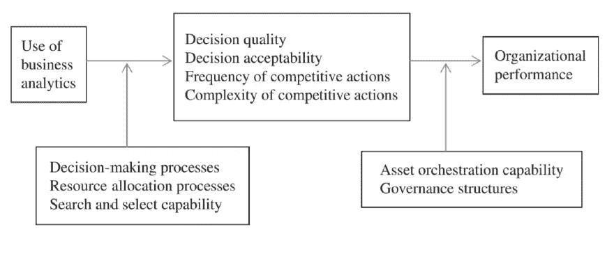

# 商业环境中的决策

> 原文：<https://medium.com/analytics-vidhya/decision-making-in-a-business-context-3c1f7914e620?source=collection_archive---------10----------------------->

大数据改变了我们生活的社会，利用这一优势可以为组织增加价值。但不是每个人都知道如何充分利用它。

弗拉季斯拉夫·巴比延科在 [Unsplash](https://unsplash.com?utm_source=medium&utm_medium=referral) 上的照片

事实上，这些组织中的大多数都拥有大量的数据、历史信息和其他有价值的见解，但却没有利用这一优势。因此，成功使用分析可以成为决策过程的有效组成部分。

在决策中使用商业分析的效果

使用分析可以有效地提高决策质量、可接受性和引入竞争措施。将分析用作决策工具时，组织面临的四个常见错误或陷阱如下:

**不了解整合问题**

一家公司将拥有多种数据资源，这些数据可以为决策过程提供一些信息。但是，如果公司不能很好地整合资源，从数据中获得富有成效的输入将成为一项艰巨的任务。在商业智能(BI)中，信息集成有助于查询和报告业务活动，用于统计研究、在线分析处理(OLAP)和数据挖掘，以支持预测、企业范围的规划和决策，从而在市场中获得更大的优势。因此，让一家公司在今天的市场中脱颖而出的是他们如何解释他们手中的数据的维度、质量和类型。来自不同来源的数据不一致的问题也必须得到解决。紧耦合和松耦合是解决数据集成问题的两种方法。紧密耦合包括使用 ETL(提取、转换和加载)从多个源检索数据到一个集中的位置。另一方面，松耦合确保数据的临时存储不会以预定义接口可以转换和操作根存储的方式进行。

> 如何正确管理数据集成的一个理想例子是沃尔玛。他们跟踪顾客在网上购买了什么，顾客的当前趋势是什么，甚至当地的天气变化如何影响购买模式。

**没有意识到非结构化数据的局限性**

据估计，每天大约产生 2.5 万亿字节的数据量。世界上 90%的数据都是在最近两年产生的。当生成的数据量增加时，大数据带来了挑战，涉及为提取有用信息而生成的数据的维度、异构性和可扩展性。因此，准确有效地转换这些数据以获取有用信息的方法变得至关重要。在大多数情况下，非结构化数据是肮脏和嘈杂的。在消除噪音的过程中，总会遇到许多挑战。因此，先进的数据预处理技术对于处理非结构化数据的质量问题至关重要。有效的数据争论工具和所有相关流程的标准化可以在一定程度上帮助解决与非结构化数据相关的问题。与结构化数据相比，非结构化数据具有很高的动态性。因此，从非结构化数据中找出意义可以促进更容易的分析和实现，从而提高其可解释性。

> 沃尔玛每小时从其 100 万客户那里收集 2.5 的非结构化数据。沃尔玛是如何利用大数据分析来高效管理运营的一个例子。

**假设相关性意味着什么**

随着数据量的日益增长，出现了一个问题。这些数据会成为支持相关决策的能力吗？如果收集的数据涉及大量重叠或重复的数据，那么这些数据对决策者没有任何帮助作用。如果相同的话，太多的信息更像是太少的信息。因此，数据的多样性成为与整个过程相关的一个非常有影响力的重要因素。机器学习算法本应通过严肃的数据处理为我们提供见解，但在处理劣质数据时将毫无用处。最初确定与数据相关联的相关性，而不仅仅是插入算法，是处理大数据的一种可行方式。这也有助于识别临时模式，从而帮助决定满足需求的战略行动。对数据的实验不仅提高了分析的质量，还提高了隐藏在数据中的答案。

> Kmart 是一个很好的例子，说明为什么你不能通过实施一个新的商业智能系统来提高商业分析。Kmart 未能对他们的数据进行统计分析，这导致对市场和客户的了解不足。顾客不断抱怨他们在凯马特商店找不到他们想要的东西。另一方面，像塔吉特和沃尔玛这样的公司在提供更好的顾客体验方面表现出色。

**低估所需劳动力技能**

随着涉及数据管理的技术不断发展，将信息转化为洞察力已经成为组织的重要组成部分。因此，组织应该在资源管理方面更有创造力和智慧。这加强了对高技能员工和更好地利用资源的需求。随着数据科学领域在组织中得到广泛接受，机器学习极大地补充了数据管理的发展。随着云服务和大数据的引入，处理数百万数据这一几十年前的梦想已经成为现实。但是，组织往往低估了解决某个问题所需的技能，这可能会导致糟糕的决策。机器学习算法的数量和种类很多。但选择正确的才是战术所在。理解数据并确定应该实施的合适方法是组织在数据科学家中寻找的一些关键技能。LinkedIn 根据职位空缺将数据科学家列为美国最有前途的工作。数据科学家为组织带来了巨大的价值，因此在决策过程中扮演着重要的角色。

> 英国国家医疗服务系统启动了一个项目，将患者的所有医疗记录整合到一个中央医疗保健数据库中。因此，人口中的健康趋势可用作规划战略和改善社会健康的重要标准。但到 2011 年，该计划在花费约 100 亿€元后被取消。该项目的失败与团队无法获得分析方面的专业知识以及无法理解系统的复杂性直接相关。

**参考文献**

1.  Y.刘，韩，德贝罗，“商业分析的挑战:成功与失败”，第 51 届夏威夷系统科学国际会议论文集，第 840-849 页，2018 年。可用:【https://doi.org/10.24251/HICSS.2018.105 
2.  Milan Kubina，Michal Varmus，Irena Kubinova，利用大数据获得公司竞争优势，Procedia Economics and Finance，2015 年第 26 卷，第 561565 页，ISSN 2212-5671，[https://doi . org/10.1016/s 22125671(15)009557](https://doi.org/10.1016/S22125671( 15)009557)。
3.  Rajeev Sharma、Sunil Mithas 和 Atreyi Kankanhalli (2014)转变决策流程:了解商业分析对组织的影响的研究议程，欧洲信息系统杂志，23:4，433441，DOI: 10.1057/ejis.2014.17

希望你读得不错。请鼓掌以示支持，并关注我以获取更多文章☺