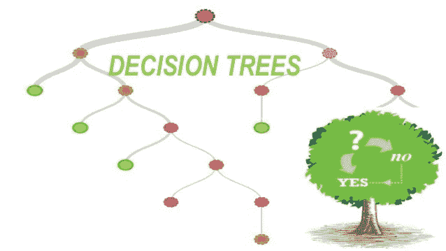
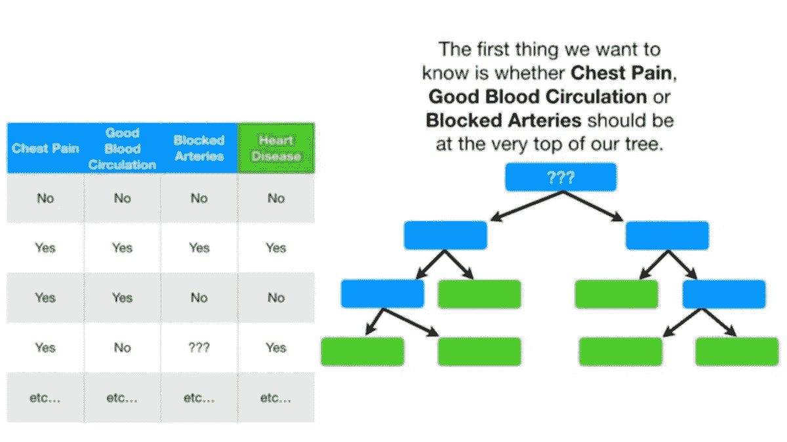
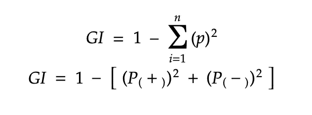
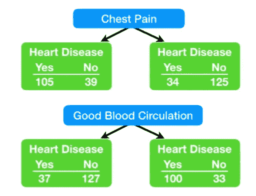
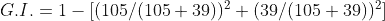
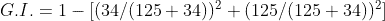
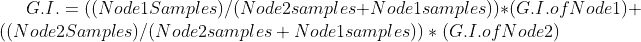
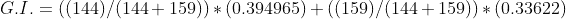

# 决策树 101！

> 原文：<https://medium.com/analytics-vidhya/decision-tree-101-e94a5d131fa0?source=collection_archive---------13----------------------->

决策图表

决策树是机器学习领域中基于树的算法之一。它非常直观，易于理解，这使得它在解决一些经典的机器学习问题时非常有用。

因此，我们不会浪费太多时间，将深入探讨这种算法的本质细节。

**什么是决策树？**

*   决策树可以用来处理分类数据和数字数据。

图片来源:youtube 上的 Statquest 频道

*   现在让我们看看上面的数据集，我们有一些特征，即胸痛，良好的血液循环，阻塞的动脉，以及一个标签，即心脏病。
*   现在要创建一个决策树，我们首先要创建一个根节点，为了创建一个根节点，我们需要选择一个以最佳方式划分数据集的特征。
*   但是我们如何选择这个特性呢？有许多指标可以计算这一点，如熵、信息增益和基尼系数。
*   就本文而言，我们将主要关注基尼系数。
*   基尼不纯度是用于计算节点不纯度的度量，由以下公式给出

基尼杂质公式

计算基尼系数

*   假设我们以胸痛为节点，通过查看上面的图表，我们可以看到，如果一个人有胸痛，那么其中 105 人会有心脏病，39 人不会有心脏病。类似地，如果患者没有心脏病，那么这些患者中有 34 人会有心脏病，125 人不会有心脏病。
*   现在让我们计算病人胸痛时某个节点的基尼系数。

节点 1 的 Gini 杂质

*   上述等式给出的值为 0.394965。
*   现在我们计算病人没有胸痛时节点 2 的基尼系数。

节点 2 的 Gini 杂质

*   上述等式给出的输出为 0.33622
*   现在，为了计算胸痛的基尼指数，我们取两个节点的加权和，如下式所示。

基尼系数的加权和

*   现在，将这些值代入上述公式，得到以下等式

*   上面的等式给出了下面的 0.36413
*   同样，我们将计算所有要素的基尼系数，基尼系数最小的要素将成为我们的根节点。
*   现在，我们已经将数据集分为两部分。我们将对每个节点应用相同的过程，直到我们得到纯叶节点或者父节点的 Gini 杂质小于子节点。

**我们的圣诞树终于准备好了！！**

*   现在，由于我们的树已经完全构建好了，我们可以通过测试数据来检查我们的预测。

**如何计算不同类型数据的基尼系数？**

*   我们已经在上面看到了如何计算是/否类型数据的基尼系数。

## 处理数字数据

*   对于连续数据，假设喜欢用身高来预测体重。我们需要问一个问题，比如将使用什么权重值来将数据分成节点。
*   首先，我们将重量数据按升序排序。然后我们取对应点对的平均值，然后用这个平均值计算每个平均值的基尼系数。
*   具有最小基尼系数杂质的平均权重将被用于该特征的基尼系数。

**处理排名数据**

*   假设我们有一个包含等级或级别的特性，那么我们能做的如下。
*   将数据分成两部分，即一个节点具有秩≤ p 的数据，另一个节点具有秩> p 的数据(p 是任何有效的秩值)。
*   现在我们计算每个等级的基尼系数，并计算基尼系数最小的等级。

**加贺**

*   决策树对非线性数据表现良好。
*   它们很容易过拟合，即它们在训练数据上表现良好，但在测试数据上表现较差。
*   决策树是其他基于树的算法的基础，如随机森林等。

**直到那时快乐学习！！**