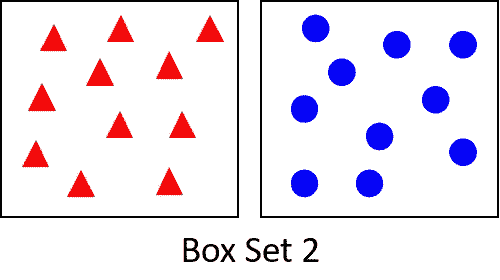
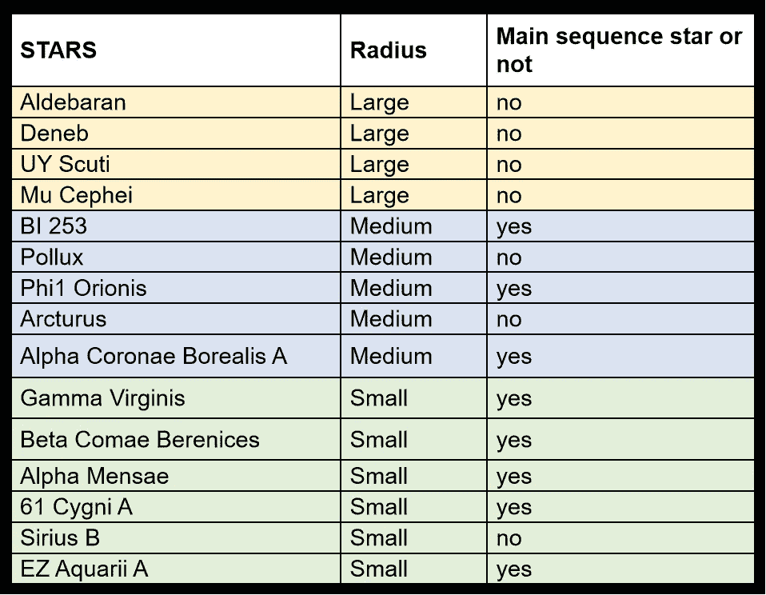
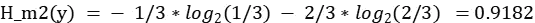

# 决策图表

> 原文：<https://medium.com/analytics-vidhya/decision-tree-7ae118b92489?source=collection_archive---------19----------------------->

## AI 的斗篷下藏着什么？

抓住你了。？(图片来源:[https://I . pinimg . com/originals/1b/33/B9/1b 33 b 9 bfc 8d 7d 8152 c 83 a 073 b 11296 c 5 . png)](https://i.pinimg.com/originals/1b/33/b9/1b33b9bfc8d7d8152c83a073b11296c5.png))

上图描绘了 AI 是:D 的一堆 if else 语句

这是部分真实的，并且恰好在**决策树**——*的最后行动中，这是许多机器学习算法之一，是人工智能*的一个子领域。

但是它忽略了指导算法建立 if else 条件的重要数学方面。

重要数学方面是什么？

> 它的熵来自信息论

请继续阅读，了解更多关于决策树和熵的知识…

## 决策树是一种监督机器学习(ML)算法。

它由一组要一个接一个满足的条件组成，因此通过该条件的算法将把它的路径指向将给定数据分类到特定类别或实值输出。条件将基于给定数据的特征。决策和路径形成树状结构，因此得名。

图一。决策树结构示例

条件被称为决策节点。

基于决策选择的类别(橙色圆圈)是叶节点。

(也可以称为父节点和子节点。举例。条件 1 是父节点，而条件 2 和 3 是子节点)

**什么是监督学习？**

监督意味着 ML 模型是基于给定特征集的可用分类或实值输出来构建的。

图 2。数据集示例

上图 2。表示数据集 D = {xi，易}

在哪里

xi =具有 n 维**特征的数据—** xi1，xi2，xi3…辛

xi1，xi2…xin 可以为 xi 下的给定项目设置实数值或类别或文本

yi =分类(y=0，1，2，3…m)或定义数据 xi 的真实值**输出**。

数据集也可以具有包含实值要素的分类输出。

当 yi's 在数据集中可用时，机器学习算法被称为监督学习，否则它是无监督学习。

因此，要构建决策树模型，需要输出值(yi)和特征数据。

好了，我们来探讨一下决策树构造。

在文章的开始，我提到了一个重要的数学方面，叫做熵。下面将阐明如何评估熵，以及它如何帮助构建决策树。

一般来说，熵是系统中无序度的一种度量。

**什么是有序和无序？**

考虑一个有三角形和圆形的盒子。下图描绘了一个三角形和圆形盒子的无序和有序状态。

图 3。三角形和圆形的盒子

从上面的三角形和圆形图像中，我们可以观察到:

1.从盒子集合 1 中挑选(看不到)三角形或圆形的概率是“0.5”(7/14)

2.从盒子组 2 中相应的盒子中挑选(看不见)三角形或圆形的概率是“1”

如果挑选一件物品的概率是 1 或 0，那么我们可以认为盒子处于有序状态。有序状态的熵为零(最小值)

如果选择的概率介于 0 和 1 之间，那么我们可以认为盒子处于无序状态。无序状态的熵是一(最大值)

在信息论中，熵是对一个数据可以包含多少信息的度量。该值也是数据中测量不确定性。

分类数据的熵由下式给出:

P(y_i)表示给定数据属于某个类别的概率。

k 是类别的数量。

考虑以 2 或 e 为底的对数进行评估。

log(1/P(y_i)) = - log(P(y_i))是与特定类别“y_i”相关联的信息的度量。上面的公式(H(y))是考虑所有类别的平均信息的度量。

从信息论上了解更多关于熵的知识: [**链接**](https://en.wikipedia.org/wiki/Entropy_(information_theory))

对于熵的直观理解，请参考:前 4 分钟的 [**视频**](https://www.youtube.com/watch?v=ErfnhcEV1O8&t=414s)

示例计算:

考虑一个大小为 15 的分类数据集，其中 y=NO(0)表示 11 行数据，y=YES(1)表示 4 行数据

那么 k = 2，因为 y 只能有 2 个值-0 和 1。

P(y=0) = 11/15，P(y=1) = 4/15

基于输出的给定数据的熵计算如下

上述评估表明，仅考虑“是”或“否”的计数，熵“H”对于所考虑的例子来说是高的。

这意味着该组数据高度无序。

对于具有二元分类的给定数据，我们观察到:

当 y 的值相等时，熵最大。当一个类别(0 或 1)的概率最大时，熵最小。

(参见图 4。来自 Google plot 的图形— x 在范围[0，1]内)

图 4。二进制分类数据的熵的 Google plot 图

在图 4 中。x 代表概率，y 代表熵(以 2 为底的对数)

**那么，有序和无序对决策树有什么影响呢？**

这就是决策树的症结所在。该树是用设定数据分类路径的条件构建的，其方式是无序度即熵在每一阶段减少。

条件基于给定数据的特征(xi1，xi2，xi3…xin)

当熵最小时，树能够将给定的数据分类到各自的类别。

**如何选择条件以减少紊乱？**

为了理解如何选择条件，我们将考虑真实世界的数据。

这些数据是天空中星星的信息。无论给定的恒星是不是**主序星，数据都会有一个类别。**

**让我们探索星星***

[大麦哲伦星云](https://en.wikipedia.org/wiki/Large_Magellanic_Cloud)中的一个[恒星形成](https://en.wikipedia.org/wiki/Star_formation#Stellar_nurseries)区域，来源:[https://en . Wikipedia . org/wiki/Star #/media/File:starsinthesky . jpg](https://en.wikipedia.org/wiki/Star#/media/File:Starsinthesky.jpg)

根据[主序](https://en.wikipedia.org/wiki/Main_sequence)中提到的赫兹普朗-罗素图，恒星主要分为主序星、巨星和矮星

但是为了我们的研究目的，我们将考虑恒星的半径、质量、光度和温度来对恒星进行分类。考虑研究来自[主序列](https://en.wikipedia.org/wiki/Main_sequence)的样本参数部分的数据。

对于巨星/超巨星/矮星，数据来自各自的维基页面(链接见本节末尾)。

下表收集了恒星的原始数据

*注:半径、质量和光度的值是相对于太阳的值。温度是恒星表面的温度

在上面的数据**中，半径、质量、光度和温度是给定恒星(xi1、xi2、xi3、xi4)的特征**

而**主序列或不主序列**列则捕获了研究恒星的类别**‘y’**。

可用的数字数据被转换成如下所示的类别:

半径:小< 2, 2< Medium <30, Large > 30

质量:光< 30, Heavy > 30

光度:Dim < 100000, Bright > 100000

温度:低< 10000K, 10000K < Mid < 40000K, High > 60000K

分类后的数据:

**方法选择条件:**

1.评估类别(主序列或非主序列)的熵，即总熵

2.基于个体特征的加权熵被评估。接下来，评估每个特征的信息增益。

3.选择具有最大信息增益的一个作为条件(决策节点)

4.假设满足步骤 3 中选择的条件，则使用剩余的特征来完成总熵值和加权熵值的上述评估步骤。具有最大信息增益的下一个特征被认为是下一级的条件

下面详细介绍上述步骤

**一级熵评价**

**1。总熵**

“主序列与否”列下可用类的熵评估

赞成的人数= 8，反对的人数= 7，总数= 15

p(是)= 8/15 = 0.533

p(否)= 7/15 = 0.4667

输出熵=

**2。加权熵**

现在，当我们选择单个特征并评估加权熵时，我们将研究类别分布。

Di =属于特定类别的给定特征参数下的数据大小

D =数据的总大小。

HDi =属于特定类别的选定特征下的数据熵。

首先我们将考虑**半径**特征和相应的类别

**为半径=大**

**的数量是** = 0，**的数量否** = 4，合计= 4

p(是)= 0

p(否)= 4/4 = 1

给定子特征类别的输出熵=

**为半径=中等**

**是**的数量= 3，**否**的数量= 2，合计= 5

p(是)= 3/5

p(否)= 2/5

给定子特征类别的输出熵=

**为半径=小**

赞成的人数= 5，反对的人数= 1，总数= 6

p(是)= 5/6

p(否)= 1/6

给定子特征类别的输出熵=

特征半径的加权熵:

类似地，为质量、光度和温度特征计算加权熵。下表列出了加权的

现在我们将评估信息增益。

就是总熵和加权熵的区别。评估每个特征的信息增益。

信息增益值如下表所示。

从上表可以看出，半径特征的信息增益最大

因此，我们有 1 级父节点，它隔离数据，从而减少熵，从而减少无序

图 5。一级决策树

基于半径分离数据将产生以下数据集:

*   大半径下的尺寸 4
*   中等半径以下的 5 号
*   小半径下的尺寸 6

虽然熵减少了，但是树仍然不能把所有的数据都归类为主星还是主序星

假设满足半径的条件，现在我们将进一步评估除半径之外的基于加权熵的特征。我们将检查每个半径特征(即大、中和小)下哪个特征具有最大信息增益。

**二级熵评估**

每个半径类别下的特征质量、光度和温度的加权熵。那将是 9 组计算

大半径:质量、光度和温度的熵

中等半径:质量、光度和温度的熵

小半径:质量、光度和温度的熵

**样本评价:**给定半径为中，对特征质量进行熵评价。

**半径=中值下的总熵**

赞成的人数= 3，反对的人数= 2，总数= 5

p(是)= 3/5

p(否)= 2/5

类别熵=

**为质量=重量**

赞成的人数= 2，反对的人数= 0，总数= 2

p(是)= 2/2

p(否)= 0

给定子特征类别的类别熵=

**表示质量=重量**

赞成的人数= 1，反对的人数= 2，总数= 3

p(是)= 1/3

p(否)= 2/3

给定子特征类别的类别熵=

特征质量的加权熵(给定半径为中):

在类似的方法中，计算亮度和温度的加权熵，从而获得信息增益。

类似地，对于给定半径小和大的不同特征，评估加权熵和信息增益。

从上表我们可以观察到，对于中小半径的恒星，温度特征将无序度降低到零。

而对于大半径来说，半径单独减少了无序。意味着不需要为其他特征评估加权熵。(这可以在 1 级决策树的总体熵评估的第一步中观察到)

现在我们将研究只有半径和温度作为特征的星表数据

从上表我们可以看出:

>大半径恒星不是主序星。我们不需要任何进一步的条件来分类。

>中等半径的恒星是主序星，如果温度高和中等。如果温度低，它就不是主序星。因此，在中等半径范围内，如果温度不低，我们可以把恒星归为主序星。

>如果温度较低，小半径恒星是主序星。如果温度适中，它就不是主序星。因此，在小半径范围内，如果温度较低，我们可以把恒星归为主序星。

因此，在熵减少的帮助下，我们能够选择对数据进行分类的特征。并且在上述关于温度条件的观察的帮助下，将为决策树的第二层选择与温度低或低相关的条件。

图 6。二级决策树

Main =主序星，Not Main =不是主序星

我们可以观察到，所有 15 颗星都是基于决策树进行分类的。

现在让我们考虑 Sun 的数据，看看决策树是如何对其进行分类的。

注意:半径、质量和光度都是 1，因为所有的恒星都有相对于太阳的值。除了温度。

我们知道太阳的半径很小。因此，决策树接下来检查温度，这是低的。这颗简单的太阳是主序星。

因此，我们有一个恒星分类器，它可以识别给定的恒星是否是主序列。

因此，我们已经看到了在给定数据类别的情况下，熵度量如何能够建立决策。

参考资料:

群星:[主序](https://en.wikipedia.org/wiki/Main_sequence)，[波卢克斯](https://en.wikipedia.org/wiki/Pollux_(star))，[大角星](https://en.wikipedia.org/wiki/Arcturus)，[阿鲁迪巴](https://en.wikipedia.org/wiki/Aldebaran)，[天津四](https://en.wikipedia.org/wiki/Deneb)， [UY Scuti](https://en.wikipedia.org/wiki/UY_Scuti) ，[穆策黑](https://en.wikipedia.org/wiki/Mu_Cephei)，[天狼星 B](https://en.wikipedia.org/wiki/Sirius#Sirius_B) 。

ML 概念:[应用根(appliedaicourse.com)](https://www.appliedaicourse.com/)

熵的替代物:

存在等价于熵的替代选择。它被称为基尼不纯

它被评估为

其中 P(yi)是给定类 yi 的概率，k 是类或类别的数量

上述评价中的熵计算可以用基尼杂质代替。基尼系数的优势在于它避免了对数计算。

来自 sklearn.tree 的 Python 模块 [DecisionTreeClassifier](https://scikit-learn.org/stable/modules/generated/sklearn.tree.DecisionTreeClassifier.html) 利用熵和 gini 杂质作为标准来建立机器学习模型。

希望这篇文章对那些正在寻找决策树的人和那些对机器学习概念不熟悉的人来说是一个不同的例子。

享受生活的有序和无序...

<<<<<<<<<<<<<<to end="" or="" to="" begin="">> > > > > > > > > > > ></to>

> 另一个熵

[热力学熵](https://en.wikipedia.org/wiki/Entropy):

宇宙的熵在稳步增加，这意味着它的总能量变得越来越无用:最终，这导致了“宇宙的热寂”。

> 和一本书上的笔记。

“那么，我们食物中使我们免于死亡的那种珍贵的东西是什么呢？这很容易回答。每一个过程、事件、发生的事情——随你怎么称呼它；一句话，自然界正在发生的一切都意味着它正在发生的那部分世界的熵的增加。因此，一个活的有机体不断增加它的熵——或者，你可以说，产生正熵——并因此趋向于最大熵的危险状态，也就是死亡。它只能通过不断地从它的环境中吸取负熵来远离它，也就是说，活着——这是我们马上会看到的非常积极的东西。有机体赖以生存的是负熵。或者，不那么矛盾地说，新陈代谢中最重要的事情是，有机体成功地将自己从活着时无法控制的所有熵中释放出来。”
― **埃尔温·薛定谔，** [**什么是人生？**](https://www.goodreads.com/work/quotes/157127)

探索消化……:)

p . s . AI 的外衣下还有很多。