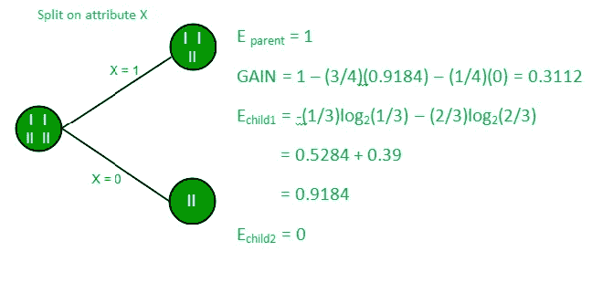

# 决策图表

> 原文：<https://medium.com/analytics-vidhya/decision-tree-fce5018f3278?source=collection_archive---------8----------------------->

在这篇博客中，我将写一个广泛使用的分类(机器学习)算法，即决策树。

在这里，我将解释*什么是决策树，决策树算法的类型，如何创建决策树，决策树的应用，优点/缺点*，最后，我将提供一个链接，链接到我简单介绍的 Jupyter 笔记本，从零开始实现*决策树算法*。

因此，没有任何进一步的到期让我们开始。


# **什么是决策树算法？**

*   决策树算法属于监督学习的范畴。它们可以用来解决回归和分类问题。
*   决策树使用树表示来解决每个叶节点对应一个类标签，属性在树的内部节点上表示的问题。
*   我们可以使用决策树来表示离散属性上的任何布尔函数。


**以下是我们在使用决策树时做出的一些假设:**

*   开始时，我们将整个训练集视为根。
*   特征值最好是分类的。如果这些值是连续的，则在构建模型之前会将其离散化。
*   基于属性值，记录被递归地分布。
*   我们使用统计方法将属性排序为根或内部节点。

# 决策树的类型

根据目标变量，决策树分为两种类型。

1.  **分类变量决策树:**这是算法有分类目标变量的地方。例如，假设要求您预测一台计算机的相对价格，分为三类:*低*、*中*或*高。*功能可能包括*显示器类型*、*扬声器质量*、 *RAM* 和 *SSD* 。决策树将从这些特征中学习，在通过每个节点传递每个数据点之后，它将在三个分类目标*低*、*中*或*高*之一的叶节点处结束。
2.  **连续变量决策树:**在这种情况下，输入到决策树的特征(如房屋质量)将用于预测连续输出(如房屋价格)。

# 关键术语

让我们看看决策树是什么样子的，以及当给定一个新的预测输入时，它们是如何工作的。

下图解释了决策树的基本结构。每棵树都有一个**根节点**，输入在这里传递。这个根节点被进一步划分成决策节点集，其中结果和观察是有条件的。将单个节点划分为多个节点的过程称为**分裂**。如果一个节点没有分裂成更多的节点，那么它被称为**叶节点**，或者**终端节点**。决策树的一个子部分称为**分支**或**子树**(例如在下图的方框中)。


还有一个概念与分裂完全相反。如果有可以消除的决策规则，我们就把它们从树上砍下来。这个过程被称为**修剪**，有助于最小化算法的复杂性。

# 如何创建决策树

在这一节中，我们将讨论描述如何创建决策树的核心算法。这些算法完全依赖于目标变量，然而，这些算法不同于用于分类和回归树的算法。

有几种技术可以用来决定如何分割给定的数据。决策树的主要目标是在节点之间进行最佳分割，从而以最佳方式将数据划分到正确的类别中。为此，我们需要使用正确的决策规则。规则直接影响算法的性能。

在我们开始之前，需要考虑一些假设:

*   开始时，整个数据被认为是根，此后，我们使用算法进行分裂或将根分成子树。
*   特征值被认为是分类的。如果这些值是连续的，则在构建模型之前会将它们分开。
*   记录是基于属性值递归分布的。
*   属性作为树的根或内部节点的排序是使用统计方法来完成的。

让我们从常用的拆分技术开始，从而构建决策树。

> ***1。信息增益***


当我们使用决策树中的节点将训练实例划分成更小的子集时，熵会发生变化。信息增益是这种熵变化的量度。
***定义*** :设 S 是一组实例，A 是一个属性，Sv 是 S 的子集且 A = v，Values (A)是 A 的所有可能值的集合，那么

**熵**
熵是随机变量不确定性的度量，它表征了任意样本集合的不纯度。熵越高，信息量越大。
***定义*** :设 S 是一组实例，A 是一个属性，Sv 是 S 的子集 A = v，Values (A)是 A 的所有可能值的集合，那么

示例:

```
For the set X = {a,a,a,b,b,b,b,b}
Total intances: 8
Instances of b: 5
Instances of a: 3= -[0.375 * (-1.415) + 0.625 * (-0.678)] 
              =-(-0.53-0.424) 
              = 0.954
```

**利用信息增益构建决策树**
**要领:**

*   从与根节点关联的所有训练实例开始
*   使用信息增益选择标记每个节点的属性
*   *注意:*根到叶的路径不应该包含两次相同的离散属性
*   递归地构造训练实例的子集上的每个子树，该训练实例将沿着树中的路径被分类。
*   如果所有正面或负面的训练实例都存在，则相应地将该节点标记为“是”或“否”
*   如果没有剩余的属性，用在该节点上剩余的训练实例的多数投票来标记
*   如果没有剩余的实例，用父实例的多数投票来标记

**举例:**
现在，让我们用信息增益为下面的数据画一个决策树。

**训练集:3 个特性和 2 个类**


这里，我们有 3 个特性和 2 个输出类。
利用信息增益建立决策树。我们将采用每个特征并计算每个特征的信息。



**在特征 X 上分割**


**特征 Y 上的分割**


**在特征 Z 上分割**

从上面的图像中我们可以看到，当我们对特征 Y 进行分割时，信息增益最大。因此，对于根节点，最适合的特征是特征 Y。现在我们可以看到，当按特征 Y 分割数据集时，子节点包含目标变量的纯子集。所以我们不需要进一步分割数据集。

上述数据集的最终树将如下所示:


***2。基尼指数***

*   基尼指数是一种衡量随机选择的元素被错误识别的频率的指标。
*   这意味着基尼系数越低的属性越好。
*   Sklearn 支持基尼指数的“基尼”标准，默认情况下，它采用“基尼”值。
*   计算基尼指数的公式如下。


**示例:**
让我们考虑下图中的数据集，用基尼指数画一个决策树。


GFG 全图

在上面的数据集中，有 5 个属性，其中属性 E 是包含 2 个(正和负)类的预测特征。我们两个班的比例相等。
在基尼指数中，我们要选择一些随机值来对每个属性进行分类。该数据集的这些值是:

```
A       B        C         D
  >= 5     >= 3.0      >= 4.2    >= 1.4
   < 5      < 3.0       < 4.2     < 1.4
```

**计算基尼指数为 Var A:**
**值> = 5: 12** 属性 A > = 5 &类=正:5/12
属性 A > = 5 &类=负:7/12
基尼(5，7) = 1 — [ (5/12) + (7/12) ] = 0.4860

**值< 5: 4** 属性 A < 5 & class =正:3/4
属性 A < 5 & class =负:1/4
Gini(3，1)= 1-[(3/4)+(1/4)]= 0.375

将每个基尼系数加权求和:
基尼系数(目标值，A)=(12/16)*(0.486)+(4/16)*(0.375)= 0.45825

**计算 Var B 的基尼指数:**
**值> = 3: 12** 属性 B > = 3 & class =正:8/12
属性 B > = 3 & class =负:4/12
基尼(5，7) = 1 — [ (8/12) + (4/12) ] = 0.4460

**值< 3: 4** 属性 B < 3 &类=正:0/4
属性 B < 3 &类=负:4/4
基尼(3，1)= 1-[(3/4)+(1/4)]= 0.375

通过对每个基尼指数加权求和:
基尼(目标，B)=(12/16)*(0.446)+(0/16)*(0)= 0.3345


# 决策树的应用

决策树是机器学习领域中最基本也是最广泛使用的算法之一。它在分类和回归建模的不同领域得到了应用。由于其描绘可视化输出的能力，人们可以很容易地从建模过程流中获得洞察力。这里有几个可以使用决策树的例子，

*   企业管理
*   客户关系管理
*   欺诈性声明检测
*   能耗
*   医疗保健管理
*   故障诊断

# 优点和缺点

决策树有一些优点和缺点。先说优点。与其他算法相比，决策树在处理数据时花费的时间非常少。可以跳过一些预处理步骤，如数据的标准化、转换和缩放。尽管数据集中存在缺失值，但模型的性能不会受到影响。决策树模型直观，易于向技术团队和利益相关者解释，并且可以跨多个组织实现。

缺点来了。在决策树中，数据的微小变化会导致决策树结构的巨大变化，从而导致不稳定。训练时间急剧增加，与数据集的大小成比例。在某些情况下，与其他传统算法相比，计算可能会变得复杂。

# **从头开始构建决策树模型**

**第一步:导入重要库并加载数据**


**第二步:计算每个属性的熵，选择具有最大*信息增益*的属性作为根节点**


**第三步:构建决策树**


**第四步:做预测**


> **完整的代码请访问下面的链接。那是我的笔记本。**

[](https://github.com/Shag10/Machine-Learning/blob/master/Internity_Internship/Day-9/Decision_Tree.ipynb) [## shag 10/机器学习

### 这个库包含机器学习算法的基础。基于监督学习的算法…

github.com](https://github.com/Shag10/Machine-Learning/blob/master/Internity_Internship/Day-9/Decision_Tree.ipynb) 

**我试图提供所有关于决策树及其实现入门的重要信息。希望你能在这里找到有用的东西。谢谢你一直读到最后。**

# **参考文献**

[](https://www.geeksforgeeks.org/decision-tree-introduction-example/) [## 决策树介绍及示例- GeeksforGeeks

### 决策树算法属于监督学习的范畴。它们可以用来解决回归和…

www.geeksforgeeks.org](https://www.geeksforgeeks.org/decision-tree-introduction-example/) [](https://blog.paperspace.com/decision-trees/) [## 决策树完全指南| Paperspace 博客

### 决策树是许多经典机器学习算法的基础，如随机森林、Bagging 和…

blog.paperspace.com](https://blog.paperspace.com/decision-trees/)