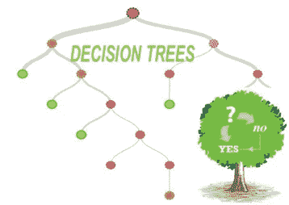
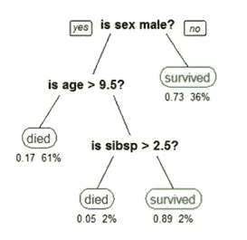
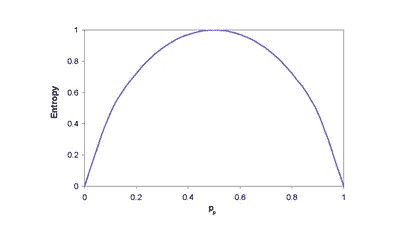

# 决策树-适合初学者

> 原文：<https://medium.com/analytics-vidhya/decision-tree-for-beginners-dd966beb0a8b?source=collection_archive---------12----------------------->

决策树是基于特定条件的决策的所有可能解决方案的图形表示。

决策树是通用的机器学习算法，可以执行分类和回归任务，甚至多输出任务。它们最广泛地用于监督学习。

它们是强大的算法，能够拟合复杂的数据集。

决策树基于 CART(分类和回归树)算法

**这是一个简单的决策树**

# **决策树术语**

在我们进入决策树如何工作之前，我们需要理解决策树的一些术语。

根节点:这是构建决策树的最顶层节点。它代表整个群体/样本，并进一步分为两个或多个节点(上图中紫色的根节点)。

父/子节点:根节点是父节点，从父/根节点分支的所有其他节点称为子节点。

分支/子树:通过拆分树/节点形成。

分裂:根据某种条件将根/子节点分成不同的部分

叶节点:无法进一步划分/分离的节点，例如上图中的橙色节点(最下面)。

修剪:除去树上不需要的树枝。

# **购物车算法**

CART(分类和回归树)算法由一系列问题构成，这些问题的答案决定了下一个问题(如果有的话)应该是什么。这些问题的结果是一个树状结构，其末端是叶子/终端节点，这里不再有问题。

**如何提问**

**决策树的构建依赖于以下几点。**

**熵**:这是数据中随机性的度量。

**公式:熵(s) = -P(是)log2P(是)-P(否)log2P(否)**

s 是总样本空间

P(是)是肯定的概率，P(否)是否定的概率

如果**是数=否数**，则 P(s) = 0.5，则熵(s) = 1

如果数据仅包含**是或不包含**，即 P(s) = 1 或 0，则熵(s) = 0

**信息增益:**信息增益测量熵的减少。这决定了在从根节点开始构建决策树的每一步中应该选择哪个属性进行拆分。

**公式:信息增益=熵(s) — [(加权平均值)*熵(每个特征)]**

其中**(加权平均值)*熵(每个特征)**为每个特征的**信息**。

树必须简单易懂，为此我们需要选择一个纯粹的分裂。一个常用的纯度衡量标准是信息。信息值告诉我们一个特性给了我们多少信息。具有最高信息增益的分割被选为第一分割，并且该过程继续。

**基尼不纯:**首先让我们了解什么是纯和不纯，纯是指所选样本的数据属于同一类。不纯意味着数据包含不同类别的混合。

基尼系数衡量的是不正确分类的可能性。如果数据集是纯的，那么不正确分类的可能性是 0，否则它将是高的。

# **如何构建决策树**

用因变量求出整个数据集的熵。

找出每个特征(自变量)的信息增益，选择信息增益最高的特征作为根节点。

形成树，并重复这些步骤，以获得整个决策树。

现在你已经建立了树，是时候在测试数据上测试它了，你发现树实际上过度拟合了数据，这是决策树的主要缺点之一。为了避免过度拟合，我们去除了利用低重要性特征的分支。这种方法被称为**剪枝**或**后剪枝**，这降低了树的复杂度，提高了测试精度。另一种方法叫做**提前停止**或**预修剪**在这里，我们试图在树生成叶子之前提前停止树构建过程。预修剪的一个问题是，如果我们停止得太早，我们可能会对数据进行欠填充。

# **决策树的优势**

容易理解

可以处理分类数据和数字数据

对异常值稳健

# **决策树的缺点**

倾向于过度拟合

需要小心调整参数

如果某些职业占优势，可能会创建有偏见的学习树

# **决策树上的面试问题**

什么是决策树，它是如何工作的？

离群值对决策树有什么影响？

决策树如何避免过拟合？

决策树如何处理单个数据集中的分类和数字特征？

用于构建决策树的库有哪些？