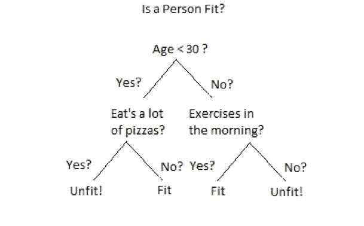
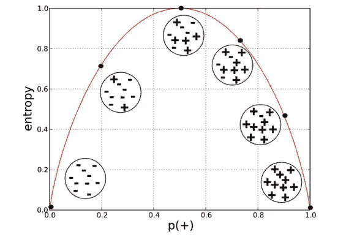
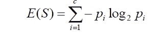
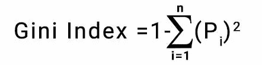
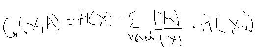
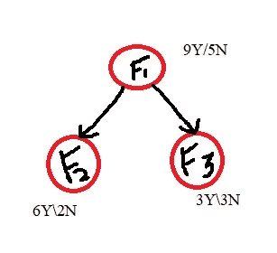

# 决策树——我的解读

> 原文：<https://medium.com/analytics-vidhya/decision-tree-my-interpretation-part-i-e730aed60cd3?source=collection_archive---------13----------------------->

在做决定的时候，我们倾向于假设很多“如果-但是”的情况，然后得出结论。机器学习中的决策树也以类似的概念工作。从视觉上看，它是一个类似流程图结构，由父节点、分支节点和叶节点组成。

图 1.0

参考上图**图 1.0** 、**年龄**为父节点、**吃披萨** & **练习**为分支节点、**适合** & **不适合**为叶节点。它告诉我们，如果你的年龄不到 30 岁，你吃比萨饼，你是不健康的。这样的 if 和 else 链形成了一棵决策树。

# ML 中的决策树

我们拥有的是历史数据，当我们对其应用决策树时，决策树将数据分成越来越小的块来创建树。决策树对数据应用一个函数来划分数据。根据函数，数据属于标签类的分离段或桶，例如:**是** & **否**。当数据被分成更小的块或桶时，目标列变得更加**同质**。直到树达到完美的同质桶，它继续进一步划分树。当我们划分树时，桶(分支)的数量增加。

> **同质桶**指由所有相同标签组成的桶

自变量和因变量之间的关系通过用于划分树的函数来表达**。这意味着**决策树**是**非参数算法**。这意味着模型**不返回模型参数**。因此，在每次迭代中，数据 s 被分成**两个子集**，这些子集被称为**分支**。**

当我们对训练数据应用决策树时，算法产生非常大和复杂的树，即它将具有许多分支、叶子、节点、桶，使得在最后一个桶中，你的目标列是完全同质的。但是，您可能在每个叶节点中只找到一条记录。这种树被称为过拟合树，因此我们需要正则化树。

> **规则化**是指在树被整枝时控制树的生长。

当决策树变得非常大时，它们会溢出。我们规范这样的树，也就是说，树不能充分发挥它的潜力，它会受到限制。因此，您最终可能会得到目标并不完全相同的叶节点。因此，我们计算桶中每个类的概率。测试记录属于桶中概率高的那一类。这个概率叫做**后验概率。**

**决策树**有一个问题，我们遗漏了一些数据点的组合，这些组合要么不是训练数据的一部分，要么被遗漏了。因此，决策树不会错过分类。

构建决策树的步骤:

*   在决策树中，原始数据集代表**根节点**。
*   根节点被分成两个桶，在对根节点应用一些函数之后，这些桶被称为**分支节点**。
*   除非正则化，否则当分支节点具有同类目标时，它们不会被进一步分裂。这些最后的节点被称为**叶节点**。

现在，问题出现了，如何决定决策树应该根据哪一列及其阈值将节点拆分到其分支，以及如何决定决策树应该将节点拆分到其分支的阈值？

*   决策树使用称为**损失函数的学习机制。**损失函数代表减少目标柱中杂质的一种方式。
*   为了计算任何特定节点中的杂质，我们使用:
    a)熵
    b)基尼
*   你的叶子越不均匀，就有越多的不确定性，即错误分类的高概率。

**a)熵:**

图 1.1

熵是概率和杂质之间的关系。X 轴表示概率，Y 轴表示杂质。你可以看到在概率= 0.5 时，你有最大的不确定性。

图 1.2

上图显示的是熵的公式。log2 pi 具有以下属性:

*   log2(pi=1) = 0
*   log2(pi=.5) = 1
*   log2(pi=0) =无穷大，

因此，当 pi=0 时，熵曲线将向无穷大移动，但熵的范围在 0–1 之间，因此我们将 pi 乘以 log2(pi ),这样曲线不是向无穷大移动，而是以 0 结束。

熵状态:

*   每当一个事件的概率，即 P(X=1)是 0.5，就有最大的不确定性。
*   当事件的概率为 0 或 1 时，不确定性为 0。

公式中出现负号的原因是 log2(pi)返回负数。

**与决策树相关的熵:**

*   决策树找到一个独立的属性&在该属性中，它还会找到一个阈值，这样当算法对给定的列应用函数时，在给定的阈值上，它会将数据分成两个节点。
*   当创建子分支时，子分支的总熵应该小于父节点的熵。下降越多，获得的信息越多。因此，为了分裂，选择给出最大熵降的柱。
    信息增益=前一节点熵-当前节点熵

**b)基尼**

*   选择熵和基尼两者中的任何一个，产出都不会有巨大的差异。

图 1.3

上图展示了基尼系数公式。

# **信息增益**

图 1.4

*   H(X):它是根节点和每个分裂节点的熵
*   |Xv|:分支节点中的样本数
*   |X|:样本总数
*   H(Xv):分支节点的熵
*   G(X，A):信息增益

图 1.5

h(F1)=-[(9/14)* log2(9/14)+(5/14)* log2(5/14)]= . 91

h(F2)=-[(6/8)* log2(6/8)+(2/8)* log2(2/8)]= . 81

h(F3)=-[(3/6)* log2(3/6)+(3/6)* log2(3/6)]= . 1

增益= . 91-[(8/14)* . 81]-[(6/14)* . 1]]=**. 0049**

> 节点中记录的数量决定了它们对整体数据的影响程度。

# **关键外卖:**

*   将熵设置为标准会因为日志操作而减慢计算
*   将拆分器设置为“随机”时，使用超级参数，如:max_features，random_state。这样就有机会使用不重要的列，这些列不会给出太多的信息。这导致更深和更不精确的树。但是它很快，不太容易因为随机性而过度拟合，并且在每次分割之前，您不需要计算最佳分割
*   当你有几个功能时，你可以用“最佳”作为拆分器
*   在 max_depth 设置为默认值的情况下，如果您为 min_samples_leaf 选择默认值，叶节点将只有一个标签
*   如果指定 min_samples_split，节点将扩展，直到所有叶子包含的样本数小于 max_depth 的最小数目。算法将选择提供最大深度的超参数。
*   您允许树增长得越深，模型就变得越复杂，因为您将有更多分裂，它将捕获更多关于训练数据信息。由于这种情况，会发生过度配合
*   如果模型过拟合，请减小 max_depth
*   让您的模型默认决定 max_depth，根据训练和验证集的分数增加或减少 max_depth
*   min_samples_split 的理想值:1 到 40。它控制过度拟合。较高的值会阻止模型学习关系。
*   如果类别不平衡，请定义 min_weight_fraction_leaf 超参数。给不平衡的类更高的权重。

# 注意事项

采油树的复杂性通过以下方式衡量:

*   节点数量
*   叶片数
*   深度
*   属性数量

停止标准:

*   最大深度
*   最小 _ 样本 _ 分割
*   最小样本叶

我建议你阅读关于修剪方法。

我希望这些内容能帮助你理清关于决策树的概念。如果对你有帮助，就善意的分享给同行，增长链条。