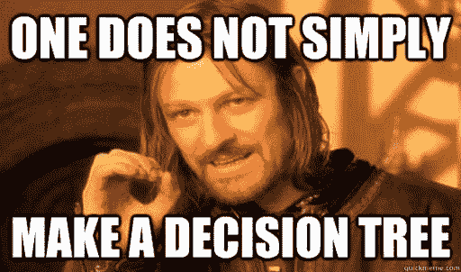
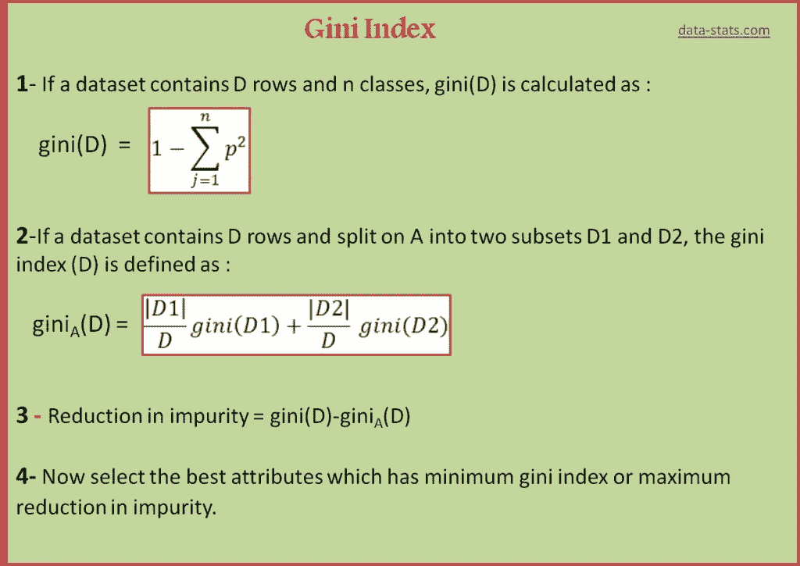
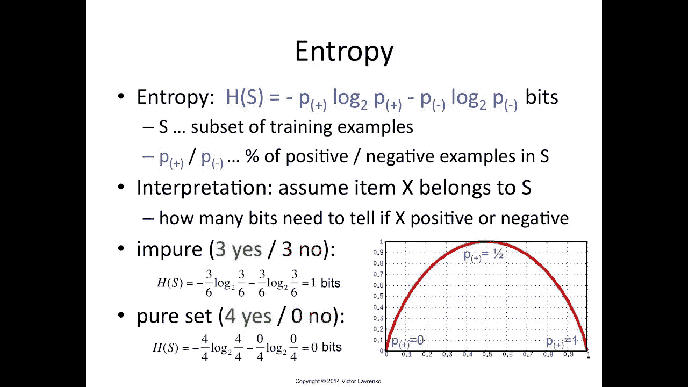
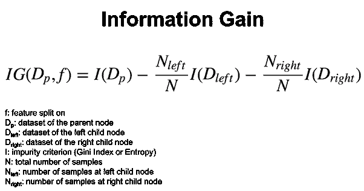
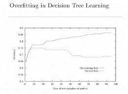
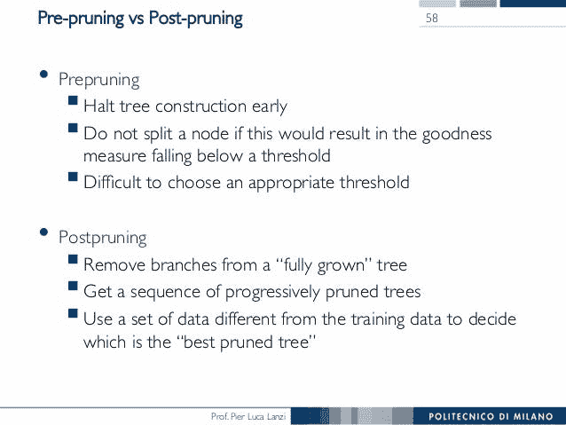
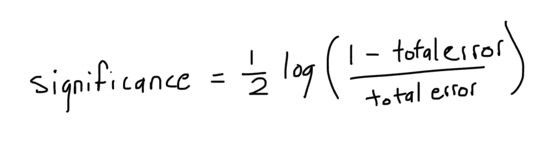

# 决策树和随机森林

> 原文：<https://medium.com/analytics-vidhya/decision-tree-random-forests-9c5d1225c435?source=collection_archive---------19----------------------->

从头开始完成实施



决策树是用于分类和回归的最强大和最流行的工具。它就像一个流程图，或者我们可以像一个树状模型，其中每个节点描述一个功能，而顶部节点被称为根节点。


关于决策树的关键点

*   简单的树状结构，模型可以在每一点上做出决策
*   易于解释，因为它显示了如何作出决定！
*   递归贪婪算法
*   定义明确的逻辑
*   模仿人类逻辑
*   特征最好是分类的

## 构建决策树可能涉及两个标准中的任何一个:

1.  基尼指数(CART——分类和回归树)
2.  熵(ID3 —迭代二色性 3)

> 决策树中最关键的一点是如何决定在每一点选择哪个特征！因此，上面指定的这些标准有助于我们做到这一点。

## 基尼指数

基尼系数通过分裂产生的群体中反应类别的混合程度，给出了分裂有多好的概念。下面的公式给出了基尼系数的值。



源数据-统计

## 熵

熵是系统中随机性的一种度量。



> 我们使用熵来计算**信息增益**，熵将被最大化以获得节点的正确特征。



> 我们将为上述任何标准赋予所有特征，然后对于具有最大信息增益的特征，我们将基于阈值或平均值分割数据。

# 让我们来看看熵的代码:

```
def entropy(col):

    counts = np.unique(col,return_counts=True)
    N = float(col.shape[0])
    entropy = 0.0

    for i in counts[1]:
        p = i/N
        entropy += (-1.0 * p * np.log2(p))

    return entropy
```

*   我们将计算唯一条目的数量和条目总数。
*   然后应用熵的公式。

## 分割数据

我们知道，将数据分为左右两个子树，因此大于阈值的值位于右侧，小于阈值的值位于左侧。

> fkey →功能名称
> 
> fval →阈值

```
def divide_data(x_data,fkey,fval):
    # work with Pandas dataframe
    # creating 2 empty dataframe
    x_right = pd.DataFrame([],columns=x_data.columns)
    x_left = pd.DataFrame([],columns=x_data.columns)

    for i in range(x_data.shape[0]):
        val = x_data[fkey].loc[i]
        if val > fval:
            x_right = x_right.append(x_data.loc[i])
        else:
            x_left = x_left.append(x_data.loc[i])

    return x_left,x_right
```

# 信息增益

```
def information_gain(x_data,fkey,fval):
    # Split data 
    left,right = divide_data(x_data,fkey,fval)
    # we will compute reduction in entropy after this entropy
    # % fo people on left and right
    l = float(left.shape[0])/x_data.shape[0]
    r = float(right.shape[0])/x_data.shape[0]

    # All examples can come to one side
    if left.shape[0] == 0 or right.shape[0] == 0:
        return -1000000 # Min information Gain

    i_gain = entropy(x_data.Survived) - (l*entropy(left.Survived) + r*entropy(right.Survived))
    return i_gain
```

*   我们将数据分成左右两组，然后计算熵。
*   应用信息公式。

> 现在我们都准备好跳到决策树的代码了！！

```
class DecisionTree:

    # Constructor
    def __init__(self,depth=0,max_depth=5):
        self.left = None
        self.right = None
        self.fkey = None
        self.fval = None
        self.max_depth = max_depth
        self.depth = depth
        self.target = None

    def train(self,X_train):

        features = ["Pclass","Sex","Age","SibSp","Parch","Fare"]
        info_gain = []

        for i in features:
            i_gain = information_gain(X_train,i,X_train[i].mean())
            info_gain.append(i_gain)

        self.fkey = features[np.argmax(info_gain)]
        self.fval = X_train[self.fkey].mean()
        print("Making tree Feature is",self.fkey)
        # Split Data
        data_left,data_right = divide_data(X_train,self.fkey,self.fval)
        data_left = data_left.reset_index(drop=True)
        data_right = data_right.reset_index(drop=True)

        # we have reached leaf node
        if data_left.shape[0] == 0 or data_right.shape[0] ==0 :
            if X_train.Survived.mean() >=0.5:
                self.target = "Survived"
            else:
                self.target = "Dead"
            return

        # Stop early when depth >=maxDepth
        if self.depth >= self.max_depth:
            if X_train.Survived.mean() >=0.5:
                self.target = "Survived"
            else:
                self.target = "Dead"
            return
        # Recursive Case
        self.left = DecisionTree(depth=self.depth+1,max_depth=self.max_depth)
        self.left.train(data_left)

        self.right = DecisionTree(depth=self.depth+1,max_depth=self.max_depth)
        self.right.train(data_right)

        # Setting Target at every node
        if X_train.Survived.mean() >=0.5:
            self.target = "Survived"
        else:
            self.target = "Dead"
        return

    def predict(self,test):
        if test[self.fkey]>self.fval:
            # right
            if self.right is None:
                return self.target
            return self.right.predict(test)
        else:
            if self.left is None:
                return self.target
            return self.left.predict(test)
```

我们在决策树中面临过拟合的问题，这意味着在训练和测试数据集中，直到某一点，精度都增加了，但是在某一点之后，测试部分的精度开始下降。这意味着我们的代码不是通用的。



为了克服这一点，我们可以使用两种方法

*   后期修剪→在这种情况下，我们让树充分成长，然后删除无用的节点
*   预修剪→我们可以设置树的最大高度，防止树在超过一定限制后生长。

我们在代码中使用了预修剪。



除此之外，决策树也有很高的方差。即使我们在数据集中做了一个小的改变，结果也会有很大的变化。

为了克服这一点，我们提出了集合的概念。集成方法，它将几个决策树结合起来，以产生比使用单个决策树更好的预测性能。

> 集成模型背后的主要原理是一组弱学习者聚集在一起形成一个强学习者。

1.  **Bagging** (Bootsrap 聚合)这里我们的主要目标是最小化树的方差。使用来自不同树的所有预测的平均值，这比单个决策树更健壮。

***随机森林*** 是套袋的延伸。这需要一个额外的步骤，除了获取数据的随机子集，还需要随机选择特征，而不是使用所有特征来生成树。当你有很多随机的树时。叫做随机森林。

2.Boosting 是另一种创建预测器集合的集成技术。在这种技术中，学习者是顺序学习的，早期的学习者将简单的模型与数据拟合，然后分析数据的错误。换句话说，我们拟合连续的树(随机样本),并且在每一步，目标都是解决来自先前树的净误差。

例如 adaboost、梯度增强器。在 adaboost 中，我们需要记录权重。最初，所有人都被赋予相同的权重并创建决策树，但高度=1。这些被称为*树桩*。对于每一个特征，我们都创建 stump。

1.  我们将选择具有最小熵或 ginni 系数的树桩。
2.  我们计算总误差。
3.  计算树桩的性能



4.我们将通过*新样本权重=树桩的权重 x ^性能*来增加错误预测类别的权重

5.我们将通过*新样本权重=树桩的权重 X e^-性能*来更新正确预测类别的权重

6.现在，我们除以新权重的总和，得到归一化的权重。

7.在此之后，我们创建一个新的决策树，循环重复。

最后我们以多数票决定。