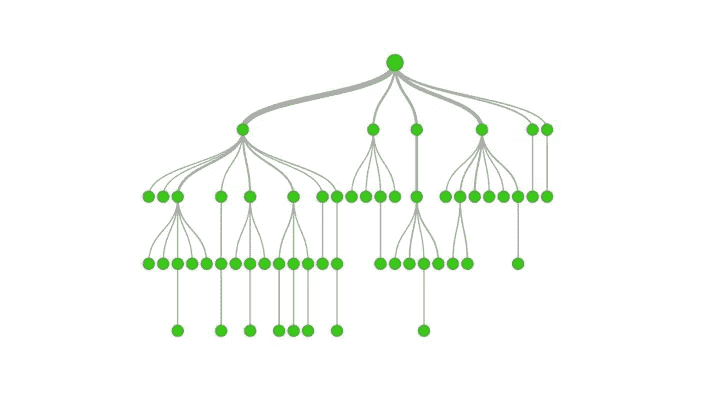
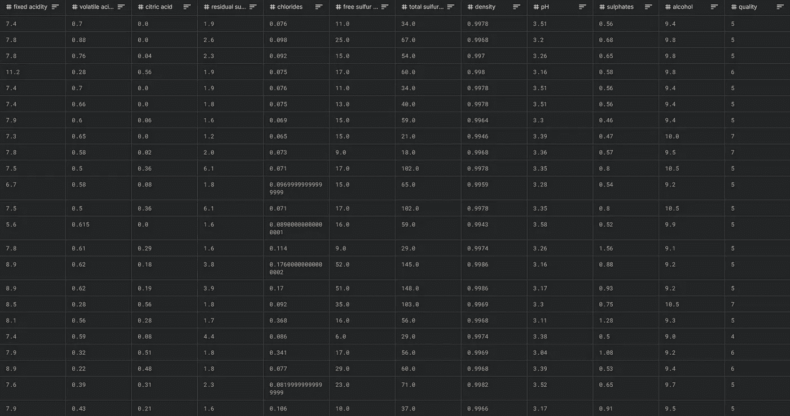

# 决策图表🌳使用 Python(用于回归)

> 原文：<https://medium.com/analytics-vidhya/decision-tree-using-python-for-regression-ecf0ccd8884e?source=collection_archive---------7----------------------->

决策树是实践中最常用的算法，背后的原因是它可以用于回归和分类。



决策树是一种决策支持工具，它使用决策及其可能结果(包括偶然事件结果、资源成本和效用)的树状模型。这是显示只包含条件控制语句的算法的一种方式。

最后我会提供一个我的 Kaggle 笔记本的链接。

**现在让我们编码吧！！！**

## 1.数据集:

该数据集与葡萄牙“Vinho Verde”葡萄酒的红色和白色变种相关。它有十二列。所有数值均基于物理化学测试。

链接:[https://www . ka ggle . com/UC IML/red-wine-quality-cortez-et-al-2009](https://www.kaggle.com/uciml/red-wine-quality-cortez-et-al-2009)



红葡萄酒和白葡萄酒质量数据集

## 2.图书馆:

我们将使用 Pandas、Numpy 和 Scikit-learn 库。我们将从 Scikit-learn 导入 **DecisionTreeRegressor** 类来训练我们的数据集。

```
# importing the libraries
import pandas as pd
import numpy as np# Reading the dataset using pandas librarie
dataset = pd.read_csv('name_of_dataset.csv')
```

## 3.探索性数据分析(EDA):

现在，我们将研究我们的数据集，检查它是否有任何缺失值，我们有什么类型的数据？对分类数据进行编码等。

*   **数据集的形状和类型:**

```
# shape of the dataset
print(dataset.shape)
# Type of the dataset
print(dataset.dtypes)
```

*   **检查空值:**

```
# checking for the null value
print(dataset.isna().sum())
# Counting the number of null values
print(dataset.isna().sum().sum())
```

*   **对分类数据进行编码:**

通过使用 dtypes 函数，我们知道我们的数据集只包含浮点和整数值，所以我们不必对上述数据集使用编码。

```
# encoding the categorical data
dataset = pd.get_dummies(dataset)
```

## 4.因变量和自变量(矩阵):

为了训练我们的数据集，我们需要指定因变量和自变量。因变量将包含我们的输出列，反之亦然。

```
# independent variables
X = dataset.iloc[:, :-1].values
# dependent variable
y = dataset.iloc[:, -1:].values
```

## 5.拆分数据集:

我们将把数据集分成训练集和测试集。训练集将拥有大部分数据，因为我们将在该数据集上训练我们的模型，而测试集将拥有少量数据，因此我们只能将其用于测试目的。

```
# spliting the dataset
from sklearn.model_selection import train_test_split
X_train, X_test, y_train, y_test  = train_test_split(X, y,                    test_size=0.2, random_state = 0)
```

## 6.特征缩放:

使用特征缩放，我们将归一化自变量的范围。

```
# using feature scaling
from sklearn.preprocessing import StandardScaler
X_sc = StandardScaler()
X_train = X_sc.fit_transform(X_train)
```

## 7.训练数据集:

是时候训练我们的数据集了，我们将使用来自树模块的 DecisionTreeRegressor 类。

```
# training the dataset
from sklearn.tree import DecisionTreeRegressor
regrassor = DecisionTreeRegressor(random_state = 0)
regrassor.fit(X_train, y_train)
```

## 8.预测结果:

训练模型后，我们将使用测试数据预测结果

```
# predictzing the result
pred = regrassor.predict(X_sc.transform(X_test))
```

## 9.精确度:

现在，我们来看看我们的算法有多精确？

```
# Accuracy of the algorithm
from sklearn.metrics import accuracy_score
print(accuracy_score(y_test, pred))
```

Kaggle 笔记本链接:

[](https://www.kaggle.com/rahulkadam0909/decision-tree) [## 决策图表

### 使用 Kaggle 笔记本探索和运行机器学习代码|使用红酒质量数据

www.kaggle.com](https://www.kaggle.com/rahulkadam0909/decision-tree) 

> 编码快乐！！！