# 分类决策树(ID3)|机器学习

> 原文：<https://medium.com/analytics-vidhya/decision-trees-for-classification-id3-machine-learning-6844f026bf1a?source=collection_archive---------1----------------------->

## 决策树和如何构建决策树概述

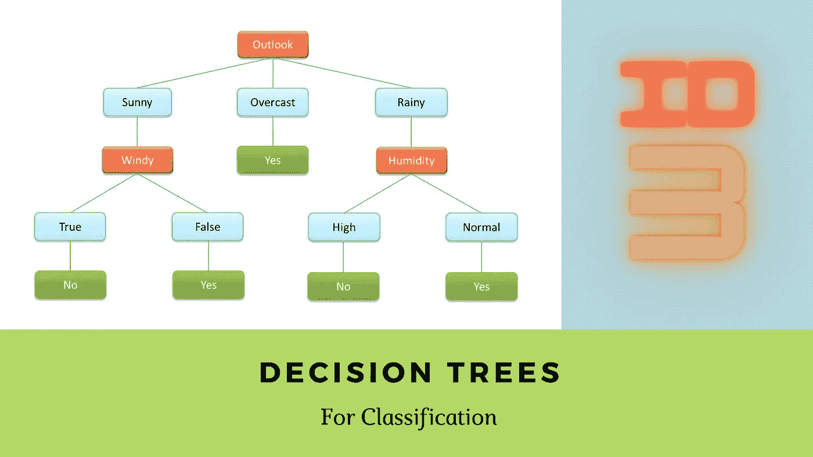

决策树是一种机器学习算法，可用于分类和回归(在这种情况下，它将被称为回归树)。这个博客集中在分类决策树上。

# 什么是决策树？

决策树类似于计算机科学树，具有层次结构。它有节点，这些节点由边连接。决策树通过在每个节点提问来对数据进行分类。(*在典型情况下，如果答案是肯定的，就去找合适的孩子。如果没有，就去左边的孩子*。

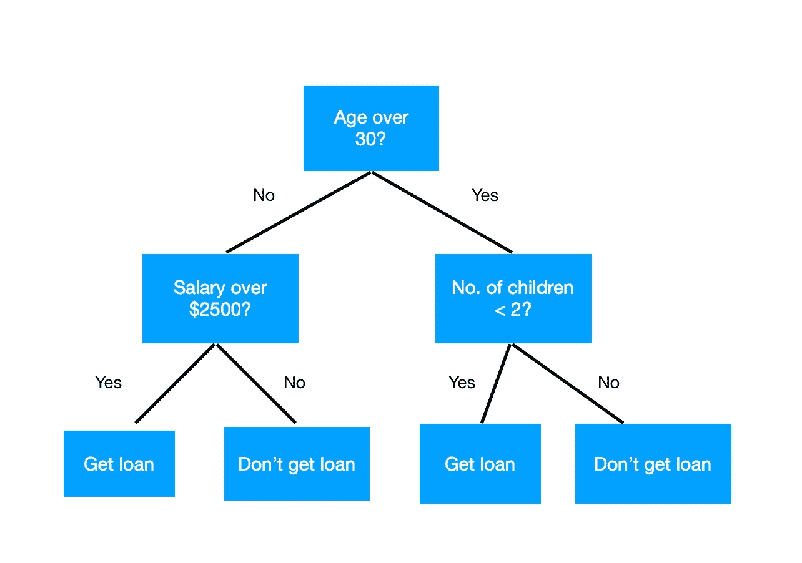

图 1.1:一个示例决策树

图 1.1 显示了一个简单的决策树，用于对客户是否获得贷款进行分类。输入特征是人的工资、孩子的数量和人的年龄。决策树使用这些属性或特征，并在正确的步骤或节点提出正确的问题，以便分类是否可以向该人提供贷款。

## 术语

在进一步深入之前，有一些重要的术语需要理解。这些术语参照图 1.1 进行说明。

**节点**:上面显示的蓝色矩形就是我们所说的树的节点。在决策树中，在每个节点上提出一个问题，根据答案，给出某个选定的结果。

**根节点或根**:在决策树中，最顶层的节点称为**根节点。**在上面的树中，询问“年龄 30 岁以上？”是根节点。

**叶节点**:没有任何子节点的节点称为叶节点。(*获得贷款，不获得贷款*)。叶节点保存输出标签。

上面决策树的高度是 3，在最顶层，我们有根节点，在最底层，我们有叶节点。尽管在图 1.1 中所有的叶节点都在同一层，但情况可能并不总是这样。在上面的决策树中，每个节点有两个子节点。这很常见，但并不总是如此。如果为一个节点选择了具有多于 2 个结果的特定分类特征来分割实例，则该节点的子节点的数量也可以多于 2 个。

# 熵和信息增益

在进入如何构建决策树之前，我们需要了解什么是**熵**和**信息增益。**

## 熵

它是节点杂质的量度。通过杂质，我们的意思是测量一个特定节点的异质性。
**例如:**
假设我们一组有 50 个红球和 50 个蓝球。在这种情况下，两种颜色的球的比例相等。因此，熵将是 1。也就是说这个布景不纯。
但是，如果该组有 98 个红球和 2 个蓝球，而不是 50–50 的比例*(同样的逻辑可以适用于一组 98 个蓝球和 2 个红球|哪一类并不重要。重要的是一个类别远远超过另一个类别)*，那么熵将会很低*(接近 0 的某个地方)。*这是因为现在该套球基本上是纯净的，因为它主要包含属于一个类别的球。正因为如此，异质性降低了。

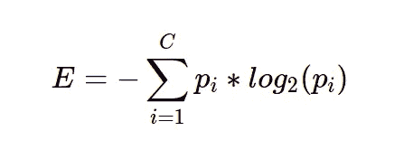

图 2.1:熵公式

图 2.1 是一个表示熵的好函数。 **C** 是班级人数。 **Pi** 是该集合中第 **i** 类的比例。已经表明，这个函数足以很好地代表异质性。

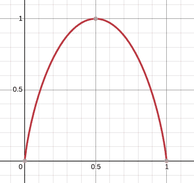

图 2.2:两类的熵图。

让我们以两个类为例。图 2.2 表示了随着属于特定类别的实例数量的比例变化，熵的变化

***注:*** *在一个 2 类问题中，一类的比例永远会是 1 —(另一类的比例)。所以，一类的比例足以画出这个熵图。*

假设图 2.2 的 x 轴代表集合中**A 类**的比例。由于更接近于 0，我们确定另一个类(**B 类**)在集合中占优。因此，同质性得以保持，集合更接近纯净，因此熵较低。(*当 A 类的比例更接近 1* 时也是如此)。但是当两个类在给定的集合中几乎具有相等比例的实例时，杂质就高，并且是高度异质的。因此，熵很高。因为该函数满足所有情况，所以它可以用作给定集合的杂质的良好度量。

## 信息增益

并不是决策树在每个节点随机提问才能得出结论。我们在正确的时间问正确的问题，以确保熵在特定的水平上尽可能地减少。这样做是为了尽可能快地在所有叶节点上获得同质性，并且得到同样简单的最佳分类树。

简单地说，我们的目标是使用熵来得出一个小而简单的树，并具有良好的分类精度。这是通过在下一步减少总熵来实现的。为了减少熵，我们需要理解在特定的节点上，哪一个属性是提问的最佳属性。这是通过一种叫做信息增益的方法来实现的。

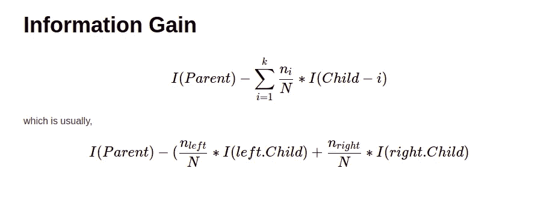

图 2.3:信息增益公式

在一个特定的节点，计算数据集中所有特征的信息增益，以检查哪个特征在下一级减少的熵更多。这是通过将父项的熵减去下一个直接子项的熵的加权和来实现的，如果选择了某个特定的特征，我们就会得到该子项。在特定节点获得最高信息增益的特征或属性或问题被选择作为在当前节点拆分数据的问题。
分配给每个子节点熵的权重基于该子节点中实例的比例。因此，不需要太多的努力，我们就可以看到这个公式做了它应该做的事情。

# 构建决策树以便更好地理解

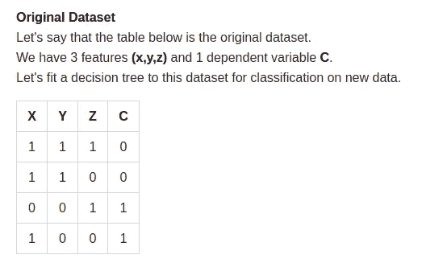

图 3.1:数据集

现在数据集已经准备好了，让我们来构建树。作为第一步，我们需要选择根节点。因此，需要计算 X、Y 和 Z 的信息增益。

## 在 X 轴上分割

当我们用 X 作为根节点时，这就是我们得到的。

图 3.2:在 X 轴上分割

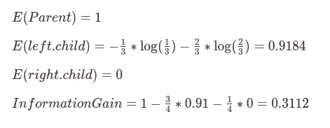

## 在 Y 轴上拆分

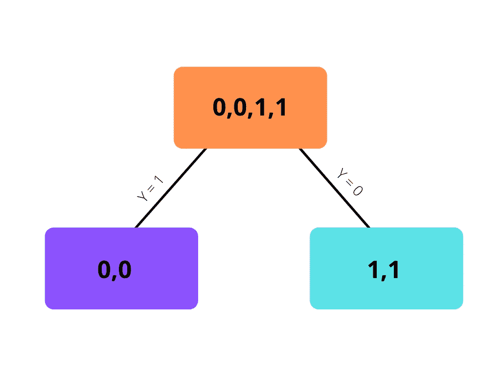

图 3.3:在 Y 轴上分割

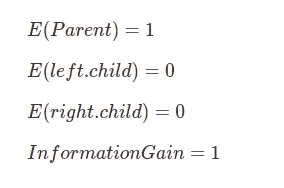

## 在 Z 轴上分割

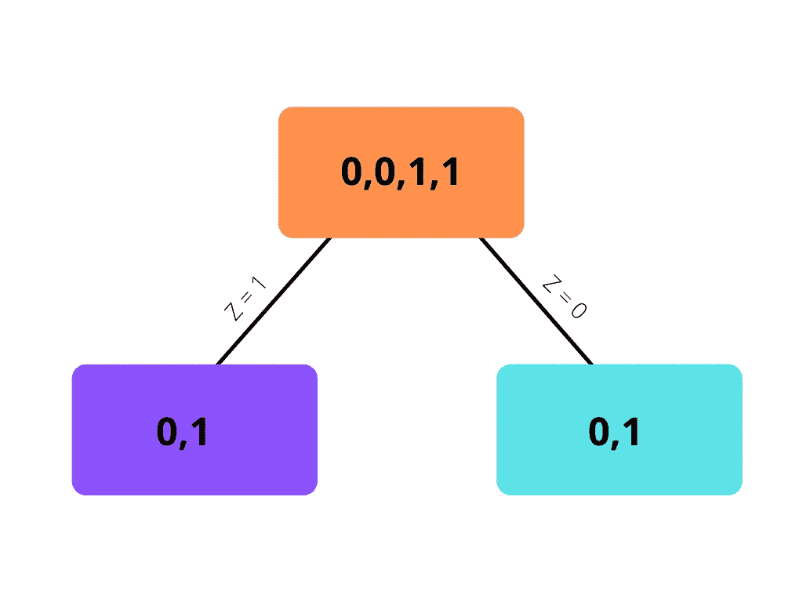

图 3.4:在 Z 轴上分割

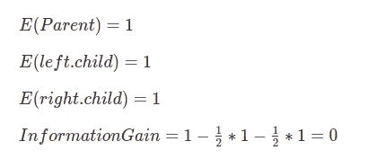

从上面的 3 次分割中，我们可以看到，当我们使用特征 **Y.** 分割数据集时，信息增益最大。因此，我们可以在根节点使用 Y。但是，当我们在根节点使用 Y 时，我们也可以看到两个叶节点都变成了纯叶节点*(只包含一个类的对象。*非 0 即 1。因此，我们可以在这个阶段停止构建树。其他特征已经变得多余，因为 **Y** 本身能够完美地对所有数据进行分类。

因此，生成的决策树如图 3.3 所示。在给出新数据时，该树将检查该数据的属性 **Y** 是 0 还是 1，并将根据它对新数据进行分类。

如果 Y 不能完美地对数据进行分类，并且其中一个叶节点不纯，我们可以继续使用该节点上的其他两个特征来进一步构建决策树，直到我们获得纯叶节点。

# 连续变量

到目前为止，我们已经看到了决策树如何在分类特征上使用熵和信息增益来选择最佳分割。但是，这如何对连续变量起作用呢？

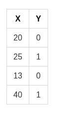

图 4.1:样本数据集

让我们考虑图 4.1 中的数据集，其中 X 是连续变量，Y 是因变量。在这里，决策树选择某些点在其节点上提问。

在选择点之前，算法将按 x 对数据集进行排序。
上例中的点将是:(13+20)/2，(20+25)/2，(25+40)/2。
= > 16.5，22.5，32.5。

在根节点中，我们评估应该使用哪个点来分割数据集，类似于我们如何使用分类特征来分割。
例如，数据是否应该在 ***(x≤16.5)*** 或 ***(x≤22.5)*** 或 ***(x≤32.5)*** 或 ***(x > 32.5)*** 上拆分，根据哪个拆分提供最高的信息增益来选择。在本例中，不难看出将选择 **x≤22.5** ，因为它最好地分割了因变量

当我们基于所有这些间隔分割数据并计算所有数据的信息增益时，当数据集很大时，这个过程在计算上变得昂贵。

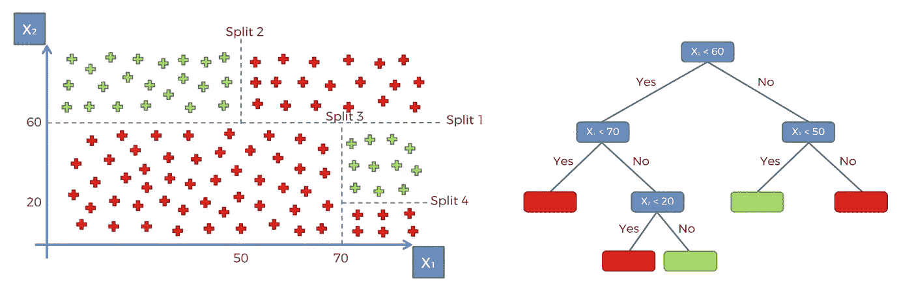

图 5.1:决策树示例

在上面所有的例子中，我使用了定制的数据集(来自多个来源的*),这样就可以做出简短的决策树。这是为了计算的目的。这是一个决策树的例子，它的分类显示在二维空间中。*

# *何时停止构建树*

*   *当所有叶节点都是纯的时(*叶节点具有属于一个类别*的数据)*
*   *当满足特定标准时(*例如树的高度超过特定限制，在这种情况下，叶节点可能不是纯的，而是可能输出类的概率而不是类本身**
*   *当所有功能都被使用时。*

# *结论*

*在这篇博客中，我们看到了什么是决策树和其他一些基本术语，以及如何建立一个，给定数据集和何时停止建立树。尽管决策树很强大，但它们容易过度拟合，讨论哪一个是单独的主题。
决策树是一种强大的算法，可用于分类，可用于非线性关系的数据。这也是一种算法，从中获得推理和变量之间的关系比其他一些算法更简单。决策树也有点像自动特征选择(假设满足一些其他条件),因为它使用信息增益。总的来说，这是一个很棒的算法。*