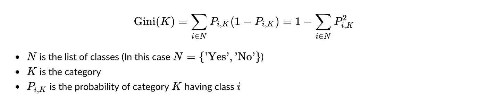

# 傻瓜决策树

> 原文：<https://medium.com/analytics-vidhya/decision-trees-for-dummies-a8e3c00c5e2e?source=collection_archive---------4----------------------->

当涉及到数据挖掘、决策分析和人工智能时，决策树是最流行的算法之一。这篇文章将温和地向你介绍决策树以及它们如此受欢迎的原因。

一个 ***决策树*** 是一个树状图形，节点代表我们挑选一个属性并提出一个问题的地方，边代表所提问题的答案，叶子代表实际输出或类标签。它们用于具有简单线性决策面的非线性决策— *来源:* [***黑客地球***](https://www.hackerearth.com/practice/machine-learning/machine-learning-algorithms/ml-decision-tree/tutorial/)

图片来源:谷歌图片

# 通俗地说就是决策树

> 让我们从一个实际的例子开始:

想象你正在计划下周的活动。你要做的事情很大程度上取决于你的朋友是否有时间，以及外面的天气如何。

*你拿出下面的图表:*

图片来源:谷歌图片

这张图表列出了 ***简单的决策规则*** ，帮助你根据其他一些数据来决定下周要做什么。在这种情况下，这是你的朋友的可用性和天气条件。

> 决策树也是如此。它们以树结构的形式建立了一组决策规则，帮助您从输入数据中预测结果。

# 决策树的应用

## 业务用例

决策树*模仿人类决策*，因此可以用于各种商业环境。

公司经常用它们来预测未来的结果。例如:

1.  哪个客户会保持忠诚，哪个会流失？【分类决策树】(T25)
2.  考虑到客户的产品选择，我们可以向他们追加销售多少？【回归决策树】(T27)
3.  接下来我应该向我的博客读者推荐哪篇文章？【分类决策树】(T29)

## 直观优势

决策树成为现实应用中的*机器学习算法*之一有多种原因:

1.  ***直观***
2.  ***信息性***
3.  ***缩放***

# 决策树的机器学习方法

> 决策树属于一类**监督机器学习**算法，用于**分类** **(预测离散结果)**和**回归(预测连续数值结果)**预测建模。

该算法的目标是从一组输入变量及其属性中预测一个目标变量。该方法通过一系列的二叉分裂**【是/否】*从根节点经由经过几个决策节点(内部节点)的分支，直到我们到达叶节点，来构建树结构。*

> *正是在这里做出了预测。*

*每个分割将输入变量分割成特征区域，用于较低的分割。*我们可以把整个树结构想象成这样:**

**

*图片来源:谷歌图片*

## *决策树算法*

**没有单一的决策树算法。相反，已经提出了多种算法来构建决策树:**

1.  ****ID3:*** *迭代二分法 3**
2.  ****c 4.5:****ID3*的继任者*
3.  ****购物车:*** *分类回归树**
4.  ***CHAID:***卡方自动交互检测**
5.  ****火星:*** *多元自适应回归样条**

*每一种新算法都是对以前算法的改进，目的是开发出能够在更嘈杂或更杂乱的数据中获得更高精度的方法。*

## *履行*

**一般来说，我们可以将决策树算法分解成一系列不同实现中常见的步骤:**

*   ****属性选择:****

1.  *从整个数据集开始，查看每个要素或属性。*
2.  *查看该属性的所有可能值，并选择一个最适合将数据集划分为不同区域的值。*
3.  *“最佳分割”的构成在很大程度上取决于我们构建的是回归树算法还是分类树算法。*

*   **下面我们将详述寻找* ***最佳分割*** *的不同方法:**

1.  *在树的根节点拆分数据集，并移动到每个分支中的子节点。*
2.  *对于每个决策节点，重复属性选择和值以进行最佳分割确定。*
3.  ****这是一个贪婪算法:*** 它只看最好的局部分裂*(非全局最优)*给定其所在区域的属性以提高建树效率。*
4.  **继续迭代直到:**

***a)** *我们已经生长了末端或叶节点，因此它们到达每个单独的样本(没有停止标准)。**

*我们达到了一些停止标准。*

> *例如，我们可能已经设置了一个最大深度，它只允许从根节点到终端节点的一定数量的分割。或者，我们可以在每个终端节点中设置最小数量的样本，以防止终端节点分裂超过某个点。*

## *决策树分类器的度量*

**在分类问题中，确定分裂点最常用的两个度量是* ***基尼杂质*** *和* ***信息增益*** *:**

*   ****基尼杂质:*** 顾名思义，这个衡量我们的劈叉有多‘纯’。如果分裂导致一个类别比另一个类别更占优势，例如 80%的 A 类和 20%的 B 类，这意味着分裂是 80%纯的。该算法迭代地试图找到类似这些独立值的百分比，从而产生同质类。*

**

*图片来源:走向数据科学*

*   ****信息增益:*** 信息增益衡量分裂后我们是否降低了系统的熵。另一方面，熵被定义为我们的系统有多混乱。这听起来可能很抽象，但这个概念相当直观。如果我们的决策树在没有任何结构的情况下随机分裂，我们最终会分裂出混合类(例如，50%的 A 类和 50%的 B 类)。混乱。但是，如果这种分离导致将类分类到它们自己的分支中，我们就剩下一个更加结构化、更加有序的系统了。*

**

*图像来源:堆栈溢出*

> *这与基尼不纯逻辑非常相似，但信息增益并不根据我们在分割后是否获得纯(结构化、较少混乱、较少熵)分割来选择分割，而是根据我们在分割后对熵的改善程度来选择分割。*

*当算法遍历一个属性的所有可能值时，它要么计算该点的 ***基尼杂质*** ，要么计算 ***信息增益*** 。最佳地最小化成本函数的属性的值被用作分割。*

## *决策树回归器的度量*

*在 CART 算法中引入，决策树回归器使用 ***方差减少*** 作为最佳分割的度量。方差减少表明我们的节点是如何同质的。如果一个节点非常同质，它的方差(及其子节点的方差)将不会很大。*

**方差公式为:**

**

*该算法遍历独立变量的不同值，然后挑选在分割后产生最大方差减少*的变量及其值。**

## *优势*

*决策树有几个好处*

1.  ****可译****
2.  ****几乎没有数据准备****
3.  ****秤井****
4.  ****处理数值和分类数据****
5.  ****对假设违反的鲁棒性****

## *不足之处*

*像大多数事情一样，机器学习方法也有一些缺点:*

1.  ****过拟合****
2.  ****对输入数据的非鲁棒性改变****
3.  ****偏向统治阶级****

## *改进模型*

**有几种改进决策树的方法，每一种都通过* ***调整超参数:*** 来解决这种机器学习算法的特定缺点*

*   **叶裂的最小样本数**
*   **最大深度**
*   **修剪**
*   **合奏方法:随机森林**
*   **特征选择或降维**
*   **助推树木**

****要从头实现，请访问我的 GitHub 库—****

* [## tanvipenumudy/Winter-实习-实习

### 存储库跟踪每天分配的工作-tanvipenumudy/Winter-实习-实习

github.com](https://github.com/tanvipenumudy/Winter-Internship-Internity/blob/main/Day%209%20-%20Decision%20Tree%20%26%20Random%20Forest/Day-9%20Notebook-1%20%28Decision%20Tree%29.ipynb)*