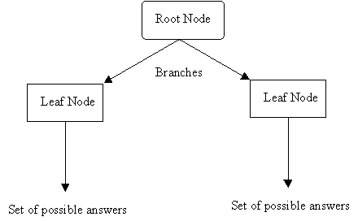
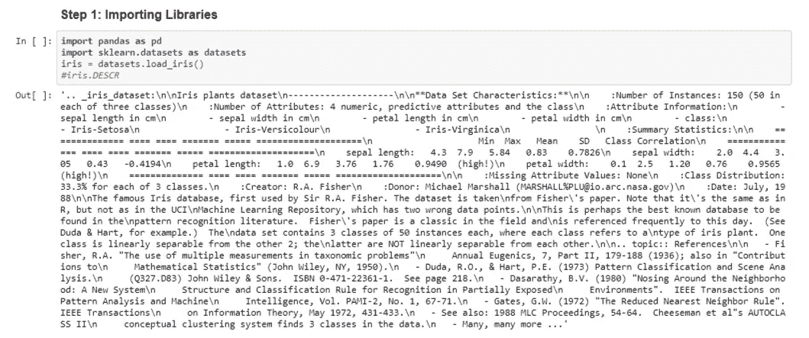
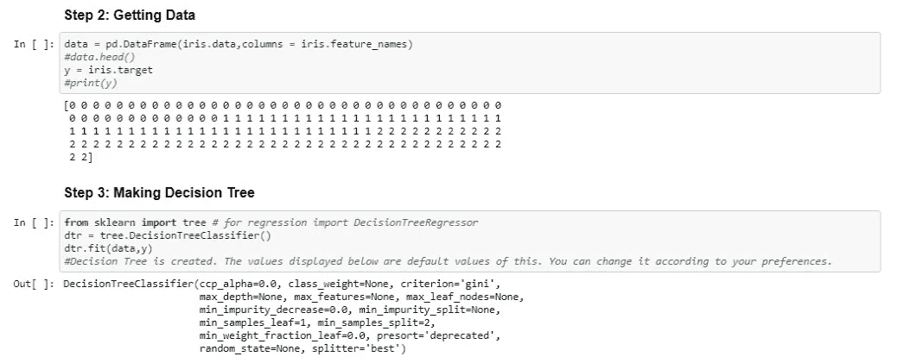
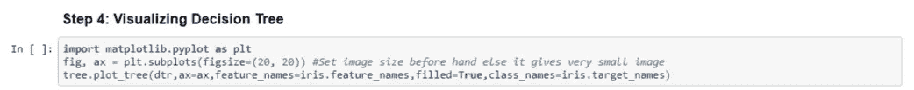
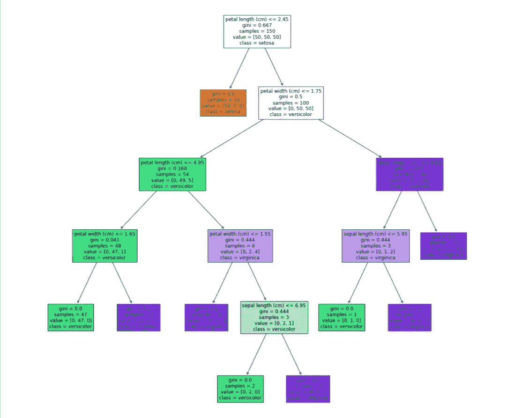
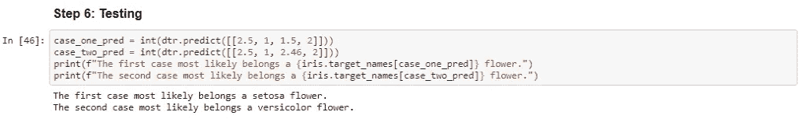

# 使用 Sklearn 的决策树

> 原文：<https://medium.com/analytics-vidhya/decision-trees-using-sklearn-baabb510c54a?source=collection_archive---------21----------------------->

> “正如 100 年前电力几乎改变了一切一样，今天我实际上很难想到一个我认为人工智能在未来几年内不会改变的行业。”—吴恩达

有了决策树，人工智能可以在没有任何人为干预的情况下做出深思熟虑的决定。决策树是一种监督学习算法，用于解决回归和分类问题。这是一种预测性的建模方法，它给出了决策以及由该决策产生的每一种可能结果的图形表示。

下图解释了决策树的典型结构:

决策树的主要挑战在于每一层根节点的属性选择。这是通过以下两个指标实现的:

1.  **熵(信息增益)**:熵是数据点随机性的度量。信息增益是熵的变化。因此，更低的熵意味着更大的变化，从而获得更多的信息。它最适合于计数较少但有许多不同值的分区。
2.  **基尼指数**:衡量随机选择的元素被错误识别的频率。基尼系数较低的属性是最好的。此外，它最适合较大的分区。

现在，我将借助 IRIS 数据集来解释决策树分类器

第一步

开始之前，一定要了解数据集(我用过 iris。请对此进行描述)。它有助于理解所有数据包括的内容及其数据类型。

第二和第三步

下一步总是要找出你的自变量和目标变量。一旦完成，你就可以使用 sklearn 库来制作一个决策树分类器。

决策图表

为了理解上面的树如何给出预测，让我们用一些例子。

案例 1:

取萼片 _ 长度= 2.5，萼片 _ 宽度= 1，花瓣 _ 长度= 1.5，花瓣 _ 宽度= 2。根节点问题是花瓣长度<=2.45 which is True and hence, class is setosa.

Case 2:

Take sepal_length = 2.5 ,sepal_width = 1, petal_length = 2.46,petal_width = 2 . Root node question is petal length<=2.45 which is False and hence, we move to next question petal width <= 1.75 , which is also false. So next question is petal length<=4.85 which is True. Now the question come, sepal length<=5.95 which is also True and hence the class is versicolor.

To test the predictions, I’m using predict formula below.

Results

Hope this helps you. If you have any questions, feel free to add comments or ping me at [LinkedIn](http://www.linkedin.com/in/anjali-pal-24246214a) 。

要查看我的项目和其他文章，请访问我在[https://anjali001.github.io/](https://anjali001.github.io/)的网站，我的机器人“Grey”在那里欢迎你。