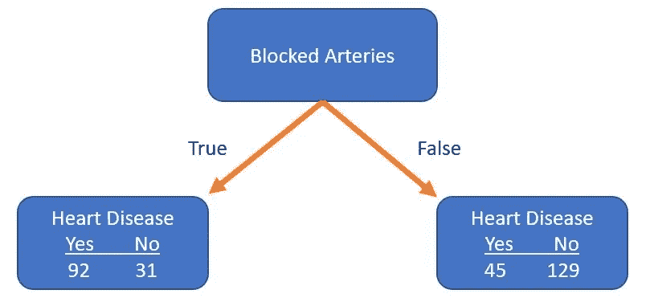

# 通过树做决定！！！🌲

> 原文：<https://medium.com/analytics-vidhya/decision-via-trees-aa187bbe45e8?source=collection_archive---------10----------------------->

只是想取个朗朗上口的标题😁

选择最有效的道路的决定！！！

## 决策树是一种决策支持工具，它使用决策及其可能结果(包括偶然事件结果、资源成本和效用)的树状模型。

这是显示只包含条件控制语句的算法的一种方式。

**比如**，看看下面:

如果一个人喜欢读博客，他必须做出选择，

**真**他爱看博客**假**他不爱读书。

所以，一般来说，决策树会问我们一个问题，然后根据答案对这个人进行分类。

上面的例子是是/否类型，即分类，如果我们有高血糖、高血压等数字数据。

我们可以根据血糖水平对人进行分类，如果血糖水平高或低，是否需要看医生。

让我们来看另一个例子:

在这里，一个人太饿了，他现在就需要吃东西，如果不饿的话，吃点零食就可以了。

以下示例显示了数值和分类值的组合:

现在，根据上面的例子，**数字数据**(静息心率)与**分类数据**(吃甜甜圈，是/否)相结合。请注意，静息心率的临界值并不总是相同的。在这种情况下，树的左边是 100 bpm，右边是 120 bpm。

此外，问题的**顺序**在左侧，首先是关于静息心率，然后是关于吃甜甜圈**不必与右侧的**相同。右边，先问关于甜甜圈的问题。

再次，你已经直接开始决策树让我们知道，

## **为什么叫决策树？**

## **这个层级是如何运作的？**

## **我们如何将原始数据转换成决策树？** …🙄

等等…好吧，我从头开始🤝

## 基本术语…

树木命名法

## **为什么叫决策树？**

它形成了同名木本植物的轮廓，通常是直立的，但有时也侧卧。决策树的每个分支代表一个可能的决策、结果或反应。树上最远的分支代表最终结果。

## **决策树层次结构是如何工作的？**

他们通过学习 if/else 问题的**层级**的答案来工作，从而做出**决定**。**树**中的每个节点代表一个从数据集中存在的特征中导出的问题。根据这些问题分割数据集，直到达到**树**的最大深度。

## 现在，我们准备讨论如何从原始数据表到决策树！！！

我们想知道的第一件事是胸痛、血液循环良好还是动脉阻塞应该在树的最顶端？

因此，我们将从选择胸痛作为预测心脏病的参数开始。一棵只考虑胸痛的小树如下:

现在，我们将获取胸痛行值并分类如下:

1.  第一个病人没有胸痛，也没有这种疾病。
2.  第二个病人有胸痛和心脏病。
3.  接下来，我们将对列胸痛和心脏病的值进行排序，直到最后一行，我们将获得本研究中所有 303 名患者的值。

胸痛的最终诊断树是:

现在，我们将做同样的事情来促进血液循环。我们得到，

最后，我们来看看阻塞的动脉是如何区分心脏病患者和非心脏病患者的。

注意:在进行分离时，如果我们缺少值，我们将跳过它。

因为我们的目标是决定**胸痛、良好的血液循环或阻塞的动脉**应该是我们决策树中的第一件事还是根节点。

因为没有一个叶节点是 100 %“有心脏病”或 100%“没有心脏病”，所以都被认为“**不纯**”。

为了确定哪种分离是最好的，我们需要一种方法来测量和比较**“杂质”。**

为了测量杂质或同质性，我们可以使用，

## 1.分类错误:

## 2.基尼指数:

## 3.熵:

其中，p-i 是找到标签为 **i** 的点的概率， **k** 是类的个数。

这里，我们只关注基尼指数...😅

## 基尼指数:

基尼指数是随机选择的数据点被错误分类的程度。

那么，我们如何计算基尼系数呢？🧐

让我们从胸痛的例子开始，

对于第一个叶节点:

对于第二个叶节点:

现在我们已经测量了两个叶节点的基尼系数，我们可以计算总基尼系数，用胸痛来区分有和没有心脏病的患者。

**叶节点不代表相同数量的患者**。因此，使用胸痛来区分心脏病患者和非心脏病患者的总基尼系数是叶节点系数的加权平均值。

所以，为了计算我们使用的加权平均值，

计算我们得到的所有特征的基尼系数:

## 良好的血液循环杂质最少(它将有心脏病和无心脏病的患者区分得最好)。所以我们会在树根处使用良好的血液循环。

当我们将所有血液循环良好的患者分开时，我们最终得到了“不纯”的叶节点。每片叶子都含有心脏病患者和非心脏病患者的混合物。

现在我们需要弄清楚胸痛和动脉阻塞如何区分这 164 名患者(37 名患有心脏病，127 名没有心脏病)。

所以，就像我们之前根据胸痛和动脉阻塞来区分这些病人一样。我们计算基尼不纯值，

由于阻塞的动脉具有最低的基尼系数(0.290) ，我们将在此节点使用它来分离患者。

这是我们到目前为止设计出的树。

接下来，我们将使用基尼指数计算如下节点(24/25)的胸痛:

不错！胸痛在区分病人方面做得很好，下面是这棵树的最后一个叶子节点。这些是树的这个分支上最后的叶子节点。

现在让我们看看当我们用胸痛来划分这 115 名患者(13 名患有心脏病，102 名没有心脏病)时发生了什么。

注意:这个节点的绝大多数患者(89%)没有心脏病。

这些新的叶子比我们以前的更好的分离病人吗？

如果我们不使用胸痛来区分患者，杂质会更低。

所以我们将它作为叶节点(13/102)。

好了，现在我们已经完成了树的整个左侧。现在我们需要在树的右边工作。

**好消息是，我们遵循与左侧完全相同的步骤:**

1.  **计算所有的基尼不纯分数。**
2.  **如果节点本身得分最低，那么就没有必要再分离患者，它就变成了叶节点。**
3.  **如果分离数据导致改善，则选择杂质值最低的分离。**

万岁！！！我们做了一个决策树！！！

## 总结:

到目前为止，我们已经看到了如何构建一个每一步都带有“是/否”问题的树。对于数字数据，我们将在下一篇文章中看到如何构建树。下次我们将使用 python 来帮助我们更好地理解这些概念。

## 参考资料:

 [## 决策图表

### 决策树是一种决策支持工具，它使用决策及其可能结果的树状模型…

en.wikipedia.org](https://en.wikipedia.org/wiki/Decision_tree) 

[https://www.youtube.com/channel/UCtYLUTtgS3k1Fg4y5tAhLbw](https://www.youtube.com/channel/UCtYLUTtgS3k1Fg4y5tAhLbw)