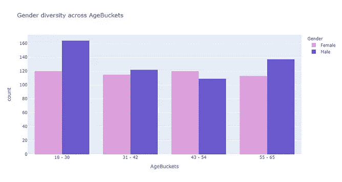

# 解读收入差距:探索性分析

> 原文：<https://medium.com/analytics-vidhya/decoding-earning-disparity-an-exploratory-analysis-3d9ee2169416?source=collection_archive---------11----------------------->

## Plotly 和 Seaborn 的视觉之旅

本周我全力支持回收！

这是我为 Python 编程入门课程所做项目的一部分，被认为值得在更广泛的平台上分享。当时的想法是用一个简单的数据集。一种不需要太多带宽的清理，并深入挖掘数据中的潜在真相，以编织一个值得讲述的故事。

# 导言和基本原理

***动机:性别薪酬差距***近年来，有报道称，从事同一工作的男女在薪酬方面存在严重不平等。根据美国消费者新闻与商业频道 2019 年的一份报告，这在医疗保健、金融管理和法律行业尤为普遍，众所周知，这些行业的女性薪酬低于男性。男性和女性之间的工资差异通常被称为薪酬差距。


Clark Van Der Beken 在 [Unsplash](https://unsplash.com?utm_source=medium&utm_medium=referral) 上拍摄的照片

**数据来源:**使用的数据来自 Kaggle 上的[开源数据集，最初来自 Glassdoor 网站，员工可以在该网站上发布关于现任和前任雇主的评论。该平台通常由希望了解潜在雇主的工作文化和薪酬见解的候选人使用。所选择的数据集包含用户的信息，从他们的教育背景到他们目前的资历和职称。](https://www.kaggle.com/nilimajauhari/glassdoor-analyze-gender-pay-gap)

通过这种分析，目的是分析不同候选人在给定属性上的薪酬结构，以获得对数据的全面理解。后续分析的目的是了解男女员工的工资趋势是否有所不同，确定是否存在工资差距，并推断不同因素下的工资差距。

# 1.设置环境

```
*# Importing necessary libraries*
**import** **pandas** **as** **pd**
**import** **numpy** **as** **np**
**import** **seaborn** **as** **sns**
**import** **matplotlib.pyplot** **as** **plt**
**import** **plotly.express** **as** **px**
%**matplotlib** inline
**import** **plotly.graph_objects** **as** **go**
**from** **plotly** **import** __version__
**import** **cufflinks** **as** **cf**
**from** **plotly.offline** **import** download_plotlyjs,init_notebook_mode,plot,iplot
cf.go_offline()*# Reading the data*
glassdoor_data=pd.read_csv("Glassdoor Gender Pay Gap.csv")glassdoor_data.head()
```

该数据集中的粒度是单个候选人级别的，捕获的信息包括他们的职称、性别、年龄、最近的绩效评估、教育背景、工作部门、在该行业中的资历级别(以工作年限和薪酬表示),分为基本工资和奖金。

在接下来的步骤中加入了一些计算变量，以使分析更加丰富。


数据集的头部

```
*# Defining colour schemes to be used in the notebook for plotly plots*
notebook_colours=["plum","slateblue","navy","firebrick",
                                      "darksalmon","slateblue","maroon","lightskyblue","blue","darkmagenta"]
```

这是我定制的一个托盘，经常在许多笔记本上使用，因为它在使用 viz 库时很方便。

# 2.数据准备和清理

作为标准做法，在继续探索之前，对数据集进行一些基本的健康检查。

```
*# No null values in the data*
glassdoor_data.isnull().sum()
```


数据集中没有空值

```
*# Summary Stats of numerical variables*
glassdoor_data.describe()
```


数据集中数值变量的摘要

```
*# Summary stats of categorical variables*
glassdoor_data.describe(include=np.object)
```


数据集中 Categoircal 变量的摘要

# 2.2 数据准备

## 2.2.1.将资历和绩效评估转换为系数

由于资历和绩效评估被记录为顺序变量(意味着离散的级别，在这种情况下范围为 1-5)，因此它们不需要存储为浮点型，并被转换为分类(对象)变量以用于此分析。

```
glassdoor_data['Seniority'] = glassdoor_data['Seniority'].astype(object)glassdoor_data['PerfEval'] = glassdoor_data['PerfEval'].astype(object)glassdoor_data.info()<class 'pandas.core.frame.DataFrame'>
RangeIndex: 1000 entries, 0 to 999
Data columns (total 9 columns):
 #   Column     Non-Null Count  Dtype 
---  ------     --------------  ----- 
 0   JobTitle   1000 non-null   object
 1   Gender     1000 non-null   object
 2   Age        1000 non-null   int64 
 3   PerfEval   1000 non-null   object
 4   Education  1000 non-null   object
 5   Dept       1000 non-null   object
 6   Seniority  1000 non-null   object
 7   BasePay    1000 non-null   int64 
 8   Bonus      1000 non-null   int64 
dtypes: int64(3), object(6)
memory usage: 70.4+ KB
```

## 计算总薪酬

要计算员工的年薪总额，需要将他们的基本工资和奖金相加。

```
glassdoor_data['TotalPay']=glassdoor_data['BasePay']+glassdoor_data['Bonus']
```

## 2.2.3.创建年龄时段

从统计摘要中我们知道年龄范围在 18 到 65 岁之间。在括号中分析不同年龄的趋势会比在每个年龄给出更好的见解。年龄分为 4 组，每组 12 岁。

```
*# Defining labels for creating age groups*
labels = ['18 - 30', '31 - 42', '43 - 54', '55 - 65'] *#* # Creating Bins in Age
bins=[17,30,42,54,65] *# the lower bin value is included in pd.cut 17---> starts at 18*age_binned=pd.cut(glassdoor_data['Age'],bins=bins,labels=labels) glassdoor_data['AgeBuckets']=age_binned
glassdoor_data['AgeBuckets']=glassdoor_data['AgeBuckets'].astype(object)glassdoor_data.head()
```


数据集的头部-计算新变量 TotalPay 和 AgeBuckets 后

```
# Now checking the summary statistics of Seniority and PerfEval
glassdoor_data.describe(include=np.object)
```


所有分类变量的汇总统计

## ***数据汇总***

*   男性人数略高于女性
*   运营是最常见的部门
*   营销助理是最常见的职位
*   大多数候选人都有 3 年的资历
*   5 是最常见的绩效评级
*   大多数候选人的教育背景只有高中
*   大多数候选人属于 18- 30 岁年龄组

# 3.探索性数据分析

# 3.1 单变量分布图

为了理解每个变量中数据的分布，生成了以下分布图。

## 3.1.1 分类变量

```
*# For categorical variables*
iplot(cf.subplots([glassdoor_data['Gender'].figure(kind='hist',color=notebook_colours[0]),
                   glassdoor_data['AgeBuckets'].figure(kind='hist',color=notebook_colours[1]),
                   glassdoor_data['Seniority'].figure(kind='hist',color=notebook_colours[2]),
                   glassdoor_data['PerfEval'].figure(kind='hist',color=notebook_colours[4]),
                   glassdoor_data['Education'].figure(kind='hist',color=notebook_colours[6]),
                   glassdoor_data['Dept'].figure(kind='hist',color=notebook_colours[7]),
                   glassdoor_data['JobTitle'].figure(kind='hist',color=notebook_colours[8])],shape=(3,3)))
```


分类变量的单变量分布图

根据任何分类变量的分布图，没有明显的异常值或缺失值。

## 连续变量

```
iplot(cf.subplots([glassdoor_data['BasePay'].figure(kind='hist',color=notebook_colours[8]),
                   glassdoor_data['Bonus'].figure(kind='hist',color=notebook_colours[6]),
                   glassdoor_data['TotalPay'].figure(kind='hist',color=notebook_colours[4])],shape=(3,1)))
```


数值变量的单变量分布图

基本工资、奖金和总工资的分布相当均匀，每个变量的峰值都在中间。

# 3.2 多元分布图

本节进行探索性分析，以了解数据集中两个或更多变量的分布和行为。

## 3.2.1 不同属性的性别多样性

本节绘制了每个分类变量中男性和女性的频率分布。

```
*# Creating list of categorical variables to iterate through*
bivar=['JobTitle', 'PerfEval', 'Education', 'Dept', 'Seniority', 'AgeBuckets']*# Plotting count of males and females for each categorical variable*
**for** i **in** bivar: fig=px.histogram(glassdoor_data,x=i,color='Gender',color_discrete_sequence=notebook_colours,barmode='group',title='Gender diversity across **{}**'.format(i))
    fig.show()
```



跨属性的性别多样性

## *性别多样性调查结果*

**年龄组**

*   18-30 岁年龄组的男性人数最多，43-54 岁年龄组是唯一女性多于男性的年龄组
*   女性在所有年龄组中的分布大致相等，每个年龄组在 113-120 岁之间

**部门**

*   在每个部门，女性都不如男性
*   管理层中女性最少，其次是工程

**职位名称**

*   大多数女性是营销助理，而同样职位的男性最少
*   经理和软件工程师职位中女性人数最少

**教育背景**

*   大多数女性是高中毕业生
*   除了大学，女性在各个教育层次上都不如男性

**绩效等级**

*   大多数女性在绩效评估中被评为 1 分(满分为 5 分)
*   与男性相比，女性获得满分 5 分的频率明显较低

**资历**

*   除了有 5 年工作经验的候选人之外，每一级别的女性人数都少于男性

## 3.2.2 工作与教育背景

本节绘制了不同职位的教育背景频率分布图。

```
px.histogram(glassdoor_data,x="JobTitle",color="Education",barmode="stack",
             color_discrete_sequence=notebook_colours)
```


不同职位的教育背景

> **关键见解**
> 
> 营销助理是最受欢迎的职位，其中大多数候选人的教育背景高达高中
> 
> IT 工作的候选人大多具有大学教育水平
> 
> 平面设计师和软件工程师的工作大部分都有硕士学历
> 
> 数据科学家职位拥有最多的博士学者

## 3.2.3 按部门分析薪金构成

工资的组成部分——基本工资和奖金因每个部门内不同的职位而异。

```
*# Analyzing the average slaries of jobs within each department*
px.histogram(glassdoor_data,x="Dept",y="BasePay",color="JobTitle",barmode="group",
             histfunc='avg',title='Base Pay offered within each department',
             color_discrete_sequence=(notebook_colours))
```


```
px.histogram(glassdoor_data,x="Dept",y="Bonus",color="JobTitle",barmode="group",histfunc='avg',
             title='Bonus offered within each department',
            color_discrete_sequence=(notebook_colours))
```


```
px.histogram(glassdoor_data,x="Dept",y="TotalPay",color="JobTitle",barmode="stack",histfunc='avg',
             title='Total pay offered within each department',
            color_discrete_sequence=(notebook_colours))
```


> **关键见解**
> 
> 薪酬最高的工作:就平均基本工资和总工资而言，经理是每个部门中薪酬最高的，其次是软件工程师
> 
> **薪酬最低的工作:**就基本工资和总工资而言，营销助理是薪酬最低的工作
> 
> 不同职位的奖金因部门而异

## 3.2.4 了解薪酬组成部分之间的关系

使用带有回归线的散点图分析不同部门男性和女性的基本工资和奖金，以了解变量之间的关系性质是否是线性的。

```
px.scatter(glassdoor_data, x="BasePay", y="Bonus",trendline="ols" ,color="Gender",           facet_col="Dept",color_discrete_sequence=notebook_colours)
```


不同性别的基本工资和奖金之间的关系

> **关键见解**
> 散点图不遵循任何既定趋势，回归线的 r 值非常小。即使这种关系看起来是负的，奖金的变化也不能完全用基本工资来解释。任何部门的男性或女性的奖金和基本工资之间的关系都没有定论。

## 3.2.5 按资历支付薪酬

绘制以下热图是为了了解随着资历级别的增加，薪酬的趋势。

```
*# Reshaping the data to a matrix format for heatmap*
seniority_pivot = glassdoor_data.pivot_table(index = 'Seniority',columns='JobTitle',values = 'TotalPay') 
*#agg function by default is mean*
seniority_pivot
```


不同职位资历的总薪酬透视视图

```
*# Heatmap of payscale with seniority*
plt.figure(figsize=(12,6)) 
sns.heatmap(seniority_pivot,linewidths=1,linecolor='black',cmap='BuGn')
```


不同资历级别的工资级别热图

> **关键见解**
> 颜色梯度表示每个小组的平均总薪酬水平。较暗的阴影表示平均工资较高，反之亦然。不出所料，对于每个职位，平均年薪总额随着资历的增加而增加。

# 4.女性与男性薪酬差异分析

# 4.1 按部门计算性别薪酬差距

这一部分包括计算和可视化不同性别之间的薪酬差异(如果有)。

```
*# At every level of seniority the quartiles for females are lower than males*
px.box(glassdoor_data,x="Dept",y="TotalPay",color='Gender',color_discrete_sequence=notebook_colours)
```


显示每个部门女性平均总收入低于男性的箱线图

```
*# Calculating average pay across Department and gender*
gender_dept_pay=glassdoor_data.groupby(['Dept','Gender'],axis=0,as_index=**False**).mean() 
gender_dept_pay
```


各部门平均总薪酬汇总视图—女性与男性

下面的表格数据表明，每个部门提供给妇女的平均基本工资和总工资低于男性。

```
*# Pivoting to get the data at required level for ease of calculation*paygap_dept=gender_dept_pay.pivot(index='Dept',values=['Bonus','BasePay','TotalPay'],columns='Gender')*# Calculating difference in total pay*
paygap_dept['DeptPayGap']=paygap_dept['TotalPay','Male']-paygap_dept['TotalPay','Female']
paygap_dept.head()
```


各部门薪酬差距的计算

> **关键见解**
> **薪酬差距在工程部门最为明显，女性的平均年薪比男性低 111，00 美元**。在早期的分析中，很明显，工程系的女性人数最少。薪酬上的巨大差异可能是女性不愿意从事工程的原因之一。

# 4.2 了解各部门内按职称分列的性别薪酬差距

下面的分析是为了了解每个部门中是否有某些职称导致了部门层面的收入差距。

```
*### Reshaping data to get average of pay in each for males and females in each job title within department*gender_job_dept_pay=glassdoor_data.groupby(['Dept','JobTitle','Gender'],axis=0,as_index=**False**).mean() gender_job_dept_pay.head()
```


探索部门内更细层次的职称薪酬差距

```
*# Treemap with outermost layer as department, then job title and gender in the inner layer*
fig = px.treemap(gender_job_dept_pay, path=['Dept','JobTitle','Gender'], values='TotalPay',
                 color='TotalPay', color_continuous_scale='bugn',
                 title="Earning disparity in Job Titles within each department",
                 labels={"TotalPay":'Average Total Pay'},width=1200, height=600)
fig.show()
```


交互式树形图展示了每个部门内职位的薪酬差距

上面的树形图有助于理解每个部门中与职位相关的收入差距。颜色梯度表示每个分组的平均总薪酬的幅度。较暗的阴影表示平均工资较高，反之亦然。

> **关键见解**
> 据观察，给定部门内的薪酬差距并不集中在一个工作岗位上。这是一个部门所有工作中男女收入差异的累积效应，其净效应是女性平均收入较低。
> 
> **销售:**女性薪酬较低的工作岗位有 IT、营销助理、销售助理、软件工程师和仓库助理
> 
> **工程:**经理、营销助理、销售助理和软件工程师等职位的女性薪酬较低
> 
> 管理:女性在金融分析师、IT、经理、营销助理、销售助理和软件工程师等职位上的薪酬较低
> 
> **运营:**女性在司机、金融分析师、软件工程师等职位上收入较低
> 
> 管理:女性担任司机和营销助理的薪水较低。行政部门没有女性软件工程师。

# 4.3 通过各部门的资历了解性别薪酬差距

虽然收入确实随着资历的增加而增加，但在每个级别上，女性的收入都低于男性。

```
*### Reshaping data to get average of pay in each for males and females in each seniority level within department*gender_seniority_dept_pay=glassdoor_data.groupby(['Dept','Seniority','Gender'],axis=0,as_index=**False**).mean() 
gender_seniority_dept_pay.head(6)
```


将数据透视到所需的部门内资历级别视图

```
*# Scatter plot with average total pay and seniority*
fig=px.scatter(gender_seniority_dept_pay,'Seniority',
            'TotalPay',color='Gender',size=(gender_seniority_dept_pay['TotalPay']/10000)-6, *# factor of total pay calculated* 
           color_discrete_sequence=notebook_colours, facet_col='Dept',labels={"TotalPay":'Average Total Pay'})fig.show()
```


部门内不同资历级别的平均总薪酬——女性与男性

> **重要见解**
> 据观察，在部门内的每个级别，女性的薪酬都低于男性。这种趋势在不同的部门有所不同，但在销售部门中，对于资历为 5 年的个人来说，这种趋势最为明显。似乎即使女性在某个部门有相同的工作年限，她们的收入也不如男性。

***在泡沫/散点图上注意，*** *我给了散点图中的数据点一个大小元素，它是平均总薪酬的指数因子。这样做是为了突出随着资历的增加，男女薪酬的差异。正如所观察到的，气泡的大小随着每一关而不断增加，紫色(雄性)气泡的大小总是比粉色(雌性)气泡的大。*

# 4.4 绩效评估和收入差距

女性有一个固定的绩效评估范围，在任何部门都不会超过 4.0。一项深入的研究是为了分析表现不佳是否是女性平均薪酬较低的原因。

```
*# Box plot to understand spread of performance rating*
px.box(glassdoor_data,x="Dept",y="PerfEval",color='Gender',color_discrete_sequence=notebook_colours,
      title='Performance Evaluation in Departments')
```


绩效评估分数的分布——女性对男性

```
*# Aggregating numerical attributes at a Department, Evaluation and gender level*gender_eval_dept_pay=glassdoor_data.groupby(['Dept','PerfEval','Gender'],axis=0,as_index=**False**).mean() 
gender_eval_dept_pay.head()
```


计算绩效评估分数中的平均总薪酬——女性与男性

```
*# Scatter plot to understand pay disparity in performance ratings* 
px.scatter(gender_eval_dept_pay,x="Dept",y="TotalPay",color='Gender',color_discrete_sequence=notebook_colours[6:8],
      title='Average Pay by performance evaluation',facet_col='PerfEval',size=(gender_eval_dept_pay['BasePay']/10000)-8)
```


部门内不同绩效得分的平均总薪酬——女性与男性

> ***关键见解***
> 
> 从方框图中可以明显看出，在管理部门，女性在评估中的表现是左偏的，而在工程部门，男性的表现是右偏的。然而，为了进一步了解绩效评估是否是女性工资低于男性的原因，绘制了部门中每个绩效等级的平均工资。
> 
> 据观察，在每个部门，无论绩效评定如何，男性都比女性挣得多。唯一的例外是管理部门中被评为 2/5 的员工和销售部门中被评为 5/5 的员工，在这些部门中，男女总薪酬没有显著差异。
> 
> 可以得出结论，尽管有相同的绩效评估，但女性的收入低于男性。

# 4.5 了解教育背景下的收入差距

为了了解教育背景是否是女性薪酬低于男性的原因，我们根据受教育程度对特定部门中男性和女性的平均薪酬进行了比较。

```
*### Reshaping data to get average of pay in each for males and females by educational background* 
gender_ed_dept_pay=glassdoor_data.groupby(['Dept','Education','Gender'],axis=0,as_index=**False**).mean() gender_ed_dept_pay.head()
```


计算不同教育水平的平均总薪酬——女性与男性

```
*# Sunburst chart with innermost layer as education, then department and gender in the outest layer*fig = px.sunburst(gender_ed_dept_pay, path=['Dept','Education','Gender'], values='TotalPay',
                 color='TotalPay', color_continuous_scale='bugn',title="Earning disparity in levels of education",
                  labels={"TotalPay":'Average Total Pay'})
fig.show()
```


交互式旭日图展示了各部门内教育背景的薪酬差距

上面的旭日图有助于理解男性和女性的收入差距与他们的教育背景的关系。颜色梯度表示每个分组的平均总薪酬的幅度。较暗的阴影表示平均工资较高，反之亦然。

> **关键见解**
> **拥有博士学位的员工收入最高**。在攻读博士学位的员工中，在工程部门工作的人收入最高。
> 
> 然而，尽管教育水平相同，但在每个部门，女性的平均收入都低于男性。

# 结论

分析了几个因素，试图从给定的数据集中了解个人收入的差异。有多种可察觉的因素影响着员工的总收入。虽然教育背景、资历、职称和部门会影响工资级别，但在理想情况下，性别不应该成为决定个人工资的因素。然而，通过多次探索发现，情况并非如此。

> **工程部门**的薪酬差距最大，其中**女性的平均年薪比男性低 111，00 美元**
> 
> 在部门内部，大多数职位都存在明显的薪酬差距。然而，在管理层的数据科学家和图形设计师中，这一差距被逆转，女性收入高于男性
> 
> 每个资历级别都有明显的差异，在相同的工作年限内，女性的收入低于男性。这在拥有 5 年工作经验的销售人员中最为突出。
> 
> 与男性的分布情况相比，女性在管理层的业绩评级偏左。然而，在分析每个部门的男女平均工资和他们的绩效评分时，发现**不管他们的绩效评分如何，每个部门的男性都比女性挣得多**
> 
> 具有博士教育水平的员工在每个部门的收入最高。然而，即便如此，尽管拥有相同的教育背景，女性的收入还是比男性低

通过对上述组成部分的分析，无法确定导致女性平均工资低于男性的原因。因此，这似乎是一种系统性的偏见，因为尽管教育背景、工作部门、职称、业绩评级和资历相似，妇女的收入却低于男子。

***那都是乡亲们！***

这是对一个简单数据集的深入分析，使用 Pandas 进行数据辩论，使用 Plotly & Seaborn 进行可视化。我有责任提醒大家，这是对给定数据集的分析，而不是一种观点。把我对社会问题的个人观点保留到另一个时间和地点，最好是离线。

在此之前，感谢您的阅读，请随时联系我们，并在下面留下您的评论和建议！