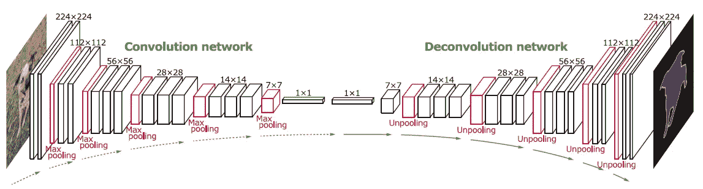

# 深度学习中的反卷积，重要性，用在哪里？

> 原文：<https://medium.com/analytics-vidhya/deconvolution-in-deep-learning-its-importance-and-where-to-use-it-59557a1b3a2c?source=collection_archive---------11----------------------->

卷积和解卷积都用于图像处理。

Clark Van Der Beken 在 [Unsplash](https://unsplash.com?utm_source=medium&utm_medium=referral) 上拍摄的照片

## 卷积:

卷积层的目标是**将图像转换成输出值的抽象表示。**卷积算法缩小图像尺寸，这意味着如果输入图像的尺寸为 6 x 6，则图像将缩小到 4 x 4 或 3 x 3。

## 去卷积:

去卷积是一种数学运算，它与卷积层的过程相反。现在将**输出通过去卷积层，您将得到相同的输入。**

我们正在缩小左侧的图像，在右侧，我们正在对图像进行上采样。(图片来源:谷歌照片)

## 重要性:

反卷积的重要性在于从卷积输出图层重新生成图像，通过这样做，我们可以确保卷积从图像中提取正确的要素。

## 使用:

从提取的神经网络层生成原始图像是一种计算密集型方法。但是它仍然被用于提高显微镜中捕获的数字图像的对比度和分辨率。它广泛应用于科学领域。