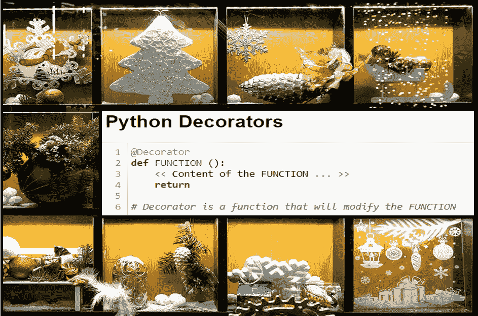
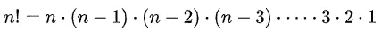

# Python 中的装饰者

> 原文：<https://medium.com/analytics-vidhya/decorators-in-python-eb05dbf9949b?source=collection_archive---------13----------------------->

## 提升您的 Python 技能——了解装饰者是什么，为什么，以及怎么样

作者图片

从字面上理解，装饰者是美化或增加现有物品价值的人或物。它可以是一个室内设计师，他的工作是使室内空间变得富有美感，或者仅仅是彩灯、金属箔片、装饰品等。用来装饰圣诞树的。

Python 装饰者也差不了太多！！以…的方式

> Python decorators 向现有的 Python 函数添加新功能，修改其行为，而不改变原始函数。

装饰器本质上是一个接受另一个函数作为输入的函数。就在定义您想要装饰的函数之前，使用@ symbol 调用装饰器。在不改变原始代码的情况下添加新功能的能力使得 Python decorators 非常有用。本文作为教程来演示装饰器的应用。

我们将首先创建一个函数来计算一个数的阶乘。然后我们将定义两个 decorators 来分配-1 的功能。检查参数和 2 的有效性。代码执行时间。最后，我们将学习如何链接装饰者。

**让我们定义一个函数 Factorial** ，它将计算一个数(N)的阶乘。我们知道阶乘可以计算为:

图 1

在图 2 中，定义了阶乘函数。阶乘的值初始化为 1，即当参数 N= 0 时的输出。对于 N 的其他值，阶乘通过实现上述公式来计算。

图 2

既然我们已经编写了阶乘函数。让我们测试参数(N)的不同值。在图 3 中，可以看到对于负数返回了一个不正确的阶乘值，并且当我们试图计算一个非整数的阶乘时抛出了一个错误。

图 3

**Decorator Example #1** —检查传递给阶乘函数的参数的有效性，并在发现负的或非整数的参数值时引发错误。

在图 4 中，装饰器 *check_parameters 是*定义的，它接受一个函数作为输入。一个*内部*函数是在装饰器中定义的，它通过使用 Python 中的*args 功能接受可变数量的参数。关于*args 的更多细节，请参考我的文章—

[https://medium . com/analytics-vid hya/args-kwargs-in-python-b 74295 F3 CD 0](/analytics-vidhya/args-kwargs-in-python-b74295f3cd0)

想法是通过使用*args 功能和 for 循环遍历参数列表，测试参数值是否为负数和非整数。如果发现参数是负数或非整数，就会抛出相关的错误消息。否则，如果参数是整数，则返回原始函数。

图 4

注意，装饰器是通过使用第 13 行中的@符号调用的，需要装饰的原始函数就定义在装饰器调用的下面。

有一种替代的方式来称呼装饰者。众所周知，在 Python 中，函数可以作为参数传递，可以从另一个函数返回，也可以赋给一个变量。一旦定义了装饰器和要装饰的函数，我们就可以调用装饰器，如图 5 所示

图 5

**装饰器示例#2 —** 计算函数的执行时间。

在图 4 中，装饰器*计时器*被定义为接受一个函数作为输入。就像前面的例子一样，内部函数被定义为具有可变数量的参数，因为阶乘函数(正在被修饰)有一个参数。

内部函数是一个包装器，在其中调用要修饰的函数(第 11 行)。返回内部函数，该函数将输出运行被修饰的函数所用的执行时间。

图 6

对于较小的数字，阶乘计算非常快。这就是为什么，为了描述执行时间的差异，阶乘是为一个小数字和一个大数字计算的。此外，两种情况下的阶乘数值都很大。如果我们按原样打印输出，那么它将占用很大的空间。因此，我们使用科学记数法来返回阶乘值。

**连锁多个装饰者**

多个装饰器可以链接在一起，为一个现有的功能增加多种功能。在图 7 中，*我们之前创建的两个 decorators 通过使用@ symbol* (第 1 行和第 2 行)*顺序调用而链接在一起。一旦装饰者被调用，我们将继续定义我们的原始函数。*

图 7

我希望读者会发现这篇文章对编写更复杂的装饰者有所帮助。

非常感谢您的反馈。

谢谢大家！！