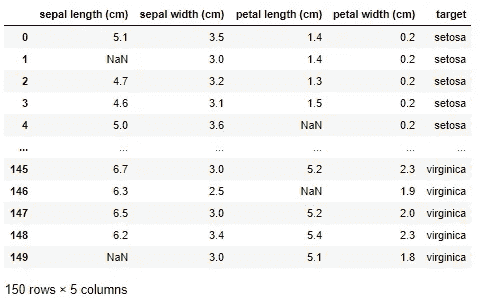
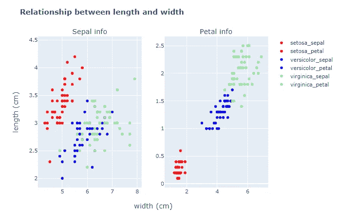

# 深入探讨决策树第一部分

> 原文：<https://medium.com/analytics-vidhya/deep-dive-into-decision-tree-part-i-9576ac66c2f8?source=collection_archive---------19----------------------->

用 python 构建决策树模型的数据预处理。

大家好🙌。

今天我将谈论决策树，但是它将被分成两部分。

> 第一部分:决策树概念，数据预处理，模型构建。
> 
> 第二部分:幕后的数学。

决策树由 Leo Breimann 等人在 1984 年开发，是一种机器学习算法，属于监督学习，目标是通过问一系列问题将数据分成类(分类)/数字箱(回归)。

可以把它想象成一棵颠倒的树，根(根节点)在顶部，叶(叶节点)在底部，中间的一切都只是被称为节点。因此，从根节点开始，我们提出问题，并根据答案分离数据。分离前的数据属于被分离成两个子节点的父节点。

我们将只讨论二元决策树，这意味着数据只有两种分离方式。尽管决策树可以有多于二进制的答案，但它的计算量非常大。

在继续之前，我将简要地谈谈利弊，这样你就可以决定这是不是适合你的问题的算法，然后继续读下去或者跳过它。

**优点:**

*   可解释性。
*   能够同时处理数值和分类特征，无需数据预处理。
*   自动特征选择。
*   多重共线性不影响算法质量。
*   使用训练模型进行预测时计算效率高。

**缺点:**

*   倾向于过度拟合
*   数据的微小变化会导致决策树结构的巨大变化。
*   如果数据相似，训练时计算量很大→需要多个问题来分离数据。

如果你认为这是你想要的算法，那就跟着做👇。

现在我们有了所有的依赖项，让我们加载数据，但是要做一些调整。

加载 iris 数据集后，用`NaN`替换`petal length` 和`sepal length`列中的 15 个随机单元格，使我们的数据集变得凌乱。

现在我们的数据集看起来像这样:

假设我们刚刚得到这些数据，我们现在的目标是训练一个决策树模型来分类花的类型(目标)。

像往常一样，我们必须探索我们的数据，找出它是否有缺失的数据，并搜索特征之间的关系。了解你正在处理的数据的背景信息是很重要的，因为这将大大减少数据预处理的时间，在这种情况下，了解 sepal，petal 指的是什么将是有益的。

现在，如果我们知道什么是花瓣，我们可以肯定地假设它的长度和宽度一定是相关的。让我们想象花瓣和萼片的长度和宽度之间的关系。

输出

我们可以看到花瓣宽度和花瓣长度之间的高度正相关。因此，我们可以执行线性回归，通过将`petal width`值插入最佳拟合的**线来填充`petal length`列中的`NaN`值，最佳拟合**线将输出预测的`petal length`值**。**

对于`sepal length`栏中缺失的数据，我们可以用相应花卉类型的平均值/中值/众数来代替。因此，例如，`sepal length`列中的第 2 行将由 **setosa** 的`sepal length`的平均值/中值/众数值替换。

最后，我们的数据集准备好用决策树算法进行训练。我们将使用 sklearn 的决策树分类器，并使用“基尼系数”作为衡量杂质的标准(这将在第二部分深入讨论)。

我们的决策树对花型分类很好。这基本上是对决策树的高级理解。在第二部分中，我们将回顾决策树的幕后，以了解它如何在每个节点选择特征、分割停止标准以及用于树修剪的其他参数。

感谢您的阅读！非常欢迎反馈，如果有任何错误信息，请评论。

参考资料:

*   [决策树的优缺点](https://en.wikipedia.org/wiki/Decision_tree#:~:text=Disadvantages%20of%20decision%20trees%3A,perform%20better%20with%20similar%20data.)