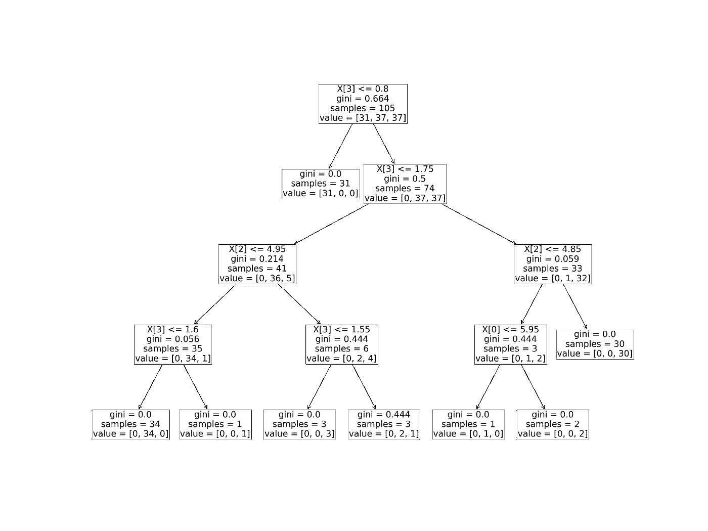
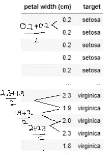
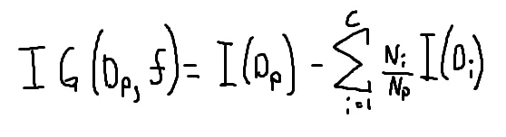
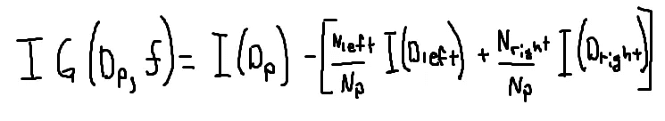
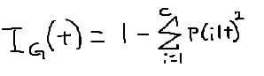
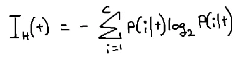
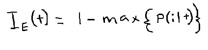
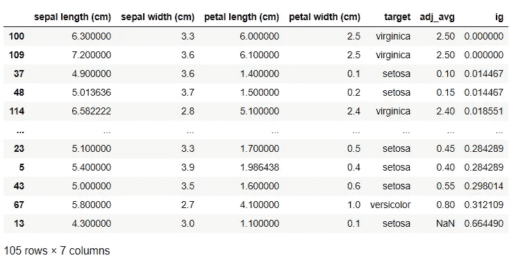

# 深入探讨决策树第二部分

> 原文：<https://medium.com/analytics-vidhya/deep-dive-into-decision-tree-part-ii-e1b5e60ab734?source=collection_archive---------17----------------------->

大家好🙌。

在前面的第一部分中，我们建立了一个决策树模型来分类花的类型。

我们将回顾之前创建的模型，并尝试理解模型提出的问题以及它为什么会提出某些问题。

对于那些没有读过《T2》第一部的人，推荐你读一读，因为这个博客是它的延续。

以下是将要涉及的一些关键词:

*   信息增益
*   杂质测量:基尼杂质，熵，分类误差
*   树木修剪
*   过度拟合

让我们想象一下我们的决策树。

sklearn 中的 Tree 类有 plot_tree 方法，它允许我们通过 matplotlib 可视化决策树。

iris _ data _ 决策树. png

上面是我们的决策树，你可以看到它问了什么问题来分离数据。从根节点开始，它通过询问“花瓣宽度(cm) ≤ 0.8”来分离数据，回答为真的数据将移到左边的子节点，否则移到右边的子节点。(注意 X[3]→X 数据帧中的第 4 列)。重复这个过程，直到叶子是纯的(所有数据都是同一类)，这通常导致过度拟合。

这就是树修剪的用武之地，为了避免过度拟合，我们必须设置停止分裂的标准，因此它不会无限分裂，直到所有的叶子都是纯净的。

可以使用 sk learn . tree . decision tree classifier 中的参数来调整停止拆分标准，以下是一些常见的标准:

*   **min_samples_split** :当节点包含少于指定限制 n 时停止
*   **max_depth** :询问到树的深度为 N(从根节点开始=深度 1)后停止，否则继续，直到所有叶子都是纯的。
*   **min _ infinity _ split:**当节点杂质低于 n%时停止。例如，如果 n = 5，那么当超过 95%的数据属于 a 类时，树停止分裂。
*   **min _ 杂质 _ 减少:**如果没有导致更多的信息增益，停止分裂。

看着我们的决策树，好奇的人可能会问以下问题

1.  为什么它用≤ 0.8(花瓣宽度(cm))来分隔数据？
2.  为什么它先用第 4 列(花瓣宽度(cm))呢？

决策树喜欢获取尽可能多的信息，所以它所做的每一个动作都取决于它获取了多少信息。

对于`petal width`列来说，选择导致最大信息增益分裂值，遵循以下步骤:

I)根据`petal width`列对值进行升序排序。

ii)计算所有行的相邻值之间的平均值。

iii)对于每个平均值，计算信息增益。

iv)从步骤 iii 中选择输出最大值(信息增益)的平均值。

我们的数据集只包含连续的列，但是其他类型(如分类和排序数据类型)更容易处理。

对于分类列，只需问类似“类别= A？”、“类别= B”等...并且首先选择导致最多信息增益的一个来使用。

对于排名列，只需问类似“排名≤ 1？”，“秩≤ 2？”等等……首先选择能获得最多信息的问题。

但是我们如何计算信息增益呢？别担心，公式如下:

信息增益公式

I(Dp) =父节点的杂质测量

I(Di) =子节点 I 的杂质测量值

Ni =子节点 I 中的数据数量

Np =父节点中的数据数量

因为我们只考虑二叉树，所以我们的公式可以简化成这样

信息增益公式，二叉决策树

决策树中的另一个重要概念是杂质。这是对你的节点有多不纯的度量，意味着你的节点有多混杂(只有一个类的节点被称为纯节点，0 不纯)。

有三种常用杂质测量方法

I)基尼不纯度

二)熵

iii)分类错误

**基尼杂质**

*   可以理解为最小化错误分类概率的标准。

**熵**

*   熵的范围是从[0，1]。0 表示最纯，1 表示最不纯。
*   在实践中，熵通常会产生与基尼系数相似的结果，因此没有必要花费太多时间来评估使用哪种杂质指标。应该花更多的时间来试验不同的修剪切断。

**分类错误**

*   树后修剪的有用标准(在树构建后进行修剪)，不推荐用于生长树，因为它对节点的类%的变化不敏感。

p(I | t)= t(节点)中第一类的概率

现在我们知道了如何计算信息增益，让我们通过编写自己的代码来仔细检查，看看按花瓣宽度≤ 0.8(由 adj_avg 选择)分割数据是否确实会导致该列的最大信息增益。

我们的最后一行代码按“ig”的升序排列数据帧。以下是输出:

你可以看到，当`petal width (cm)`列时，0.8cm 花瓣宽度的分裂(从 adj_avg 列计算)导致最大(信息增益)。

现在我们回答了为什么花瓣宽度列使用 0.8 的值来分割数据，现在是时候回答为什么它首先使用花瓣宽度列了？而不是萼片长度或任何其他列？

同样，决策树首先使用导致最大信息增益列。就像我们对`petal width`列所做的一样，对所有其他列也这样做，比较所有列的最大信息增益值，然后首先使用包含最大信息增益的列。

每次分割后重复此过程(前一个子对象成为父对象)，直到满足停止分割标准或所有叶子都是纯的。你可以在我们的决策树中看到，在第一次分裂后，树的左边停止了，因为它是纯的，只剩下树的右边了。

总之，决策树是一个非常简单的模型，具有高度的可解释性，因此，当您需要与非技术人员交流您的发现时，通常会用到它。它也是随机森林的基础，随机森林是将多个决策树组合在一起，遵循多数表决原则来回答问题，通常可以减轻单个决策树的过拟合行为。

感谢您的阅读！反馈是非常受欢迎的，请评论，如果有任何错误信息，我会尽快纠正他们！

参考资料:

*   克莱恩决策树文档
*   [Python 机器学习第 3 版第 3 章](https://www.packtpub.com/product/python-machine-learning-third-edition/9781789955750)
*   [数据科学家实用统计学第 1 版第 6 章](https://math2510.coltongrainger.com/books/2017-bruce-and-bruce-pratical-statistics-for-data-scientists.pdf)
*   [决策树教程视频第一部分](https://www.youtube.com/watch?v=7VeUPuFGJHk&t=33s&ab_channel=StatQuestwithJoshStarmer)
*   [决策树教程视频第二部分](https://www.youtube.com/watch?v=wpNl-JwwplA&ab_channel=StatQuestwithJoshStarmer)
*   [分割停止标准](http://www.alanfielding.co.uk/multivar/crt/dt_example_04.htm)