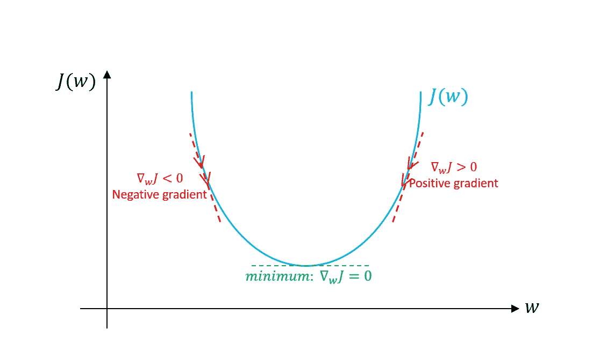

# 深入研究逻辑回归

> 原文：<https://medium.com/analytics-vidhya/deep-dive-into-logistic-regression-26a495baa0de?source=collection_archive---------18----------------------->

读者警告:伙计们，请坐好，因为这将是一篇涵盖逻辑回归所有本质细节的长篇综合文章。

我们将首先讨论所需的所有要素，然后看看这些要素是如何组合起来准备一个令人敬畏的算法的。

所以，不浪费任何时间，让我们开始我们的文章。

**什么时候使用逻辑回归？**

你们一定听说过经典的机器学习问题，比如猫和狗，贝宁病毒和恶性肿瘤，或者基本上，我们可以说，我们需要在两个类别之间进行分类，即二进制分类问题，其中输出类别属于 0 或 1。

识别猫和狗(图 1)

## 数学课

为了便于理解逻辑回归。我们将获取一个包含一个要素和两个输出类的数据集。一般的等式是

*z = w.x + b，其中 w 为权重，x 为特征，b 为偏项。*

当我们用 w 和 b 的任意值求解上述方程时，它应该给出我们的类输出。但是上面的等式有一个小问题。二进制分类中的类标签可以是 0，也可以是 1，但是上面的等式可以给我们任何实数。但是，别担心，我们有解决这个问题的办法。

**乙状结肠功能拯救**

Sigmoid 函数(图 2)

现在我们来讨论一下 sigmoid 函数。sigmoid 函数将任何实数作为输入，并将 0 到 1 之间的值作为输出。这些值可以被视为概率。正如您在 sigmoid 图中看到的，x->∞，y->1 的值和 x-> -∞，y-> 0 的值。因此，y 的值保持在 0 和 1 之间。当 z 为零时，s 形图在 0.5 处切割 y 轴。

那么，我们如何在逻辑回归中使用它呢？实际上，正是乙状结肠给了逻辑回归这个名字。等式 z= w.x +b 给出的输出可以是任何实数，现在如果我们将 z 传递给 sigmoid 函数，我们将得到 0 到 1 之间的输出，这是我们的类概率。

**成本函数**

现在我们已经有了方程，但是我们如何知道我们的方程是否如预期的那样工作。为此，我们需要一种机制来计算实际 y 值和预测 y 值有多接近。成本函数有助于估计这种差异。我们将使用的成本函数是对数损失函数

对数损失函数(图 3)

在上面的损失函数中， *y* 代表实际值， *p* 代表我们假设方程中的预测值或输出值(z)。

现在，我们将试着把上面的等式分解成两部分来解释。

当实际标签(y)为零时，成本函数变成-log(1-p)并且-log(1-p)的图形是

对数图(1-p)。y 轴上的成本函数和 x 轴上的假设

从上图中可以看出，如果 p(或假设等式中的 z)的值给出的输出为零，则误差为零(因为实际值和预测值相同)，如果预测值为 1，则给出的实际值为 0。成本函数上升到一个大值。

**给你做个小作业**:试着画出 y=1 时的代价函数对数图，推导出你的结论。

你们中的一些人一定在想，为什么我们不使用均方差函数，这背后有一个合理的原因，我们将在下一部分讨论。

现在我们有了成本函数，但现在我们需要一种机制来以某种方式降低成本函数值，为此，我们需要在等式中找到“w”和“b”的优化值，这将为我们提供最准确的预测。

但是我们如何找到“w”和“b”的最优值。我们的数学研究人员早就找到了解决方法。

**使用梯度下降进行优化**

梯度下降是机器学习领域中最重要的算法之一。梯度下降将帮助我们找到“w”和“b”的值，这样我们的成本函数值变得最小，我们将借助图表来查看这一点

我们的参数 w 和 b 的成本函数图(图 4)

简单回顾一下，我们之前讨论过，我们不会使用均方误差进行逻辑回归，原因是它不会给出如上所述的碗形或凸形图形。这个图的好处是只有一个全局极小值(底部红点)，没有局部极小值，所以不管我们的 w 和 b 的初始值是什么，都会收敛到全局极小点。

梯度下降方程给出如下

参数 Qj 的梯度下降方程(图 5)

让我们来理解这个等式

1.  Qj 代表我们假设中的任何参数。在我们的例子中，我们有“w”和“b”
2.  **α** 代表学习率，即您希望更新参数的快慢。
3.  ∂J(Q)/∂Qj 导数是为了发现当我们稍微改变我们的参数时，成本函数是如何变化的(也称为该点切线的斜率)。

现在让我们看看为什么梯度下降有效

让我们来理解上面的图表。假设我们计算梯度，结果是正的。现在，在我们的梯度下降方程中(参见图 5)，如果梯度为正，那么 Q 值(这里是 w，将减少或移动到较小的正值)，反之亦然。用纸和笔检查一下，试着解决这个问题。

最后，我们介绍了所有的配料。让我们现在准备食谱。

1.  首先，我们将看看问题是否是二进制分类。如果是，那么我们知道我们可以使用逻辑回归。
2.  我们将决定一个假设，即 z = w*x+b
3.  现在，我们将使用 sigmoid 激活函数，并将 z 传递给它，以获得{0，1}范围内的输出
4.  我们现在定义我们的成本函数，在我们的例子中是对数损失。
5.  最后，我们将使用我们的梯度下降算法，并继续迭代，直到我们得到 w 和 b 的值，使损失最小。

就这样，我们准备好了逻辑回归的方法。幕后有很多数学计算超出了本文的范围。如果你想了解更多，你可以看看计算图是如何在梯度下降中使用的，或者微积分是如何在我们的算法中计算梯度的。

如果你想用代码弄脏你的手，你可以参考我在 github 上的代码，我在里面从零开始实现了逻辑回归。

 [## iamarpan/logistic_regression2

### 逻辑回归的改进实现。为 iamarpan/logistic_regression2 开发做出贡献，创建一个…

github.com](https://github.com/iamarpan/logistic_regression2)