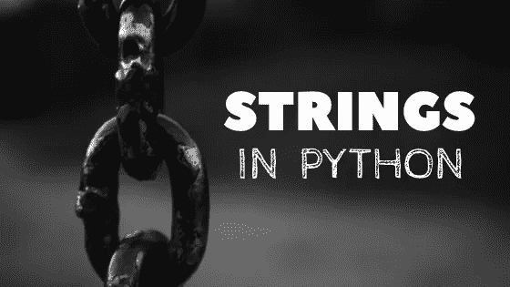

# 深入探究 Python 中的字符串(初学者指南)

> 原文：<https://medium.com/analytics-vidhya/deep-dive-into-strings-in-python-a-beginners-guide-1af6ceed9bf8?source=collection_archive---------5----------------------->



欢迎各位。在这篇博文中，我们将学习 python 中的字符串、它们的行为、初始化、方法以及一些解决字符串相关问题的方法。

# python 的基本介绍。

在讨论字符串之前，让我简单介绍一下 python。(如果你有概念，可以跳过这一部分)。

Python 是一种高级的、解释性的、面向对象的语言。所谓面向对象是指 python 中的所有东西，从数据结构到函数和类，都被视为对象。

维基百科将对象定义为:

一个**对象**是一个抽象数据类型，增加了多态和继承。。一个**对象**有状态(数据)和行为(代码)”

python 中的变量是动态类型的，这意味着我们不声明变量的**类型**。它检查程序运行时的变量种类。

深入探讨这个问题超出了本文的范围。但是我当然想单独写一篇关于它的文章😊。

# 那么，python 中的字符串是什么呢？

因为 python 中的一切都是一个**对象**，所以字符串也是。

字符串是**不可变的序列对象**，其中每个字符代表序列中的一个元素。

字符串的基本示例。

```
greeting = "have a nice day"
```

稍微解释一下，string 情况下的不可变意味着一旦 string 对象在内存中初始化。我们不能改变它..但是我们仍然可以用许多**内置**方法来操作它。但是原始的字符串对象保持不变，同时返回它的副本。作为一个简单的经验法则，任何操作字符串的方法都会返回它的一个副本..

所谓序列，我们指的是一个字符串对象像一个列表一样是**可索引和可迭代的**(我们将在后面讨论)。这意味着我们可以通过索引访问 string 对象的元素(基本上是一个字符),并在循环中遍历各个值。

让我们来看看实际情况

```
# indexing
greeting[0]
#>> h

#we can also take a slice of the  string due to its indexing properties
greeting[0:3]
#>> have

#iterating through a string
for  char in greeting[0:3]:
    print(char)
#>> h
#>>a
#>>v
#>>e

# remember index starts from 0 
```

# 字符串的一些有用的方法。

python 中的字符串打包了许多强大的方法。操控它们让我们的生活变得更美好。

在这里，我将向您展示一些与字符串相关的最有用的方法。

**注意:**代码块中 **# > >某值**代表从终端返回或者 python **REPL**

## 更改字符串大小写的方法。

```
greeting = 'have a nice day'
greeting.capitalize()
# captalizes the first character of the string
#>> Have a nice day

greeting.swapcase()
#inverses the case of each character of a string
#>>HAVE A NICE DAY

greeting.title()
# captalizes the first character of each word in the string
# >> Have A Nice Day

greeting.upper()
# captalizes every character of the string
# >>  HAVE A NICE DAY

greeting.lower()
# changes the case to lower for every character in the string
#>> have a nice day
```

## 在字符串中查找和替换的方法。

```
greeting.count("nice")
#return the number of times the substring is present in the string
#>> 1

greeting.endswith("day")
#return a boolean whether the string ends with the substring
#>> True

greeting.startswith("day")
#return a boolean whether the string starts with the substring
#>> False

greeting.find("day")
# Return the lowest index in S where substring sub is found,
#>> 12

greeting.split("")
# Return a list of the words in the string, using sep as the delimiter string.here the sep used is a space
#>> ['have', 'a' ,'nice', 'day']

greeting.replace("nice","bad")
#Returns a copy of the string with all occurrences of substring old replaced by new.
#>> have a bad day

words=['have','a','nice','day']
#we have a list of words that we need to concat with with space between the words.
greeting=" ".join(words)
#here we call call the join method of a string with a blank space.
print(greeting)
#as we see string.join() insert the the string between every word(string) in the list
#>> "have a nice day" 
```

## 方法从字符串中去除空格

```
greeting='have a nice day '
greeting.rstrip()
#remove the blank space from the rightside
#>> 'have a nice day'

greeting=' have a nice day'
greeting.lstrip()
#remove the blank space from the left side
#>> 'have a nice day'

greeting=' have a nice day '
greeting.strip()
#remove the blank space from the both sides
#>> 'have a nice day' 
```

# 字符串操作的方法。

## 从字符串列表或任何其他可迭代列表中创建一个字符串。

有很多方法可以从字符串列表中创建一个字符串。比如我们可以使用 loot，将每个字符添加到一个空字符串中。

但是 python string 对象有一个针对这种需求的强大且优化的方法，那就是 **string.join(iter)** 。它将 iterable 作为参数。其方法被调用的字符串被插入到每个给定的字符串之间。结果作为新字符串返回。

让我给你看一个例子:

假设我们有一个字符串列表:["have "、" a "、" nice "、" day"]，我们想把它连接成一个字符串，每个单词之间留有空格。

```
words=['have','a','nice','day']
#we have a list of words that we need to concat with with space between the words.
greeting=" ".join(words)
#here we call call the join method of a string with a blank space.
print(greeting)
#as we see string.join() insert the the string between every word(string) in the list
#>> "have a nice day" 
```

## 用字符串中的字符创建列表。

由于 python 中的字符串是可迭代的，调用 builtin list 函数会返回字符串中的字符列表。

```
alphabet_string="abcdefghijklmnopqrstuvwxyz"

alphabet_list= list(alphabet_string)
print(alphabet_list)
#>> ['a', 'b', 'c', 'd', 'e', 'f', 'g', 'h', 'i', 'j', 'k', 'l', 'm', 'n', 'o', 'p', 'q', 'r', 's', 't', 'u', 'v', 'w', 'x', 'y', 'z']
```

谢谢你一直读到最后。请继续关注本系列的新教程。(python 中的数据结构)，将每天分享新的帖子。

祝你编码日愉快，🥰.