# 深入研究各种自动编码器

> 原文：<https://medium.com/analytics-vidhya/deep-dive-into-variational-autoencoders-d66c4a3df236?source=collection_archive---------5----------------------->

# 介绍

在之前关于自动编码器的文章中([第一部分](/analytics-vidhya/under-and-over-autoencoders-3d695f428c1a) & [第二部分](/analytics-vidhya/implementing-under-over-autoencoders-using-pytorch-4ddaf458947e)，我们探讨了欠自动编码器和过自动编码器的直觉、理论和实现。自动编码有两个部分:编码器和解码器。编码器将输入移动到潜在空间，而解码器试图从潜在空间表示中取回输入表示。

## 经典自动编码器的问题是

然而，这些情况下的编码器本质上是确定性的，即，将输入中的值映射到潜在空间中的点，该点随后被解码器映射回输入空间。然而，一个好的自动编码器不应该学习输入数据的点表示，而是更多地学习潜在空间特征的分布，原因有两个:

*   数据的特征没有点的表示。他们有分布。
*   输入数据的流形结构应该是平滑的，而不是不连续的。

varrational auto encoders(VAE)试图通过使用潜在表示的概率模型来解决这些问题，该模型更好地理解潜在的因果关系，有助于更有效的概括。

# 结构

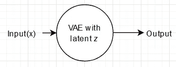

考虑 *z* ，潜在空间或隐藏表征，输入 *x* ，设 *z* 有一个概率分布 *p(z)* 。

为了一般化，我们希望有 *p(x)。*我们只能访问 *x* ，我们想要捕获 *p(z|x)。*

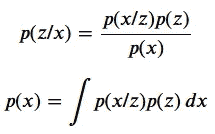

所以，为了捕捉 *p(x)* ，我们需要 *p(z)。*然而，由于 *z* 不可接近，我们无法知道 z 的分布以及随后的 p(z)，使得这个问题变得棘手。

但是，有另一种方法可以解决这个问题。潜在变量 z 可以被强制遵循已知的分布。VAE 就是这么做的。在 VAE，我们对潜在变量 z 实施高斯分布。高斯分布可以通过均值和方差来表征，而均值和方差是通过输入值来估计的。

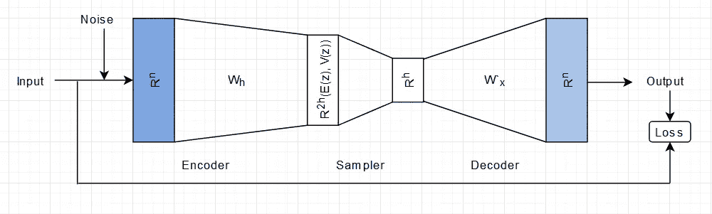

VAE 结构。来源:作者

VAE 有三个组成部分:

*   编码器:将输入的 *n* 维向量编码成 *2h* 维向量。 *h* 是潜在空间的尺寸。此处， *2h* 尺寸表示 *h* 平均值和 *h* 方差串联。
*   采样器:取 *2h* 维长向量，基于 h 均值和 h 方差创建高斯分布，从中采样用于输出的 *z* 值。
*   解码器:它采用高斯分布并输出重构向量，将其与输入向量进行比较以计算损失。

## 如何加强潜在变量分布的结构

让我们考虑一下经典的自动编码器损失函数，即重建损失在这里的作用。z 的分布可以认为是潜在空间中的气泡。当气泡完全不重叠时，重建损失被最小化，因为重叠将带来模糊点。因此，重建损失将 z 分布的气泡彼此推得尽可能远。如果没有关于这些气泡可以存在多远的规定，重建损失会将它们推得太远，使得分布与气泡所在的空间相比可以忽略不计，从而违背了首先获得分布的整个目的。

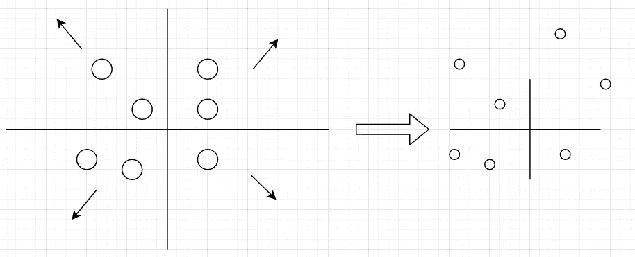

由于重建损失，z 分布气泡漂走。来源:作者

因此，我们需要一个损失项来约束分布气泡，并在单个气泡上实施高斯分布。这种作用是通过高斯分布相对于具有零均值和单位方差的正态分布的 KL 散度来实现的。

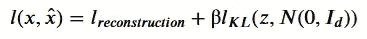

VAE 的损失。来源:作者

高斯相对于标准正态分布的 KL 散度(或相对熵)为:

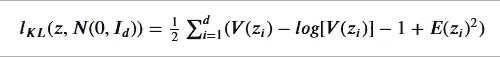

均值为 E(z)方差为 V(z)的高斯分布的 KL 散度。来源:作者

KL 背离的最后一项对潜在变量的均值施加了 L2 惩罚，将它们拉向原点，阻止它们偏离。其余项，即`V(z)-log(V(z))-1`在 V(z)为 1 时具有最小值，这在我们寻找相对于标准正态分布的相对熵时是显而易见的。因此，复合损失项在减少重建误差和与标准正态分布的差异之间取得了平衡。

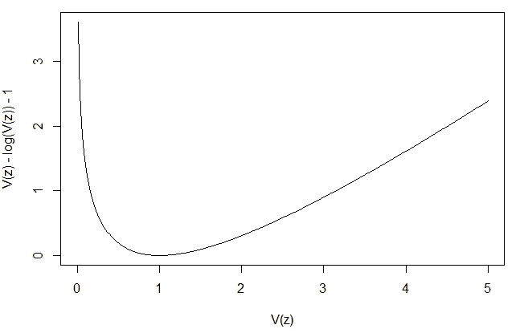

`V(z) vs V(z)-log(V(z))-1\. source: author`

## 重新参数化的技巧

我们对输入解码器的潜在变量(z)进行高斯分布采样。然而，这在反向传播和随后的优化中产生了问题，因为当我们进行梯度下降来训练 VAE 模型时，我们不知道如何通过采样模块进行反向传播。

相反，我们使用重新参数化技巧对 *z* 进行采样。

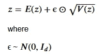

现在，反向传播是可能的，因为相对于 *z* 的梯度只需要通过和与积函数。

# 使用 PyTorch 实现

我们将使用 MNIST 数据集进行解释。

数据加载和转换步骤与传统编码器相似。我们将在这里关注 VAE 的建筑。

我们用三个单元来定义一个简单的 VAE，即编码器、解码器和采样器。采样器实现了上面讨论的重新参数化技巧。

## 基础架构

输入尺寸(784)对应于 28×28 的 MNIST 图像尺寸。输入数据从 784 维移动到 400( *dxd* ) dim，经过非线性层(ReLU)然后移动到 *2d* 超空间，这里 d = 20。潜在空间是 *d* (20)维的。我们需要 *2d* 尺寸，因为它是 *d* 平均值和 *d* 方差的串联。

解码器模块也非常类似于经典的自动编码器。它获取一个 d 维潜在空间向量，通过一组线性和非线性层，输出大小为 784 的最终向量，与输入相同。

神奇的事情发生在采样器层。

采样器模块获取 2d 向量，并基于重新参数化技巧返回 z。这里需要注意的一点是，我们没有将方差输入到采样器层，而是输入方差的对数。这是因为方差必须为正，而方差对数也可以为负。它确保方差总是正的，并且我们能够使用全范围的值作为输入。这也使过程更加稳定。

接下来，我们将损失定义为重建损失和 KL 散度之和。该培训类似于传统的自动编码器，已在之前的[文章](/analytics-vidhya/implementing-under-over-autoencoders-using-pytorch-4ddaf458947e)中介绍过。

在训练之前，这是我们得到的重建图像，上面一行是原始图像，下面是重建图像:

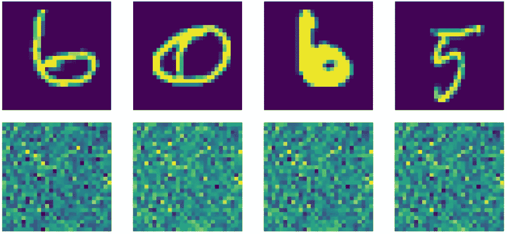

训练前的重建。来源:作者

仅仅 20 个时期之后，以下是重建的结果:

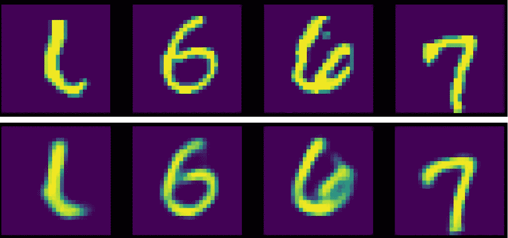

实际 vs 训练后 VAE 重建。来源:作者

为了查看潜在空间向量，我们生成几个随机样本，并使用解码器来生成样本:

`z_sample = torch.randn((8, d)).to(device)
sample_out = model.decoder(z_sample)`

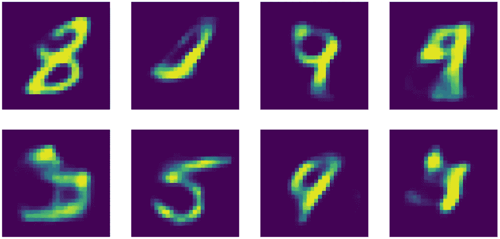

潜在空间解码数据

我们可以看到，潜在空间已经学会了数字的表示，尽管还不完全。随着训练次数的增加，隐含层可以更好地捕捉输入特征。

## 两个输入之间的插值

通过取潜在空间表示的加权平均值，我们可以使用潜在空间表示在两个输入(这里是图像)之间进行插值。考虑数字 0 和 6。我们可以看看从 0 到 6 的渐进过程。

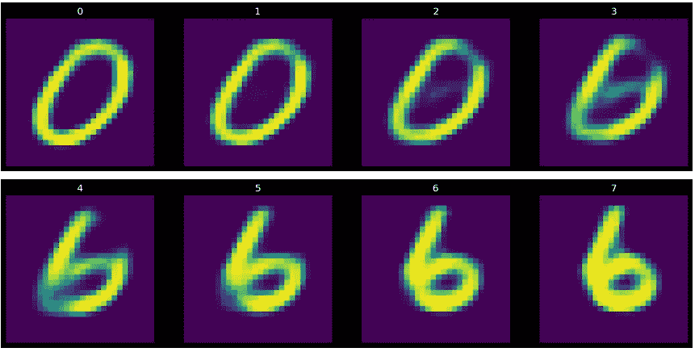

将 0 转到 6。来源:作者

变换的每一步将插值图像的潜在变量定义为:

`z_interpolation = ((i/N)*z_6 + (1-i/N)*z_0) where i ranges from 0 to 8
output_interpolation = model.decoder(z_interpolation)`

# 结论

正如我们已经看到的，变分自动编码器代表的潜在变量不是点，而是概率云或分布。它不仅有助于使潜在的空间表现更普遍，而且它使流形更连接和光滑。VAE 的基本概念模拟数据生成过程，可进一步用于 GANs。