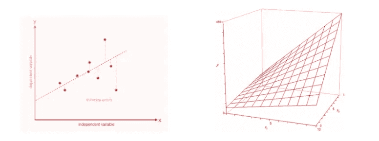

# 深度学习 101 —什么是神经网络？感知器和多层感知器

> 原文：<https://medium.com/analytics-vidhya/deep-learning-101-what-is-a-neural-network-the-perceptron-and-the-multi-layer-perceptron-c50d9bc49e42?source=collection_archive---------17----------------------->

图片来自[像素](https://www.pexels.com/)的[像素](https://www.pexels.com/es-es/@pixabay)

在“深度学习 101”系列的[上一篇文章](https://omarbr6.medium.com/deep-learning-101-artificial-intelligence-and-machine-learning-basics-5687a75212e3)中，我们看到了人工智能和机器学习的概念，以及我们如何对它们进行分类。在机器学习中，我们发现了一个全新的世界，其中有大量不同的技术可用于解决多种应用，如决策树、分类模型或聚类方法等。然而，在过去的十年中，一项彻底改变了世界的技术是神经网络的使用。

我们目前正在经历一场数字革命。一些因素，如硬件价格下降、可用数据量增加或关于数据价值的心态变化，将我们带到了大数据时代。为了从海量数据中获得有价值的见解，我们需要强大而复杂的技术，比如深度学习。

深度学习是一种构建人工神经网络的机器学习技术。“深度”一词来自于神经网络的复杂性，因为它被构造为一堆层，我们从输入中提取分层数据表示。神经网络的层数越高，我们的 DL 模型就越深。此时，在定义什么是神经网络之前，我们必须回顾一些更简单的概念。

## 感知器

神经网络的复杂性来自于一起工作的更简单组件的相互作用，正如在大多数复杂系统中发生的那样。在神经网络的情况下，这些部分中的每一个都被称为“神经元”或“感知器”。

感知器被视为生物神经元的类比，它是我们将在神经网络中找到的基本处理单元。与生物神经元类似，它也有输入连接，从那里接收外部刺激，即输入值。感知器执行内部计算并生成输出值。我们在这里可以看到,“感知机”只是一个数学函数的酷名。

图片由 [ColiN00B](https://pixabay.com/users/colin00b-346653/) 从 [Pixabay](https://pixabay.com/) 获得

我们之前提到的内部计算是输入值的加权和。每个输入的权重来自每个输入连接的分配权重。这意味着每个输入值都有或多或少的重要性，给定它所分配的权重。这些权重将是我们模型的参数，它们将是必须调整的值，以便我们的模型可以学习。

您可能已经注意到，感知器非常类似于线性回归模型，其中我们有一些定义直线或超平面的输入值，我们可以通过改变参数来改变其斜率。在线性回归中，我们有一个独立变量，它表示 Y 轴的截距。我们在感知器中也有这个独立变量。它被称为“偏置”，它被建模为分配给“1”的神经元的另一个输入连接，我们可以通过改变偏置值来操纵它。

作者图片

正如我们可以想象的那样，神经网络是由几个感知器互连而成的。有一个[数学定理](https://sites.millersville.edu/bikenaga/linear-algebra/lintrans/lintrans.html)证明线性变换的组合是线性变换。不幸的是，我们无法仅仅通过线性变换来构建像语音识别系统或无人驾驶汽车这样的酷应用。我们的感知器中缺少最后一个组件，它将允许我们创建非线性函数。

激活功能是完成我们神经元的组成部分。我们将把这个函数应用于线性回归的输出值，它将允许我们把非线性引入我们的模型。有几个激活函数，它们将根据我们想要解决的问题来定义，但是我们将在以后的文章中讨论这个问题。

作者图片

使用单个感知器，我们可以解决线性分离模型的问题，但事实证明它们是[唯一一种神经元可以单独解决的模型](https://www.youtube.com/watch?v=QW_srPO-LrI)。然而，通过互连几个感知器，我们可以绕过这一限制，处理非线性可分离数据。

## 多层感知器(MLP)

在现实世界的问题中，我们通常会发现非线性分布的数据，例如图像、音频或文本。为了处理这种类型的数据分布，我们不能使用感知器模型，因为我们在前面的部分已经看到了它的局限性。

我们可以同时连接几个神经元。当每层中的每个节点都是来自前一层的所有输入的线性组合时，该网络就被称为多层感知器(MLP)。在 MLP 中，我们发现三种类型的层。

*   *输入图层。*包含我们模型的输入数据。
*   *隐藏层。*输入和输出之间的层。所有的计算都在这里完成。隐藏层的数量定义了神经网络的“深度”。更多的隐藏层将我们引向更深的模型。
*   *输出图层。*包含应用于输入值的神经网络模拟的函数结果。

作者图片

给定图像中的 MLP，让我们定义向前一步的公式。

对于每个隐藏层 **h_i** :

*   矩阵:包含所有的权重，代表网络之间的联系。
*   **x** 向量:包含输入值
*   **b** 向量:包含偏差

作者图片

我们可以计算的与 MLPs 相关的一个有趣的度量是它的参数数量。我们不需要知道这个数字，但它可以帮助我们减少我们的模型大小，或者使它更快地进行推断。这里计算的是可训练参数的总数(即权重和偏差)。

#参数=层间连接+各层偏差

# Parameters =(输入大小*隐藏层大小)+(隐藏层大小+输出数量)

让我们看一个例子。

作者图片

## 结论

神经网络允许我们通过堆叠神经元层来在分层级别中编码数据。我们已经看到，当试图解决涉及非线性分离数据的问题时，感知器模型具有局限性，但我们可以通过将几个神经元相互连接来解决它。

在本文中我们已经看到了 MLP，但它不是唯一的神经网络类型。在下面的文章中，我们将讨论其他神经网络，如卷积神经网络或递归神经网络。但是我们如何训练他们呢？在“深度学习 101”系列的下一篇博客文章中，我们将回顾反向传播算法。