# 深度学习——简介

> 原文：<https://medium.com/analytics-vidhya/deep-learning-a-brief-introduction-86c92c6dd555?source=collection_archive---------8----------------------->

深度学习也称为神经网络，是机器学习的一个子集，模仿人脑处理数据和创建决策模式的工作。

1967 年，Alexey Ivakhnenko 发表了有监督的、深度的、前馈多层感知器的第一个工作模型，

那么，为什么深度学习不出名，然后突然之间深度学习行业蓬勃发展…？

即使神经网络很久以前就被开发出来了，公司也没有足够的基础设施来投资研究。

举个例子，

5 MB 硬盘在 1956 年重 1 吨。

10 兆硬盘在 20 世纪 80 年代的价格是 3495 美元。

转向云服务的行业为许多研究人员打开了一扇大门，他们可以探索具有高 GPU 和 TPU 处理数百万数据的最佳配置的神经网络。

数据类型:

结构化数据——结构化数据是定义明确且可搜索的数据类型，类似于表格格式的数据。

非结构化数据——非结构化数据没有任何数据模型，以图像、音频等原始格式存储。

神经元:

神经元是大脑中的基本单位，它接收来自外部世界的感觉输入，并将这些输入转化为对自主和非自主行动有用的电信号。类似地，数百万个神经元会相互作用，产生有用信息电脉冲。

人类大脑对图像/音频的反应比表格结构更快，我们正试图在神经网络中模仿同样的情况。

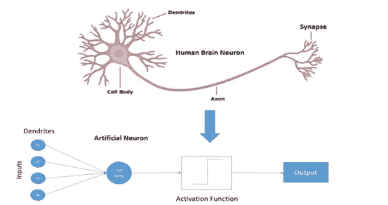

神经元

**激活功能:**

激活函数在计算加权和的基础上决定是否激活隐层中的一个神经元，并用于在神经元的输出中引入非线性。

例如，在下面的等式中，每个神经元的输出将总是线性的，并且多个神经元的组合将总是提供相同的线性输出。神经元不能用线性函数学习，所以有必要添加一个激活函数来转换为非线性函数。

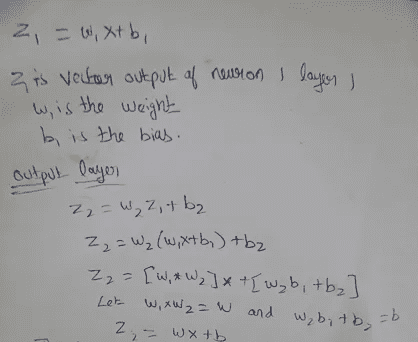

输出层的加权和

**激活功能类型:**

**乙状结肠功能:**

该图绘制成 S 形，数值范围在 0 和 1 之间。图形是非线性的，当斜率更陡时，X 的小变化会导致 Y 值的大变化。如果该值大于 0.5，则将该值预测为 1，如果该值小于 0.5，则将该值预测为 0。这仅在二进制分类的情况下有用。

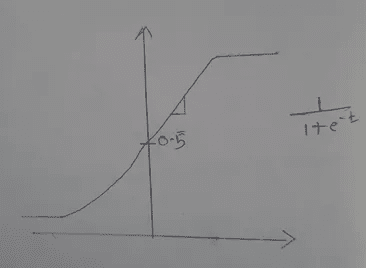

Sigmoid 函数

**双曲正切函数:**

这是 sigmoid 函数的数学修改版本。值的范围在-1 到 1 之间，本质上是非线性的。随着输入值范围的增加，曲线饱和，这意味着斜率将等于零。所以优化是不可能的。为了克服这种情况，开发了另一种激活功能，称为 RELU。

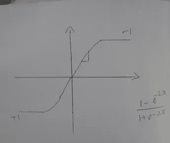

Tan h 函数

**RELU(整流线性单位):**

这是非线性的，通常值的范围在 0 和无穷大之间，斜率永远不会达到 0，除非值为负。RELU 在计算上比 Sigmoid 和 Tan h 更便宜

***【A(x)= max(0，x)*** 。如果 x 是正数，它给出一个输出 x，否则给出 0

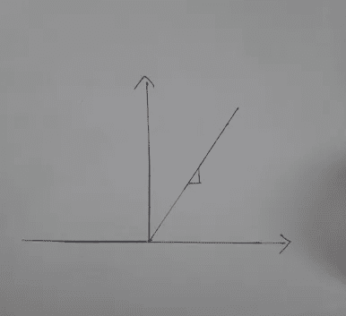

RELU 函数

**漏 Relu:**

对于负值，RELU 函数将总是导致斜率为 0，因此为了克服这种情况，引入了在负方向具有窄斜率的泄漏 Relu。

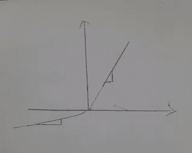

泄漏 Relu

**机器学习中梯度下降法介绍:**

梯度下降是线性回归中的一种迭代优化算法，用于寻找微分函数的局部最小值。梯度下降算法将在斜率开始时选择随机初始化，并截取和计算误差项。在每次迭代中，它将反向检查误差项，并反向传播和更新斜率和截距值，直到误差最小。

学习率代表步长，偏导数代表它应该移动的方向。总是建议选择较小的学习率，这样就不会错过局部最小值。

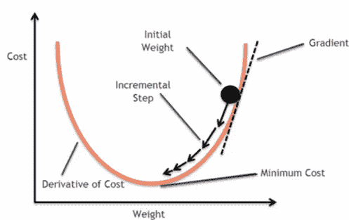

梯度下降图

保持斜率和截距不变推导梯度下降方程:

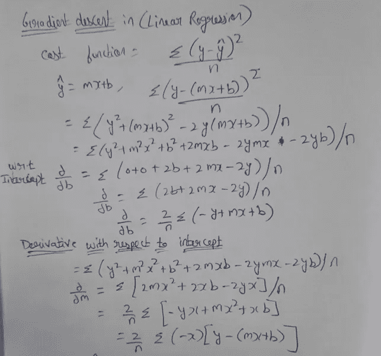

梯度下降的偏导数

使用导出的公式对样本数据集进行梯度下降。

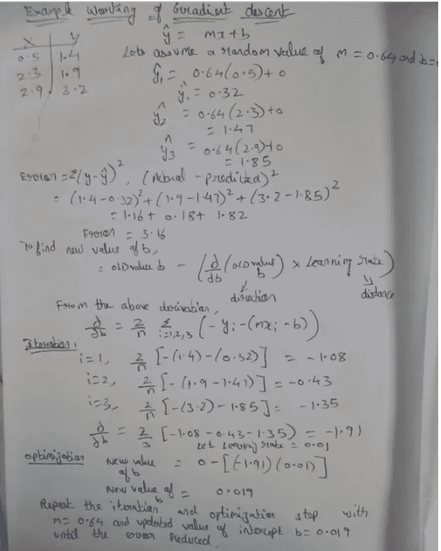

**简单的神经网络架构。**

在下图中，X1、X2 和 X3 是表示数据集中的列的输入要素，隐藏图层不对外公开，所有计算都在隐藏图层中完成，并将数据传输到输出图层。

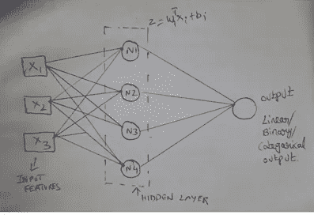

神经网络

如果输出应该是二进制分类，则在输出图层的末尾添加一个 sigmoid 函数，将其转换为 0 和 1。默认情况下，输出是线性的。

一旦正向计算完成，基于成本函数，它将反向传播并更新隐藏层中的权重和偏差，并重新计算，直到成本函数最小化，类似于上述情况中看到的梯度下降示例。

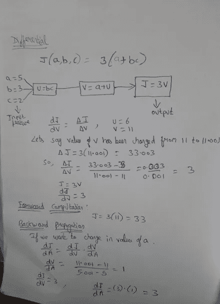

向前和向后计算

**损失函数:**

它只是真实值与预测值的偏差，现在可以是平方差或绝对差的形式。

**成本函数:**

损失函数仅针对一个训练示例，而成本函数考虑了作为损失函数的平均值简单计算的整个数据集。

**用 Python 构建单层神经网络:**

[数据集](https://raw.githubusercontent.com/Jayachandran9283/Dataset/main/pima-indians-diabetes-data.csv)

在 Google Colab 中安装驱动器。

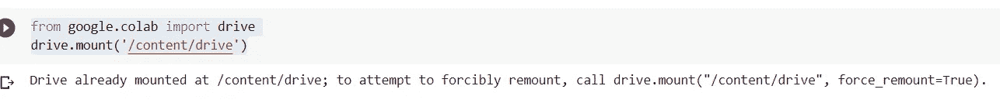

加载所需的库:

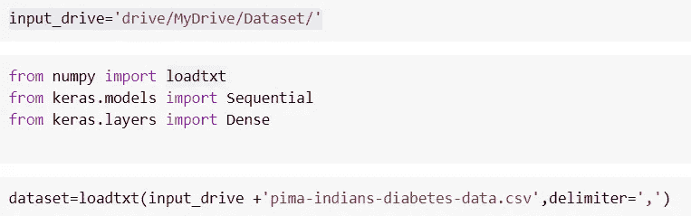

神经网络是顺序的，我们在输入数据集中总共有 8 列作为独立变量和 1 个隐藏层来转换为非线性，并且由于输出是二进制分类器，所以添加了 Sigmoid 激活函数。

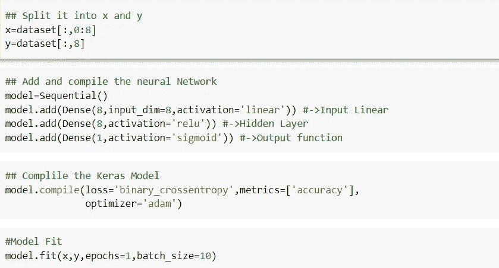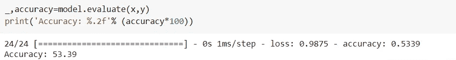

增加历元大小/批次大小，并重复迭代以获得更好的精度。