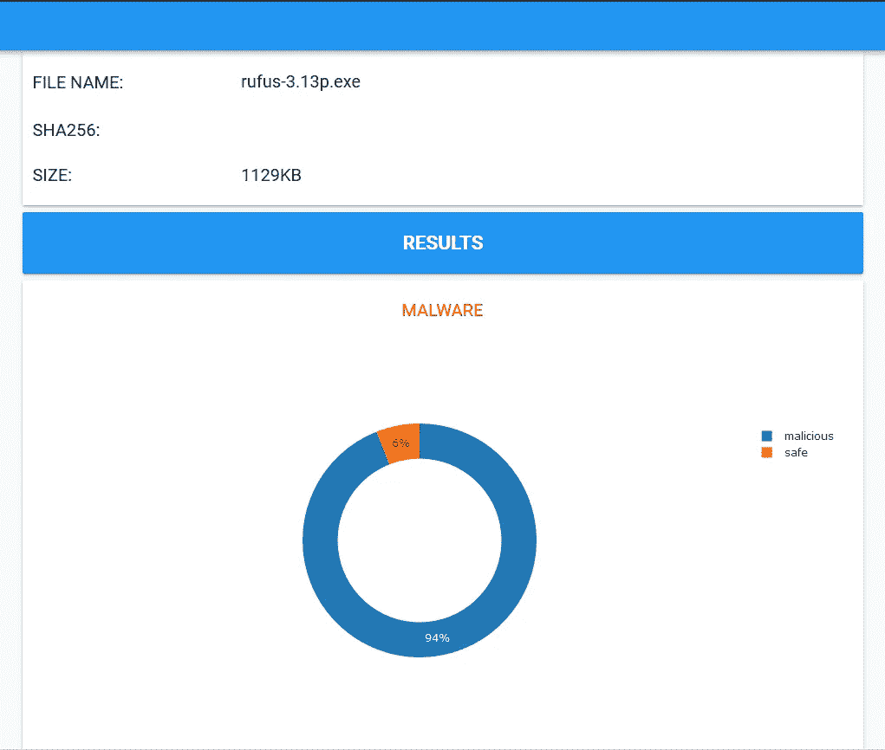

# 基于深度学习的恶意软件检测演示

> 原文：<https://medium.com/analytics-vidhya/deep-learning-based-malware-detection-demo-d545c5653200?source=collection_archive---------6----------------------->

很久以前，我发表了一些关于创建基于深度学习的恶意软件检测器的帖子。我给出了一些关于特征提取以及如何应用 CNN 进行恶意软件检测的例子。

今天，我为大家带来了一个基于深度学习的恶意软件检测器的完整演示。恶意软件检测器包含四种型号:

1.  一个 **CNN** 模型，在将 exe 文件转换成图像后对其进行分析(查看更多细节)。
2.  一个基于 **LSTM** 的模型，分析汇编语言指令(序列分类)。
3.  一个 **SAE + FNN** 来分析 EXE 文件中被调用的函数和 dll。
4.  一个 **SAE+FNN** 来分析 4gm 的字节序列。

我将解释如何实现 2。, 3.第四。在后来的帖子(1。已经解释过了)。现在，让我们去看演示。

要成功运行演示，您需要具备:

1.  anvil.works 的账户(你只需要一个电子邮件地址)
2.  Kaggle 的一个帐户(你需要一个电子邮件地址+电话号码)

一旦你创建了这两个帐户，**我希望你点击这个链接，这样你就可以在 anvil.works 上克隆我的应用程序:**[https://anvil . works/build # clone:vk 25 ignezrb 2 kpm 6 = cokhruiv 2 uf 4 vyir 6 gzlfz 4](https://anvil.works/build#clone:VK25IGNEZRB2KPM6=COKHRRHEV2UF4VYIR6GZLFZ4)**。**

**然后点击另一个链接，在 ka ggle**[https://www.kaggle.com/isuremu/malware-detection-demo](https://www.kaggle.com/isuremu/malware-detection-demo)**导入我的笔记本。**

仅此而已！如果你从未与 anvil 或 Kaggle 合作过，不要担心！你不需要做很大的事情，只需点击链接克隆应用程序和笔记本，然后在 anvil 上运行应用程序。点击它，然后点击运行，就可以了。还是不知道该怎么办？

## 观看此视频

在 Kaggle 笔记本中，您可以找到运行演示所需的所有模型和全部代码。

**你也可以在 GitHub 上查看我的资源库，里面几乎包含了重现这部作品的所有组件:**[**https://github.com/islem-esi/DeepMalwareDetector**](https://github.com/islem-esi/DeepMalwareDetector)

在接下来的几天里，我将与您分享包含 flask GUI 的 docker 文件，该文件允许使用以前的模型进行更多功能和数据可视化的特征提取和恶意软件分析。