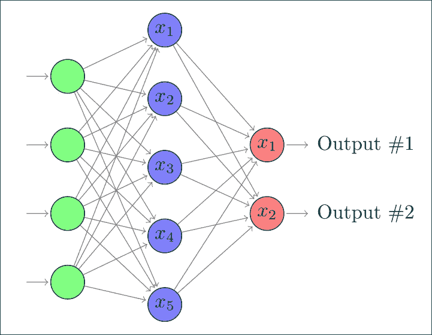

# 深度学习基础

> 原文：<https://medium.com/analytics-vidhya/deep-learning-basics-c007caab825f?source=collection_archive---------9----------------------->

作者 Zachary Galante——Bryant 大学数据科学专业的大四学生

[附身摄影](https://unsplash.com/@possessedphotography?utm_source=medium&utm_medium=referral)在 [Unsplash](https://unsplash.com?utm_source=medium&utm_medium=referral) 上拍照

当今世界，人工智能和机器学习正被应用于无数行业。企业可以使用模型来预测客户的无数特征，分析 tweet 和许多其他应用程序的情绪。机器学习的一个流行子集是深度学习，目前正用于驱动自动驾驶汽车、智能手机中的 face-ID 等等。

深度学习是使用称为神经网络的模型实现的。从高层次来看，神经网络获取输入数据(通常以矩阵的形式)，应用称为激活函数的函数，然后将数据传递到网络的下一层。在阅读本文之前，您可能已经听说过神经网络是如何模仿人脑的构成而建立的。这种说法有一定道理，但遗憾的是不完全正确。

在写这篇文章的时候，我们甚至还没有完全理解人类大脑是如何构成的，所以用深度学习完全重建它几乎是不可能的。然而，相似之处是用模型的基本轮廓绘制的，模型获取数据，进行学习，然后将其传递给下一层。然后将这与大脑神经元如何相互影响进行比较。

下图显示了一个基本的神经网络。从高层次来看，网络从第一层(称为输入层)获取信息，并将其传递给下一层。正如连接**输入层**到下一个蓝色层的箭头所示，这是一个完全连接的层。此外，这意味着前一层中的每个神经元都将对前一层中的每个神经元进行输入。另一个需要理解的重要术语是**隐藏层的概念。**在这个例子中，隐藏层是网络中间的蓝色层。之所以称之为隐藏层，是因为在创建模型时，除了分配神经元数量之外，没有任何方法可以看到该级别的计算。红色显示的最后一层是**输出层。**这是最终返回模型预测/输出的层。在以下网络的情况下，有两个输出可能表明该网络正用于多类分类问题。这也表明了使用 **SoftMax** 功能的可能性。

一个清楚解释 SoftMax 函数的好例子是一个狗-猫分类器。比方说，你有一个包含 10，000 张狗和猫的图像的数据集，你训练了这个模型，现在希望在一张新的图像上测试它。然后你给它一张新的你的狗的图像，它以前从未见过。SoftMax 函数将返回两个概率，一个是图像是一只狗，另一个是图像是一只猫。这种神经网络的基本结构可以在许多不同的应用和案例中采用和实现，从自然语言处理到自动驾驶。

深度学习是一个不断改进和发展的领域，并被证明是当前最受欢迎的学习主题之一。

**参考文献**

 [## 深度学习和机器学习有多大区别？

### 人工智能(AI)是这个时代非常需要和期待的技术。它是…的能力

noeliagorod.com](https://noeliagorod.com/2019/11/14/how-deep-learning-is-different-from-machine-learning/) 

[https://tex . stack exchange . com/questions/406315/tikz-draw-neural-network-outline](https://tex.stackexchange.com/questions/406315/tikz-draw-neural-network-outline)